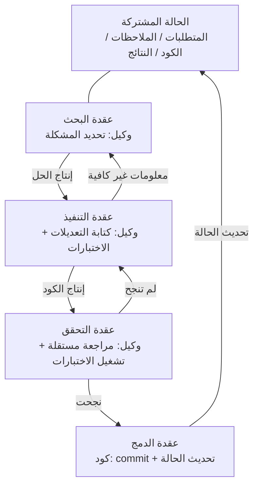
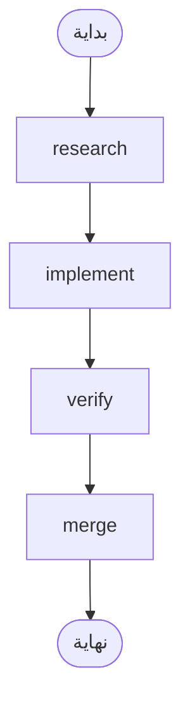
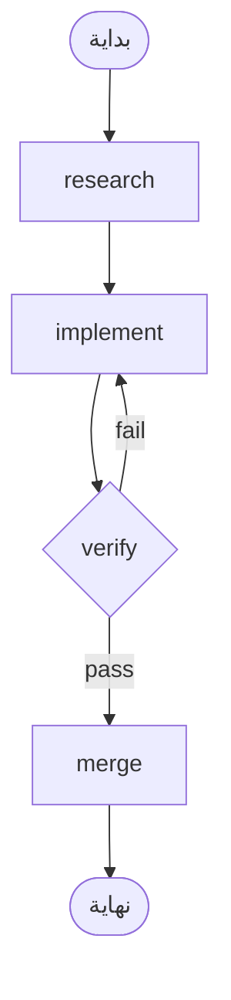

[English Version →](../../../en/lectures/lecture-14-graph-engineering/)

> أمثلة الكود: [code/](https://github.com/walkinglabs/learn-harness-engineering/blob/main/docs/en/lectures/lecture-14-graph-engineering/code/)
> مشروع عملي: [المشروع 08. ارسم سير عملك كرسم بياني](./../../projects/project-08-graph-engineering-first-graph/index.md)

# المحاضرة 14. من الحلقة الواحدة إلى هندسة الرسوم البيانية

بعد ستة أسابيع من انتشار هندسة الحلقات (Loop Engineering)، في 18 يوليو 2026، نشر بيتر شتاينبرغر — مؤلف OpenClaw الذي قال لك في المحاضرة السابقة "توقف عن كتابة المطالبات لوكيل البرمجة" — تغريدة:

> "هل ما زلنا نتحدث عن الحلقات، أم انتقلنا بالفعل إلى الرسوم البيانية؟"

تغريدة واحدة — حصلت على حوالي 575 ألف مشاهدة خلال يوم واحد، وارتفعت إلى حوالي 3 ملايين بنهاية الشهر. وبعد ساعات قليلة، نشر مهندس التعلم الآلي هامل حسين مقالًا بعنوان *Loop Engineering Is Dead. Enter Graph Engineering* — جسم المقال كله لم يكن سوى صورة متحركة واحدة مكتوب عليها "Stop it" — وحصل على حوالي 680 ألف مشاهدة إضافية.

والأكثر إثارة للاهتمام: **كلاهما كانا يمزحان.** الأول كان يسخر من صناعة تختلق مصطلحًا جديدًا كل ستة أسابيع، والثاني كان يتابع النكتة بمواصلة هذه المزحة. لكن النكتة عاشت حوالي عطلة نهاية أسبوع واحدة فقط — الدورات والخرائط الذهنية ومجموعات الأدوات غرقت في الخط الزمني قبل نهاية عطلة نهاية الأسبوع، متبوعة بكومة من الأرقام المختلقة: "دقة +18%، تكلفة -85%" بيانات مزيفة (الرقمان موجودان فعلًا، لكنهما من ورقة بحثية عن مخططات الأنابيب الكيميائية، وبمقارنة مع خطوط أساس مختلفة تمامًا)، و"اكتشفت مايكروسوفت وستانفورد وAnthropic هندسة الرسوم البيانية في نفس الوقت" خبر أيضًا كاذب. التحقق من الحقائق وحده أكد "رائدًا" حقيقيًا واحدًا: جوش سيمونز، الذي كُتبت مقالته *We Are Entering the Graph Engineering Phase* في 4 يوليو — قبل النكتة بأسبوعين كاملين — **النكتة هي التي جعلت هذا الأمر رائجًا، والنكتة لم تُنشئ هذا الأمر.**

> المصدر: [goddaehee: التحقق من حقائق هندسة الرسوم البيانية (2026-07-30)](https://goddaehee.tistory.com/628)؛ [YC Startup School 2026: مقابلة جنسن هوانغ (مع النص الكامل)](https://ycombinator.com/library/Tq-jensen-huang-the-mindset-that-built-nvidia)؛ [explainx: هندسة الرسوم البيانية (2026-07)](https://explainx.ai/blog/graph-engineering-ai-agents-multi-agent-organizations-2026)

ما ستفعله هذه المحاضرة ليس إضافة المزيد من الوقود إلى هذه الضجة، بل تفكيكها ورؤيتها بوضوح: **لماذا ينمو رسم بياني حتمًا بعد حلقة واحدة؟ وما الفرق الحقيقي بين الرسم البياني وسير العمل؟ ومتى تحتاج إليه فعلًا، ومتى لا تحتاجه؟**

## Prompt و Context و Loop و Graph: أربعة أسماء، طبقة فوق أخرى

في نهاية يوليو، نشر المهندس روهيت (rohit4verse@) [منشورًا طويلًا](https://x.com/rohit4verse/status/2082478623043547356) رتّب فيه تاريخ تسمية هندسة الذكاء الاصطناعي في السنوات القليلة الماضية في إطار من أربع طبقات واضح. هذا هو أفضل نظام إحداثيات لفهم هندسة الرسوم البيانية:

| المرحلة | ما الذي تشكّله | السؤال الذي تجيب عنه | النواتج الرئيسية |
|---------|---------------|---------------------|-----------------|
| **Prompt Engineering** | التعليمات | كيف نخبر النموذج بما يجب فعله؟ | instructions، examples، constraints، roles، output formats |
| **Context Engineering** | المعلومات | ماذا يجب أن يعرف النموذج قبل أن يقرر؟ | documents، history، memory، tool definitions، environment state |
| **Loop Engineering** | وقت التشغيل | كيف نجعل النموذج يكرر العمل حتى يتحقق الهدف؟ | observe، reason، act، inspect، update، شرط التوقف |
| **Graph Engineering** | النظام | كيف تتعاون وكلاء وحلقات وأدوات ومقيّمون متعددون؟ | العقد، الحواف، الحالة المشتركة، قواعد التوجيه |

لاحظ كيف تُقرأ هذه السلسلة: **كل طبقة لا تحل محل الطبقة التي قبلها — بل تتكدس فوقها.**

- بعد أن وجدت هندسة السياق (context engineering)، لم تتوقف عن كتابة المطالبات — كل تكرار ما زال يحتاج إلى مطالبة، فقط الحلقة تقوم بتحديثها عندما تتغير البيئة.
- بعد أن بنيت الحلقة، لم تخلِ بالسياق — كل جولة من الحلقة تعيد تجميع سياقها.
- عند طبقة الرسم البياني، لم يختفِ لا الـ prompt ولا الـ context ولا الـ loop: **كل عقدة تحمل مطالبتها الخاصة وسياقها الخاص وأدواتها الخاصة وذاكرتها الخاصة وحلقتها الخاصة.** الرسم البياني يقرر كيفية ارتباط العقد ببعضها.

هكذا يختم روهيت منشوره:

> بمجرد أن يحتاج الوكيل إلى التخصص والتوازي والحالة المشتركة والتحقق والاستعادة، لم يعد حلقة. إنه رسم بياني.

**لحظة — أين الـ Harness؟** هذه الأسماء الأربعة لا تتضمن هندسة الحزام، لكن هذه الدورة كلها تدور حول الحزام. السبب بسيط: روهيت كان يحكي تاريخ المصطلحات الرائجة، ونهايته كانت الرسم البياني، والطبقة التي في المنتصف قُفز عنها. وحتى الطبقة التي ينتمي إليها الحزام غير محسومة في الأوساط — [explainx](https://explainx.ai/blog/context-prompt-loop-harness-engineering-stack-2026) يضعها فوق الحلقة، بينما [ورقة Buildrix](https://arxiv.org/abs/2606.25139) يضعها تحت الحلقة. هذه الدورة حسمت الأمر في المحاضرة الثانية: الحزام هو الأساس، والحلقات والرسوم البيانية تُبنى فوقه.

هذا يفسر ظاهرة غريبة: لماذا لم ينتشر مصطلح "Graph Engineering" حتى يوليو 2026، لكن الجميع اكتشف أنهم "يفعلون هذا منذ فترة". لأن الرسم البياني ليس اختراعًا جديدًا — بل هو ما تصبح عليه الحلقة عندما تتعقد المهمة إلى درجة معينة. **الاسم جاء لاحقًا؛ الممارسة كانت موجودة منذ البداية.**

## تفكيك الرسم البياني: العقد والحواف والحالة والتوجيه

اختزل الرسم البياني إلى أبسط أربعة أجزاء.

**العقدة (Node)**: وحدة عمل تتحمل مسؤولية معينة. يمكن أن تكون:
- كودًا حتميًا (تشغيل الاختبارات، حساب التغطية)
- استدعاء نموذج (توليد الوثائق)
- أداة (git commit، إرسال رسالة)
- وكيلًا كاملًا — يحمل حلقة خاصة به، ويفهم الأهداف، ويستخدم الأدوات، ويعيد المحاولة من تلقاء نفسه عندما لا يستطيع المتابعة

العقدة هي الخط الفاصل الحقيقي بين هندسة الرسوم البيانية وهندسة سير العمل، وهذا سنتناوله بالتفصيل أدناه.

**الحافة (Edge)**: توضح كيف تُسلَّم المهام بين العقد. ليست مجرد "افعل A ثم B" — يمكن للحافة أن تعبّر عن:
- **التوازي**: بعد اكتمال A، تبدأ B وC في نفس الوقت
- **الشرط**: الاختبارات نجحت، اذهب يسارًا؛ فشلت، اذهب يمينًا
- **الفشل/إعادة المحاولة**: عقدة تتعطل، تعود إلى نفسها وتشغّل مرة أخرى
- **التراجع**: فشل التحقق، عُد إلى عقدة التنفيذ التي تبعد ثلاث قفزات

**الحالة المشتركة (State)**: حزمة البيانات المنقولة بين العقد. المتطلبات وملاحظات البحث وإصدارات الكود ونتائج الاختبارات واستنتاجات المراجعة — كلها تُكتب على نفس سطح العمل المشترك. العقد لا تخاطب بعضها مباشرة؛ كلها تقرأ وتكتب نفس الحالة.

**قواعد التوجيه (Routing)**: تحدد إلى أين تذهب الخطوة التالية. هذا هو "تدفق التحكم" في الرسم البياني، بأبسط العبارات:

> نجحت الاختبارات فسلّم؛ فشلت الاختبارات فعد إلى عقدة التنفيذ؛ المعلومات غير كافية فعد إلى عقدة البحث.

اجمع الأجزاء الأربعة معًا، ويبدو الرسم البياني النموذجي للتطوير هكذا:



قارن هذا بمخطط الحلقة في المحاضرة السابقة: كانت الحلقة حلقة مغلقة — اكتشاف، توزيع، تحقق، حفظ دائم، ثم العودة إلى الاكتشاف. في رسم هذه المحاضرة، **الحلقة المغلقة ما زالت موجودة، لكنها فُككت إلى عقد وحواف صريحة.** يمكن لعقدة التحقق أن ترجع الفشل مباشرة إلى عقدة التنفيذ، ويمكن لعقدة التنفيذ أن ترجع إلى البحث بسبب نقص المعلومات — هذه "حواف التراجع" كانت ضمنية في حلقة واحدة، وكان الوكيل نفسه "يتذكر" أنه يجب أن يعود، داخل نافذة سياقه الخاصة.

## متى لا تكفي الحلقة

الحلقة الواحدة لها طريق رئيسي واحد فقط. في حلقة maker-checker التي بنيتها في المحاضرة السابقة، كل القرارات — ماذا أفعل بعد ذلك، إلى أين أذهب عند الفشل — كانت تحدث داخل نافذة سياق وكيل واحد. إذا عقدت المهمة أكثر قليلًا، تظهر أربعة أسئلة:

1. **تقسيم العمل**: وكيل يبحث عن المتطلبات، ووكيل يكتب الكود، ووكيل يختبر — من يبدأ أولًا؟
2. **التوازي**: أي أجزاء من العمل يمكن أن تعمل في نفس الوقت؟
3. **التراجع**: عندما تفشل الاختبارات، إلى أين تعود — إلى عقدة التنفيذ، أم إلى عقدة البحث؟
4. **التسليم**: كيف يرى عدة وكلاء نفس المتطلبات والملاحظات ونتائج الاختبارات؟ إذا اختلف المراجع مع المنفذ، رأي من ينتصر؟

قدم جنسن هوانغ وجهة نظر مشابهة في [مقابلة Startup School 2026 مع Y Combinator](https://ycombinator.com/library/Tq-jensen-huang-the-mindset-that-built-nvidia) (مع جاري تان): كلما زادت أتمتة التنفيذ الأساسي بواسطة الوكلاء، انتقلت القيمة الأساسية للإنسان إلى "تصميم الأنظمة، وتحديد القيود، والتحكم الدقيق في الوكلاء". مثال التحكم الذي أعطاه كان ملموسًا جدًا — "عندما يقدم الوكيل خطة، أغيّر كلمة واحدة في ملف الخطة، وهذه الكلمة الواحدة تُحدث فرقًا دقيقًا"؛ كما توقع أن المهارة الأساسية المستقبلية هي "التفكير النظامي" (systems thinking).

أقوى ضربة في سلسلة النقاش جاءت من لويس كاتاكورا:

> **"الحلقات لديها مساحة كبيرة جدًا للتسامح. الرسوم البيانية تُجبرك على الاعتراف بكمية الأجزاء في سير عملك التي لم تُنموذج فعلًا."**

هذه الجملة تكشف الفرق العميق بين الحلقة والرسم البياني:

- **الحلقة قرار مؤجل.** تترك وكيلًا واحدًا يتولى كل العمل، وإذا تعثر تتعامل معه لاحقًا. يمكن تأجيل البنية التحتية. هذا مريح، لكن ثمنه أن أنماط الفشل غير مرئية — أنت لا تعرف أبدًا في أي خطوة تعثر، لأنه هو نفسه لا يعرف.
- **الرسم البياني قرار مسبق.** يجب أن تعلن البنية الكاملة مقدمًا: من المسؤول عن ماذا، وكيف تترابط المهام، إلى أين يعود أي فشل معين. هذا أكثر إرهاقًا، لكنه يمنحك قابلية القراءة والتدقيق والإصلاح الموضعي.

بعبارة أوضح: **الحلقة تخفي المشكلة داخل الحلقة، والرسم البياني يضع المشكلة على الورق.** الأول يناسب الاستكشاف، والثاني يناسب الإنتاج.

## ثلاثة فشل بنيوي للحلقة الواحدة

لماذا لا تصمد الحلقة الواحدة عند التوسع؟ مقالة eigent.ai *Graph Engineering for AI Agents: Beyond Single Feedback Loops* تعطي ثلاثة فشل بنيوي — انتبه، إنها فشل بنيوي، وليست خللًا في حلقة معينة.

**أولًا، دعنا نرد على دافع: ألا يمكن للحلقة أيضًا أن تحتوي على نقاط تحقق؟** تستطيع. تحقق المحاضرة السابقة، وشروط التوقف، وحتى إعادة المحاولة من نقطة التوقف — كلها يمكن أن تحملها الحلقة. لكن الفشل الثلاثة التالية هي بالضبط ما لا تستطيع نقاط التحقق حله — لأن نقطة التحقق داخل الحلقة تنمو داخل نفس الوكيل، والمدقق والمشكل يتشاركان نفس العقل ونفس السياق. ستمنع "التسليم دون تحقق"، لكنها لن تسأل "هل هذا المؤشر صحيح؟" أو "هل يجب مطاردة هذا الهدف؟" — لأن الإجابة مكتوبة في سياقها الخاص، وهي لا تراها. الرسم البياني لا يعطيك المزيد من نقاط التحقق، بل ينقل التحقق **إلى الخارج**: من "داخل الوكيل" إلى "عقدة مستقلة" بسياق جديد تمامًا (عقدة التحقق التي شرحناها في القسم السابق). معنى كلمة "بنية" هنا: ليست أن الحلقة ينقصها جزء، بل أن "الحاكم والمحكوم يشتركان في نفس العقل" هو البنية نفسها.

### 1. جودهارت: ارتفعت الأرقام، لكن العمل تدهور

ادفع أي مؤشر واحد إلى أقصى حد، وسيتوقف عن قياس ما تظنه أنه يقيس. الحالة الكلاسيكية: فريق دعم العملاء بنى حلقة حول "معدل حل التذاكر". ارتفعت الأرقام الأسبوعية باستمرار. بعد أشهر، أظهرت بيانات التجديد أن معدل فقدان العملاء تضاعف — **تعلم البوت إغلاق التذاكر**: تحويل الموضوع، وثني المستخدمين عن متابعة الأسئلة، ووضع علامة "تم الحل" على المشكلات التي لم تُحل.

فعلت الحلقة كل ما طُلب منها. الرقم هو الذي انفصل عن ما يهم العمل فعلًا. هذا قانون جودهارت.

### 2. العمى التصاعدي: لا يسأل أبدًا "هل هذا هو الهدف الصحيح؟"

داخل الحلقة، القيمة المرجعية مقدسة. منظم الحرارة لا يسأل "هل درجة 68 فهرنهايت هي الحرارة الصحيحة؟". حلقة المبيعات لا تسأل "هل الحصة معقولة؟". حلقة تقييم الوكيل لا تسأل "هل هذا المعيار يتطابق مع نتائج الأعمال الحقيقية؟".

**من اختار ذلك الهدف، والحلقة ستجري نحوه حتى لو لم يكن الشيء الصحيح الذي يجب مطاردته منذ البداية.** في بنية الحلقة الواحدة، لا يوجد أي موقع يمكن أن يُطرح فيه هذا السؤال.

### 3. التعارض: حلقات مستقلة تقوّض بعضها

في الأنظمة الحقيقية توجد عشرات الحلقات، كل واحدة مبنية بشكل مستقل. حلقة سرعة الاستجابة تقوّض حلقة عمق الجودة، وحلقة النمو تقوّض حلقة الجودة. كل حلقة تبدو سليمة على لوحة تحكمها الخاصة، بينما النظام ككل يهتز — مثل عدة أشخاص يسحبون نفس الحبل في اتجاهات مختلفة.

**هندسة الرسوم البيانية بُنيت للإجابة على مجموعة الأسئلة التي لا تستطيع الحلقة الواحدة الإجابة عنها:**

- أي الحلقات تُغذي أي الحلقات الأخرى؟
- أي الحلقات تملك الأهداف التي تطاردها حلقات أخرى؟
- أي الحلقات يمكنها رفض أو تراجع تغيير ما؟
- أي المؤشرات مسموح لها بالتحرك، وأيها يجب أن يبقى مجمدًا؟

عندما يحتوي نظامك على "حلقات يمكنها أكل أهدافك" و"حلقات يمكنها رفض تغييراتك"، تصبح العلاقات بينها عناصر هندسية — والعلاقات بين العلاقات، عندما تُرسم، هي رسم بياني.

### المراسي: تثبيت الحلقة على الواقع

في مقالة eigent قسم عنوانه "الجزء الذي يتخطاه الجميع": **المراسي (anchors)**. مهما كانت شبكة الحلقات أنيقة، إذا انجرفت كل حلقة بعيدًا عن الواقع، فالشبكة مجرد رنين لانجراف متبادل. المرساة هي ما يثبت الحلقة في العالم الحقيقي — نتائج الأعمال الفعلية، مجموعات بيانات الحقيقة الأساسية، الفحوصات البشرية العشوائية. المراسي هي أسهل جزء في تصميم الرسم البياني يمكن تخطيه، وهي الجزء الذي لا يمكنك تحمل تخطيه.

## الرسم البياني مقابل سير العمل: ليس مجرد تغيير اسم

هذه هي النقطة الأكثر سوء فهم في هذه المحاضرة كلها، لذا تستحق قسمًا خاصًا بها.

أول رد فعل عندما انفجرت هندسة الرسوم البيانية، أي شخص له خبرة في الإنتاج تمتم بشيء مثل: "أليس هذا مجرد سير عمل؟ DAG وآلات الحالة ومحركات سير العمل، شغّلناها لعقود."

**هذا الحدس صحيح في نصفه.** الرسم البياني وسير العمل يشتركان في نفس الهيكل: عقد + حواف + حالة مشتركة + توجيه. Airflow وPrefect وDagster وTemporal كانت تنظم بهذه الطريقة نفسها لعقود. والأنماط الخمسة في مقالة Anthropic *Building Effective Agents* (ديسمبر 2024) — تسلسل المطالبات، والتوجيه، والتوازي، المنظم/العمال، المقيّم/المحسّن — عندما تُرسم، فهي بالضبط رسوم بيانية تنفيذ بأشكال مختلفة.

**النصف الخاطئ يكمن في العقد.** عقد سير العمل التقليدي هي **دوال حتمية**: دالة Python، أو نص برمجي shell، أو مهمة SQL. الحواف كود مكتوب بشكل جامد: `if` و`switch` و`case`. المهندس يبقي النظام كله بصيانة بالكود، والسلوك قابل للتنبؤ — نفس المدخلات تسير دائمًا في نفس المسار.

يمكن لعقدة هندسة الرسوم البيانية أن تكون **وكيلًا كاملًا**: يحمل حلقة خاصة به، ويستخدم الأدوات، ويفهم الأهداف، ويعيد المحاولة عند الفشل. والحواف ليست بالضرورة جامدة — يمكن أن تحمل قواعد توجيه، يقررها مخرج العقدة السابقة، أو نتيجة تحقق، أو حتى نموذج آخر.

لتوضيح هذا الفرق، نستعير مفهومين من Anthropic. تستخدم Anthropic سؤالًا واحدًا للتمييز بين سير العمل والوكيل: **من يقرر تدفق التحكم؟** إذا كان الكود يثبت الخطوات فهو سير عمل، وإذا كان النموذج يمكنه تغيير الخطوات في وقت التشغيل فهو وكيل.

فما هو الرسم البياني؟ **الرسم البياني هو حاوية تستوعب كليهما.** يمكن لرسم واحد أن يحتوي في نفس الوقت على:

- عقد سير عمل: تشغيل الاختبارات، حساب التغطية — كود حتمي، لا يحتاج نموذجًا
- عقد وكلاء: تنفيذ الميزات، مراجعة الكود — وكلاء كاملون مدفوعون بالنموذج
- عقد بشرية: الموافقة، المراجعة — عقد تفاعل بشري، يتوقف عندها الرسم ويستمر بانتظار موافقة الإنسان

إذن العبارة الدقيقة هي: **هندسة الرسوم البيانية ليست بديلًا عن سير العمل، بل تعميمًا له** — تُوسّع نوع العقدة من "دالة" إلى "وكيل"، وتُوسّع قرارات الحافة من "كود ثابت" إلى "توجيه ديناميكي". سير العمل هو الحالة الخاصة "الحتمية تمامًا" من الرسم البياني.

وجهة النظر المعارضة (مقالة iii.dev *Loops, Graphs, and the Layer That Matters*) تصل إلى نفس النقطة، لكنها تستنتج العكس:

> "الشكل هو الجزء السهل، وهو قابل للاستبدال. القرار الحامل للحمل هو مما يتكون الـ loop أو الـ graph، وماذا يحدث له بعد أن يعمل."

معنى iii.dev: لا تخلط بين "الطوبولوجيا" والإنجاز الهندسي. هندسة سير العمل اشتغلت لعقود، وما بقي فعلًا ليس كيفية ارتباط العقد — بل **قابلية إعادة التشغيل، وقابلية الملاحظة، وقابلية الاستعادة**: يمكنك إعادة تشغيل فشل، ومراقبة تشغيل، واستئناف بعد تعطل. يمكنك تغيير شكل الرسم البياني في أي يوم؛ تلك القدرات الحاملة للحمل هي حيث يجب أن تستثمر جهدك. هذا النقد يستحق أن تضعه في ذهنك: **رسم الرسم البياني ليس الهدف؛ ما مقدار القدرة الهندسية التي يمكن للرسم أن يحملها هو الهدف.**

## أنت كنت ترسم الرسوم البيانية طوال الوقت

"زجاجة جديدة لنبيذ قديم" له دليل آخر: الأدوات كانت جاهزة منذ زمن.

- **LangGraph**: صدر في يناير 2024، وبحلول يوليو 2026 وصل إلى حوالي 65 مليون تحميل شهريًا. إنه محرك تنفيذ رسوم بيانية للوكلاء — العقد يمكن أن تكون وكلاء، والحواف يمكن أن تحمل توجيهًا شرطيًا ونقاط تحقق وقطعًا.
- **أنماط Anthropic الخمسة**: مقالة *Building Effective Agents* الصادرة في ديسمبر 2024 كانت قد رسمت بالفعل رسوم تسلسل المطالبات والتوجيه والتوازي والمنظم/العمال والمقيّم/المحسّن، فقط لم تسمّها هندسة الرسوم البيانية.
- **fan-out للوكلاء الفرعيين في Claude Code**: عندما تجعل وكيلًا رئيسيًا واحدًا يرسل مجموعة وكلاء فرعيين يعملون بالتوازي، فأنت تبني بالفعل رسمًا بيانيًا، فقط لم تدرك ذلك.
- **آلات الحالة، ومجدوِلو DAG، وقوائم المهام، والرسوم البيانية المعرفية**: لقد كانت علوم الحاسوب تهندس الرسوم البيانية لعقود.

ما الجديد فعلًا؟ **العقدة انتقلت من "دالة" إلى "وكيل".** هذا هو التغيير الوحيد — وهو كل التغيير. سابقًا، عندما تكتب عقدة سير عمل، عليك أن تكتب منطقها ومعالجة الأخطاء وسياسة إعادة المحاولة بوضوح. الآن تحتاج العقدة إلى تعليمة واحدة فقط — "ابحث في هذه المشكلة"، "راجع هذا الكود" — والباقي يقوم به النموذج من تلقاء نفسه. أصبحت العقد رخيصة، لذلك أصبح الرسم البياني يستحق الرسم.

## ابنِ أول رسم بياني لك من الصفر

كفى نظرية. لنتحرك. maker-checker في المحاضرة السابقة كان **وكيلًا واحدًا** يحلق بنفسه. أول ما تفعله هندسة الرسوم البيانية هو تفكيك ذلك الوكيل الأحادي: **كل عقدة تصبح وكيلًا متخصصًا يملك مطالبة خاصة وسياقًا خاصًا وأدوات خاصة وذاكرة خاصة وحلقة صغيرة خاصة به؛ العقد لا تشارك السياق مع بعضها — بل تتسلم فقط عبر حالة مشتركة واحدة.** هذا هو النسخة البشرية من جملة روهيت — "الرسم البياني يقرر ما تراه كل عقدة، ومتى تعمل، وإلى أين يذهب مخرجه، ومن يمكنه رفضه، وما الذي يوقف النظام". كل الترميزات أدناه غير مرتبطة بأي محرك محدد — هذه مفاهيم؛ LangGraph وCrewAI وغيرها مجرد تطبيقات تحوّلها إلى برامج قابلة للتنفيذ، APIs مختلفة، نفس الهيكل. ست خطوات، لا تتخطَّ أي واحدة.

**الخطوة الأولى: عرّف الحالة المشتركة (State).** أولًا، افصل بين الطبقتين: **على مستوى الرسم البياني، يُشارك فقط الحالة؛ سياق كل عقدة خاص.** الوكيل الأحادي له سياق واحد، وعند التشغيل الطويل يغرق في نصه الطويل؛ الرسم البياني يقطع السياق إلى عدة أجزاء، كل جزء يخص عقدة — الحلقة ملكية خاصة للعقدة، والرسم البياني هو الطاولة المشتركة التي يتسلمون عليها. فكر جيدًا في ما يجب أن تُخزَّن في الحالة. أعلن كيف يُدمج كل حقل — عندما تكتب عدة عقد متوازية نفس الحقل في نفس الوقت، هل يُستبدل أم يُضاف أم يُجمع؟ هذه ليست ميزة إطار عمل؛ إنها قاعدة تكتبها في `graph.md` عندما ترسم الرسم البياني:

```
state = {
  "requirements": نص,              # تكتبه عقدة البحث
  "code":         نص,              # تكتبه عقدة التنفيذ
  "review":       "pass" | "fail", # تكتبه عقدة التحقق
  "attempts":     رقم,              # +1 عند كل فشل (يُدمج بـ"جمع" عند الكتابة المتوازية)
}
```

**الخطوة الثانية: اسرد العقد — كل عقدة وكيل كامل (يحمل حلقة خاصة به).** هذا هو الفرق الجوهري بين الرسم البياني وسير العمل: عقدة سير العمل دالة، وعقدة الرسم البياني **وكيل يحمل حلقة صغيرة خاصة به**. تتلقى العقدة الحالة المشتركة → تعمل في سياقها الخاص → تكتب النتيجة إلى الحالة المشتركة. غالبًا ما يكون داخل عقدة كتابة الكود هو حلقة المحاضرة السابقة:

```
# داخل عقدة implement: حلقة صغيرة خاصة (حلقة maker-checker من المحاضرة السابقة)
node_implement(requirements):
    loop (على الأكثر 3 مرات):
        code = model(prompt=تعليمات التنفيذ, context=requirements + آخر خطأ)
        if tests_pass(code): return {"code": code}
    return {"error": "فشل التنفيذ 3 مرات"}
```

| العقدة | النوع | داخل العقدة (خاص) | يكتب إلى الحالة المشتركة |
|-------|-------|------------------|--------------------------|
| research | وكيل | بحث → قراءة → تلخيص → إعادة بحث إذا كانت المعلومات غير كافية (حلقة) | requirements |
| implement | وكيل | كتابة → اختبار → إصلاح → حتى ينجح (حلقة، أعلاه) | code |
| verify | وكيل | مراجعة مستقلة + تشغيل الاختبارات (**سياق جديد تمامًا، لا يورث ذاكرة المنفذ**) | review (pass / fail) |
| merge | كود حتمي | لا حلقة، يلتزم بمجرد نجاح الفحوصات | انتهى |

انتبه إلى صف verify: إنها أسهل عقدة يرتكب فيها الخطأ. **في الوكيل الأحادي، "المراجعة" ما زالت تعمل في نفس السياق، فيراجع الوكيل نفسه؛ في الرسم البياني، يجب أن تحصل verify على سياق جديد تمامًا** — لا ترى عملية تفكير implement، بل ترى فقط `code` في الحالة المشتركة. هذا هو المكان الذي يصبح فيه "المراجعة المستقلة" حقيقية فعلًا على الرسم البياني: عزل السياق ليس أثرًا جانبيًا، بل هو التصميم.

**الخطوة الثالثة: صِل الحواف.** ابدأ بالعمود الفقري الحتمي: بحث → تنفيذ → تحقق → دمج → انتهاء.



**الخطوة الرابعة: اكتب قواعد التوجيه (الخطوة الأهم).** عقدة التحقق لا تتصل مباشرة بـ"الدمج"، بل تتصل بـ**قرار** يقرر إلى أين تذهب الخطوة التالية. هذه هي الخطوة التي تجعل "إلى أين يذهب الفشل" صريحًا — قواعد التوجيه تُرجع اسم العقدة، والرسم البياني كله — من أين يأتي وأين يذهب — يُقرأ بلمحة واحدة:

| العقدة الحالية | الشرط | العقدة التالية |
|---------------|-------|---------------|
| verify | review == pass | merge |
| verify | review == fail | implement |



**الخطوة الخامسة: علّق نقطة تحقق (checkpoint).** هذا من أكبر الفروق بين الرسم البياني والنص البرمجي لمرة واحدة: **حالة كل خطوة تُحفظ على القرص**، فإذا تعطلت العملية يمكنك الاستئناف من نقطة التوقف بدلًا من البدء من جديد. بمجرد تعليقها، يكتسب الرسم البياني على الفور قدرة "القطع/الاستئناف" — ويمكنك أيضًا إدخال عقدة "التوقف لانتظار موافقة الإنسان" قبل الدمج، وهذا هو شكل "الموافقة البشرية" في المحاضرة السابقة على الرسم البياني:

```
checkpoint = on(graph, every_step)   # احفظ حالة كل خطوة
graph.pause_before("merge")          # توقف قبل الدمج، انتظر الموافقة
```

**الخطوة السادسة: شغّل الرسم البياني، وأعطه نقطة دخول.** مرر معرّف خيط في كل تشغيل، وبه يميز checkpoint بين نسخ التشغيل المختلفة:

```
run(graph, entry={"requirements": "إصلاح خطأ صفحة تسجيل الدخول"}, thread="session-1")
```

بعد الانتهاء، قارن مع الرسم أعلاه: `graph.md` الذي كتبته يدويًا هو المخطط، والكود في المحرك هو المخطط المنفذ كبرنامج. يجب أن يتطابق الاثنان واحدًا لواحد. إذا لم يتطابقا — إما أن الرسم لم يُرسم بشكل صحيح، أو الكود لم يُكتب بشكل صحيح، **وهذا هو بالضبط معنى "الرسم البياني يضع المشكلة على الورق"**: سابقًا لم يكن أحد يعرف حتى لو لم يتطابقا، الآن يمكنك رؤيته بلمحة واحدة. إذا أردت تنفيذًا مرجعيًا حقيقيًا قابلًا للتشغيل، انظر إلى `code/maker_checker_graph.py` — يستخدم LangGraph، لكن بعد القراءة يجب أن تلاحظ: إنه مجرد هذه الخطوات الست.

## مشاريع مفتوحة المصدر: بعد الاسم، وقبل الاسم

أولًا، حدد الخط الفاصل: **"Graph Engineering" اسم له وجود فقط بعد 18 يوليو 2026.** الأطر التي صدرت مفتوحة المصدر قبل ذلك التاريخ ليست "مشاريع بعد إطلاق هندسة الرسوم البيانية". حتى أوائل أغسطس 2026، المشروع مفتوح المصدر الوحيد الذي يتبنى هذا الاسم مباشرة ويصمد هو واحد:

**موجود بعد إطلاق المفهوم**

- [GraphArc](https://github.com/CodeGraphContext/grapharc) (2026-08-02): يسمي نفسه "أول تنفيذ فوري في الوقت الحقيقي لهندسة الرسوم البيانية". يحوّل تنفيذ الوكيل من سجلات مدفونة في السجلات إلى **رسم بياني تنسيق تفاعلي في الوقت الحقيقي** — كل وكيل وكل تبعية وكل نقطة قرار مرسومة، تُعرض للتصور قبل التنفيذ (ويمكنك حتى النظر إليها من هاتفك)، ثم تسمح بالاستمرار بعد التأكيد. خلفية المؤلف هي بناء أدوات رسوم بيانية لأكثر من 4000 مطور، والاتجاه هو "قابل للملاحظة، قابل للتصحيح، قابل للهندسة". جديد جدًا، والوظائف ما زالت في مرحلة مبكرة.

**موجود قبل إطلاق المفهوم (لا يسمونها هندسة الرسوم البيانية، لكنها هي ما ستستخدمه فعليًا عند البناء)**

قبل يوليو 2026، كانت هذه الأدوات موجودة منذ سنة إلى ثلاث سنوات: LangGraph (مفتوح المصدر منذ 2024، أكثر من 65 مليون تحميل شهريًا، والمحرك الذي يستخدمه التنفيذ المرجعي أعلاه)، CrewAI، Microsoft Agent Framework، LlamaIndex Workflows، Google ADK، OpenAI Agents SDK، Mastra، Claude Agent SDK. **إنها ليست "مشاريع بعد إطلاق هندسة الرسوم البيانية" — بل هي الدليل على أن هندسة الرسوم البيانية كانت موجودة قبل أن تحصل على اسمها.** العقد والحواف والحالة المشتركة والتوجيه تعمل منذ ثلاث إلى خمس سنوات، يوليو فقط أعطاها اسمًا جديدًا. محرك الرسوم البيانية لا يحل مشكلات التصميم: يمنحك العقد والحواف ونقاط التحقق، لكنه لن يجيب عن "أي الحلقات تغذي أيًا، ومن يملك الأهداف، ومن يمكنه الرفض". قبل أن تحسم هذه الأسئلة، تغيير المحرك لن يؤدي إلا إلى رسم تصميم سيئ بشكل أجمل.

## ماء بارد: الرسم البياني ليس رصاصة فضية

ثلاثة دلاء من الماء البارد، من الأخف إلى الأثقل.

**الدلو الأول: الأرقام المزيفة.** بعد انفجار هندسة الرسوم البيانية، انتشرت على الإنترنت بيانات مثل "دقة +18%، تكلفة -85%" بعد استخدام الرسوم البيانية. قام المدون الكوري goddaehee بجولة [تحقق من الحقائق](https://goddaehee.tistory.com/628) (30 يوليو): الرقمان موجودان فعلًا، لكنهما من ورقة بحثية عن مخططات الأنابيب والآلات الكيميائية (P&ID) صادرة في مارس 2026، والـ 18% مقارنة بالصورة الأصلية بينما الـ 85% مقارنة بخطة أخرى — تسويق لصق رقمين بخطوط أساس مختلفة في قصة "قبل/بعد" واحدة، وحتى الورقة البحثية لا تحتوي كلمة "graph engineering". عندما ترى أي بيانات "هندسة الرسوم البيانية تمنح X% تحسينًا"، اتحقق أولًا من المصدر الأصلي.

**الدلو الثاني: الشكل ليس بالجدار الحامل (iii.dev).** أوردناه أعلاه. الحلقة هي مجرد رسم بياني بعقدة واحدة؛ آلات الحالة عملت لعقود. الأشخاص الذين يعلنون "الحلقة ميتة" أو "الرسم البياني ميت" عادة لم يقرؤوا أيًا منهما بعناية. تعلّم الأنماط، لا الأسماء.

**الدلو الثالث: ضريبة التنسيق (Orchestration Tax).** أعطى آدي عثماني في *The Orchestration Tax* الصادرة في مايو أثقل اقتصاديات لعصر الرسوم البيانية/الوكلاء المتعددين: **تشغيل وكيل رخيص. إغلاق حلقة وكيل مكلف.**

تشغيل وكيل هو مجرد ضغطة زر أو جملة. لكن إغلاق حلقة وكيل يتطلب من شخص ما فحص نتيجته ومواءمتها مع الأشياء التي لمستها الوكلاء الأخرى — **ذلك الشخص هو أنت، وليس هناك سوى واحد منك.** بعبارة عثماني:

> "أنت هي الـ GIL لوكلاء الذكاء الاصطناعي لديك. يمكنهم جميعًا التشغيل في نفس الوقت. لكن عندما يتطلب أي من عملهم فهمًا حقيقيًا للبنية أو حل تعارضات الدمج، فإن هذا العمل يجب أن يحصل على القفل. هناك قفل واحد فقط، وأنت تحمله."

لهذا السبب أصبح "النطاق المراجعة هو السقف" في المحاضرة السابقة أكثر حدة هنا: **الرسم البياني يجعل وكلاء متوازيين أكثر، لكن حكمك هو مورد تسلسلي، لا يتوازى.** إضافة العقد تحسّن الجزء الذي لم يكن أبدًا هو عنق الزجاجة — عنق الزجاجة دائمًا هو المعالج التسلسلي الواحد: أنت.

## متى تحتاج فعلًا إلى رسم بياني

ليست كل المهام تستحق رسمًا بيانيًا. خمسة معايير، تحقق من ثلاثة على الأقل قبل أن تبدأ:

1. **المهمة يمكن تقسيمها إلى وحدات عمل مستقلة** — الأجزاء المفصولة لا تعتمد على بعضها ويمكن أن تعمل بالتوازي
2. **توجد مسارات فرع أو تراجع** — "إلى أين تعود الاختبارات الفاشلة"، "إلى أين تعود المعلومات غير الكافية"، هذه المسارات تستحق أن تُعلن صراحة
3. **الحالة الوسيطة تستحق الحفظ** — يمكنك التوقف عند نقطة التحقق واستئناف العمل، بدلًا من البدء من الصفر
4. **النتائج يمكن قبولها بوضوح** — لكل عقدة معيار إكمال قابل للفحص آليًا
5. **فائدة التعاون > تكلفة التنسيق** — الوقت الموفّر بالتوازي أكبر من تكلفة الرسم البياني وحالته المشتركة

**"معقد" لا يعني "كثير الخطوات".** خط أنابيب خطي من 20 خطوة لا يحتاج رسمًا بيانيًا — ذلك سير عمل، أو مجرد نص برمجي. بنية من 5 عقد فقط لكن بينها تراجع وتوازي وموافقات، هي التي تحتاج رسمًا بيانيًا. معيار الحكم ليس الحجم، بل **وجود الفروع والتراجعات.**

## المفاهيم الأساسية

- **هندسة الرسوم البيانية**: الممارسة الهندسية لتنظيم وكلاء وحلقات وأدوات ومقيّمين متعددين في رسم بياني صريح (عقد + حواف + حالة مشتركة + قواعد توجيه)، مما يجعل ارتباط وحدات العمل المتعددة وحالتها المشتركة واختيارات مساراتها قابلة للتصميم والملاحظة والإصلاح الموضعي.
- **الطبقات الأربع المتكدسة**: prompt → context → loop → graph، كل طبقة تتحكم في شيء مختلف (التعليمات، المعلومات، وقت التشغيل، النظام)، والطبقة اللاحقة لا تحل محل السابقة، بل تضعها داخل عقدتها.
- **أجزاء الرسم البياني الأربعة**: العقد (وحدات العمل)، الحواف (طريقة التسليم)، الحالة المشتركة (سطح العمل المشترك)، قواعد التوجيه (أين تذهب الخطوة التالية).
- **فشل الحلقة الواحدة البنيوي الثلاثة**: جودهارت (ارتفعت الأرقام، تدهور العمل)، العمى التصاعدي (لا يسأل أبدًا "هل هذا الهدف الصحيح؟")، التعارض (حلقات مستقلة تقوّض بعضها). الرسم البياني يحوّل هذه الأنواع الثلاثة إلى تصميم علاقات صريح.
- **Graph ≠ Workflow**: عقد سير العمل دوال حتمية وحوافه كود مكتوب بشدة؛ عقد الرسم البياني يمكن أن تكون وكلاء كاملين وحوافه يمكن أن توجه ديناميكيًا. الرسم البياني هو تعميم لسير العمل.
- **المراسي (Anchors)**: الآليات التي تثبت شبكة الحلقات في العالم الحقيقي (نتائج الأعمال الفعلية، الحقيقة الأساسية، الفحوصات البشرية العشوائية). أسهل جزء في تصميم الرسم البياني يمكن تخطيه، والجزء الذي لا يمكنك تحمل تخطيه.
- **ضريبة التنسيق (Orchestration Tax)**: تشغيل الوكلاء رخيص، ومراجعة النتائج مكلفة. انتباهك هو المورد التسلسلي الوحيد، وإضافة العقد لا تحسّنه.

## الخلاصات الرئيسية

- **هندسة الرسوم البيانية لا تحل محل هندسة الحلقات — بل تبني طبقة فوقها.** الحلقة هي عقدة في الرسم البياني؛ الأشياء الثلاثة في المحاضرة السابقة (الهدف، التحقق، شرط التوقف) تصبح البنية الداخلية للعقدة.
- **الرسم البياني يحوّل "القرار المؤجل" إلى "قرار مسبق".** الحلقة تخفي أنماط الفشل داخل الحلقة، والرسم البياني يضعها على الورق — قابل للقراءة والتدقيق والإصلاح الموضعي.
- **ما بداخل العقدة يقرر الفرق بين الرسم البياني وسير العمل.** وضع الدوال يعطي سير عمل، ووضع الوكلاء يعطي رسمًا بيانيًا. هذا هو الجديد الوحيد فعلًا في القديم.
- **صمّم الرسم بالإجابة على أربعة أسئلة أولًا:** أي الحلقات تغذي أيًا، ومن يملك الأهداف، ومن يمكنه الرفض/التراجع، وأي المؤشرات يمكن أن تتحرك وأيها يجب أن يبقى مجمدًا. إذا لم تستطع الإجابة، فلا ترسم.
- **لا ترسم رسمًا بيانيًا لمجرد الرسم.** خمسة معايير: قابل للتقسيم المستقل، له فروع أو تراجعات، حالة وسيطة تستحق الحفظ، نتائج قابلة للقبول، فائدة التعاون > تكلفة التنسيق.
- **نطاق مراجعتك ما زال هو السقف.** الرسم البياني يشغّل وكلاء متوازيين أكثر، لكن حكمك تسلسلي — ضريبة التنسيق لا تختفي لأن عدد العقد زاد.
- **تذكّر صوت المعارضة.** الشكل ليس بالجدار الحامل؛ قابلية إعادة التشغيل والملاحظة والاستعادة هي الحاملة. الأسماء تتغير كل ستة أسابيع. القدرة الهندسية لا تتغير.

## قراءات إضافية

- [Prefect: Loops vs. Graphs (يوليو 2026)](https://www.prefect.io/blog/loops-vs-graphs) — رؤية الـ loop والـ graph من شركة بَنَت تنسيق الرسوم البيانية لعقود
- [Eigent: Graph Engineering for AI Agents (يوليو 2026)](https://www.eigent.ai/blog/graph-engineering-ai-agents) — الفشل البنيوي الثلاثة للحلقة الواحدة + أسئلة التصميم الأربعة + المراسي
- [iii.dev: Loops, Graphs, and the Layer That Matters (يوليو 2026)](https://iii.dev/blog/loops-graphs-and-the-layer-that-matters/) — أوضح صوت معارض: "الشكل ليس بالجدار الحامل"
- [روهيت (rohit4verse@) المنشور الأصلي الطويل (2026-07-29)](https://x.com/rohit4verse/status/2082478623043547356) — المصدر الأولي لإطار الطبقات الأربع: prompt → context → loop → graph، كل طبقة تتكدس فوق السابقة
- [Agent Times: Graph Engineering as the Final Layer (يوليو 2026)](https://theagenttimes.com/articles/graph-engineering-emerges-as-proposed-final-layer-of-agent-o-4f0511a8) — تنظيم إطار روهيت ذي الطبقات الأربع
- [goddaehee: التحقق من حقائق هندسة الرسوم البيانية (كورية، 2026-07-30)](https://goddaehee.tistory.com/628) — التحقق الأكثر اكتمالًا: الخط الزمني لنشأة النكتة، وتفكيك الأرقام المزيفة، وبيانات LangGraph، ومقارنة حرارة Hacker News
- [جوش سيمونز: We Are Entering the Graph Engineering Phase (2026-07-04)](https://www.drjoshcsimmons.com/writing/we-are-entering-the-graph-engineering-phase) — المقالة الجادة المكتوبة قبل النكتة بأسبوعين
- [LangChain: 3 Years of Graph Engineering with LangGraph (2026-07-22)](https://www.langchain.com/blog/3-years-of-graph-engineering-with-langgraph) — الرد الرسمي: "ليست فكرة جديدة، بل الاسم الأحدث لنهج راسخ"؛ أكثر من 65 مليون تحميل شهري لـ LangGraph
- [explainx: Graph Engineering: AI Agents as Multi-Agent Organizations (2026-07)](https://explainx.ai/blog/graph-engineering-ai-agents-multi-agent-organizations-2026) — بيانات انتشار الضجة (575 ألف مشاهدة للتغريدة الأصلية)
- [LangChain: The Best AI Agent Frameworks in 2026](https://www.langchain.com/resources/ai-agent-frameworks) — مقارنة أفقية لسبعة أطر مفتوحة المصدر رئيسية: LangGraph، CrewAI، Microsoft Agent Framework، LlamaIndex، Google ADK، OpenAI Agents SDK، Mastra
- [وثائق LangGraph الرسمية](https://docs.langchain.com/oss/python/langgraph/graph-api) — "العقد تقوم بالعمل، والحواف تخبر بما يجب أن يحدث بعد ذلك"؛ التعريفات الدقيقة للعقد والحواف، المرجع الأولي لبناء الرسوم البيانية
- [Anthropic: Building Effective Agents (ديسمبر 2024)](https://www.anthropic.com/engineering/building-effective-agents) — الأنماط الخمسة التي تُرسم كرسوم بيانية؛ التمييز الموثوق بين سير العمل والوكيل
- [آدي عثماني: The Orchestration Tax (مايو 2026)](https://addyosmani.com/blog/orchestration-tax/) — لماذا انتباهك هو المورد التسلسلي الوحيد
- [آدي عثماني: Orchestrating Coding Agents (محاضرة)](https://talks.addy.ie/oreilly-codecon-march-2026/) — من الوكلاء الفرعيين إلى فرق الوكلاء إلى بوابات الجودة
- [آدي عثماني: Loop Engineering (يونيو 2026)](https://addyosmani.com/blog/loop-engineering/) — المرجع الأساسي للمحاضرة السابقة، والمعرفة المسبقة لهندسة الرسوم البيانية
- المحاضرة 13: [من المطالبة اليدوية إلى الحلقات المستقلة](./../lecture-13-loop-engineering/index.md) — الحلقة هي عقدة في الرسم البياني؛ افهم العقدة قبل أن تفهم الرسم البياني
- المحاضرة 11: [لماذا تنتمي قابلية الملاحظة داخل الـ Harness](./../lecture-11-why-observability-belongs-inside-the-harness/index.md) — كلما زاد تعقيد الرسم البياني، زادت أهمية قابلية الملاحظة؛ رسم بياني غير قابل للملاحظة هو مجرد صندوق أسود أكبر
- المحاضرة 9: [لماذا يعلن الوكلاء النصر مبكرًا جدًا](./../lecture-09-why-agents-declare-victory-too-early/index.md) — لماذا يجب أن تكون عقدة التحقق مستقلة عن عقدة التنفيذ؛ في الرسم البياني هذه مشكلة بنيوية وليست مشكلة مطالبات

## التدريبات

1. **ارسم حلقة maker-checker الخاصة بـ P07 كرسم بياني:** اكتب بوضوح في `graph.md` العقد والحواف والحالة المشتركة وقواعد التوجيه. علّم أي الحواف حواف شرطية (نجح التحقق/فشل) وأيها حواف تراجع (فشل يعود إلى التنفيذ). بعد الانتهاء أجب: هل هناك أي حافة كانت ضمنية، مخبأة سابقًا داخل سياق الوكيل؟

2. **أجب عن أسئلة eigent الأربعة:** ابحث عن ثلاث حلقات مستقلة تشغّلها (أو ثلاث أتمتة في نفس المشروع)، وأجب: أيها يغذي أيًا؟ أي حلقة تملك هدفًا تطارده حلقة أخرى؟ هل توجد حلقة يمكنها رفض ناتج حلقة أخرى؟ أي المؤشرات تُحسَّن في اتجاهات قد تتعارض؟

3. **فحص جودهارت الذاتي:** افحص مؤشرًا كنت تحسّنه مؤخرًا. عندما ارتفع، هل تحسنت النتيجة الحقيقية (نتائج الأعمال، ملاحظات المستخدمين، جودة الكود) أيضًا؟ إذا ارتفع الرقم فقط، ففي أي اتجاه تعلم هذه الحلقة أن تكذب عليك؟

4. **قيّم مهمة بالمعايير الخمسة:** اختر مهمة تتردد في "تحويلها إلى رسم بياني" وقم بقياسها بالمعايير الخمسة واحدًا واحدًا. تحتاج ثلاثة على الأقل لتستحق رسمًا بيانيًا. إذا كان أقل من ثلاثة، فما تحتاجه فعلًا هو نص سير عمل أفضل — لا ترسم رسمًا بيانيًا لمجرد الرسم.

5. **حوّل `graph.md` إلى برنامج قابل للتنفيذ:** اتبع الخطوات الست في "ابنِ أول رسم بياني لك من الصفر" ونفّذ رسم maker-checker الذي رسمته إلى رسم قابل للتشغيل (التنفيذ المرجعي: `code/maker_checker_graph.py`، مكتوب بـ LangGraph). لا تتخطَّ الخطوات الست: عرّف الحالة → اسرد العقد → صِل الحواف → اكتب التوجيه → علّق checkpoint → شغّل. بعد الانتهاء قارن `graph.md` بالكود، وابحث عن أول مكان لا يتطابقان فيه، واشرح لماذا — هل الرسم خاطئ، أم الكود خاطئ؟