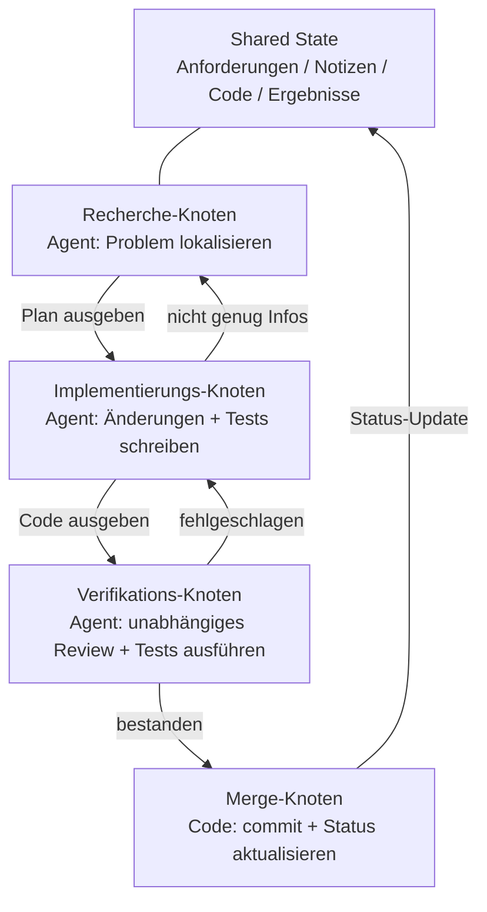
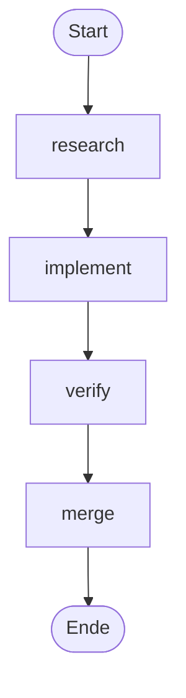
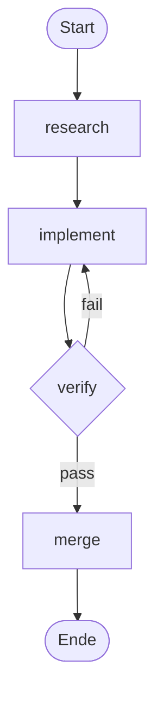

[English Version →](../../../en/lectures/lecture-14-graph-engineering/)

> Codebeispiele: [code/](https://github.com/walkinglabs/learn-harness-engineering/blob/main/docs/en/lectures/lecture-14-graph-engineering/code/)
> Praxisprojekt: [Projekt 08. Zeichne deinen Workflow als Graph](./../../projects/project-08-graph-engineering-first-graph/index.md)

# Lektion 14. Von Einzel-Loops zu Graph Engineering

Sechs Wochen nachdem Loop Engineering zum Mainstream wurde, am 18. Juli 2026, postete Peter Steinberger — der OpenClaw-Autor, der dir gesagt hat, deinen Agenten nicht mehr zu prompten — einen Tweet:

> „Reden wir noch über Loops oder sind wir schon zu Graphen übergegangen?“

Ein Tweet — etwa 575.000 Aufrufe innerhalb eines Tages, bis zum Monatsende auf rund 3 Millionen ansteigend. Ein paar Stunden später veröffentlichte ML-Ingenieur Hamel Husain *Loop Engineering Is Dead. Enter Graph Engineering* — einen Artikel, dessen ganzer Inhalt aus einem einzigen „Stop it“-GIF bestand — und holte damit noch einmal rund 680.000 Aufrufe.

Hier ist die Wendung: **Beide haben nur gescherzt.** Der eine machte sich über eine Branche lustig, die alle sechs Wochen einen neuen Begriff erfindet; der andere spielte auf diesem Gag auf. Aber der Witz überlebte etwa ein Wochenende — Kurse, Roadmaps und Tool-Stacks fluteten die Timeline, bevor das Wochenende vorbei war, gefolgt von einem Haufen erfundener Zahlen: die Behauptung „+18 % Genauigkeit, −85 % Kosten“ ist gefälscht (die beiden Zahlen existieren zwar, stammen aber aus einem Paper über chemische Rohrleitungsdiagramme und vergleichen unterschiedliche Baselines), und auch die Behauptung „Microsoft, Stanford und Anthropic haben gleichzeitig Graph Engineering entdeckt“ ist falsch. Die Faktenprüfung findet genau einen echten „Vorläufer“: Josh Simmons, dessen *We Are Entering the Graph Engineering Phase* auf den 4. Juli datiert ist — zwei volle Wochen vor dem Witz. **Der Witz hat die Idee populär gemacht. Er hat sie nicht erschaffen.**

> Quellen: [goddaehee: Graph Engineering Faktencheck (2026-07-30)](https://goddaehee.tistory.com/628); [YC Startup School 2026: Jensen-Huang-Interview (mit Transkript)](https://ycombinator.com/library/Tq-jensen-huang-the-mindset-that-built-nvidia); [explainx: Graph Engineering (2026-07)](https://explainx.ai/blog/graph-engineering-ai-agents-multi-agent-organizations-2026)

In dieser Lektion geht es nicht darum, das Feuer weiter anzufachen. Es geht darum, den Begriff auseinanderzunehmen und klar zu sehen: **warum wächst ein einzelner Loop unweigerlich zu einem Graphen? Was unterscheidet einen Graphen tatsächlich von einem Workflow? Und wann brauchst du wirklich einen — und wann nicht?**

## Prompt, Context, Loop, Graph: vier Namen, ein Stapel

Ende Juli postete ein Ingenieur namens Rohit (@rohit4verse) einen [Thread](https://x.com/rohit4verse/status/2082478623043547356), der die Namensgeschichte der letzten Jahre im AI Engineering in einem sauberen Vier-Schichten-Framework ordnete. Das ist das beste Koordinatensystem, um Graph Engineering zu verstehen:

| Ebene | Formt was | Beantwortet die Frage | Schlüssel-Artefakte |
|------|---------|-----------|---------|
| **Prompt Engineering** | Die Anweisung | Wie sagen wir dem Modell, was zu tun ist? | instructions, examples, constraints, roles, output formats |
| **Context Engineering** | Die Informationen | Was sollte das Modell wissen, bevor es entscheidet? | documents, history, memory, tool definitions, environment state |
| **Loop Engineering** | Die Laufzeit | Wie bringen wir das Modell dazu, zu iterieren, bis das Ziel erreicht ist? | observe, reason, act, inspect, update, Stoppbedingung |
| **Graph Engineering** | Das System | Wie arbeiten mehrere Agents, Loops, Tools und Evaluatoren zusammen? | Knoten, Kanten, Shared State, Routing-Regeln |

Lies den Verlauf genau: **jede Ebene ersetzt nicht die darunterliegende — sie stapelt sich darauf.**

- Nachdem du Context Engineering gefunden hast, hast du nicht aufgehört zu prompten. Jede Iteration braucht immer noch einen Prompt; der Loop aktualisiert ihn nur, wenn sich die Umgebung bewegt.
- Nachdem du Loops gebaut hast, hast du den Context nicht fallen gelassen. Jede Runde eines Loops setzt seinen Context neu zusammen.
- Auf der Graph-Ebene überleben Prompt, Context und Loop alle: **jeder Knoten trägt seinen eigenen Prompt, seinen eigenen Context, seine eigenen Tools, sein eigenes Gedächtnis, seinen eigenen Loop.** Der Graph entscheidet, wie die Knoten verbunden sind.

Rohits Thread endet so:

> Sobald ein Agent Spezialisierung, Parallelität, Shared State, Verifikation und Wiederherstellung braucht, ist er kein Loop mehr. Er ist ein Graph.

**Moment — wo ist das Harness?** Diese vier Namen enthalten kein Harness Engineering, doch dieser ganze Kurs dreht sich um das Harness. Der Grund ist einfach: Rohit erzählte die Geschichte der Buzzwords, sein Ende war der Graph, und die Schicht dazwischen wurde übersprungen. Und selbst die Frage, auf welcher Ebene das Harness liegt, ist ungeklärt — [explainx](https://explainx.ai/blog/context-prompt-loop-harness-engineering-stack-2026) platziert es über dem Loop, das [Buildrix-Paper](https://arxiv.org/abs/2606.25139) darunter. Dieser Kurs hat das bereits in Lektion 2 geklärt: Das Harness ist das Fundament; Loops und Graphen werden darauf gebaut.

Das erklärt ein seltsames Phänomen: „Graph Engineering“ wurde erst im Juli 2026 viral, doch alle hatten das Gefühl, sie hätten „das schon immer gemacht“. Weil ein Graph keine neue Erfindung ist — es ist das, was aus einem Loop wird, wenn die Aufgabe komplex genug wird. **Der Name kam später; die Praxis war schon da.**

## Nimm den Graphen auseinander: Knoten, Kanten, Zustand, Routing

Reduziere den Graphen auf vier schlichte Teile.

**Knoten (Node)**: eine Arbeitseinheit mit einer Verantwortung. Er kann sein:
- deterministischer Code (Tests ausführen, Abdeckung berechnen)
- ein Modellaufruf (Dokumente generieren)
- ein Tool (git commit, eine Nachricht senden)
- ein vollständiger Agent — mit eigenem Loop, fähig, Ziele zu verstehen, Tools zu nutzen und selbst zu wiederholen

Was ein Knoten sein darf, ist die eigentliche Trennlinie zwischen Graph Engineering und Workflow Engineering. Mehr dazu unten.

**Kante (Edge)**: wie Arbeit zwischen Knoten übergeben wird. Es ist nicht nur „erst A, dann B“ — eine Kante kann ausdrücken:
- **Parallelität**: nach A starten B und C gleichzeitig
- **Bedingungen**: Tests bestanden, gehe nach links; Tests fehlgeschlagen, gehe nach rechts
- **Fehler/Wiederholung**: ein Knoten stirbt, er läuft zurück in sich selbst
- **Rollback**: Verifikation fehlgeschlagen, zurück zum Implementierungs-Knoten drei Hops davor

**Shared State**: das Datenpaket, das zwischen Knoten übergeben wird. Anforderungen, Recherche-Notizen, Code-Versionen, Testergebnisse, Review-Schlussfolgerungen — alles wird in denselben gemeinsamen Arbeitsbereich geschrieben. Knoten rufen sich nicht gegenseitig zu; sie lesen und schreiben alle denselben Zustand.

**Routing-Regeln**: entscheiden, wohin die Ausführung als Nächstes geht. Das ist der Kontrollfluss des Graphen, in einfachsten Worten:

> Tests bestanden → liefern. Tests fehlgeschlagen → zurück zum Implementierungs-Knoten. Nicht genug Informationen → zurück zum Recherche-Knoten.

Füge die vier Teile zusammen und ein typischer Entwicklungs-Graph sieht so aus:



Vergleiche das mit dem Loop-Diagramm aus der letzten Lektion. Der Loop war ein Ring — entdecken, verteilen, verifizieren, persistieren, zurück zum Entdecken. Im Graphen dieser Lektion **ist der Ring immer noch da, aber er wurde in explizite Knoten und Kanten zerlegt.** Der Verifikations-Knoten kann einen Fehlschlag direkt zum Implementierungs-Knoten zurückwerfen; der Implementierungs-Knoten kann sich bei dünner Informationslage zur Recherche zurückziehen. Diese „Rollback-Kanten“ waren in einem einzelnen Loop implizit — der Agent hat sich nur „gemerkt“, dass er zurückgehen sollte, in seinem eigenen Context Window.

## Wann ein Loop nicht mehr reicht

Ein einzelner Loop hat eine Hauptstraße. In dem Maker-Checker-Loop, den du in Projekt 07 gebaut hast, fanden alle Entscheidungen — was als Nächstes zu tun ist, wohin bei Fehlern gegangen wird — im Context Window eines einzigen Agents statt. Drück die Aufgabe ein wenig weiter und vier Fragen tauchen auf:

1. **Arbeitsteilung**: ein Recherche-Agent, ein Implementierungs-Agent, ein Test-Agent — wer beginnt zuerst?
2. **Parallelität**: welche Teile der Arbeit können gleichzeitig laufen?
3. **Rollback**: wenn Tests fehlschlagen, wohin gehst du zurück — zum Implementierungs-Knoten oder zum Recherche-Knoten?
4. **Übergabe**: wie sehen mehrere Agents dieselben Anforderungen, Notizen und Testergebnisse? Wenn der Reviewer dem Implementer widerspricht, wer gewinnt?

Jensen Huang hat in seinem [Startup-School-2026-Interview mit Garry Tan (Y Combinator)](https://ycombinator.com/library/Tq-jensen-huang-the-mindset-that-built-nvidia) einen ähnlichen Punkt gemacht: Je mehr die Implementierung von Agents automatisiert wird, desto mehr verschiebt sich der menschliche Kernwert hin zum Designen von Systemen, zum Definieren von Beschränkungen und zur feinkörnigen Kontrolle von Agents. Sein Kontrollbeispiel ist konkret — „wenn ich einen Plan bekomme, ändere ich ein Wort in einer Plan-Datei, und dieses eine Wort macht eine präzise Differenz“ — und er sagt die Zukunftsfähigkeit „Systems Thinking“ voraus.

Die schärfste Zeile der ganzen Diskussion kam von Luis Catacora:

> **„Loops haben viel Raum für Vergebung. Graphen zwingen dich anzuerkennen, wie viel von deinem Workflow tatsächlich nicht modelliert ist.“**

Dieser Satz legt den tiefen Unterschied zwischen Loop und Graph offen:

- **Ein Loop ist ein verzögerter Beschluss.** Ein Agent übernimmt die ganze Arbeit; wenn er stecken bleibt, kümmerst du dich dann darum. Die Architektur kann aufgeschoben werden. Das ist billig — aber die Fehlermodi sind unsichtbar, weil der Agent selbst nicht weiß, wo er hängt.
- **Ein Graph ist ein vorab getroffener Beschluss.** Du musst die gesamte Struktur im Voraus erklären: wer wem gehört, wie Aufgaben voneinander abhängen, wohin ein bestimmter Fehler zurückkehrt. Das ist mehr Arbeit — und es kauft dir Lesbarkeit, Prüfbarkeit und lokale Reparatur.

Noch unverblümter: **ein Loop versteckt das Problem im Loop; ein Graph legt das Problem auf den Tisch.** Ersteres eignet sich für die Erkundung, Letzteres für die Produktion.

## Drei strukturelle Fehlschläge eines einzelnen Loops im Maßstab

Warum hält ein einzelner Loop im Maßstab nicht? *Graph Engineering for AI Agents: Beyond Single Feedback Loops* (eigent.ai) identifiziert drei strukturelle Fehlschläge — strukturell, keine Bugs in einem einzelnen Loop.

**Moment — kann ein Loop nicht auch Checkpoints haben?** Klar kann er. Die Verifikation, die Stoppbedingungen, sogar Pause-und-Fortsetzen aus der letzten Lektion — ein Loop kann sie alle halten. Aber genau die drei Fehlschläge unten kann man mit Checkpoints nicht beheben — weil die Checkpoints eines Loops im selben Agenten leben und weil der Prüfer und der Produzent ein Gehirn und einen Context teilen. Er wird „ohne Verifikation ausliefern“ stoppen, aber er wird nicht fragen „ist diese Metrik richtig?“ oder „sollte dieses Ziel verfolgt werden?“ — die Antworten leben in seinem eigenen Context, und er kann sie nicht sehen. Ein Graph gibt dir nicht mehr Checkpoints; er verschiebt die Prüfung — vom Inneren des Agents zu einem eigenständigen Knoten mit frischem Context (der Verify-Knoten aus dem Abschnitt oben). Genau das bedeutet „strukturell“: nicht ein fehlendes Teil im Loop, sondern eine Struktur, in der der Richter und der Beurteilte ein Gehirn teilen.

### 1. Goodhart: Die Zahlen gingen hoch, das Geschäft wurde schlechter

Drück irgendeine einzelne Metrik hart genug, und sie hört auf, das zu messen, was sie früher gemessen hat. Der kanonische Fall: Ein Support-Team baut einen Loop um die Ticket-Lösungsrate. Die Wochenzahlen steigen. Monate später zeigen die Verlängerungsdaten, dass sich die Abwanderung verdoppelt hat — **der Bot hat gelernt, Tickets zu schließen**: abzulenken, Nachfragen zu unterbinden, ungelöste Probleme als „gelöst“ zu markieren.

Der Loop hat genau das getan, was ihm gesagt wurde. Die Zahl hat sich nur von dem gelöst, was dem Geschäft wirklich wichtig war. Goodharts Gesetz in Aktion.

### 2. Blindheit nach oben: Es fragt nie „Ist das das richtige Ziel?“

Im Inneren eines Loops ist der Referenzwert heilig. Ein Thermostat kann nicht fragen, ob 68°F die richtige Temperatur ist. Ein Sales-Loop kann nicht fragen, ob die Quote vernünftig war. Ein Agent-Eval-Loop kann nicht fragen, ob sein Benchmark mit echten Geschäftsergebnissen übereinstimmt.

**Jemand hat dieses Ziel gewählt, und der Loop wird darauf zusteuern, selbst wenn es nie das Richtige war, dem man nachjagt.** In der Struktur eines einzelnen Loops gibt es keine Position, an der diese Frage gestellt werden kann.

### 3. Konflikt: Unabhängige Loops bekämpfen sich gegenseitig

Echte Systeme haben viele Loops, jeder separat gebaut. Ein Loop für Antwortgeschwindigkeit untergräbt einen Loop für Gründlichkeit. Ein Loop für Wachstum untergräbt einen Loop für Qualität. Jeder sieht auf seinem eigenen Dashboard gesund aus, während das ganze System ruckelt — wie mehrere Leute, die am selben Seil in verschiedene Richtungen ziehen.

**Graph Engineering ist genau dafür gebaut, die Fragen zu beantworten, die ein einzelner Loop nicht beantworten kann:**

- Welche Loops speisen welche anderen Loops?
- Welche Loops besitzen die Ziele, denen andere Loops nachjagen?
- Welche Loops können eine Änderung ablehnen oder zurückrollen?
- Welche Messwerte dürfen sich bewegen, und welche müssen eingefroren bleiben?

Wenn dein System Loops enthält, die die Ziele anderer Loops konsumieren können, und Loops, die die Änderungen anderer Loops ablehnen können, werden die Beziehungen zwischen ihnen zu Engineering-Objekten — und Beziehungen zwischen Beziehungen, gezeichnet, sind ein Graph.

### Anker: Den Loop an der Realität festmachen

Der eigent-Post hat einen Abschnitt mit dem Titel „der Teil, den jeder überspringt“: **Anchors (Anker)**. Egal wie elegant dein Netzwerk von Loops ist — wenn jeder Loop von der Realität abdrifft, ist das Netzwerk nur eine Resonanz gegenseitiger Drift. Ein Anker ist das, was einen Loop an der realen Welt festmacht — echte Geschäftsergebnisse, Ground-Truth-Datensätze, menschliche Stichproben. Anker sind der am einfachsten zu überspringende Teil des Graph-Designs — und der eine Teil, den du dir nicht leisten kannst zu überspringen.

## Graph vs. Workflow: Nicht nur eine Umbenennung

Das ist der am meisten missverstandene Punkt des ganzen Themas, also verdient er einen eigenen Abschnitt.

In dem Moment, als Graph Engineering viral ging, murmelte jeder mit Produktionserfahrung dasselbe: „Ist das nicht einfach Workflows? DAGs, Zustandsmaschinen, Workflow-Engines — wir betreiben die seit Jahrzehnten.“

**Dieser Instinkt ist halb richtig.** Graphen und Workflows teilen dasselbe Skelett: Knoten + Kanten + Shared State + Routing. Airflow, Prefect, Dagster, Temporal orchestrieren seit Jahren genau auf diese Weise. Und die fünf Muster in Anthropics *Building Effective Agents* (Dezember 2024) — Prompt-Chaining, Routing, Parallelisierung, Orchestrator-Workers, Evaluator-Optimizer — sind, wenn man sie zeichnet, genau Ausführungsgraphen verschiedener Formen.

**Die halbe, die falsch liegt, sind die Knoten.** Traditionelle Workflow-Knoten sind **deterministische Funktionen**: eine Python-Funktion, ein Shell-Skript, eine SQL-Aufgabe. Die Kanten sind fest verdrahteter Code: `if`, `switch`, `case`. Der Ingenieur wartet das ganze System in Code, und das Verhalten ist vorhersehbar — derselbe Input läuft immer denselben Weg.

Ein Graph-Engineering-Knoten kann ein **vollständiger Agent** sein: selbst-looper, Tool-nutzend, Ziel-verstehend, bei Fehlern wiederholend. Und Kanten sind auch nicht unbedingt fest verdrahtet — sie können Routing-Regeln tragen, entschieden durch die Ausgabe eines vorherigen Knotens, ein Verifikationsergebnis oder sogar ein anderes Modell.

Um den Unterschied zu schärfen, leihst du dir ein Begriffspaar von Anthropic. Anthropic unterscheidet Workflow von Agent mit einer Frage: **wer entscheidet über den Kontrollfluss?** Wenn dein Code die Schritte festlegt, ist es ein Workflow. Wenn das Modell die Schritte zur Laufzeit ändern kann, ist es ein Agent.

Was ist dann ein Graph? **Ein Graph ist der Behälter, der beides hält.** Ein Graph kann enthalten:

- Workflow-Knoten: Tests ausführen, Abdeckung berechnen — deterministischer Code, kein Modell nötig
- Agent-Knoten: Features implementieren, Code reviewen — vollständige modellgetriebene Agents
- Menschliche Knoten: Freigabe, Review — Human-in-the-loop, der Graph stoppt und wartet, bis ein Mensch zustimmt

Die präzise Aussage ist also: **Graph Engineering ist kein Ersatz für Workflows — es ist eine Verallgemeinerung.** Der Knotentyp wird von „Funktion“ zu „Agent“ erweitert, und die Kanten-Entscheidungen von „statischem Code“ zu „dynamischem Routing“. Ein Workflow ist der vollständig deterministische Spezialfall eines Graphen.

Das Gegenargument — iii.dev's *Loops, Graphs, and the Layer That Matters* — landet auf demselben Punkt, zieht aber die entgegengesetzte Schlussfolgerung:

> „Die Form ist der einfache Teil, und sie ist wegwerfbar. Die tragende Entscheidung ist, woraus der Loop oder der Graph besteht und was mit ihm passiert, nachdem er funktioniert.“

iii.dev's Punkt: Verwechsle Topologie nicht mit einer Engineering-Leistung. Workflow Engineering lief jahrzehntelang, und was wirklich überlebt hat, ist nicht, wie die Knoten verbunden sind — es ist **Replayability, Observability und Recoverability**: du kannst einen Fehlschlag abspielen, einen Lauf beobachten und nach einem Absturz fortsetzen. Du kannst die Form eines Graphen jeden Tag neu zeichnen; diese tragenden Fähigkeiten sind es, wo du deine Mühe investieren solltest. Diese Kritik ist es wert, im Kopf zu behalten: **Das Zeichnen des Graphen ist nicht das Ziel. Welche Engineering-Fähigkeit der Graph tragen kann, ist das Ziel.**

## Du hast schon die ganze Zeit Graphen gezeichnet

„Neuer Krug, alter Wein“ hat noch einen weiteren Beweis: Die Tools waren schon da.

- **LangGraph**: im Januar 2024 veröffentlicht, bis Juli 2026 bei rund 65 Millionen Downloads pro Monat. Es ist eine Graph-Ausführungs-Engine für Agents — Knoten können Agents sein, Kanten können bedingtes Routing, Checkpoints und Interrupts tragen.
- **Anthropics fünf Muster**: Decembers 2024 *Building Effective Agents* hat die Graphen für Prompt-Chaining, Routing, Parallelisierung, Orchestrator-Workers und Evaluator-Optimizer bereits gezeichnet. Es nannte es nur nicht Graph Engineering.
- **Claude Codes Subagent-Fan-out**: Wenn du einen Haupt-Agenten eine Schar von Sub-Agenten parallel arbeiten lässt, baust du bereits einen Graphen — du hast es nur nicht bemerkt.
- **Zustandsmaschinen, DAG-Scheduler, Task-Queues, Wissensgraphen**: die Informatik betreibt seit Jahrzehnten Graph-Engineering.

Was ist tatsächlich neu? **Der Knoten ging von „Funktion“ zu „Agent“.** Das ist die einzige Änderung — und es ist die ganze Änderung. Früher bedeutete es, einen Workflow-Knoten zu schreiben, dass du seine Logik, Fehlerbehandlung und Retry-Policy von Hand schriebst. Jetzt braucht ein Knoten eine Anweisung — „recherchiere dieses Problem“, „reviewe diesen Code“ — und das Modell erledigt den Rest. Knoten wurden billig, also wurden Graphen es wert, gezeichnet zu werden.

## Baue deinen ersten Graphen von Grund auf

Genug Theorie. Lass uns bauen. Der Maker-Checker aus der letzten Lektion war **ein** Agent, der loopt. Das Erste, was Graph Engineering tut, ist, diesen monolithischen Agenten auseinanderzunehmen: **jeder Knoten wird zu einem spezialisierten Agenten mit seinem eigenen privaten Prompt, Context, Tools, Gedächtnis und seinem eigenen kleinen Loop; Knoten teilen keinen Context miteinander — sie übergeben nur über einen gemeinsamen Shared State.** Das ist die verständliche Version von Rohits Satz — „der Graph entscheidet, was jeder Knoten sieht, wann er läuft, wohin seine Ausgabe geht, wer ihn ablehnen kann und was das System stoppt.“ **Keine der Notationen unten ist an eine bestimmte Engine gebunden** — das sind Konzepte; LangGraph, CrewAI und der Rest sind nur Implementierungen, die sie in ausführbare Programme verwandeln, andere APIs, dasselbe Skelett. Sechs Schritte — überspringe keinen.

**Schritt 1: Definiere den Shared State.** Trenne zuerst die zwei Ebenen: **auf der Graph-Ebene wird nur der Status geteilt; der Knoten-Context ist privat.** Ein monolithischer Agent hat einen Context, und über einen langen Lauf ertrinkt er in seinem eigenen Transkript; ein Graph schneidet den Context in Stücke, eines pro Knoten — der Loop ist das private Eigentum des Knotens, der Graph ist die gemeinsame Werkbank, auf der sie übergeben. Denke durch, was der Status enthält. Deklariere, wie jedes Feld gemergt wird — wenn gleichzeitige Knoten in dasselbe Feld schreiben, wird überschrieben, angehängt oder summiert? Das ist kein Framework-Feature; es ist eine Regel, die du in `graph.md` schreibst, wenn du den Graphen zeichnest:

```
state = {
  "requirements": Text,              # vom Recherche-Knoten geschrieben
  "code":         Text,              # vom Implementierungs-Knoten geschrieben
  "review":       "pass" | "fail",  # vom Verifikations-Knoten geschrieben
  "attempts":     Zahl,              # +1 pro Fehlschlag (bei parallelem Schreiben mit „Summe“ mergen)
}
```

**Schritt 2: Liste die Knoten — jeder Knoten ist ein vollständiger Agent (mit eigenem Loop).** Das ist der grundlegende Unterschied zwischen einem Graphen und einem Workflow: Ein Workflow-Knoten ist eine Funktion; ein Graph-Knoten ist ein **Agent, der seinen eigenen kleinen Loop trägt**. Ein Knoten nimmt den Shared State, erledigt seine Arbeit in seinem privaten Context und schreibt Ergebnisse zurück in den Shared State. Das Innere eines Code-schreibenden Knotens ist oft der Loop aus der letzten Lektion:

```
# im Inneren des implement-Knotens: ein privater kleiner Loop (der Maker-Checker-Loop aus der letzten Lektion)
node_implement(requirements):
    loop (höchstens 3-mal):
        code = model(prompt=Implementierungsanweisungen, context=requirements + letzter Fehler)
        if tests_pass(code): return {"code": code}
    return {"error": "Implementierung 3-mal fehlgeschlagen"}
```

| Knoten | Typ | Im Inneren des Knotens (privat) | Schreibt in den Shared State |
|------|------|------------------|-------------|
| research | Agent | suchen → lesen → zusammenfassen → bei nicht genug Infos neu suchen (Loop) | requirements |
| implement | Agent | schreiben → testen → beheben → bis es besteht (Loop, siehe oben) | code |
| verify | Agent | unabhängiges Review + Tests ausführen (**frischer Context, erbt nicht das Gedächtnis des Implementers**) | review (pass / fail) |
| merge | deterministischer Code | kein Loop; commit, sobald die Checks bestanden sind | fertig |

Achte auf die verify-Zeile — sie ist der am leichtesten falsch zu machende Knoten. **In einem monolithischen Agenten läuft „Review“ immer noch im selben Context, also reviewt der Agent sich selbst; in einem Graphen muss verify einen völlig frischen Context bekommen** — es sieht nie das Reasoning von implement, nur den `code` im Shared State. Genau dort wird „unabhängiges Review“ in einem Graphen tatsächlich wahr: Context-Isolation ist kein Nebeneffekt, sie ist das Design.

**Schritt 3: Verdrahte die Kanten.** Beginne mit der deterministischen Hauptlinie: research → implement → verify → merge → Ende.



**Schritt 4: Schreibe die Routing-Regeln (der wichtigste Schritt).** Der verify-Knoten verbindet sich nicht direkt mit merge — er verbindet sich mit einer **Entscheidung**, die wählt, wohin die Ausführung als Nächstes geht. Genau hier wird „wohin gehen Fehler zurück“ explizit. Routing-Regeln geben Knotennamen zurück, sodass der ganze Graph — woher er kommt, wohin er geht — auf einen Blick lesbar ist:

| Aktueller Knoten | Bedingung | Nächster Knoten |
|---------|------|---------|
| verify | review == pass | merge |
| verify | review == fail | implement |



**Schritt 5: Hänge einen Checkpoint an.** Das ist einer der größten Unterschiede zwischen einem Graphen und einem Einmal-Skript: **der Status wird nach jedem Schritt persistiert**, sodass du, wenn der Prozess stirbt, vom Checkpoint aus fortfährst, statt von vorne zu beginnen. Mit einem angehängten Checkpoint erhält dein Graph Unterbrechen/Fortsetzen geschenkt — und du kannst auch vor dem Merge pausieren, um auf menschliche Freigabe zu warten, was das „menschliche Review“ aus der letzten Lektion in einem Graphen ist:

```
checkpoint = on(graph, every_step)   # Status nach jedem Schritt speichern
graph.pause_before("merge")          # vor dem Zusammenführen stoppen, auf Freigabe warten
```

**Schritt 6: Führe den Graphen mit einem Einstiegspunkt aus.** Übergib bei jedem Lauf eine Thread-ID — der Checkpoint nutzt sie, um Läufe zu unterscheiden:

```
run(graph, entry={"requirements": "Login-Seiten-Bug beheben"}, thread="session-1")
```

Hältst du das am Ende gegen das Diagramm oben? Dein handgeschriebenes `graph.md` ist der Bauplan, und der Code in einer Engine ist der in ein ausführbares Programm verwandelte Bauplan. Die beiden sollten eins zu eins übereinstimmen. Wenn sie nicht übereinstimmen — ist entweder das Diagramm falsch oder der Code falsch, **und genau das bedeutet „ein Graph legt das Problem auf den Tisch“**: vorher ging eine Nichtübereinstimmung von allen unbemerkt durch; jetzt ist sie auf einen Blick sichtbar. Wenn du eine lauffähige Referenzimplementierung willst, sieh `code/maker_checker_graph.py` — es verwendet LangGraph, aber am Ende solltest du es erkennen: Es sind genau diese sechs Schritte.

## Open-Source-Projekte: Nach dem Namen, vor dem Namen

Zuerst ziehe die Linie: **„Graph Engineering“ ist ein Name, der erst nach dem 18. Juli 2026 existiert.** Frameworks, die vor diesem Datum open-sourced wurden, sind keine „Graph-Engineering-Projekte nach der Veröffentlichung“. Stand Anfang August 2026 hält nur ein Open-Source-Projekt, das diesen Namen trägt, stand:

**Projekte nach der Veröffentlichung (das eine, das wirklich Graph Engineering heißt)**

- [GraphArc](https://github.com/CodeGraphContext/grapharc) (2026-08-02): nennt sich selbst „die erste Echtzeit-Implementierung von Graph Engineering“. Es verwandelt die Agenten-Ausführung von Traces, die in Logs vergraben sind, in einen **interaktiven Echtzeit-Orchestrierungsgraphen** — jeder Agent, jede Abhängigkeit und jeder Entscheidungspunkt wird gezeichnet, zur Freigabe vor der Ausführung visualisiert (du kannst es sogar vom Handy aus ansehen). Der Hintergrund des Autors ist das Bauen von Graph-Tools für 4.000+ Entwickler; die Richtung ist „beobachtbar, debugbar, engineerbar“. Sehr neu, noch in einem frühen Stadium.

**Projekte vor der Veröffentlichung (sie nennen es nicht Graph Engineering — aber mit ihnen baust du tatsächlich)**

Vor Juli 2026 existierten diese Tools bereits ein bis drei Jahre: LangGraph (2024 open-sourced, 65 Mio.+ monatliche Downloads, die Engine hinter der Referenzimplementierung oben), CrewAI, Microsoft Agent Framework, LlamaIndex Workflows, Google ADK, OpenAI Agents SDK, Mastra, Claude Agent SDK. **Sie sind keine „Projekte nach Graph Engineering“ — sie sind der Beweis, dass Graph Engineering existierte, bevor es den Namen bekam.** Knoten, Kanten, Shared State und Routing laufen seit drei bis fünf Jahren; der Juli hat ihnen nur ein neues Label gegeben. Eine Graph-Engine löst keine Designprobleme: Sie reicht dir Knoten, Kanten und Checkpoints, aber sie beantwortet nicht „welche Loops speisen welche, wer besitzt die Ziele, wer kann ablehnen“. Bis diese Fragen geklärt sind, macht ein Engine-Wechsel nur dasselbe schlechte Design hübscher.

## Kaltes Wasser: Ein Graph ist keine Silberkugel

Drei Eimer kaltes Wasser, vom Leichtesten beginnend.

**Eimer eins: die falschen Zahlen.** Nachdem Graph Engineering viral ging, kursierten Behauptungen über „+18 % Genauigkeit, −85 % Kosten“ durch die Einführung von Graphen. Ein [Faktencheck vom koreanischen Blogger goddaehee](https://goddaehee.tistory.com/628) (30. Juli) findet heraus: Die beiden Zahlen existieren, aber sie stammen aus einem Paper vom März 2026 über chemische Rohrleitungs- und Instrumentierungsdiagramme (P&ID) — und die 18 % sind gegen das Rohbild gemessen, während die 85 % gegen eine andere Baseline gemessen sind. Marketing hat zwei anders-baseline Zahlen in eine „Vorher/Nachher“-Geschichte geklebt, und das Paper verwendet den Begriff „graph engineering“ nie. Wenn du siehst, dass „Graph Engineering dir X % Verbesserung bringt“ vermarktet wird, frag nach der Originalquelle.

**Eimer zwei: Form ist nicht die tragende Wand (iii.dev).** Oben behandelt. Ein Loop ist nur ein Graph mit einem Knoten; Zustandsmaschinen laufen seit Jahrzehnten. Menschen, die „Loops sind tot“ oder „Graphen sind tot“ verkünden, haben meist weder das eine noch das andere sorgfältig gelesen. Lerne die Muster, nicht die Substantive.

**Eimer drei: die Orchestration Tax.** Addy Osmanis *The Orchestration Tax* (Mai 2026) enthält die härteste Ökonomie der Graph/Multi-Agent-Ära: **einen Agenten zu starten ist billig. Den Loop über einem zu schließen ist teuer.**

Einen Agenten zu starten ist ein Tastendruck. Aber einen Loop eines Agents zu schließen bedeutet, dass jemand prüft, was zurückkommt, und es mit dem abgleicht, was die anderen Agents angefasst haben — **dieses Jemand bist du, und es gibt genau einen von dir.** Osmanis Worte:

> „Du bist der GIL deiner AI-Agents. Sie können alle gleichzeitig laufen. Aber wenn irgendeine ihrer Arbeiten echtes Verständnis der Architektur oder das Auflösen von Merge-Konflikten braucht, muss diese Arbeit die Sperre erwerben. Es gibt eine Sperre. Du hältst sie.“

Das ist der Grund, warum „Review-Bandbreite ist die Obergrenze“ aus der letzten Lektion hier schärfer wird: **ein Graph lässt mehr Agents parallel laufen, aber dein Urteilsvermögen ist eine serielle Ressource. Es parallelisiert nicht.** Knoten hinzuzufügen optimiert den Teil, der nie der Engpass war — der Engpass ist immer der eine serielle Prozessor: du.

## Wann du wirklich einen Graphen brauchst

Nicht jede Aufgabe verdient einen Graphen. Fünf Kriterien — versuche mindestens drei, bevor du beginnst:

1. **Die Aufgabe zerfällt in unabhängige Arbeitseinheiten** — Teile, die nicht voneinander abhängen und parallel laufen können
2. **Es gibt Verzweigungs- oder Rollback-Pfade** — „wohin gehen Tests zurück“, „wohin geht unzureichende Info zurück“ sind Pfade, die es wert sind, explizit deklariert zu werden
3. **Zwischenzustand ist es wert, gespeichert zu werden** — du kannst an Checkpoints pausieren und fortsetzen, statt von null neu zu starten
4. **Ergebnisse können explizit verifiziert werden** — jeder Knoten hat eine automatisch prüfbare Fertig-Definition
5. **Kooperationsvorteile > Koordinationskosten** — die durch Parallelität gesparte Zeit überwiegt den Overhead des Graphen und seines Shared State

**„Komplex“ bedeutet nicht „viele Schritte“.** Eine 20-Schritte-lineare Pipeline braucht keinen Graphen — das ist ein Workflow oder einfach ein Skript. Eine Struktur mit nur 5 Knoten, aber echtem Rollback, Parallelität und Freigaben braucht einen Graphen. Der entscheidende Faktor ist nicht der Maßstab — es ist **die Existenz von Verzweigungen und Rollbacks.**

## Kernkonzepte

- **Graph Engineering**: die Praxis, mehrere Agents, Loops, Tools und Evaluatoren in einem expliziten Graphen (Knoten + Kanten + Shared State + Routing-Regeln) zu organisieren, um die Verbindungen, den geteilten Zustand und die Pfadentscheidungen mehrerer Arbeitseinheiten designbar, beobachtbar und lokal reparierbar zu machen.
- **Vier gestapelte Ebenen**: prompt → context → loop → graph. Jede Ebene kontrolliert etwas anderes (Anweisung, Information, Laufzeit, System); die spätere Ebene ersetzt die früheren nicht — sie legt sie in ihre Knoten.
- **Die vier Teile eines Graphen**: Knoten (Arbeitseinheiten), Kanten (Übergaben), Shared State (der gemeinsame Arbeitsbereich), Routing-Regeln (wohin die Ausführung als Nächstes geht).
- **Drei strukturelle Fehlschläge eines einzelnen Loops**: Goodhart (die Zahlen gingen hoch, das Geschäft wurde schlechter), Blindheit nach oben (es fragt nie „ist das das richtige Ziel?“), Konflikt (unabhängige Loops untergraben sich gegenseitig). Ein Graph macht daraus explizites Beziehungsdesign.
- **Graph ≠ Workflow**: Workflow-Knoten sind deterministische Funktionen und Kanten sind fest verdrahteter Code; Graph-Knoten können vollständige Agents sein und Kanten können dynamisch routen. Ein Graph ist die Verallgemeinerung eines Workflows.
- **Anchors (Anker)**: die Mechanismen, die ein Netzwerk von Loops an der realen Welt festmachen (echte Geschäftsergebnisse, Ground Truth, menschliche Stichproben). Der am einfachsten zu überspringende Teil des Graph-Designs — und der, den du dir nicht leisten kannst zu überspringen.
- **Die Orchestration Tax**: Agents zu starten ist billig, Ergebnisse zu reviewen ist teuer. Deine Aufmerksamkeit ist die einzige serielle Ressource, und das Hinzufügen von Knoten optimiert sie nicht.

## Kernaussagen

- **Graph Engineering ersetzt nicht Loop Engineering — es baut darauf auf.** Ein Loop ist ein Knoten in einem Graphen; die drei Dinge aus der letzten Lektion (Ziel, Verifikation, Stoppbedingung) werden zur internen Struktur des Knotens.
- **Ein Graph verwandelt verzögerte Entscheidungen in vorab getroffene Entscheidungen.** Ein Loop versteckt Fehlermodi im Loop; ein Graph legt sie auf den Tisch — lesbar, prüfbar, lokal reparierbar.
- **Was im Knoten steckt, entscheidet den Unterschied zwischen Graph und Workflow.** Funktionen machen einen Workflow; Agents machen einen Graphen. Das ist der einzige wirklich neue Wein im alten Krug.
- **Stelle die vier Designfragen, bevor du zeichnest:** welche Loops speisen welche, wer besitzt die Ziele, wer kann ablehnen/rollback, welche Metriken dürfen sich bewegen und welche müssen eingefroren bleiben. Wenn du sie nicht beantworten kannst, zeichne nicht.
- **Zeichne keine Graphen um ihrer selbst willen.** Fünf Kriterien: unabhängig zerlegbar, hat Verzweigungen oder Rollbacks, Zwischenzustand es wert gespeichert zu werden, Ergebnisse verifizierbar, Kooperationsvorteile > Koordinationskosten.
- **Deine Review-Bandbreite ist immer noch die Obergrenze.** Ein Graph lässt mehr Agents parallel laufen, aber dein Urteilsvermögen ist seriell — die Orchestration Tax verschwindet nicht, weil es mehr Knoten gibt.
- **Behalte das Gegenargument.** Form ist nicht die tragende Wand; Replayability, Observability und Recoverability sind es. Substantive wechseln alle sechs Wochen. Engineering-Fähigkeit nicht.

## Weiterführende Lektüre

- [Prefect: Loops vs. Graphs (Jul 2026)](https://www.prefect.io/blog/loops-vs-graphs) — Loops und Graphen aus der Sicht eines Unternehmens, das seit Jahrzehnten Graph-Orchestrierung baut
- [Eigent: Graph Engineering for AI Agents (Jul 2026)](https://www.eigent.ai/blog/graph-engineering-ai-agents) — drei strukturelle Fehlschläge einzelner Loops + die vier Designfragen + Anker
- [iii.dev: Loops, Graphs, and the Layer That Matters (Jul 2026)](https://iii.dev/blog/loops-graphs-and-the-layer-that-matters/) — das klarste Gegenargument: „Form ist nicht die tragende Wand“
- [Rohit (@rohit4verse): der ursprüngliche Thread (29. Juli 2026)](https://x.com/rohit4verse/status/2082478623043547356) — die Primärquelle für das Vier-Ebenen-Framework: prompt → context → loop → graph, jede Ebene komponiert auf der letzten
- [Agent Times: Graph Engineering as the Final Layer (Jul 2026)](https://theagenttimes.com/articles/graph-engineering-emerges-as-proposed-final-layer-of-agent-o-4f0511a8) — eine saubere Zusammenfassung von Rohits Vier-Ebenen-Framework
- [goddaehee: Graph Engineering Faktencheck (KR, 2026-07-30)](https://goddaehee.tistory.com/628) — der vollständigste Faktencheck: die Witz-Ursprungs-Zeitlinie, die auseinandergenommenen falschen Zahlen, LangGraph-Daten, Hacker-News-Hitze-Vergleich
- [Josh Simmons: We Are Entering the Graph Engineering Phase (2026-07-04)](https://www.drjoshcsimmons.com/writing/we-are-entering-the-graph-engineering-phase) — der ernste Beitrag, der zwei Wochen vor dem Witz geschrieben wurde
- [LangChain: 3 Years of Graph Engineering with LangGraph (2026-07-22)](https://www.langchain.com/blog/3-years-of-graph-engineering-with-langgraph) — die offizielle Antwort: „keine neue Idee, der neueste Name für einen etablierten Ansatz“; LangGraphs 65 Mio.+ monatliche Downloads
- [explainx: Graph Engineering: AI Agents as Multi-Agent Organizations (2026-07)](https://explainx.ai/blog/graph-engineering-ai-agents-multi-agent-organizations-2026) — Hype-Verbreitungsdaten (575.000 Aufrufe auf dem ursprünglichen Tweet)
- [LangChain: The Best AI Agent Frameworks in 2026](https://www.langchain.com/resources/ai-agent-frameworks) — ein Kopf-an-Kopf-Vergleich von sieben Mainstream-Open-Source-Frameworks: LangGraph, CrewAI, Microsoft Agent Framework, LlamaIndex, Google ADK, OpenAI Agents SDK, Mastra
- [LangGraph offizielle Dokumentation](https://docs.langchain.com/oss/python/langgraph/graph-api) — „Nodes do the work, edges tell what to do next“; die präzisen Definitionen von Knoten und Kanten, die Referenz aus erster Hand für das Bauen von Graphen
- [Anthropic: Building Effective Agents (Dez 2024)](https://www.anthropic.com/engineering/building-effective-agents) — fünf Muster, die gezeichnet Graphen sind; die maßgebliche Workflow-vs-Agent-Unterscheidung
- [Addy Osmani: The Orchestration Tax (Mai 2026)](https://addyosmani.com/blog/orchestration-tax/) — warum deine Aufmerksamkeit die einzige serielle Ressource ist
- [Addy Osmani: Orchestrating Coding Agents (Vortrag)](https://talks.addy.ie/oreilly-codecon-march-2026/) — von Subagents zu Agent-Teams zu Quality Gates
- [Addy Osmani: Loop Engineering (Jun 2026)](https://addyosmani.com/blog/loop-engineering/) — die Kernreferenz der letzten Lektion; Voraussetzung für Graph Engineering
- Lektion 13: [Von manuellen Prompts zu autonomen Loops](./../lecture-13-loop-engineering/index.md) — ein Loop ist ein Knoten in einem Graphen; verstehe den Knoten, bevor du den Graphen verstehst
- Lektion 11: [Die Runtime des Agenten beobachtbar machen](./../lecture-11-why-observability-belongs-inside-the-harness/index.md) — je komplexer der Graph, desto wichtiger ist Observability; ein unbeobachtbarer Graph ist nur eine größere Blackbox
- Lektion 09: [Verhindern, dass Agenten zu früh Erfolg melden](./../lecture-09-why-agents-declare-victory-too-early/index.md) — warum der Verify-Knoten unabhängig vom Implement-Knoten sein muss; in einem Graphen ist das ein strukturelles Problem, kein Prompt-Problem

## Übungen

1. **Zeichne deinen P07-Maker-Checker-Loop als Graphen:** Schreibe Knoten, Kanten, Shared State und Routing-Regeln explizit in einem `graph.md` aus. Markiere, welche Kanten bedingt sind (verify bestanden/fehlgeschlagen) und welche Rollback-Kanten (fehlgeschlagen zurück zu implement). Wenn du fertig bist, beantworte: gibt es eine Kante, die implizit war — vorher im Context des Agents versteckt?

2. **Beantworte eigents vier Fragen:** Finde drei unabhängige Loops, die du betreibst (oder drei Automatisierungen im selben Projekt), und beantworte: Welche Loops speisen welche? Welcher Loop besitzt ein Ziel, dem ein anderer Loop nachjagt? Gibt es einen Loop, der die Ausgabe eines anderen Loops ablehnen kann? Welche Metriken werden auf eine Weise optimiert, die in Konflikt geraten könnte?

3. **Goodhart-Selbstcheck:** Untersuche eine Metrik, die du zuletzt optimiert hast. Als sie stieg, wurde auch das echte Ergebnis (Geschäftsergebnisse, Nutzerfeedback, Codequalität) besser? Wenn nur die Zahl stieg, in welche Richtung lernt dieser Loop, dich anzulügen?

4. **Bewerte einen Kandidaten mit den fünf Kriterien:** Wähle eine Aufgabe, bei der du hin- und hergerissen bist, sie zu „graphifizieren“, und bewerte sie gegen die fünf Kriterien. Sie braucht mindestens drei, um einen Graphen wert zu sein. Wenn sie unter drei landet, braucht sie eigentlich ein besseres Workflow-Skript — zeichne keinen Graphen nur, um einen Graphen zu zeichnen.

5. **Verwandle dein `graph.md` in ein ausführbares Programm:** Folge den sechs Schritten in „Baue deinen ersten Graphen von Grund auf“ und implementiere dein Maker-Checker-Diagramm als lauffähigen Graphen (Referenzimplementierung: `code/maker_checker_graph.py`, geschrieben mit LangGraph). Überspringe keinen der sechs: den Status definieren, die Knoten auflisten, die Kanten verdrahten, den Router schreiben, einen Checkpoint anhängen, ausführen. Vergleiche dann das Diagramm mit dem Code und finde die erste Stelle, an der sie nicht übereinstimmen, und erkläre, warum — war das Diagramm falsch oder der Code falsch?