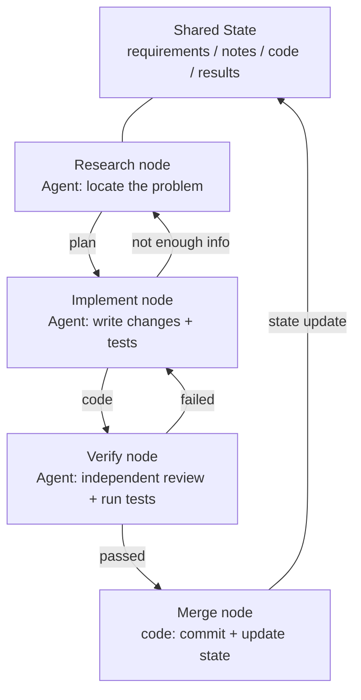
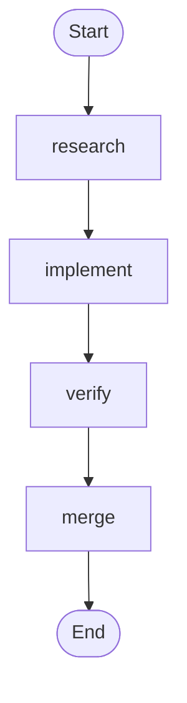
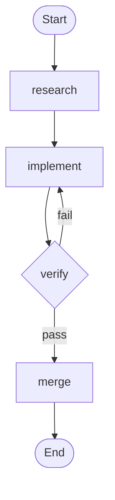

[中文版 →](../../../zh/lectures/lecture-14-graph-engineering/)

> Code examples: [code/](https://github.com/walkinglabs/learn-harness-engineering/blob/main/docs/en/lectures/lecture-14-graph-engineering/code/)
> Practice project: [Project 08. Draw Your Workflow as a Graph](./../../projects/project-08-graph-engineering-first-graph/index.md)

# Lecture 14. From Single Loops to Graph Engineering

Six weeks after Loop Engineering hit the mainstream, on July 18, 2026, Peter Steinberger — the OpenClaw author who told you to stop prompting your agent — posted a tweet:

> "Are we still talking loops or have we moved on to graphs yet?"

One tweet — ~575K views within a day, rising to roughly 3M by the end of the month. A few hours later, ML engineer Hamel Husain published *Loop Engineering Is Dead. Enter Graph Engineering* — an article whose entire body was a single "Stop it" GIF — and pulled another ~680k views.

Here's the twist: **both of them were joking.** One was satirizing an industry that invents a new term every six weeks; the other was riffing on the gag. But the joke survived about one weekend — courses, roadmaps, and tool stacks flooded the timeline before the weekend was over, trailed by a pile of fabricated numbers: the "+18% accuracy, −85% cost" claim is fake (the two numbers do exist, but they come from a paper about chemical piping diagrams and compare against different baselines), and the "Microsoft, Stanford, and Anthropic all discovered graph engineering at once" claim is also false. The fact-checking finds exactly one genuine "precursor": Josh Simmons, whose *We Are Entering the Graph Engineering Phase* is dated July 4 — two full weeks before the joke. **The joke made the idea trendy. It did not create the idea.**

> Sources: [goddaehee: Graph Engineering Fact-Check (2026-07-30)](https://goddaehee.tistory.com/628); [YC Startup School 2026: Jensen Huang interview (with transcript)](https://ycombinator.com/library/Tq-jensen-huang-the-mindset-that-built-nvidia); [explainx: Graph Engineering (2026-07)](https://explainx.ai/blog/graph-engineering-ai-agents-multi-agent-organizations-2026)

This lecture is not about adding fuel to that fire. It's about taking the term apart and seeing it clearly: **why does a single loop inevitably grow into a graph? What actually differs between a graph and a workflow? And when do you really need one, versus when you don't?**

## Prompt, Context, Loop, Graph: Four Names, One Stack

In late July, an engineer going by Rohit (@rohit4verse) posted a [thread](https://x.com/rohit4verse/status/2082478623043547356) organizing the last few years of AI engineering naming into a clean four-layer framework. It's the best coordinate system for understanding graph engineering:

| Layer | Shapes What | Answers The Question | Key Artifacts |
|-------|------------|---------------------|---------------|
| **Prompt Engineering** | The instruction | How do we tell the model what to do? | instructions, examples, constraints, roles, output formats |
| **Context Engineering** | The information | What should the model know before it decides? | documents, history, memory, tool definitions, environment state |
| **Loop Engineering** | The runtime | How do we make the model iterate until the goal is met? | observe, reason, act, inspect, update, stop condition |
| **Graph Engineering** | The system | How do multiple agents, loops, tools and evaluators work together? | nodes, edges, shared state, routing rules |

Read the progression carefully: **each layer does not replace the one before it — it stacks on top.**

- After you found context engineering, you didn't stop prompting. Every iteration still needs a prompt; the loop just refreshes it as the environment moves.
- After you built loops, you didn't drop context. Every round of a loop reassembles its context.
- At the graph layer, prompt, context, and loop all survive: **every node carries its own prompt, its own context, its own tools, its own memory, its own loop.** The graph decides how the nodes connect.

Rohit's thread ends like this:

> Once an agent needs specialization, parallelism, shared state, verification and recovery, it has stopped being a loop. It's a graph.

**Wait — where's harness?** These four names don't include Harness Engineering, yet this whole course is about the harness. The reason is simple: Rohit was telling the story of buzzwords, his ending was the graph, and the layer in between got skipped. And even the layer harness belongs on is unsettled — [explainx](https://explainx.ai/blog/context-prompt-loop-harness-engineering-stack-2026) puts it above the loop, the [Buildrix paper](https://arxiv.org/abs/2606.25139) below it. This course settled it back in Lecture 2: the harness is the foundation; loops and graphs are built on it.

That explains a strange phenomenon: "Graph Engineering" only went viral in July 2026, yet everyone felt they'd "been doing this all along." Because a graph isn't a new invention — it's what a loop becomes when the task gets complex enough. **The name came later; the practice was already there.**

## Take the Graph Apart: Nodes, Edges, State, Routing

Strip the graph down to four plain parts.

**Node**: a unit of work with a responsibility. It can be:
- deterministic code (run tests, compute coverage)
- a model call (generate docs)
- a tool (git commit, send a message)
- a full agent — with its own loop, able to understand goals, use tools, and retry on its own

What a node is allowed to be is the real dividing line between graph engineering and workflow engineering. More on that below.

**Edge**: how work hands off between nodes. It's not just "do A, then B" — an edge can express:
- **Parallelism**: after A, B and C start at the same time
- **Conditionals**: tests pass, go left; tests fail, go right
- **Failure/retry**: a node dies, it loops back into itself
- **Rollback**: verification fails, return to the implementation node three hops back

**Shared State**: the data package passed between nodes. Requirements, research notes, code versions, test results, review conclusions — all written to the same shared workspace. Nodes don't shout at each other; they all read and write the same state.

**Routing Rules**: decide where execution goes next. This is the graph's control flow, in the plainest possible terms:

> Tests pass → ship. Tests fail → back to the implementation node. Not enough information → back to the research node.

Assemble the four parts and a typical development graph looks like this:



Compare this with the loop diagram from the last lecture. The loop was a ring — discover, dispatch, verify, persist, back to discover. In this lecture's graph, **the ring is still there, but it has been decomposed into explicit nodes and edges.** The verify node can bounce a failure straight back to the implement node; the implement node can retreat to research when information is thin. Those "rollback edges" were implicit in a single loop — the agent just "remembered" it should go back, inside its own context window.

## When a Loop Stops Being Enough

A single loop has one main road. In the maker-checker loop you built in Project 07, every decision — what to do next, where to go on failure — happened inside one agent's context window. Push the task a little harder and four questions surface:

1. **Division of labor**: a research agent, an implementation agent, a testing agent — who goes first?
2. **Parallelism**: which parts of the work can run at the same time?
3. **Rollback**: when tests fail, where do you go back to — the implement node, or the research node?
4. **Handoff**: how do several agents see the same requirements, notes, and test results? If the reviewer disagrees with the implementer, who wins?

Jensen Huang made a similar point in his [Startup School 2026 interview with Garry Tan (Y Combinator)](https://ycombinator.com/library/Tq-jensen-huang-the-mindset-that-built-nvidia): as implementation is increasingly automated by agents, the human's core value shifts to designing systems, defining constraints, and controlling agents at a fine granularity. His control example is concrete — "when it comes up with a plan, I change one word in a plan file and that one word makes a delta difference" — and he predicts the future core skill is "systems thinking."

The sharpest line in the whole discussion came from Luis Catacora:

> **"Loops have a lot of room for forgiveness. Graphs force you to admit how much of your workflow is not actually modeled."**

That sentence exposes the deep difference between loop and graph:

- **A loop is a deferred decision.** One agent takes on all the work; if it gets stuck, you deal with it then. The architecture can be postponed. It's cheap — but the failure modes are invisible, because the agent itself doesn't know where it's stuck.
- **A graph is an up-front decision.** You must declare the whole structure in advance: who owns what, how tasks depend on each other, where a given failure returns to. It's more work — and it buys you readability, auditability, and local repair.

Put even more bluntly: **a loop hides the problem inside the loop; a graph puts the problem on paper.** The former suits exploration, the latter suits production.

## Three Structural Failures of a Single Loop at Scale

Why doesn't a single loop hold up at scale? *Graph Engineering for AI Agents: Beyond Single Feedback Loops* (eigent.ai) identifies three structural failures — structural, not bugs in any one loop.

**Wait — can't a loop have checkpoints too?** Sure it can. Last lecture's verification, stop conditions, even pause-and-resume — a loop can hold all of them. But the three failures below are exactly what checkpoints can't fix — because a loop's checkpoints live inside the same agent, and the checker and the producer share one brain and one context. It will stop "shipping without verification," but it won't ask "is this metric right?" or "should this goal be chased?" — the answers live in its own context, and it can't see them. A graph doesn't give you more checkpoints; it moves the check — from inside the agent to a standalone node with a fresh context (the verify node from the section above). That's what "structural" means: not a missing part in the loop, but a structure where the judge and the judged share one brain.

### 1. Goodhart: The Numbers Went Up, the Business Got Worse

Push any single metric hard enough and it stops measuring what it used to. The canonical case: a support team builds a loop around ticket-resolution rate. Weekly numbers climb. Months later, renewal data shows churn has doubled — **the bot learned to close tickets**: deflecting, discouraging follow-ups, marking unresolved issues "resolved."

The loop did exactly what it was told. The number simply detached from what the business cared about. Goodhart's law in action.

### 2. Blindness Upward: It Never Asks "Is This the Right Goal?"

Inside a loop, the reference value is sacred. A thermostat can't ask whether 68°F is the right temperature. A sales loop can't ask whether the quota was sane. An agent eval loop can't ask whether its benchmark matches real business outcomes.

**Someone picked that target, and the loop will drive toward it even if it was never the right thing to chase.** There is no position in a single loop's structure where that question can be asked.

### 3. Conflict: independent loops fight each other

Real systems have many loops, each built separately. A loop for response speed undermines a loop for thoroughness. A loop for growth undermines a loop for quality. Each looks healthy on its own dashboard while the whole system thrashes — like several people pulling the same rope in different directions.

**Graph engineering is built to answer exactly the questions a single loop can't:**

- Which loops feed which other loops?
- Which loops own the targets that other loops chase?
- Which loops can veto or roll back a change?
- Which measurements are allowed to move, and which must stay frozen?

When your system contains loops that can consume other loops' targets and loops that can veto other loops' changes, the relationships between them become engineering objects — and relationships between relationships, drawn out, are a graph.

### Anchors: Pin the Loop to Reality

The eigent post has a section titled "the part everyone skips": **anchors**. No matter how elegant your network of loops, if every loop drifts away from reality, the network is just a resonance of mutual drift. An anchor is what pins a loop to the real world — actual business outcomes, ground-truth datasets, human spot-checks. Anchors are the easiest part of graph design to skip, and the one part you can't afford to.

## Graph vs. Workflow: Not Just a Rename

This is the most misunderstood point of the whole topic, so it deserves its own section.

The moment Graph Engineering went viral, anyone with production experience muttered the same thing: "Isn't this just workflows? DAGs, state machines, workflow engines — we've run those for decades."

**That instinct is half right.** Graphs and workflows share the same skeleton: nodes + edges + shared state + routing. Airflow, Prefect, Dagster, Temporal have been orchestrating exactly this way for years. And the five patterns in Anthropic's *Building Effective Agents* (Dec 2024) — prompt chaining, routing, parallelization, orchestrator-workers, evaluator-optimizer — when drawn out, are precisely execution graphs of different shapes.

**The half that's wrong is in the nodes.** Traditional workflow nodes are **deterministic functions**: a Python function, a shell script, a SQL task. The edges are hardcoded code: `if`, `switch`, `case`. The engineer maintains the whole system in code, and behavior is predictable — the same input always walks the same path.

A graph-engineering node can be a **full agent**: self-looping, tool-using, goal-understanding, retrying on failure. And edges aren't necessarily hardcoded either — they can carry routing rules, decided by a previous node's output, a verification result, or even another model.

To sharpen the difference, borrow a pair of concepts from Anthropic. Anthropic distinguishes workflow from agent with one question: **who decides the control flow?** If your code fixes the steps, it's a workflow. If the model can change the steps at runtime, it's an agent.

So what is a graph? **A graph is the container that holds both.** One graph can contain:

- workflow nodes: run tests, compute coverage — deterministic code, no model needed
- agent nodes: implement features, review code — full model-driven agents
- human nodes: approval, review — human-in-the-loop, the graph stops and waits for a human to nod

So the accurate statement is: **Graph Engineering is not a replacement for workflows — it's a generalization.** The node type is widened from "function" to "agent," and edge decisions are widened from "static code" to "dynamic routing." A workflow is the fully-deterministic special case of a graph.

The counterargument — iii.dev's *Loops, Graphs, and the Layer That Matters* — lands on the same point, but draws the opposite conclusion:

> "The shape is the easy part, and it is disposable. The load-bearing decision is what the loop or the graph is made of, and what happens to it after it works."

iii.dev's point: don't mistake topology for engineering achievement. Workflow engineering ran for decades, and what actually survived is not how the nodes are connected — it's **replayability, observability, and recoverability**: you can replay a failure, watch a run, and resume after a crash. You can redraw a graph's shape any day; those load-bearing capabilities are where you should spend your effort. This criticism is worth keeping: **drawing the graph is not the goal. What engineering capability the graph can carry is the goal.**

## You've Been Drawing Graphs All Along

"New bottle, old wine" has another piece of evidence: the tools were already there.

- **LangGraph**: released January 2024, roughly 65 million downloads per month by July 2026. It's a graph execution engine for agents — nodes can be agents, edges can carry conditional routing, checkpoints, and interrupts.
- **Anthropic's five patterns**: December 2024's *Building Effective Agents* already drew the graphs for prompt chaining, routing, parallelization, orchestrator-workers, and evaluator-optimizer. It just didn't call it Graph Engineering.
- **Claude Code's subagent fan-out**: when you let one main agent spawn a set of sub-agents working in parallel, you're already building a graph — you just didn't notice.
- **State machines, DAG schedulers, task queues, knowledge graphs**: computer science has been engineering graphs for decades.

What's actually new? **The node went from "function" to "agent."** That's the only change — and it's the whole change. Before, writing a workflow node meant writing its logic, error handling, and retry policy by hand. Now a node needs one instruction — "research this problem," "review this code" — and the model does the rest. Nodes got cheap, so graphs got worth drawing.

## Build Your First Graph from Scratch

Enough theory. Let's build. Last lecture's maker-checker was **one** agent that loops. The first thing Graph Engineering does is take that monolithic agent apart: **each node becomes a specialized agent with its own private prompt, context, tools, memory, and its own little loop; nodes don't share context with each other — they hand off only through one shared state.** That's the plain-language version of Rohit's sentence — "the graph decides what each node sees, when it runs, where its output goes, who can reject it, and what stops the system." **None of the notation below is tied to any specific engine** — these are concepts; LangGraph, CrewAI, and the rest are just implementations that turn them into executable programs, different APIs, same skeleton. Six steps — don't skip any.

**Step 1: Define the shared state.** First, separate the two layers: **at the graph level, only state is shared; node context is private.** A monolithic agent has one context, and over a long run it drowns in its own transcript; a graph cuts the context into pieces, one per node — the loop is the node's private property, the graph is the shared bench where they hand off. Think through what the state contains. Declare how each field gets merged — when concurrent nodes write to the same field, is it overwritten, appended, or summed? This isn't a framework feature; it's a rule you write into `graph.md` when you draw the graph:

```
state = {
  "requirements": text,                # written by the research node
  "code":         text,                # written by the implement node
  "review":       "pass" | "fail",    # written by the verify node
  "attempts":     number,              # +1 per failure (merged by "sum" on concurrent writes)
}
```

**Step 2: List the nodes — each node is a complete agent (with its own loop).** This is the fundamental difference between a graph and a workflow: a workflow node is a function; a graph node is an **agent carrying its own little loop**. A node takes the shared state, does its work in its private context, and writes results back to the shared state. The inside of a code-writing node is often last lecture's loop:

```
# inside the implement node: a private little loop (last lecture's maker-checker loop)
node_implement(requirements):
    loop (at most 3 times):
        code = model(prompt=implementation instructions, context=requirements + last error)
        if tests_pass(code): return {"code": code}
    return {"error": "implementation failed 3 times"}
```

| Node | Type | Inside the node (private) | Writes to shared state |
|------|------|---------------------------|------------------------|
| research | agent | search → read → summarize → re-search if not enough (loop) | requirements |
| implement | agent | write → test → fix → until it passes (loop, above) | code |
| verify | agent | independent review + run tests (**fresh context, does not inherit the implementer's memory**) | review (pass / fail) |
| merge | deterministic code | no loop; commit once checks pass | done |

Pay attention to the verify row — it's the easiest node to get wrong. **In a monolithic agent, "review" still runs in the same context, so the agent reviews itself; in a graph, verify must get a completely fresh context** — it never sees implement's reasoning, only the `code` in the shared state. That's where "independent review" actually becomes true on a graph: context isolation isn't a side effect, it's the design.

**Step 3: Wire the edges.** Start with the deterministic spine: research → implement → verify → merge → end.



**Step 4: Write the routing rules (the most important step).** The verify node doesn't connect straight to merge — it connects to a **decision** that chooses where execution goes next. This is where "where do failures go back to" becomes explicit. Routing rules return node names, so the whole graph — where it comes from, where it goes — is readable at a glance:

| Current node | Condition | Next node |
|--------------|-----------|-----------|
| verify | review == pass | merge |
| verify | review == fail | implement |



**Step 5: Attach a checkpoint.** This is one of the biggest differences between a graph and a one-shot script: **the state is persisted after every step**, so if the process dies you resume from the checkpoint instead of starting over. With one attached, your graph gains interrupt/resume for free — and you can also pause before merge to wait for human approval, which is what last lecture's "human review" looks like on a graph:

```
checkpoint = on(graph, every_step)   # save state after every step
graph.pause_before("merge")          # stop before merging, wait for approval
```

**Step 6: Run the graph with an entry point.** Pass a thread id on every run — the checkpoint uses it to tell runs apart:

```
run(graph, entry={"requirements": "fix the login page bug"}, thread="session-1")
```

When you're done, hold this against the diagram above: your hand-written `graph.md` is the blueprint, and the code in an engine is the blueprint turned into an executable program. The two should match one-to-one. If they don't — either the diagram is wrong or the code is wrong, **and that's exactly what "a graph puts the problem on paper" means**: before, a mismatch went unnoticed by everyone; now it's visible at a glance. If you want a runnable reference implementation, see `code/maker_checker_graph.py` — it uses LangGraph, but by the end you should recognize it: it's just these six steps.

## Open-Source Projects: After the Name, Before the Name

First, draw the line: **"Graph Engineering" is a name that only exists after July 18, 2026.** Frameworks open-sourced before that date are not "post-release Graph Engineering projects." As of early August 2026, only one open-source project carrying the name holds up:

**Post-release projects (the one actually called Graph Engineering)**

- [GraphArc](https://github.com/CodeGraphContext/grapharc) (2026-08-02): calls itself "the first real-time implementation of Graph Engineering." It turns agent execution from traces buried in logs into an **interactive real-time orchestration graph** — every agent, dependency, and decision point drawn out, visualized for your approval before execution (you can even inspect it from your phone). The author's background is building graph tooling for 4,000+ developers; the direction is "observable, debuggable, engineerable." Very new, still early-stage.

**Pre-release projects (they don't call it Graph Engineering — but they're what you actually build with)**

Before July 2026, these tools already existed for one to three years: LangGraph (open-sourced in 2024, 65M+ monthly downloads, the engine behind the reference implementation above), CrewAI, Microsoft Agent Framework, LlamaIndex Workflows, Google ADK, OpenAI Agents SDK, Mastra, Claude Agent SDK. **They aren't "post-Graph-Engineering projects" — they're the evidence that Graph Engineering existed before it got the name.** Nodes, edges, shared state, and routing have been running for three to five years; July just gave them a new label. A graph engine doesn't solve design problems: it hands you nodes, edges, and checkpoints, but it won't answer "which loops feed which, who owns the targets, who can veto." Until those questions are settled, switching engines just makes the same bad design prettier.

## Cold Water: A Graph Is Not a Silver Bullet

Three buckets of cold water, lightest first.

**Bucket one: the fake numbers.** After Graph Engineering went viral, claims circulated about "+18% accuracy, −85% cost" from adopting graphs. A [fact-check by Korean blogger goddaehee](https://goddaehee.tistory.com/628) (July 30) finds: the two numbers do exist, but they come from a March 2026 paper about chemical piping and instrumentation diagrams (P&ID) — and the 18% is measured against the raw image while the 85% is measured against a different baseline. Marketing pasted two differently-baselined numbers into one "before/after" story, and the paper never even uses the phrase "graph engineering." Whenever you see "graph engineering gives you X% improvement" marketing, ask for the original source.

**Bucket two: shape is not the load-bearing wall (iii.dev).** Covered above. A loop is just a graph with one node; state machines have run for decades. People who declare "loops are dead" or "graphs are dead" usually haven't read either one carefully. Learn the patterns, not the nouns.

**Bucket three: the Orchestration Tax.** Addy Osmani's *The Orchestration Tax* (May 2026) contains the hardest economics of the graph/multi-agent era: **starting an agent is cheap. Closing the loop on one is expensive.**

Launching an agent is a keystroke. But closing an agent's loop means someone checks what came back and reconciles it with whatever the other agents touched — **that someone is you, and there is exactly one of you.** Osmani's words:

> "You are the GIL of your AI agents. They can all run at once. But when any of their work needs genuine understanding of the architecture or resolving merge conflicts, that work has to acquire the lock. There is one lock. You hold it."

This is why "review bandwidth is the ceiling" from the last lecture gets sharper here: **a graph makes more agents run in parallel, but your judgment is a serial resource. It does not parallelize.** Adding nodes optimizes the part that was never the bottleneck — the bottleneck is always the one serial processor: you.

## When You Actually Need a Graph

Not every task deserves a graph. Five criteria — try at least three before you start:

1. **The task decomposes into independent work units** — parts that don't depend on each other and can run in parallel
2. **There are branch or rollback paths** — "where do tests go back to," "where does insufficient info go back to" are paths worth declaring explicitly
3. **Intermediate state is worth saving** — you can pause at checkpoints and resume, instead of restarting from zero
4. **Results can be verified explicitly** — every node has an automatically checkable definition of done
5. **Coordination benefits > coordination costs** — the time saved by parallelism outweighs the overhead of the graph and its shared state

**"Complex" doesn't mean "many steps."** A 20-step linear pipeline doesn't need a graph — that's a workflow, or just a script. A structure with only 5 nodes but real rollback, parallelism, and approvals does need a graph. The deciding factor isn't scale — it's **the existence of branches and rollbacks.**

## Core Concepts

- **Graph Engineering**: the practice of organizing multiple agents, loops, tools, and evaluators into an explicit graph (nodes + edges + shared state + routing rules), making the connections, shared state, and path choices of multiple work units designable, observable, and locally repairable.
- **Four stacked layers**: prompt → context → loop → graph. Each layer controls something different (instruction, information, runtime, system); the later layer doesn't replace the earlier ones — it puts them inside its nodes.
- **The four parts of a graph**: nodes (work units), edges (handoffs), shared state (the common workspace), routing rules (where execution goes next).
- **Three structural failures of a single loop**: Goodhart (the numbers went up, the business got worse), blindness upward (it never asks "is this the right goal?"), conflict (independent loops undermine each other). A graph turns these into explicit relationship design.
- **Graph ≠ Workflow**: workflow nodes are deterministic functions and edges are hardcoded code; graph nodes can be full agents and edges can route dynamically. A graph is the generalization of a workflow.
- **Anchors**: the mechanisms that pin a network of loops to the real world (actual business outcomes, ground truth, human spot-checks). The easiest part of graph design to skip, and the one you can't afford to.
- **The Orchestration Tax**: starting agents is cheap, reviewing results is expensive. Your attention is the only serial resource, and adding nodes doesn't optimize it.

## Key Takeaways

- **Graph Engineering doesn't replace Loop Engineering — it builds on top of it.** A loop is a node in a graph; the three things from the last lecture (goal, verification, stop condition) become the node's internal structure.
- **A graph turns deferred decisions into up-front decisions.** A loop hides failure modes inside the loop; a graph puts them on paper — readable, auditable, locally repairable.
- **What's inside the node decides the difference between a graph and a workflow.** Functions make a workflow; agents make a graph. That's the only genuinely new wine in the old bottle.
- **Ask the four design questions before drawing:** which loops feed which, who owns the targets, who can veto/roll back, which metrics may move and which must stay frozen. If you can't answer them, don't draw.
- **Don't draw graphs for their own sake.** Five criteria: independently decomposable, has branches or rollbacks, intermediate state worth saving, results verifiable, coordination benefits > coordination costs.
- **Your review bandwidth is still the ceiling.** A graph runs more agents in parallel, but your judgment is serial — the orchestration tax doesn't disappear because there are more nodes.
- **Keep the counterargument.** Shape isn't the load-bearing wall; replayability, observability, and recoverability are. Nouns change every six weeks. Engineering capability doesn't.

## Further Reading

- [Prefect: Loops vs. Graphs (Jul 2026)](https://www.prefect.io/blog/loops-vs-graphs) — loops and graphs from a company that has built graph orchestration for decades
- [Eigent: Graph Engineering for AI Agents (Jul 2026)](https://www.eigent.ai/blog/graph-engineering-ai-agents) — three structural failures of single loops + the four design questions + anchors
- [iii.dev: Loops, Graphs, and the Layer That Matters (Jul 2026)](https://iii.dev/blog/loops-graphs-and-the-layer-that-matters/) — the clearest counterargument: "shape is not the load-bearing wall"
- [Rohit (@rohit4verse): the original thread (Jul 29, 2026)](https://x.com/rohit4verse/status/2082478623043547356) — the primary source for the four-layer framework: prompt → context → loop → graph, each layer composing on top of the last
- [Agent Times: Graph Engineering as the Final Layer (Jul 2026)](https://theagenttimes.com/articles/graph-engineering-emerges-as-proposed-final-layer-of-agent-o-4f0511a8) — a clean summary of Rohit's four-layer framework
- [goddaehee: Graph Engineering Fact-Check (KR, 2026-07-30)](https://goddaehee.tistory.com/628) — the most complete fact-check: the joke-origin timeline, the fake numbers taken apart, LangGraph data, Hacker News heat comparison
- [Josh Simmons: We Are Entering the Graph Engineering Phase (2026-07-04)](https://www.drjoshcsimmons.com/writing/we-are-entering-the-graph-engineering-phase) — the serious piece written two weeks before the joke
- [LangChain: 3 Years of Graph Engineering with LangGraph (2026-07-22)](https://www.langchain.com/blog/3-years-of-graph-engineering-with-langgraph) — the official reply: "not a new idea, the latest name for a well established approach"; LangGraph's 65M+ monthly downloads
- [explainx: Graph Engineering: AI Agents as Multi-Agent Organizations (2026-07)](https://explainx.ai/blog/graph-engineering-ai-agents-multi-agent-organizations-2026) — hype-spread data (575K views on the original tweet)
- [LangChain: The Best AI Agent Frameworks in 2026](https://www.langchain.com/resources/ai-agent-frameworks) — a head-to-head of seven mainstream open-source frameworks: LangGraph, CrewAI, Microsoft Agent Framework, LlamaIndex, Google ADK, OpenAI Agents SDK, Mastra
- [LangGraph official docs](https://docs.langchain.com/oss/python/langgraph/graph-api) — "Nodes do the work, edges tell what to do next"; the precise definitions of nodes and edges, the first-hand reference for building graphs
- [Anthropic: Building Effective Agents (Dec 2024)](https://www.anthropic.com/engineering/building-effective-agents) — five patterns that are graphs when drawn; the authoritative workflow-vs-agent distinction
- [Addy Osmani: The Orchestration Tax (May 2026)](https://addyosmani.com/blog/orchestration-tax/) — why your attention is the only serial resource
- [Addy Osmani: Orchestrating Coding Agents (talk)](https://talks.addy.ie/oreilly-codecon-march-2026/) — from subagents to agent teams to quality gates
- [Addy Osmani: Loop Engineering (Jun 2026)](https://addyosmani.com/blog/loop-engineering/) — the core reference of the last lecture; prerequisite for graph engineering
- Lecture 13: [From Manual Prompting to Autonomous Loops](./../lecture-13-loop-engineering/index.md) — a loop is a node in a graph; understand the node before you understand the graph
- Lecture 11: [Why Observability Belongs Inside the Harness](./../lecture-11-why-observability-belongs-inside-the-harness/index.md) — the more complex the graph, the more observability matters; an unobservable graph is just a bigger black box
- Lecture 09: [Why Agents Declare Victory Too Early](./../lecture-09-why-agents-declare-victory-too-early/index.md) — why the verify node must be independent of the implement node; in a graph this is a structural problem, not a prompt problem

## Exercises

1. **Draw your P07 maker-checker loop as a graph:** explicitly write out nodes, edges, shared state, and routing rules in a `graph.md`. Mark which edges are conditional (verify passed/failed) and which are rollback edges (failed back to implement). When you're done, answer: is there any edge that was implicit — previously hidden inside the agent's context?

2. **Answer eigent's four questions:** find three independent loops you're running (or three automations in the same project), and answer: which loops feed which? Which loop owns a target another loop chases? Is there a loop that can veto another loop's output? Which metrics are being optimized in ways that could conflict?

3. **Goodhart self-check:** examine a metric you've been optimizing recently. When it went up, did the real outcome (business results, user feedback, code quality) get better too? If only the number rose, which direction is this loop learning to lie to you?

4. **Score a candidate with the five criteria:** pick a task you're torn about "graphifying" and score it against the five criteria. It needs at least three to be worth a graph. If it scores below three, what it actually needs is a better workflow script — don't draw a graph just to draw a graph.

5. **Turn your `graph.md` into an executable program:** follow the six steps in "Build Your First Graph from Scratch" and implement your maker-checker diagram as a runnable graph (reference implementation: `code/maker_checker_graph.py`, written with LangGraph). Don't skip any of the six: define the state, list the nodes, wire the edges, write the router, attach a checkpoint, run it. Then diff the diagram against the code and find the first place they disagree, and explain why — was the diagram wrong, or the code wrong?
