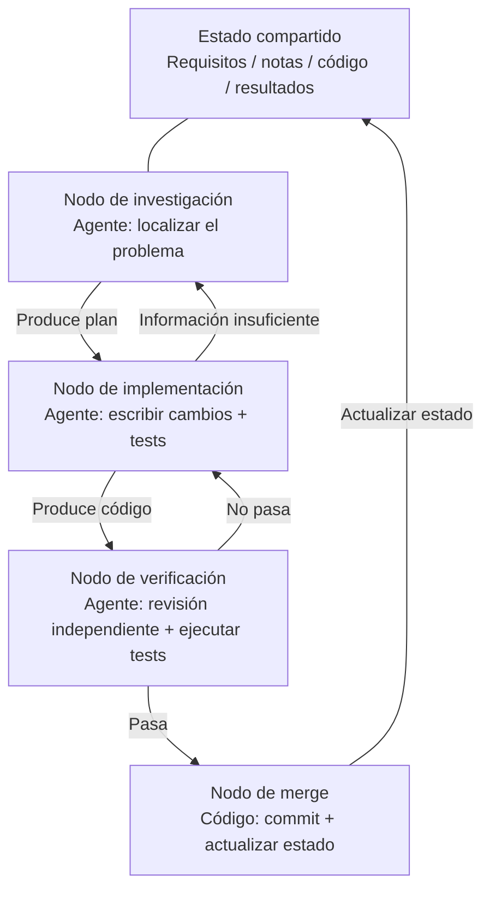
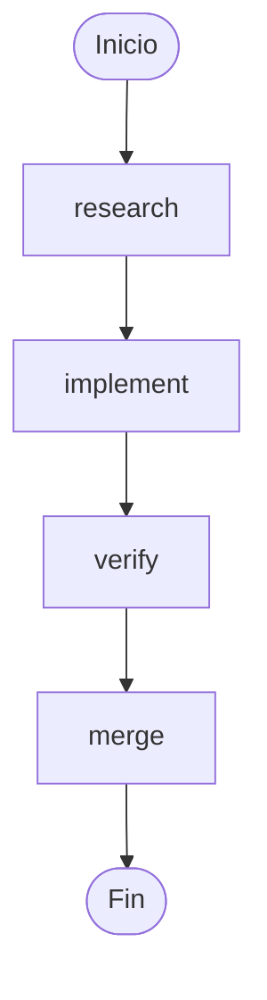
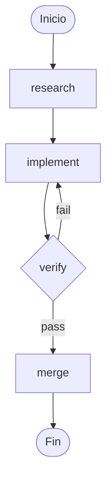

[English Version →](../../../en/lectures/lecture-14-graph-engineering/)

> Ejemplos de código: [code/](https://github.com/walkinglabs/learn-harness-engineering/blob/main/docs/en/lectures/lecture-14-graph-engineering/code/)
> Proyecto práctico: [Proyecto 08. Dibuja Tu Flujo de Trabajo como un Grafo](./../../projects/project-08-graph-engineering-first-graph/index.md)

# Lección 14. De los Loops Únicos a la Ingeniería de Grafos

Seis semanas después de que la lección anterior terminara de contar Loop Engineering, el 18 de julio de 2026, Peter Steinberger — el autor de OpenClaw de la lección anterior, aquel que dijo "deja de hacerle prompting a tu coding agent" — publicó un tweet:

> "¿Todavía hablamos de loops, o ya hemos pasado a los graphs?"

Un tweet — unas 575 mil visitas en un día, subiendo a unos 3 millones para fin de mes. Unas horas después, el ingeniero de ML Hamel Husain publicó *Loop Engineering Is Dead. Enter Graph Engineering* — un artículo cuyo cuerpo entero era un solo GIF de "Stop it" — y consiguió otras ~680 mil visitas.

Lo más interesante: **los dos estaban bromeando.** Uno satirizaba a una industria que inventa un término nuevo cada seis semanas; el otro seguía el chiste. Pero el chiste sobrevivió alrededor de un fin de semana — cursos, hojas de ruta y stacks de herramientas inundaron el timeline antes de que terminara el fin de semana, seguidos de un montón de números inventados: la afirmación de "+18% de precisión, −85% de coste" es falsa (los dos números existen, pero provienen de un artículo sobre diagramas de tuberías químicas y comparan contra líneas base completamente diferentes), y la afirmación de que "Microsoft, Stanford y Anthropic descubrieron la ingeniería de grafos al mismo tiempo" también es falsa. La verificación de datos confirma un único "precursor" real: Josh Simmons, cuyo *We Are Entering the Graph Engineering Phase* está fechado el 4 de julio — dos semanas completas antes del chiste. **El chiste hizo que el concepto se volviera popular. No fue el chiste el que lo creó.**

> Fuentes: [goddaehee: Verificación de datos de Graph Engineering (2026-07-30)](https://goddaehee.tistory.com/628); [YC Startup School 2026: Entrevista a Jensen Huang (con transcripción)](https://ycombinator.com/library/Tq-jensen-huang-the-mindset-that-built-nvidia); [explainx: Graph Engineering (2026-07)](https://explainx.ai/blog/graph-engineering-ai-agents-multi-agent-organizations-2026)

Esta lección no trata de echar más leña al fuego de la palabra de moda, sino de desarmarla y verla con claridad: **¿por qué un loop único inevitablemente se convierte en un grafo? ¿Qué diferencia hay realmente entre un grafo y un workflow? ¿Y cuándo lo necesitas de verdad, y cuándo no?**

## prompt, context, loop, graph: cuatro nombres, una capa sobre la otra

A finales de julio, el ingeniero Rohit (@rohit4verse) publicó un [hilo largo](https://x.com/rohit4verse/status/2082478623043547356) que organizaba la historia de los nombres de la ingeniería de IA de los últimos años en un marco claro de cuatro capas. Es el mejor sistema de coordenadas para entender Graph Engineering:

| Capa | Lo que da forma | La pregunta que responde | Artefactos clave |
|------|---------------|------------------------|------------------|
| **Prompt Engineering** | La instrucción | ¿Cómo le decimos al modelo qué hacer? | instructions, examples, constraints, roles, output formats |
| **Context Engineering** | La información | ¿Qué debería saber el modelo antes de decidir? | documents, history, memory, tool definitions, environment state |
| **Loop Engineering** | El runtime | ¿Cómo hacemos que el modelo itere solo hasta lograr el objetivo? | observe, reason, act, inspect, update, condición de parada |
| **Graph Engineering** | El sistema | ¿Cómo colaboran múltiples agentes, loops, herramientas y evaluadores? | nodos, aristas, estado compartido, reglas de routing |

Fíjate en cómo se lee esta línea: **cada capa no reemplaza a la anterior — se apila encima de ella.**

- Después de encontrar el context engineering, no dejaste de hacer prompt engineering — cada iteración sigue necesitando un prompt; el loop solo lo refresca cuando el entorno cambia.
- Después de construir loops, tampoco descartaste el context — cada ronda de un loop tiene que reensamblar su contexto.
- Al llegar al grafo, ni el prompt, ni el context, ni el loop han desaparecido: **cada nodo lleva su propio prompt, su propio context, sus propias herramientas, su propia memoria y su propio loop.** El grafo decide cómo se conectan los nodos.

Rohit cierra su hilo con estas palabras:

> Una vez que un agente necesita especialización, paralelismo, estado compartido, verificación y recuperación, ya no es un loop. Es un grafo.

**Espera — ¿y el harness?** En estos cuatro nombres no está Harness Engineering, y sin embargo este curso trata del harness. La razón es simple: Rohit contaba la historia de las palabras de moda, su final era el grafo, y la capa del medio quedó saltada. Y ni siquiera está clara la capa en la que debería estar el harness — [explainx](https://explainx.ai/blog/context-prompt-loop-harness-engineering-stack-2026) lo pone encima del loop, y el [paper de Buildrix](https://arxiv.org/abs/2606.25139) lo pone debajo. Este curso lo decidió en la segunda lección: el harness es la base; el loop y el grafo se construyen sobre él.

Esto explica un fenómeno curioso: por qué "Graph Engineering" no se hizo viral hasta julio de 2026, y sin embargo todo el mundo descubrió que "ya lo estaba haciendo desde hace tiempo". Porque el grafo no es un invento nuevo — es lo que el loop se convierte automáticamente cuando tu tarea es lo bastante compleja. **El nombre llegó después; la práctica ya existía.**

## Desarma el grafo: nodos, aristas, estado, routing

Reduce el grafo a sus cuatro piezas más simples.

**Nodo (Node)**: una unidad de trabajo con una responsabilidad. Puede ser:
- código determinista (ejecutar tests, calcular cobertura)
- una llamada de modelo (generar documentación)
- una herramienta (git commit, enviar un mensaje)
- un agente completo — con su propio loop, capaz de entender objetivos, usar herramientas y reintentar por su cuenta cuando no avanza

Qué puede ser un nodo es la verdadera línea divisoria entre la ingeniería de grafos y la ingeniería de workflows. Se explica en detalle más abajo.

**Arista (Edge)**: expresa cómo se hace la entrega entre nodos. No es tan simple como "primero A y luego B" — una arista puede expresar:
- **Paralelismo**: después de A, B y C empiezan al mismo tiempo
- **Condición**: si el test pasa, ve por la izquierda; si falla, ve por la derecha
- **Fallo/reintento**: el nodo se cae, vuelve a sí mismo y se ejecuta otra vez
- **Retroceso**: la verificación no pasa, vuelve al nodo de implementación que está tres pasos atrás

**Estado compartido (State)**: el paquete de datos que se transmite entre nodos. Requisitos, notas de investigación, versiones de código, resultados de tests, conclusiones de revisión — todo se escribe en el mismo espacio de trabajo común. Los nodos no se hablan directamente entre sí; todos leen y escriben el mismo estado.

**Reglas de routing (Routing)**: deciden a dónde ir a continuación. Es el "control de flujo" del grafo, dicho de la forma más simple:

> Si el test pasa, entrega; si el test falla, vuelve al nodo de implementación; si la información es insuficiente, vuelve al nodo de investigación.

Junta las cuatro piezas y un grafo de desarrollo típico se ve así:



Fíjate en la comparación con el grafo de loop de la lección anterior: la anterior era un anillo — descubrir, despachar, verificar, persistir, y volver a descubrir. En el grafo de esta lección, **el anillo sigue ahí, pero está descompuesto en nodos y aristas explícitos.** El nodo de verificación puede devolver directamente el fallo al nodo de implementación, y el nodo de implementación puede volver al nodo de investigación por información insuficiente — estas "aristas de retroceso" en un loop único son implícitas: es el propio agente el que recuerda en su contexto que "debe volver atrás".

## Cuándo un loop no alcanza

Un loop tiene un solo camino principal. En el loop maker-checker que construiste en la lección anterior, todas las decisiones — qué hacer después, a dónde ir si falla — ocurren dentro de la ventana de contexto del mismo agente. Cuando la tarea se complica un poco más, aparecen cuatro problemas:

1. **División del trabajo**: el agente que investiga los requisitos, el que escribe el código y el que hace los tests — ¿quién empieza primero?
2. **Paralelismo**: ¿qué trabajo se puede hacer al mismo tiempo?
3. **Retroceso**: después de que falle el test, ¿a dónde se vuelve — al nodo de implementación o al nodo de investigación?
4. **Entrega**: ¿cómo ven varios agentes los mismos requisitos, notas y resultados de tests? Si el revisor no está de acuerdo con el implementador, ¿a quién se le hace caso?

Jensen Huang dijo algo similar en la [entrevista de Startup School 2026](https://ycombinator.com/library/Tq-jensen-huang-the-mindset-that-built-nvidia) de Y Combinator (en conversación con Garry Tan): a medida que la implementación de base se automatiza cada vez más con agentes, el valor central de los humanos se desplaza a "diseñar sistemas, definir restricciones claras y tener control fino sobre los agentes". Su ejemplo de control era muy concreto — "después de que el agente da su plan, yo cambio una palabra en el archivo del plan, y esa palabra produce una diferencia precisa en un solo punto" — y también predijo que la habilidad central del futuro es el "pensamiento sistémico" (systems thinking).

El golpe más brillante del hilo de discusión vino de Luis Catacora:

> **"Un loop tiene mucho margen para la tolerancia a fallos. Un grafo te obliga a admitir cuántas partes de tu flujo de trabajo nunca han sido modeladas realmente."**

Esta frase señala la diferencia profunda entre loop y grafo:

- **El loop es decisión diferida.** Primero dejas que un agente se encargue de todo el trabajo; si no avanza, ya se verá; la arquitectura se puede posponer. Es cómodo, pero el coste es que los modos de fallo son invisibles — nunca sabes en qué paso se atascó, porque ni siquiera él mismo lo sabe.
- **El grafo es decisión anticipada.** Tienes que declarar toda la estructura por adelantado: quién se encarga de qué, cómo dependen las tareas entre sí, a dónde vuelve cada fallo. Es más trabajoso, pero a cambio obtienes algo legible, auditable y reparable localmente.

Dicho más directamente: **el loop esconde el problema dentro del ciclo; el grafo pone el problema sobre el papel.** El primero sirve para explorar; el segundo, para producción.

## Los tres fallos estructurales del loop único

¿Por qué un loop único no aguanta a escala? El artículo *Graph Engineering for AI Agents: Beyond Single Feedback Loops* de eigent.ai identifica tres fallos estructurales — fíjate que son estructurales, no un bug de un loop concreto.

**Primero, una objeción: ¿no se pueden añadir checkpoints dentro del loop?** Se puede. La verificación, las condiciones de parada e incluso los reintentos desde un punto de ruptura de la lección anterior — el loop las admite todas. Pero los tres fallos siguientes son justamente lo que los checkpoints no pueden resolver — porque los checkpoints de un loop crecen dentro del mismo agente: el que comprueba y el que tiene el problema son el mismo cerebro, la misma ventana de contexto. Detiene "entregar sin verificar", pero nunca se pregunta "¿este indicador es el correcto?" o "¿merece la pena perseguir este objetivo?" — la respuesta está escrita en su propio context, y no puede verla. El grafo no te da más checkpoints; lo que hace es **sacar la comprobación fuera**: de "dentro del agente" a "un nodo independiente", dándole una ventana de contexto completamente nueva (como se explicó en la sección del nodo verify). Ahí está el sentido de "estructural": no es que al loop le falte una pieza, es que "el que juzga y el que es juzgado comparten el mismo cerebro" — esa estructura en sí misma es el problema.

### 1. Goodhart: el número sube, pero el negocio empeora

Lleva cualquier indicador único al extremo y dejará de medir lo que crees que mide. Caso clásico: un equipo de soporte construyó un loop alrededor de la "tasa de resolución de tickets". Los datos semanales no paraban de subir. Meses después, los datos de renovación mostraban que el churn se había duplicado — **el bot había aprendido a cerrar tickets**: desviar el tema, disuadir al usuario de preguntar más, y marcar como "resuelto" problemas que no estaban resueltos.

El loop hizo todo lo que se le pidió. Solo que el número se había separado de lo que al negocio realmente le importa. Eso es la ley de Goodhart.

### 2. Ceguera hacia arriba: nunca pregunta "¿es correcto este objetivo?"

Dentro de un loop, la referencia es sagrada. Un termostato no pregunta "¿68°F es la temperatura correcta?". Un loop de ventas no pregunta "¿es razonable esta cuota?". Un loop de evals de agentes no pregunta "¿coincide este benchmark con los resultados reales del negocio?".

**Quienquiera que eligiera el objetivo, el loop corre hacia él, aunque desde el principio no fuera lo que debía perseguir.** En la estructura de un loop único no hay ningún lugar donde quepa esta pregunta.

### 3. Conflicto: loops independientes se sabotean entre sí

En un sistema real hay decenas de loops, cada uno construido de forma independiente. El loop de velocidad de respuesta sabotea al loop de calidad de profundidad; el loop de crecimiento sabotea al loop de calidad. Cada loop está sano en su propio dashboard, pero el sistema en conjunto tiembla — como varias personas tirando de la misma cuerda en direcciones distintas.

**Graph engineering responde justamente al conjunto de preguntas que un loop único no puede responder:**

- ¿Qué loops alimentan a qué loops?
- ¿Qué loops poseen los objetivos que otros loops persiguen?
- ¿Qué loops pueden vetar o revertir un cambio?
- ¿Qué indicadores pueden moverse y cuáles deben congelarse?

Cuando en un sistema existen "loops que pueden comerse tu objetivo" y "loops que pueden vetar tu cambio", la relación entre ellos se convierte en un objeto de ingeniería — y las relaciones entre relaciones, dibujadas, son un grafo.

### Anclas: fijar los loops a la realidad

El artículo de eigent tiene una sección que "todo el mundo se salta": **anchors (anclas)**. Por muy refinada que sea la red de loops, si cada loop se aleja de la realidad, la red no es más que una resonancia de deriva mutua. Una ancla es lo que fija un loop al mundo real — resultados reales de negocio, conjuntos de datos ground truth, muestreos manuales. Al diseñar un grafo, las anclas son el paso que más fácil se salta — y el que menos se puede omitir.

## Graph vs. Workflow: no es solo cambiar el nombre

Esta es la parte de la lección que más se malinterpreta, y merece que la tratemos aparte.

La primera reacción al boom de Graph Engineering, cualquier ingeniero con experiencia lo murmura: "¿Pero esto no es un workflow? DAGs, máquinas de estado, motores de flujo de trabajo — los llevamos corriendo décadas."

**Esa intuición es correcta a medias.** El grafo y el workflow comparten de hecho el mismo esqueleto: nodos + aristas + estado compartido + routing. La forma en que Airflow, Prefect, Dagster y Temporal han orquestado durante décadas es exactamente este grafo. Y los cinco patrones que Anthropic resumió en diciembre de 2024 en *Building Effective Agents* — cadenas de prompts, routing, paralelización, orquestador/trabajadores, evaluador/optimizador — dibujados, no son más que grafos de ejecución con formas distintas.

**La mitad que está mal está dentro del nodo.** Los nodos de un workflow tradicional son **funciones deterministas**: una función de Python, un script de shell, una tarea SQL. Las aristas son código fijo: `if`, `switch`, `case`. Todo el sistema lo mantiene el ingeniero con código, y el comportamiento es predecible — la misma entrada siempre recorre el mismo camino.

El nodo de la ingeniería de grafos puede ser un **agente completo**: con su propio loop, capaz de usar herramientas, entender objetivos y reintentar por su cuenta ante un fallo. Y la arista tampoco tiene por qué estar fijada en código — puede llevar reglas de routing, donde el siguiente paso lo decide la salida del nodo anterior, el resultado de la verificación, o incluso otro modelo.

Para explicar bien esta diferencia, tomamos prestado un par de conceptos de Anthropic. Anthropic distingue workflow y agente con una frase: **¿quién decide el control de flujo?** Si el código decide los pasos, es un workflow; si el modelo puede cambiar los pasos en tiempo de ejecución, es un agente.

Entonces, ¿qué es un grafo? **Un grafo es el contenedor de ambos.** En un mismo grafo puede haber a la vez:

- nodos de workflow: ejecutar tests, calcular cobertura — código determinista, no necesita modelo
- nodos de agente: implementar funciones, revisar código — agentes completos impulsados por modelo
- nodos humanos: aprobación, revisión — nodos de interacción humano-máquina; cuando el flujo llega aquí, se detiene y espera a que una persona dé el visto bueno

Así que la afirmación correcta es: **Graph Engineering no es un sustituto del Workflow, es una generalización del Workflow** — amplía el tipo de nodo de "función" a "agente", y la decisión de la arista de "código estático" a "routing dinámico". El workflow es ese caso particular del grafo en el que todo es "completamente determinista".

La visión contraria (*Loops, Graphs, and the Layer That Matters* de iii.dev) aterriza en el mismo punto, solo que con la conclusión opuesta:

> "La forma es la parte fácil, y es desechable. Las decisiones que soportan peso son de qué están hechos el loop o el grafo, y cómo se comportan después de que funcionan."

Lo que iii.dev quiere decir: no conviertas la "topología" en un logro de ingeniería. La ingeniería de workflows lleva décadas corriendo, y lo que realmente se ha asentado no es cómo se conectan los nodos, sino **reproducibilidad, observabilidad y recuperación** — si algo sale mal se puede reproducir, durante la ejecución se puede observar, y si se cae se puede continuar. La forma del grafo la puedes cambiar cuando quieras; estas capacidades de soporte de peso son donde deberías invertir. Esta crítica merece quedarse en la memoria: **dibujar el grafo no es el objetivo; cuánta capacidad de ingeniería puede soportar encima el grafo es el objetivo.**

## Ya estabas dibujando grafos

"Vino viejo en odres nuevos" tiene además otra prueba: las herramientas ya estaban listas.

- **LangGraph**: se publicó en enero de 2024; para julio de 2026 rondaba los 65 millones de descargas mensuales. Es un motor de ejecución de grafos para agentes: los nodos pueden ser agentes y las aristas pueden llevar routing condicional, checkpoints e interrupts.
- **Los cinco patrones de Anthropic**: *Building Effective Agents* de diciembre de 2024 ya había dibujado los grafos de cadenas de prompts, routing, paralelización, orquestador/trabajadores y evaluador/optimizador — solo que no los llamó Graph Engineering.
- **El fan-out de subagentes de Claude Code**: cuando haces que un agente principal despache a un montón de subagentes para trabajar en paralelo, ya estás construyendo un grafo — solo que no te diste cuenta.
- **Máquinas de estado, scheduling de DAGs, colas de tareas, grafos de conocimiento**: en las décadas de ciencias de la computación, la ingeniería de grafos no es un problema nuevo.

¿Qué es realmente nuevo? **El nodo pasó de "función" a "agente".** Ese es el único cambio, y es todo el cambio. Antes, para escribir un nodo de workflow tenías que especificar su lógica, su manejo de errores y su estrategia de reintentos. Ahora un nodo solo necesita una instrucción — "investiga este problema", "revisa este código" — y el resto lo hace el modelo. El nodo se ha vuelto barato, y por eso el grafo ha pasado a valer la pena dibujarlo.

## Construye tu primer grafo desde cero

Basta de teoría, manos a la obra. El maker-checker de la lección anterior es **un** agente que se hace loop a sí mismo. Lo primero que hace Graph Engineering es desarmar ese agente monolítico: **cada nodo se convierte en un agente especializado, cada uno con su prompt privado, su context, sus tools, su memory y su propio loop pequeño; los nodos no comparten contexto entre sí, solo se pasan el relevo a través de un estado compartido.** Esta es la versión en lenguaje humano de la frase de Rohit — "el grafo decide qué ve cada nodo, cuándo se ejecuta, a dónde va su salida, quién puede vetar y qué detiene el sistema". Todas las notaciones de abajo no están ligadas a ningún motor concreto — esto es un concepto; LangGraph y CrewAI son solo implementaciones que lo convierten en un programa ejecutable: API diferentes, mismo esqueleto. Seis pasos, y no te saltes ninguno.

**Paso uno: define el estado compartido (State).** Primero distingue las dos capas: **en la capa del grafo solo se comparte el estado; el contexto de cada nodo es privado.** Un agente monolítico tiene un solo context, que con el tiempo se ahoga en su propia transcripción larga; el grafo corta el context en varias piezas, cada una pertenece a un nodo — el loop es la propiedad privada del nodo, y el grafo es la mesa común donde se entregan el relevo. Piensa bien antes qué va en el estado. Declara cómo se "fusiona" cada campo — cuando varios nodos paralelos escriben en el mismo campo a la vez, ¿se sobrescribe, se añade o se suma? Este paso no es una característica de framework; es una regla que escribes en tu `graph.md` mientras dibujas:

```
state = {
  "requirements": texto,              # lo escribe el nodo de investigación
  "code":         texto,              # lo escribe el nodo de implementación
  "review":       "pass" | "fail",    # lo escribe el nodo de revisión
  "attempts":     número,             # +1 por cada fallo (fusión "suma" en escritura paralela)
}
```

**Paso dos: enumera los nodos — cada nodo es un agente completo (con su propio loop).** Esta es la diferencia fundamental entre grafo y workflow: el nodo de un workflow es una función; el nodo de un grafo es un **agente que lleva su propio loop pequeño**. El nodo recibe el estado compartido → trabaja con su context privado → escribe el resultado de vuelta en el estado compartido. El interior de un nodo que escribe código suele ser el loop de la lección anterior:

```
# Interior del nodo implement: un loop pequeño privado (el loop maker-checker de la lección anterior)
node_implement(requirements):
    loop (máximo 3 veces):
        code = model(prompt=instrucciones de implementación, context=requirements + último error)
        if tests_pass(code): return {"code": code}
    return {"error": "la implementación no pasó tras 3 intentos"}
```

| Nodo | Tipo | Interior del nodo (privado) | Escribe en estado compartido |
|------|------|----------------------------|------------------------------|
| research | agente | buscar → leer → resumir → re-buscar si falta información (loop) | requirements |
| implement | agente | escribir → testear → corregir → hasta pasar (loop, ver arriba) | code |
| verify | agente | revisión independiente + ejecutar tests (**contexto nuevo, no hereda la memoria del implementador**) | review (pass / fail) |
| merge | código determinista | sin loop, si la verificación pasa hace commit | fin |

Fíjate en la fila de verify: es el nodo que más fácil se hace mal en un grafo. **En un agente monolítico, la "revisión" usa el mismo context, se revisa a sí mismo; en un grafo, verify debe llevar una ventana de contexto completamente nueva** — no ve el proceso de pensamiento del implementador, solo ve el code del estado compartido. Ahí es donde la "revisión independiente" se cumple de verdad en el grafo: el aislamiento del contexto no es un efecto secundario, es diseño.

**Paso tres: conecta las aristas.** Primero conecta la columna principal determinista: investigación → implementación → verificación → merge → fin.



**Paso cuatro: escribe las reglas de routing (el paso más importante).** El nodo de verificación no se conecta directamente a "merge", sino a una **decisión**, que decide a dónde ir a continuación. Este paso hace explícito "a dónde vuelve un test fallido" — las reglas de routing devuelven el nombre de un nodo; de un vistazo se ve de dónde viene este grafo y a dónde va:

| Nodo actual | Condición | Siguiente nodo |
|------------|-----------|---------------|
| verify | review == pass | merge |
| verify | review == fail | implement |



**Paso cinco: cuelga checkpoints.** Esta es una de las mayores diferencias entre un grafo y un script de un solo uso: **el estado de cada paso se persiste en disco**, y si el proceso se cae se puede continuar desde el punto de ruptura, sin empezar de cero. Al colgarlos, tu grafo gana de inmediato la capacidad de "interrumpir/reanudar" — y también puedes insertar un nodo de "pausa para esperar aprobación humana" antes del merge, que es como se ve en un grafo el "human-in-the-loop" de la lección anterior:

```
checkpoint = on(graph, every_step)   # el estado de cada paso se guarda
graph.pause_before("merge")          # detenerse antes del merge, esperando aprobación humana
```

**Paso seis: ejecuta el grafo y dale un punto de entrada.** Cada ejecución pasa un id de hilo, y el checkpoint lo usa para distinguir las distintas instancias de ejecución:

```
run(graph, entry={"requirements": "arreglar el bug de la página de login"}, thread="session-1")
```

Cuando termines, compara con el grafo de arriba: tu `graph.md` escrito a mano es el plano; el código de ese motor es el programa ejecutable en el que se convirtió el plano. Los dos deben corresponderse uno a uno. Si no coinciden — o el grafo está mal dibujado, o el código está mal escrito. **Justo ahí está el sentido de "el grafo pone el problema sobre el papel"**: antes, si no coincidían, nadie lo sabía; ahora se ve de un vistazo. Si quieres una implementación de referencia real y ejecutable, mira `code/maker_checker_graph.py` — está hecho con LangGraph, pero cuando termines de leerlo deberías reconocer: son exactamente los seis pasos de arriba.

## Proyectos open source: los que vinieron después de la publicación y los que ya estaban antes

Primero, delimitemos: **Graph Engineering es un nombre que solo existe después del 18 de julio de 2026.** Los frameworks de código abierto publicados antes de esa fecha no son "proyectos posteriores al lanzamiento de Graph Engineering". De los proyectos open source que realmente aparecieron con este nombre después del boom del concepto, hasta principios de agosto de 2026 solo hay uno que se sostiene:

**Solo existen después de la publicación del concepto**

- [GraphArc](https://github.com/CodeGraphContext/grapharc) (2026-08-02): se autodenomina "la primera implementación en tiempo real de Graph Engineering". Convierte la ejecución del agente — antes un trace enterrado en los logs — en un **grafo de orquestación interactivo y en tiempo real**: cada agente, cada dependencia y cada punto de decisión se dibujan, la gráfica completa se visualiza antes de ejecutar, y tú das el visto bueno (incluso puedes mirarlo desde el móvil) antes de que se lance. El autor viene de hacer herramientas de grafos para más de 4000 desarrolladores, y la dirección es "observable, depurable, ingenieril". Es muy nuevo, y las funciones aún están en fase temprana.

**Existían antes de la publicación del concepto (no se llaman Graph Engineering, pero son justo los que usarás para construir)**

Antes de julio de 2026, estas herramientas ya llevaban de uno a tres años existiendo: LangGraph (open source desde 2024, 65 millones+ de descargas mensuales, es el que usa la implementación de referencia de arriba), CrewAI, Microsoft Agent Framework, LlamaIndex Workflows, Google ADK, OpenAI Agents SDK, Mastra, Claude Agent SDK. **No son "proyectos posteriores al lanzamiento de Graph Engineering" — son precisamente la prueba de que Graph Engineering "existía antes del lanzamiento".** Ese conjunto de nodos, aristas, estado compartido y routing lleva corriendo de tres a cinco años, y en julio solo recibió un nombre nuevo. Un motor de grafos no resuelve problemas de diseño: te da nodos, aristas y checkpoints, pero no te responde por ti "qué loops alimentan a qué loops, quién posee el objetivo, quién puede vetar". Mientras esas preguntas no estén claras, cambiar de motor solo dibuja mejor el mismo diseño malo.

## Agua fría: el grafo no es una bala de plata

Tres cubos de agua fría, de menos a más.

**El primero: números falsos.** Después del boom de Graph Engineering, por internet circulan datos como "usar grafos mejora la precisión un +18% y reduce costes un −85%". El blogger coreano goddaehee hizo una [verificación de datos](https://goddaehee.tistory.com/628) (30 de julio): los dos números existen, pero provienen de un artículo de marzo de 2026 sobre diagramas de tuberías e instrumentación química (P&ID), y el 18% es comparado contra el original de la imagen y el 85% contra otro esquema — el texto de marketing cosió dos números de líneas base distintas en un "antes y después", y en el artículo ni siquiera aparece la palabra "graph engineering". Ante cualquier dato de "X% de mejora gracias a la ingeniería de grafos", primero comprueba la fuente original.

**El segundo: la forma no es un muro de carga (iii.dev).** Ya lo hemos contado. Un loop es un grafo con un solo nodo; las máquinas de estado llevan décadas corriendo. Quien anda repitiendo "loop ha muerto" o "grafo ha muerto" normalmente no ha leído con atención ni el loop ni el grafo. Lo que hay que aprender son los patrones, no los nombres.

**El tercero: el Orchestration Tax (impuesto de orquestación).** En *The Orchestration Tax* de mayo, Addy Osmani dio la economía más contundente de la era del grafo/multi-agente: **arrancar un agente es barato; cerrar un loop es caro.**

Arrancar un agente es un botón, una frase. Pero cerrar el loop de un agente requiere que alguien revise sus resultados y los alinee con lo que tocaron otros agentes — **ese alguien eres tú, y solo hay un tú.** Palabras textuales de Osmani:

> "Tú eres el GIL de tus agentes de IA. Pueden correr en paralelo. Pero en cuanto su trabajo requiera entender de verdad la arquitectura o resolver conflictos de merge, ese trabajo tiene que adquirir el lock. Solo hay un lock, y lo tienes tú."

Por eso lo que la lección anterior llamaba "el ancho de banda de revisión es el techo" se vuelve más afilado en esta: **el grafo hace que haya más agentes en paralelo, pero tu juicio es un recurso en serie, y no se paraleliza.** Añadir nodos optimiza justo lo que nunca fue el cuello de botella — el cuello de botella siempre es ese único procesador en serie: tú.

## Cuándo deberías usar realmente un grafo

No todas las tareas merecen que las dibujes. Cinco criterios; si se cumplen al menos tres, manos a la obra:

1. **La tarea se puede dividir de forma independiente en varias unidades de trabajo** — las partes separadas no dependen entre sí y se pueden paralelizar
2. **Existen rutas de ramificación o retroceso** — a dónde vuelve un test fallido, a dónde volver si falta información: estas rutas merecen declararse explícitamente
3. **El estado intermedio vale la pena guardarlo** — tras un checkpoint se puede detener y reanudar, en lugar de empezar desde cero
4. **El resultado se puede aceptar de forma inequívoca** — cada nodo tiene un criterio de completitud comprobable automáticamente
5. **El beneficio de la colaboración > el coste de la coordinación** — el tiempo que ahorra el paralelismo es mayor que el overhead del grafo en sí y del estado compartido

**"Complejo" no es igual a "muchos pasos".** Un pipeline lineal de 20 pasos no necesita un grafo — eso es un workflow, o directamente un script. Una estructura de solo 5 nodos pero con retrocesos, paralelismo y aprobación entre ellos sí necesita un grafo. El criterio no es el tamaño, es **la existencia de ramificaciones y retrocesos**.

## Conceptos clave

- **Graph Engineering**: la práctica de ingeniería de organizar múltiples agentes, loops, herramientas y evaluadores en un grafo explícito (nodos + aristas + estado compartido + reglas de routing). Hace que la conexión de múltiples unidades de trabajo, el estado compartido y la elección de rutas sean diseñables, observables y reparables localmente.
- **Cuatro capas apiladas**: prompt → context → loop → graph; cada capa controla algo distinto (instrucción, información, runtime, sistema), y la siguiente no reemplaza a la anterior, solo la mete dentro de sus propios nodos.
- **Las cuatro piezas del grafo**: nodo (unidad de trabajo), arista (forma de entrega), estado compartido (mesa de trabajo común), reglas de routing (a dónde ir a continuación).
- **Los tres fallos estructurales del loop único**: Goodhart (el número sube, pero el negocio empeora), ceguera hacia arriba (nunca pregunta "¿es correcto este objetivo?"), conflicto (loops independientes se sabotean entre sí). El grafo convierte estos tres tipos de problemas en diseño explícito de relaciones.
- **Graph ≠ Workflow**: el nodo del workflow es una función determinista y sus aristas son código fijo; el nodo del grafo puede ser un agente completo y sus aristas pueden tener routing dinámico. El grafo es la generalización del workflow.
- **Anchors (anclas)**: los mecanismos que fijan la red de loops al mundo real (resultados reales de negocio, ground truth, muestreos manuales). El paso que más fácil se salta en el diseño de un grafo — y el que menos se puede omitir.
- **Orchestration Tax (impuesto de orquestación)**: arrancar agentes es barato, revisar los resultados es caro. Tu atención es el único recurso en serie, y añadir nodos no lo optimiza.

## Puntos clave

- **Graph Engineering no reemplaza a Loop Engineering — construye una capa encima.** El loop es un nodo dentro del grafo; las tres cosas de la lección anterior (objetivo, verificación, condición de parada) se convierten en la estructura interna del nodo.
- **El grafo convierte la "decisión diferida" en "decisión anticipada".** El loop esconde los modos de fallo dentro del ciclo; el grafo los pone sobre el papel — legible, auditable, reparable localmente.
- **Lo que va dentro del nodo decide la diferencia entre grafo y workflow.** Meter funciones es un workflow; meter agentes es un grafo. Es también la única "cosa nueva" en el "vino viejo en odres nuevos".
- **Para diseñar un grafo, responde primero cuatro preguntas:** qué loops alimentan a qué loops, quién posee el objetivo, quién puede vetar/revertir, qué indicadores pueden moverse y cuáles se congelan. Si no puedes responderlas, no lo dibujes.
- **No dibujes por dibujar.** Cinco criterios: se puede dividir de forma independiente, hay ramificaciones o retrocesos, el estado intermedio vale la pena guardarlo, el resultado se puede aceptar, beneficio de la colaboración > coste de coordinación.
- **Tu ancho de banda de revisión sigue siendo el techo.** El grafo hace que haya más agentes en paralelo, pero tu juicio es un recurso en serie — el impuesto de orquestación no desaparece porque haya más nodos.
- **Recuerda la voz contraria.** La forma no es un muro de carga; lo que importa es la reproducibilidad, la observabilidad y la recuperación. Los nombres cambian cada seis semanas; la capacidad de ingeniería, no.

## Lectura adicional

- [Prefect: Loops vs. Graphs (jul 2026)](https://www.prefect.io/blog/loops-vs-graphs) — loop y grafo desde la perspectiva de una empresa que lleva décadas haciendo orquestación de grafos
- [Eigent: Graph Engineering for AI Agents (jul 2026)](https://www.eigent.ai/blog/graph-engineering-ai-agents) — los tres fallos estructurales del loop único + cuatro preguntas de diseño + anclas
- [iii.dev: Loops, Graphs, and the Layer That Matters (jul 2026)](https://iii.dev/blog/loops-graphs-and-the-layer-that-matters/) — la voz contraria más lúcida: "la forma no es un muro de carga"
- [Hilo original de Rohit (@rohit4verse) (2026-07-29)](https://x.com/rohit4verse/status/2082478623043547356) — la fuente primaria del marco de cuatro capas: prompt → context → loop → graph, cada capa se apila sobre la anterior
- [Agent Times: Graph Engineering as the Final Layer (jul 2026)](https://theagenttimes.com/articles/graph-engineering-emerges-as-proposed-final-layer-of-agent-o-4f0511a8) — resumen del marco de cuatro capas de Rohit
- [goddaehee: Verificación de datos de Graph Engineering (coreano, 2026-07-30)](https://goddaehee.tistory.com/628) — la verificación de datos más completa: la línea de tiempo del origen del chiste, el desmontaje de los números falsos, los datos de LangGraph, la comparación de popularidad en Hacker News
- [Josh Simmons: We Are Entering the Graph Engineering Phase (2026-07-04)](https://www.drjoshcsimmons.com/writing/we-are-entering-the-graph-engineering-phase) — el artículo serio que apareció dos semanas antes del chiste
- [LangChain: 3 Years of Graph Engineering with LangGraph (2026-07-22)](https://www.langchain.com/blog/3-years-of-graph-engineering-with-langgraph) — la respuesta oficial: "no es una idea nueva, es el nombre más reciente de un método existente"; LangGraph con 65 millones+ de descargas mensuales
- [explainx: Graph Engineering: AI Agents as Multi-Agent Organizations (2026-07)](https://explainx.ai/blog/graph-engineering-ai-agents-multi-agent-organizations-2026) — datos de la difusión del término (el tweet original con 575 mil visitas)
- [LangChain: The Best AI Agent Frameworks in 2026](https://www.langchain.com/resources/ai-agent-frameworks) — comparación horizontal de siete frameworks open source importantes: LangGraph, CrewAI, Microsoft Agent Framework, LlamaIndex, Google ADK, OpenAI Agents SDK, Mastra
- [Documentación oficial de LangGraph](https://docs.langchain.com/oss/python/langgraph/graph-api) — "Nodes do the work, edges tell what to do next"; las definiciones precisas de nodo y arista, la referencia de primera mano para construir grafos
- [Anthropic: Building Effective Agents (dic 2024)](https://www.anthropic.com/engineering/building-effective-agents) — cinco patrones que, dibujados, son grafos; la distinción autoritativa entre workflow y agente
- [Addy Osmani: The Orchestration Tax (may 2026)](https://addyosmani.com/blog/orchestration-tax/) — por qué tu atención es el único recurso en serie
- [Addy Osmani: Orchestrating Coding Agents (charla)](https://talks.addy.ie/oreilly-codecon-march-2026/) — de subagentes a equipos de agentes y quality gates
- [Addy Osmani: Loop Engineering (jun 2026)](https://addyosmani.com/blog/loop-engineering/) — la referencia central de la lección anterior, el conocimiento previo de la ingeniería de grafos
- Lección 13: [Del Prompting Manual a los Loops Autónomos](./../lecture-13-loop-engineering/index.md) — el loop es un nodo dentro del grafo; primero entiende el interior del nodo y luego el grafo
- Lección 11: [Haz observable el runtime del agente](./../lecture-11-why-observability-belongs-inside-the-harness/index.md) — cuanto más complejo es el grafo, más importante es la observabilidad; un grafo que no se puede observar solo ensambla cajas negras en una caja negra más grande
- Lección 9: [Evita que los agentes declaren victoria demasiado pronto](./../lecture-09-why-agents-declare-victory-too-early/index.md) — por qué el nodo de verificación debe ser independiente del nodo de implementación; en el grafo es un problema estructural, no de prompts

## Ejercicios

1. **Dibuja el loop maker-checker de P07 como un grafo:** escribe explícitamente en `graph.md` los nodos, las aristas, el estado compartido y las reglas de routing. Marca qué arista es condicional (la verificación pasa/falla) y cuál es de retroceso (el fallo vuelve a la implementación). Cuando termines, responde: ¿hay alguna arista que fuera implícita, escondida antes en el contexto del agente?

2. **Responde las cuatro preguntas de eigent:** elige tres loops independientes que estés ejecutando (o tres automatizaciones dentro del mismo proyecto) y responde: ¿quién alimenta a quién? ¿Qué loop posee el objetivo que persigue otro loop? ¿Hay algún loop que pueda vetar la salida de otro? ¿Qué indicadores se están optimizando por separado y podrían entrar en conflicto?

3. **Autochequeo de Goodhart:** examina algún indicador que hayas optimizado recientemente. Subió — ¿mejoraron también los resultados reales (resultados de negocio, feedback de usuarios, calidad del código)? Si solo subió el número, ¿en qué dirección te está engañando este loop?

4. **Evalúa los cinco criterios:** elige una tarea que estés dudando si "graficar" o no, y puntúa uno por uno con los cinco criterios. Solo con al menos tres merece la pena dibujar un grafo. Si no llega a tres, lo que necesita es un mejor script de workflow — no dibujes un grafo solo por usarlo.

5. **Convierte graph.md en un programa ejecutable:** siguiendo los seis pasos de "Construye tu primer grafo desde cero" de esta lección, implementa el grafo maker-checker que dibujaste en un grafo que se pueda ejecutar (implementación de referencia: `code/maker_checker_graph.py`, escrito con LangGraph). No te saltes ninguno de los seis pasos: definir estado → enumerar nodos → conectar aristas → escribir routing → colgar checkpoints → ejecutar. Cuando termine, compara `graph.md` con el código, encuentra el primer punto donde no coinciden y explica por qué no coinciden — ¿estaba mal dibujado el grafo, o mal escrito el código?
