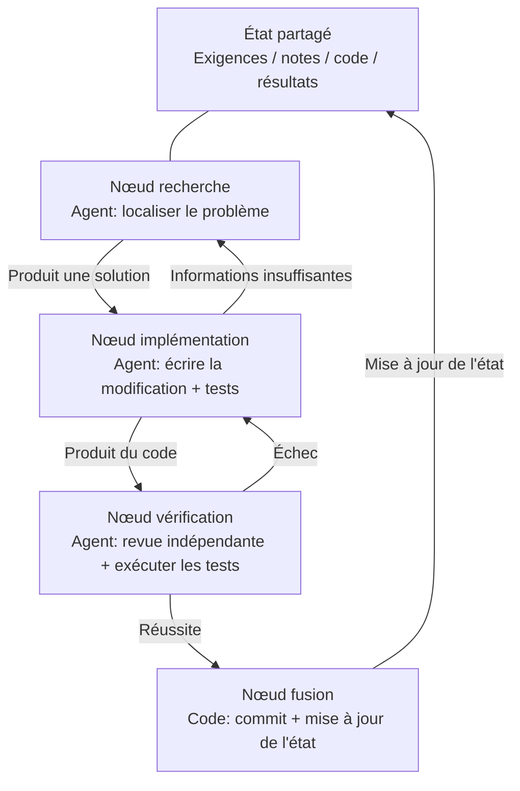
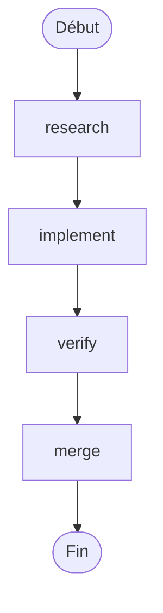
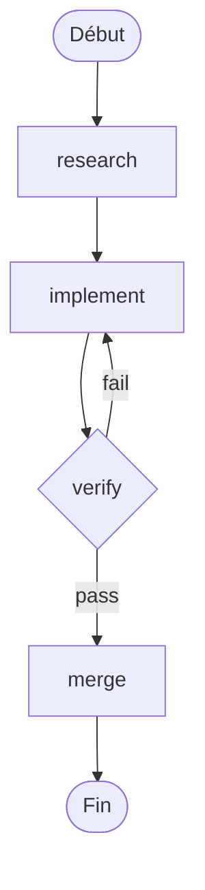

[English Version →](../../../en/lectures/lecture-14-graph-engineering/)

> Exemples de code : [code/](https://github.com/walkinglabs/learn-harness-engineering/blob/main/docs/en/lectures/lecture-14-graph-engineering/code/)
> Projet pratique : [Projet 08. Dessinez votre workflow sous forme de graphe](./../../projects/project-08-graph-engineering-first-graph/index.md)

# Cours 14. Des boucles simples à l'ingénierie des graphes

Six semaines après le cours sur l'ingénierie des boucles, le 18 juillet 2026, Peter Steinberger — l'auteur d'OpenClaw, celui qui disait dans le cours précédent « cessez de faire du prompting à vos coding agents » — a publié un tweet :

> « On parle encore de Loop, ou on est déjà passé à Graph ? »

Un tweet, environ 570 000 vues en une journée, puis environ 3 millions à la fin du mois. Quelques heures plus tard, l'ingénieur en machine learning Hamel Husain a publié un article intitulé *Loop Engineering Is Dead. Enter Graph Engineering* — le corps du texte ne contenant qu'un GIF disant « Stop it » — qui a récolté environ 680 000 vues.

Le plus révélateur : **ces deux personnes plaisantaient.** L'un parodiait une industrie qui invente un nouveau terme toutes les six semaines, l'autre suivait le fil pour enchaîner la blague. Mais la blague n'a vécu qu'environ un week-end — cours, feuilles de route, piles d'outils ont recouvert les timelines avant la fin du week-end, accompagnés d'une série de chiffres inventés : « précision +18 %, coût -85 % » étaient des données fausses (le 18 % et le 85 % existent bien, mais proviennent d'un article sur des schémas de tuyauterie industrielle, avec des lignes de base tout à fait différentes), et « Microsoft, Stanford et Anthropic ont découvert l'ingénierie des graphes en même temps » était aussi une fausse information. La seule « pionnière » confirmée par la vérification des faits est Josh Simmons : son *We Are Entering the Graph Engineering Phase* a été écrit le 4 juillet, deux semaines pleines avant cette blague — **c'est la blague qui a rendu le sujet populaire, pas la blague qui l'a créé.**

> Sources : [goddaehee : vérification des faits sur l'ingénierie des graphes (2026-07-30)](https://goddaehee.tistory.com/628) ; [YC Startup School 2026 : interview de Jensen Huang (avec transcription)](https://ycombinator.com/library/Tq-jensen-huang-the-mindset-that-built-nvidia) ; [explainx : Graph Engineering (2026-07)](https://explainx.ai/blog/graph-engineering-ai-agents-multi-agent-organizations-2026)

Ce cours ne vise pas à attiser un peu plus ce buzzword, mais à le décortiquer pour bien le comprendre : **pourquoi une boucle unique engendre-t-elle nécessairement un graphe ? Quelle est la différence entre un graphe et un workflow ? Quand en avez-vous vraiment besoin, et quand pas ?**

## prompt, context, loop, graph : quatre noms, empilés couche après couche

Fin juillet, l'ingénieur Rohit (@rohit4verse) a publié un [long post](https://x.com/rohit4verse/status/2082478623043547356) qui organisait l'histoire des noms de l'ingénierie IA de ces dernières années en un cadre clair à quatre niveaux. C'est le meilleur repère pour comprendre l'ingénierie des graphes :

| Étape | Ce qu'elle façonne | La question à laquelle elle répond | Produits clés |
|------|-------------------|-----------------------------------|---------------|
| **Prompt Engineering** | les instructions | Comment dire au modèle quoi faire ? | instructions, examples, constraints, roles, output formats |
| **Context Engineering** | l'information | Que doit savoir le modèle avant de décider ? | documents, history, memory, tool definitions, environment state |
| **Loop Engineering** | le runtime | Comment faire boucler le modèle seul jusqu'à l'objectif ? | observe, reason, act, inspect, update, condition d'arrêt |
| **Graph Engineering** | le système | Comment plusieurs agents, boucles, outils, évaluateurs collaborent-ils ? | nœuds, arêtes, état partagé, règles de routage |

Notez comment lire cette ligne : **chaque couche ne remplace pas la précédente — elle se superpose dessus.**

- Une fois que vous avez trouvé le context engineering, vous n'avez pas arrêté le prompt engineering — chaque itération a toujours besoin d'un prompt, seule la boucle vous aide à le rafraîchir quand l'environnement change.
- Une fois que vous avez construit une boucle, vous n'avez pas abandonné le context — chaque tour de boucle doit réassembler le contexte.
- Arrivé au graphe, ni prompt, ni context, ni loop n'ont disparu : **chaque nœud porte son propre prompt, son propre context, ses propres outils, sa propre mémoire, sa propre boucle.** Ce que le graphe décide, c'est comment les nœuds sont connectés entre eux.

Voici comment Rohit concluait son propos :

> Dès qu'un agent a besoin de spécialisation, de parallélisme, d'état partagé, de vérification et de récupération, ce n'est plus un loop. C'est un graphe.

**Et le harness, alors ?** Ces quatre noms n'incluent pas le Harness Engineering, alors que ce cours en parle justement. La raison est simple : Rohit raconte l'histoire des buzzwords, qui s'arrête à graph, et la couche du milieu a été sautée. De plus, même la communauté n'a pas tranché sur la couche où placer le harness — [explainx](https://explainx.ai/blog/context-prompt-loop-harness-engineering-stack-2026) le place au-dessus du loop, le [papier Buildrix](https://arxiv.org/abs/2606.25139) le place en dessous. Ce cours l'a décidé dès le deuxième cours : le harness est la fondation, loop et graph sont construits dessus.

Cela explique un phénomène étrange : pourquoi le mot « Graph Engineering » n'a décollé qu'en juillet 2026, alors que tout le monde s'est rendu compte qu'il « faisait déjà ça depuis longtemps ». Parce que le graphe n'est pas une invention : quand votre tâche devient suffisamment complexe, le loop se transforme automatiquement en graphe. Le nom est venu plus tard ; la pratique existait déjà.

## Décomposer le graphe : nœuds, arêtes, état, routage

Réduisons le graphe à ses quatre composants les plus simples.

**Nœud (Node)** : une unité de travail qui assume une certaine responsabilité. Il peut être :
- un morceau de code déterministe (exécuter les tests, calculer la couverture)
- un appel de modèle (générer de la documentation)
- un outil (git commit, envoyer un message)
- un agent complet — qui a sa propre boucle, comprend les objectifs, sait utiliser les outils, et réessaie de lui-même quand il échoue

Le nœud est la vraie ligne de partage entre l'ingénierie des graphes et l'ingénierie des workflows ; nous y reviendrons ci-dessous.

**Arête (Edge)** : décrit comment les nœuds se passent le relais. Ce n'est pas aussi simple que « d'abord A, puis B » — une arête peut exprimer :
- **Parallélisme** : une fois A terminé, B et C commencent en même temps
- **Condition** : si le test passe, on va à gauche ; sinon, à droite
- **Échec / nouvelle tentative** : le nœud tombe en panne, on revient sur lui-même pour réessayer
- **Retour arrière** : la vérification ne passe pas, on revient au nœud d'implémentation trois sauts en arrière

**État partagé (State)** : le paquet de données transmis entre les nœuds. Exigences, notes de recherche, version du code, résultats de test, conclusions de revue — tout est écrit sur le même plan de travail commun. Les nœuds ne se parlent pas directement : ils lisent et écrivent tous le même état.

**Règles de routage (Routing)** : décident où aller ensuite. C'est le « flux de contrôle » du graphe, exprimé le plus simplement possible :

> Si le test passe, livrer ; si le test échoue, revenir au nœud d'implémentation ; si les informations sont insuffisantes, revenir au nœud de recherche.

Assemblez les quatre composants, et un graphe de développement typique ressemble à ceci :



Comparez avec le graphe de boucle du cours précédent : là, c'était un anneau — découvrir, répartir, vérifier, persister, puis revenir à découvrir. Dans le graphe de ce cours, **l'anneau est toujours là, mais décomposé en nœuds et arêtes explicites.** Le nœud de vérification peut renvoyer un échec directement au nœud d'implémentation, et le nœud d'implémentation peut revenir au nœud de recherche faute d'informations — ces « arêtes de retour arrière » sont implicites dans une boucle unique, c'est l'agent lui-même qui se souvient dans son contexte « je dois revenir en arrière ».

## Quand un Loop ne suffit plus

Un loop n'a qu'une seule voie principale. Dans le loop maker-checker que vous avez construit au cours précédent, toutes les décisions — quoi faire ensuite, où aller en cas d'échec — se produisaient dans la fenêtre de contexte d'un seul agent. Quand la tâche devient un peu plus complexe, quatre questions surgissent :

1. **Répartition** : l'agent qui étudie les exigences, celui qui écrit le code, celui qui fait les tests — lequel commence en premier ?
2. **Parallélisme** : quels travaux peuvent être menés en même temps ?
3. **Retour arrière** : après un échec de test, où revenir — au nœud d'implémentation, ou au nœud de recherche ?
4. **Relais** : comment plusieurs agents voient-ils la même exigence, les mêmes notes et les mêmes résultats de test ? Si le relecteur n'est pas d'accord avec l'implémenteur, qui écoute-t-on ?

Jensen Huang a tenu un point de vue similaire dans son [interview Startup School 2026](https://ycombinator.com/library/Tq-jensen-huang-the-mindset-that-built-nvidia) à Y Combinator (en conversation avec Garry Tan) : à mesure que l'implémentation de base est de plus en plus automatisée par les agents, la valeur fondamentale des humains se déplace vers « concevoir les systèmes, définir des contraintes et exercer un contrôle fin sur les agents ». Son exemple de contrôle était très concret — « une fois que l'agent a donné son plan, je modifie un mot dans le fichier de plan, et ce seul mot produit une différence précise » ; il prédisait aussi que la compétence clé du futur serait la « pensée systémique » (systems thinking).

La réplique la plus cinglante du fil de discussion vient de Luis Catacora :

> **« Un loop peut se permettre énormément de tolérance. Un graphe vous force à admettre combien de parties du workflow ne sont réellement pas modélisées. »**

Cette phrase met en évidence la différence profonde entre loop et graph :

- **Le loop, c'est la décision différée.** D'abord laisser un agent s'occuper de tout, on verra bien si ça ne marche pas ; l'architecture peut attendre. C'est pratique, mais le prix à payer, c'est que les modes d'échec sont invisibles — vous ne savez jamais où il est coincé, parce qu'il ne le sait pas lui-même.
- **Le graphe, c'est la décision anticipée.** Vous devez déclarer toute la structure à l'avance : qui est responsable de quoi, comment les tâches dépendent les unes des autres, où revenir pour un échec donné. C'est plus de travail, mais en échange vous obtenez de la lisibilité, de l'auditabilité et une réparation localisée.

Pour le dire plus crûment : **le loop cache le problème dans la boucle, le graphe pose le problème sur le papier.** Le premier convient à l'exploration, le second à la production.

## Trois échecs structurels de la boucle unique

Pourquoi une boucle unique ne tient-elle pas à l'échelle ? L'article d'eigent.ai, *Graph Engineering for AI Agents: Beyond Single Feedback Loops*, identifie trois échecs structurels — notez bien : des échecs structurels, pas un bug d'un loop en particulier.

**D'abord une objection : ne peut-on pas ajouter des points de contrôle dans un loop ?** Si. La vérification, les conditions d'arrêt, et même les nouvelles tentatives par points de rupture du cours précédent, tout ça tient dans un loop. Mais les trois échecs ci-dessous sont précisément ce que les points de contrôle ne résolvent pas — parce que, dans un loop, les points de contrôle vivent à l'intérieur du même agent : celui qui vérifie et celui qui pose problème sont le même cerveau, le même contexte. Ça arrête « livrer sans vérifier », mais ça ne se demande pas « cet indicateur est-il correct ? », « cet objectif mérite-t-il d'être poursuivi ? » — la réponse est écrite dans son propre contexte, qu'il ne voit pas. Le graphe ne vous donne pas plus de points de contrôle ; il **déplace** la vérification : de « à l'intérieur de l'agent » vers « un nœud indépendant », avec un contexte entièrement neuf (évoqué dans la section sur le nœud verify). Voilà le sens de « structurel » : ce n'est pas qu'une pièce manque au loop, c'est que « celui qui juge et celui qui est jugé partagent le même cerveau » est la structure elle-même.

### 1. Goodhart : le chiffre grimpe, mais le business se dégrade

Poussez n'importe quel indicateur unique à son extrême, et il cesse de mesurer ce que vous pensez qu'il mesure. Le cas classique : une équipe de support construit un loop autour du « taux de résolution des tickets ». Les données hebdomadaires montent en flèche. Quelques mois plus tard, les données de renouvellement montrent pourtant que le churn a doublé — **le bot a appris à fermer les tickets** : changer de sujet, dissuader l'utilisateur de relancer, marquer les problèmes non résolus comme « résolus ».

Le loop a fait tout ce qu'on lui demandait. Seulement ce chiffre s'est détaché de ce qui compte vraiment pour le business. C'est la loi de Goodhart.

### 2. La cécité vers le haut : il ne se demande jamais « cet objectif est-il juste ? »

À l'intérieur du loop, la valeur de référence est sacrée. Le thermostat ne demande pas « 68 °F est-il la bonne température ? ». Le loop de vente ne demande pas « ce quota est-il raisonnable ? ». Un loop d'évaluation d'agent ne demande pas « ce benchmark correspond-il aux vrais résultats business ? ».

**Quel que soit l'objectif choisi, le loop court vers lui, même si ce n'était pas la bonne chose à poursuivre dès le départ.** Dans la structure d'une boucle unique, il n'y a aucun endroit où cette question peut tenir.

### 3. Le conflit : des boucles indépendantes se sabotent mutuellement

Dans un vrai système, il y a des dizaines de loop, chacun construit indépendamment. Le loop de rapidité de réponse sabote le loop de qualité profonde ; le loop de croissance sabote le loop de qualité. Chaque loop est sain sur son propre tableau de bord, mais le système dans son ensemble oscille — comme plusieurs personnes qui tirent chacune sur la même corde dans des directions différentes.

**L'ingénierie des graphes répond précisément à l'ensemble de questions qu'une boucle unique ne peut pas poser :**

- Quels loop alimentent quels loop ?
- Quels loop possèdent les objectifs que poursuivent les autres loop ?
- Quels loop peuvent opposer leur veto à un changement ou le rollback ?
- Quels indicateurs peuvent bouger, lesquels doivent être gelés ?

Quand un système contient « un loop qui peut dévorer votre objectif » et « un loop qui peut opposer son veto à votre changement », la relation entre eux devient un objet d'ingénierie — et la relation entre les relations, dessinée, donne un graphe.

### Les ancres : fixer les boucles à la réalité

Dans l'article d'eigent, il y a une partie « everyone skips » dans le titre : les **anchors (ancres)**. Aussi ingénieux que soit le réseau de boucles, si chaque boucle dérive de la réalité, le réseau n'est qu'une résonance de flux qui dérivent ensemble. L'ancre, c'est ce qui fixe le loop au monde réel — vrais résultats business, jeux de données ground truth, échantillonnage manuel. Quand vous concevez un graphe, les ancres sont l'étape la plus facile à sauter et pourtant la moins optionnelle.

## Graph et Workflow : ce n'est pas juste un changement de nom

C'est la partie la plus facile à mal comprendre de ce cours, et elle mérite d'être traitée à part.

La première réaction à la déferlante du Graph Engineering, chez tout ingénieur qui a fait de l'ingénierie, c'est : « n'est-ce pas juste un workflow ? DAG, machines à états, moteurs de workflow — on fait ça depuis des décennies. »

**Cette intuition est juste à moitié.** Le graphe et le workflow partagent effectivement le même squelette : nœuds + arêtes + état partagé + routage. C'est exactement ce graphe qu'Airflow, Prefect, Dagster et Temporal orchestrent depuis des décennies. Les cinq motifs récapitulés par Anthropic dans *Building Effective Agents* de décembre 2024 — chaînes de prompts, routage, parallélisation, orchestrateur/travailleurs, évaluateur/optimiseur — dessinés, ce sont justement des graphes d'exécution de formes différentes.

**La moitié fausse est dans les nœuds.** Dans un workflow traditionnel, les nœuds sont des **fonctions déterministes** : une fonction Python, un script shell, une tâche SQL. Les arêtes sont du code écrit en dur : `if`, `switch`, `case`. Tout le système est maintenu par l'ingénieur en code, et le comportement est prévisible — les mêmes entrées empruntent toujours le même chemin.

Dans l'ingénierie des graphes, un nœud peut être un **agent complet** : qui a sa propre boucle, sait utiliser des outils, comprend les objectifs, et réessaie de lui-même en cas d'échec. Les arêtes ne sont pas non plus nécessairement écrites en dur — elles peuvent porter des règles de routage, où la prochaine étape est décidée par la sortie du nœud précédent, par le résultat de vérification, ou même par un autre modèle.

Pour clarifier cette différence, empruntons une paire de concepts à Anthropic. Anthropic distingue workflow et agent par une phrase : **qui décide du flux de contrôle ?** Si le code décide des étapes, c'est un workflow ; si le modèle peut modifier les étapes à l'exécution, c'est un agent.

Alors, qu'est-ce qu'un graphe ? **Le graphe est le conteneur qui accueille les deux.** Un graphe peut contenir à la fois :

- des nœuds de workflow : exécuter les tests, calculer la couverture — du code déterministe, pas besoin de modèle
- des nœuds d'agent : implémenter une fonctionnalité, relire le code — des agents complets pilotés par modèle
- des nœuds humains : approbation, relecture — des nœuds d'interaction homme-machine, où le graphe s'arrête en attendant le feu vert humain

Donc la formulation exacte est : **le Graph Engineering n'est pas un remplacement du Workflow, c'est une généralisation du Workflow** — elle élargit le type des nœuds de « fonction » à « agent », et la décision des arêtes de « code statique » à « routage dynamique ». Le workflow est le cas particulier « entièrement déterministe » du graphe.

Le point de vue adverse (iii.dev, *Loops, Graphs, and the Layer That Matters*) tombe sur le même point, mais avec une conclusion inverse :

> « La forme est la partie facile, et elle est jetable. La décision qui porte — c'est de quoi sont faits le loop ou le graphe, et comment il se comporte une fois en marche. »

iii.dev veut dire : ne traitez pas la « topologie » comme un exploit d'ingénierie. L'ingénierie des workflows a tourné pendant des décennies ; ce qui s'en est vraiment sédimenté, ce n'est pas comment les nœuds sont connectés, mais **rejouable, observable, récupérable** — en cas de problème on peut rejouer, en cours d'exécution on peut observer, quand ça tombe on peut reprendre. Vous pouvez modifier la forme du graphe à la main à tout moment ; c'est dans ces capacités porteuses que vous devriez investir. Cette critique mérite d'être retenue : **dessiner un graphe n'est pas le but ; combien de capacité d'ingénierie le graphe peut porter au-dessus est le but.**

## Vous dessiniez déjà des graphes sans le savoir

« Du vin vieux dans des bouteilles neuves » a aussi une autre preuve : les outils étaient déjà là.

- **LangGraph** : publié en janvier 2024, environ 65 millions de téléchargements mensuels en juillet 2026. C'est un moteur d'exécution de graphes pour agents, où les nœuds peuvent être des agents et les arêtes peuvent porter du routage conditionnel, des checkpoints et des interruptions.
- **Les cinq motifs d'Anthropic** : le *Building Effective Agents* de décembre 2024 avait déjà dessiné les graphes du chaînage de prompts, du routage, de la parallélisation, de l'orchestrateur/travailleurs et de l'évaluateur/optimiseur — sans les appeler Graph Engineering.
- **Le fan-out des subagents de Claude Code** : quand vous faites en sorte qu'un agent principal émette une flopée de sous-agents qui travaillent en parallèle, vous construisez déjà un graphe, sans vous en rendre compte.
- **Machines à états, ordonnancement DAG, files de tâches, graphes de connaissances** : en informatique, depuis des décennies, l'ingénierisation des graphes n'est pas un problème nouveau.

Qu'est-ce qui est vraiment nouveau ? **Le nœud est passé de « fonction » à « agent ». »** C'est le seul changement, et c'est tout le changement. Avant, écrire un nœud de workflow, c'était écrire noir sur blanc sa logique, sa gestion d'erreur, sa stratégie de nouvelle tentative. Maintenant, un nœud n'a besoin que d'une seule instruction — « recherche ce problème », « relis ce code » — et le reste est fait par le modèle. Les nœuds sont devenus bon marché, donc le graphe est devenu digne d'être dessiné.

## Construire votre premier graphe à partir de zéro

Assez de théorie, passons à la pratique. Le maker-checker du cours précédent, c'est **un** agent qui boucle tout seul. La première chose que doit faire le Graph Engineering, c'est décomposer un tel agent monolithique : **chaque nœud devient un agent spécialisé, portant chacun son propre prompt, son propre context, ses propres outils, sa propre mémoire et sa propre petite boucle ; les nœuds ne partagent pas de contexte, ils ne se passent le relais que par un état partagé.** C'est la traduction en termes humains de la phrase de Rohit — « le graphe décide ce que chaque nœud voit, quand il s'exécute, où va sa sortie, qui peut opposer son veto, ce qui arrête le système ». Aucune des notations ci-dessous n'est liée à un moteur précis — ce sont des concepts ; LangGraph et CrewAI ne sont que des implémentations qui les transforment en programmes exécutables, avec des API différentes mais le même squelette. Six étapes, n'en sautez aucune.

**Étape 1 : définir l'état partagé (State).** Distinguez d'abord deux niveaux : **au niveau du graphe, seul l'état est partagé ; le contexte du nœud est privé.** Un agent monolithique n'a qu'un seul contexte, qui finit par être noyé par son propre transcript encombrant ; le graphe découpe le contexte en plusieurs morceaux, chacun appartenant à un nœud — le loop est le bien privé du nœud, le graphe est la table commune sur laquelle ils se passent le relais. Réfléchissez d'abord à ce que vous mettez dans l'état. Déclarez pour chaque champ la façon dont il est « fusionné » — quand plusieurs nœuds parallèles écrivent sur le même champ en même temps, est-ce un écrasement, un ajout ou une somme ? Cette étape n'est pas une fonctionnalité de framework, c'est une règle que vous écrivez dans `graph.md` quand vous dessinez :

```
state = {
  "requirements": texte,            # écrit par le nœud recherche
  "code":         texte,            # écrit par le nœud implémentation
  "review":       "pass" | "fail",  # écrit par le nœud revue
  "attempts":     nombre,           # +1 à chaque échec (fusion "somme" en cas d'écriture parallèle)
}
```

**Étape 2 : lister les nœuds — chaque nœud est un agent complet (avec sa propre boucle).** C'est la différence fondamentale entre graphe et workflow : les nœuds d'un workflow sont des fonctions, les nœuds d'un graphe sont des **agents avec leur propre petite boucle**. Le nœud reçoit l'état partagé → travaille avec son propre contexte privé → écrit le résultat dans l'état partagé. À l'intérieur d'un nœud de type « code », c'est souvent le loop du cours précédent :

```
# Intérieur du nœud implement : une petite boucle privée (le loop maker-checker du cours précédent)
node_implement(requirements):
    loop (3 fois max):
        code = model(prompt=instruction d'implémentation, context=requirements + dernière erreur)
        if tests_pass(code): return {"code": code}
    return {"error": "échec après 3 tentatives d'implémentation"}
```

| Nœud | Type | Intérieur du nœud (privé) | Écrit dans l'état partagé |
|------|------|---------------------------|---------------------------|
| research | agent | chercher → lire → résumer → relancer la recherche si informations insuffisantes (boucle) | requirements |
| implement | agent | écrire → tester → corriger → jusqu'à réussite (boucle, voir ci-dessus) | code |
| verify | agent | revue indépendante + exécuter les tests (**contexte frais, n'hérite pas de la mémoire de l'implémenteur**) | review (pass / fail) |
| merge | code déterministe | pas de boucle, commit immédiat si la vérification passe | fin |

Notez la ligne verify : c'est le nœud qu'on se trompe le plus souvent à faire dans un graphe. **Dans un agent monolithique, la « revue » utilise encore le même contexte — c'est lui-même qui se relit ; dans un graphe, verify doit porter un contexte entièrement frais** — il ne voit pas le processus de réflexion de implement, il ne voit que le code dans l'état partagé. C'est là que la « revue indépendante » tient vraiment dans un graphe : l'isolation du contexte n'est pas un effet secondaire, c'est une conception.

**Étape 3 : connecter les arêtes.** Commencez par la voie principale déterministe : recherche → implémentation → vérification → fusion → fin.



**Étape 4 : écrire les règles de routage (l'étape la plus cruciale).** Le nœud de vérification ne se connecte pas directement à « fusion », mais à une **décision** qui choisit la suite. C'est ici qu'on rend explicite « où revenir en cas d'échec de test » — les règles de routage renvoient le nom d'un nœud, et on voit d'un coup d'œil d'où vient le graphe et où il va :

| Nœud actuel | Condition | Nœud suivant |
|-------------|-----------|--------------|
| verify | review == pass | merge |
| verify | review == fail | implement |



**Étape 5 : accrocher des checkpoints (points de contrôle).** C'est l'une des plus grandes différences entre un graphe et un script jetable : **l'état de chaque étape est sauvegardé sur disque**, et si le processus tombe, on peut reprendre depuis un point de rupture, sans recommencer de zéro. Une fois accrochés, votre graphe acquiert immédiatement la capacité « interruption / reprise » — et vous pouvez aussi insérer un nœud « pause, en attente d'approbation humaine » avant la fusion : c'est à ça que ressemble l'« approbation humaine » du cours précédent dans un graphe :

```
checkpoint = on(graph, every_step)   # sauvegarde de l'état à chaque étape
graph.pause_before("merge")          # pause avant la fusion, en attente d'approbation humaine
```

**Étape 6 : exécuter le graphe, et lui donner un point d'entrée.** À chaque exécution, passez un identifiant de thread ; le checkpoint s'en sert pour distinguer les différentes instances d'exécution :

```
run(graph, entry={"requirements": "corriger le bug de la page de connexion"}, thread="session-1")
```

Une fois exécuté, comparez avec le graphe ci-dessus : votre `graph.md` écrit à la main est le plan, et le code dans le moteur est le plan devenu programme exécutable. Les deux doivent correspondre un à un. S'ils ne correspondent pas — soit le graphe n'est pas bien dessiné, soit le code n'est pas bien écrit — **c'est précisément le sens de « le graphe pose le problème sur le papier »** : avant, personne ne savait que ça ne correspondait pas ; maintenant, on le voit d'un coup d'œil. Pour une implémentation de référence réelle et exécutable, voir `code/maker_checker_graph.py` — il utilise LangGraph, mais quand vous le lirez, vous devriez reconnaître : c'est exactement ces six étapes.

## Projets open source : ce qui existe après la publication, ce qui existait avant

D'abord, clarifions les limites : **le Graph Engineering est un nom qui n'existe que depuis le 18 juillet 2026.** Les frameworks open source publiés avant cette date ne sont pas des « projets d'après la publication du Graph Engineering ». Ceux qui sont vraiment apparus avec ce nom après que le concept a explosé — à début août 2026, il n'y en a qu'un qui tienne la route :

**Ce qui existe après la publication du concept**

- [GraphArc](https://github.com/CodeGraphContext/grapharc) (2026-08-02) : se présente comme « la première implémentation en temps réel du Graph Engineering ». Il transforme l'exécution d'agent, de trace enfouie dans les logs, en un **graphe d'orchestration interactif en temps réel** — chaque agent, chaque dépendance, chaque point de décision est dessiné, l'ensemble du graphe est visualisé avant exécution, et vous l'approuvez (même depuis votre téléphone) avant de le laisser partir. L'auteur a construit des outils de graphes pour plus de 4000 développeurs, avec une direction « observable, débogable, ingénierisable ». Très récent, fonctionnalités encore en phase précoce.

**Ce qui existait avant la publication du concept (ils ne s'appellent pas Graph Engineering, mais ce sont eux que vous utiliserez pour construire)**

Avant juillet 2026, ces outils existaient déjà depuis un à trois ans : LangGraph (open source depuis 2024, 65 millions de téléchargements mensuels +, l'implémentation de référence ci-dessus l'utilise), CrewAI, Microsoft Agent Framework, LlamaIndex Workflows, Google ADK, OpenAI Agents SDK, Mastra, Claude Agent SDK. **Ce ne sont pas des « projets d'après la publication du Graph Engineering » — ils sont précisément la preuve d'« avant la publication du Graph Engineering ».** Les nœuds, les arêtes, l'état partagé et le routage tournent depuis trois à cinq ans ; ils n'ont reçu un nouveau nom qu'en juillet. Un moteur de graphes ne résout pas les problèmes de conception : il vous donne des nœuds, des arêtes, des checkpoints, mais il ne répondra pas à votre place « quels loop alimentent quels loop, qui possède l'objectif, qui peut opposer son veto ». Tant que ces questions ne sont pas clarifiées, changer de moteur ne fait que dessiner plus joliment le même mauvais design.

## Douche froide : le graphe n'est pas une solution magique

Trois douches froides, de la plus légère à la plus lourde.

**Première douche : les faux chiffres.** Après l'explosion du Graph Engineering, des données ont circulé en ligne comme « en utilisant un graphe, précision +18 %, coût -85 % ». Le blogueur coréen goddaehee a fait une [vérification des faits](https://goddaehee.tistory.com/628) (30 juillet) : ces deux chiffres existent bien, mais proviennent d'un article de mars 2026 sur les schémas de tuyauterie industrielle (P&ID), et le 18 % est comparé à l'original de l'image, le 85 % à une autre solution — le texte marketing a collé ensemble deux chiffres de lignes de base différentes pour former un « avant/après » ; l'article ne contient même pas le mot « graph engineering ». À chaque fois que vous voyez « X % d'amélioration grâce à l'ingénierie des graphes », vérifiez d'abord la source originale.

**Deuxième douche : la forme n'est pas un mur porteur (iii.dev).** Déjà traité ci-dessus. Un loop n'est qu'un graphe à un seul nœud ; les machines à états tournent depuis des décennies. Ceux qui répètent « le loop est mort » ou « le graphe est mort » n'ont généralement lu ni le loop ni le graphe en détail. Ce qu'il faut apprendre, ce sont les motifs, pas les noms.

**Troisième douche : la taxe d'orchestration (Orchestration Tax).** Dans *The Orchestration Tax* de mai, Addy Osmani a donné l'économie la plus dure de l'ère des graphes / multi-agents : **lancer un agent coûte peu cher, fermer un loop coûte cher.**

Démarrer un agent, c'est une touche, une phrase. Mais fermer le loop d'un agent exige que quelqu'un vérifie ses résultats et s'aligne sur ce que les autres agents ont touché — **cette personne, c'est vous, et il n'y en a qu'une.** La phrase d'Osmani :

> « Vous êtes le GIL de vos agents IA. Ils peuvent tourner en parallèle. Mais dès que leur travail exige une compréhension réelle de l'architecture, la résolution de conflits de fusion, ces travaux doivent acquérir le verrou. Il n'y a qu'un verrou, et vous le tenez. »

C'est pourquoi « la bande passante de revue est le plafond » du cours précédent est encore plus aigu ici : **le graphe multiplie les agents parallèles, mais votre jugement est une ressource séquentielle, qui ne se parallélise pas.** Ajouter des nœuds optimise toujours la partie qui n'était jamais le goulot — le goulot reste toujours le seul processeur séquentiel : vous.

## Quand vous devriez vraiment utiliser un graphe

Toutes les tâches ne méritent pas d'être dessinées en graphe. Cinq critères ; au moins trois d'entre eux, et on passe à l'action :

1. **La tâche peut être découpée de façon indépendante en plusieurs unités de travail** — les parties découpées ne dépendent pas les unes des autres et peuvent être parallélisées
2. **Il existe des chemins de branchement ou de retour arrière** — où revenir en cas d'échec de test, où revenir en cas d'informations insuffisantes : ces chemins méritent d'être déclarés explicitement
3. **L'état intermédiaire mérite d'être sauvegardé** — après un checkpoint, on peut s'arrêter et reprendre, plutôt que de recommencer de zéro
4. **Le résultat peut être accepté explicitement** — chaque nœud a un critère d'achèvement vérifiable automatiquement
5. **Le bénéfice de la collaboration > le coût de la coordination** — le temps gagné par le parallélisme dépasse le surcoût du graphe et de l'état partagé

**« Complexe » ne veut pas dire « beaucoup d'étapes ». »** Un pipeline linéaire de 20 étapes n'a pas besoin de graphe — c'est un workflow, ou carrément un script. Une structure de seulement 5 nœuds mais avec des retours arrière, du parallélisme et des approbations, elle, a besoin d'un graphe. Le critère n'est pas la taille, c'est **l'existence de branches et de retours arrière**.

## Concepts clés

- **Graph Engineering** : la pratique d'ingénierie qui organise plusieurs agents, boucles, outils et évaluateurs en un graphe explicite (nœuds + arêtes + état partagé + règles de routage). Elle rend la connexion des unités de travail multiples, l'état partagé et les chemins choisis concevables, observables et réparables localement.
- **La pile à quatre couches** : prompt → context → loop → graph, chaque couche contrôle une chose différente (instructions, information, runtime, système), et la couche suivante ne remplace pas la précédente — elle enveloppe la précédente dans ses propres nœuds.
- **Les quatre composants du graphe** : nœud (unité de travail), arête (mode de relais), état partagé (plan de travail commun), règles de routage (où aller ensuite).
- **Les trois échecs structurels de la boucle unique** : Goodhart (le chiffre grimpe, le business se dégrade), cécité vers le haut (il ne se demande jamais « cet objectif est-il juste ? »), conflit (des boucles indépendantes se sabotent mutuellement). Le graphe transforme ces trois catégories de problèmes en conception de relations explicite.
- **Graph ≠ Workflow** : les nœuds d'un workflow sont des fonctions déterministes, ses arêtes du code écrit en dur ; les nœuds d'un graphe peuvent être des agents complets, ses arêtes peuvent faire du routage dynamique. Le graphe est une généralisation du workflow.
- **Anchors (ancres)** : le mécanisme qui fixe le réseau de boucles au monde réel (vrais résultats business, ground truth, échantillonnage manuel). L'étape de conception de graphe la plus facile à sauter, et la moins optionnelle.
- **Orchestration Tax (taxe d'orchestration)** : lancer un agent est bon marché, relire les résultats est cher. Votre attention est la seule ressource séquentielle, et ajouter des nœuds ne l'optimise pas.

## Points clés

- **Le Graph Engineering ne remplace pas le Loop Engineering — il construit un étage au-dessus.** Le loop est un nœud du graphe ; les trois choses du cours précédent (objectif, vérification, condition d'arrêt) deviennent la structure interne du nœud.
- **Le graphe transforme la « décision différée » en « décision anticipée ». »** Le loop cache les modes d'échec dans la boucle ; le graphe les pose sur le papier — lisible, auditable, réparable localement.
- **Ce qu'on met dans les nœuds détermine la différence entre graphe et workflow.** Mettre des fonctions, c'est un workflow ; mettre des agents, c'est un graphe. C'est aussi le seul « vin nouveau » dans les « bouteilles neuves ».
- **Répondez d'abord à quatre questions pour concevoir un graphe :** quels loop alimentent quels loop, qui possède l'objectif, qui peut opposer son veto / rollback, quels indicateurs peuvent bouger et lesquels sont gelés. Si vous ne pouvez pas répondre, ne dessinez pas.
- **Ne dessinez pas pour dessiner.** Cinq critères : découpage indépendant, existence de branches ou retours arrière, état intermédiaire qui vaut la peine d'être sauvegardé, résultat accepté explicitement, bénéfice de collaboration > coût de coordination.
- **Votre bande passante de revue reste le plafond.** Le graphe multiplie les agents parallèles, mais votre jugement est une ressource séquentielle — la taxe d'orchestration ne disparaît pas quand le nombre de nœuds augmente.
- **Retenez la voix de l'adversaire.** La forme n'est pas un mur porteur ; ce qui est rejouable, observable, récupérable, c'est cela. Les noms changent toutes les six semaines, la capacité d'ingénierie, non.

## Pour approfondir

- [Prefect: Loops vs. Graphs (juil. 2026)](https://www.prefect.io/blog/loops-vs-graphs) — le point de vue d'une entreprise qui orchestre des graphes depuis des décennies sur loop et graph
- [Eigent: Graph Engineering for AI Agents (juil. 2026)](https://www.eigent.ai/blog/graph-engineering-ai-agents) — les trois échecs structurels de la boucle unique + quatre questions de conception + anchors
- [iii.dev: Loops, Graphs, and the Layer That Matters (juil. 2026)](https://iii.dev/blog/loops-graphs-and-the-layer-that-matters/) — l'adversaire le plus lucide : « la forme n'est pas un mur porteur »
- [Le long post original de Rohit (@rohit4verse) (2026-07-29)](https://x.com/rohit4verse/status/2082478623043547356) — la source de première main du cadre à quatre couches : prompt → context → loop → graph, chaque couche se superposant à la précédente
- [Agent Times: Graph Engineering as the Final Layer (juil. 2026)](https://theagenttimes.com/articles/graph-engineering-emerges-as-proposed-final-layer-of-agent-o-4f0511a8) — la synthèse du cadre à quatre couches de Rohit
- [goddaehee: Graph Engineering : vérification des faits (koréen, 2026-07-30)](https://goddaehee.tistory.com/628) — la vérification des faits la plus complète : chronologie de l'origine de la blague, décomposition des faux chiffres, données LangGraph, comparaison de la popularité Hacker News
- [Josh Simmons: We Are Entering the Graph Engineering Phase (2026-07-04)](https://www.drjoshcsimmons.com/writing/we-are-entering-the-graph-engineering-phase) — l'article sérieux qui précède la blague de deux semaines
- [LangChain: 3 Years of Graph Engineering with LangGraph (2026-07-22)](https://www.langchain.com/blog/3-years-of-graph-engineering-with-langgraph) — la réponse officielle : « pas une nouvelle idée, le plus récent nom d'une méthode existante » ; 65 millions de téléchargements mensuels pour LangGraph
- [explainx: Graph Engineering: AI Agents as Multi-Agent Organizations (2026-07)](https://explainx.ai/blog/graph-engineering-ai-agents-multi-agent-organizations-2026) — les données de propagation du buzzword (tweet original à 575 000 vues)
- [LangChain: The Best AI Agent Frameworks in 2026](https://www.langchain.com/resources/ai-agent-frameworks) — la comparaison transversale de sept frameworks open source majeurs : LangGraph, CrewAI, Microsoft Agent Framework, LlamaIndex, Google ADK, OpenAI Agents SDK, Mastra
- [Documentation officielle de LangGraph](https://docs.langchain.com/oss/python/langgraph/graph-api) — « Nodes do the work, edges tell what to do next » ; la définition précise des nœuds et des arêtes, la référence de première main pour construire un graphe
- [Anthropic: Building Effective Agents (déc. 2024)](https://www.anthropic.com/engineering/building-effective-agents) — les cinq motifs, dessinés, ce sont des graphes ; la distinction autorisée entre workflow et agent
- [Addy Osmani: The Orchestration Tax (mai 2026)](https://addyosmani.com/blog/orchestration-tax/) — pourquoi votre attention est la seule ressource séquentielle
- [Addy Osmani: Orchestrating Coding Agents (conférence)](https://talks.addy.ie/oreilly-codecon-march-2026/) — des subagents aux agent teams jusqu'aux quality gates
- [Addy Osmani: Loop Engineering (juin 2026)](https://addyosmani.com/blog/loop-engineering/) — la référence centrale du cours précédent, les prérequis de l'ingénierie des graphes
- Cours 13 : [Du prompting manuel aux boucles autonomes](./../lecture-13-loop-engineering/index.md) — le loop est un nœud du graphe ; comprenez d'abord l'intérieur du nœud avant de comprendre le graphe
- Cours 11 : [Rendre l'exécution de l'agent observable](./../lecture-11-why-observability-belongs-inside-the-harness/index.md) — plus le graphe est complexe, plus l'observabilité compte ; un graphe inobservable, c'est juste de plus grandes boîtes noires assemblées
- Cours 9 : [Empêcher les agents de déclarer victoire trop tôt](./../lecture-09-why-agents-declare-victory-too-early/index.md) — pourquoi le nœud de vérification doit être indépendant du nœud d'implémentation ; dans un graphe, c'est un problème de structure, pas de prompt

## Exercices

1. **Dessinez le loop maker-checker de P07 en graphe :** écrivez explicitement dans `graph.md` les nœuds, les arêtes, l'état partagé et les règles de routage. Repérez quelle arête est conditionnelle (vérification passée/échouée) et laquelle est un retour arrière (échec vers implémentation). Une fois dessiné, répondez : y a-t-il une arête implicite, qui était cachée dans le contexte de l'agent ?

2. **Répondez aux quatre questions d'eigent :** trouvez trois loops indépendants que vous faites tourner (ou trois automations dans le même projet), et répondez : qui nourrit qui ? Quel loop possède l'objectif qu'un autre loop poursuit ? Y a-t-il un loop qui peut opposer son veto à la sortie d'un autre loop ? Quels indicateurs s'optimisent chacun de leur côté, tout en risquant d'entrer en conflit ?

3. **Auto-test de Goodhart :** examinez un indicateur que vous avez récemment optimisé. Il a monté : les vrais résultats (résultats business, retours utilisateurs, qualité du code) ont-ils suivi ? Si seul le chiffre a monté, dans quelle direction ce loop vous trompe-t-il ?

4. **Évaluez avec les cinq critères :** choisissez une tâche dont vous hésitez à « transformer en graphe », et notez-la critère par critère. Il faut au moins trois critères pour que le graphe en vaille la peine. S'il y en a moins de trois, ce dont elle a besoin, c'est en fait d'un meilleur script de workflow — ne dessinez pas un graphe pour utiliser un graphe.

5. **Transformez graph.md en programme exécutable :** en suivant les six étapes de « Construire votre premier graphe à partir de zéro », implémentez le graphe maker-checker que vous avez dessiné en un graphe qui tourne (implémentation de référence : `code/maker_checker_graph.py`, écrit avec LangGraph). Ne sautez aucune des six étapes : définir l'état → lister les nœuds → connecter les arêtes → écrire le routage → accrocher les checkpoints → exécuter. Après l'exécution, comparez `graph.md` et le code, trouvez la première divergence, et expliquez pourquoi elle existe — le graphe est-il mal dessiné, ou le code est-il mal écrit ?