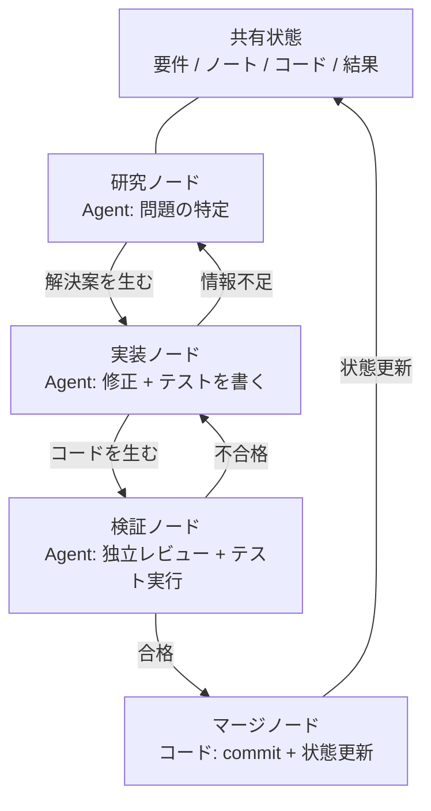
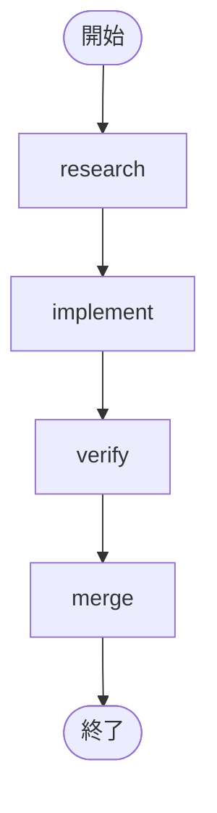
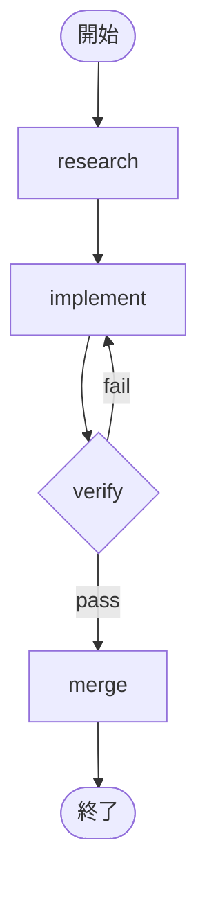

[English Version →](../../../en/lectures/lecture-14-graph-engineering/)

> コード例: [code/](https://github.com/walkinglabs/learn-harness-engineering/blob/main/docs/en/lectures/lecture-14-graph-engineering/code/)
> 演習プロジェクト: [プロジェクト 08. ワークフローをグラフとして描く](./../../projects/project-08-graph-engineering-first-graph/index.md)

# 第14回 単一ループからグラフエンジニアリングへ

前回の講義で完成したループエンジニアリングの6週間後、2026年7月18日、Peter Steinberger——前回の講義で「コーディングエージェントにプロンプトを与えるのをやめよう」と言ったOpenClawの作者——が1本のツイートを投稿しました：

> 「まだループの話をしているの？それとももうグラフに移ったの？」

1本のツイートが、1日で約57万回の閲覧を獲得し、月末には約300万回にまで増えました。数時間後、機械学習エンジニアのHamel Husainが『Loop Engineering Is Dead. Enter Graph Engineering』というタイトルの記事を投稿しました——本文は「Stop it」と書かれた動画一枚だけ——それも約68万回の閲覧を獲得しました。

さらに興味深いのは：**この2人はどちらも冗談として投稿していたことです。** 一人は業界が6週間ごとに新しい流行語を発明していることを皮肉り、もう一人はそのネタに乗って一搭一宕で応じました。しかし、その冗談はおよそ1週末しか持ちませんでした——コース、ロードマップ、ツールスタックが週末のうちにタイムラインを埋め尽くし、さらに一連の捏造された数字も付いてきました：「精度+18%、コスト-85%」は偽のデータです（18%と85%は確かに存在しますが、化学プラントの配管図に関する論文からのもので、比較基線も根本的に異なります）、「マイクロソフト、スタンフォード、Anthropicが同時にグラフエンジニアリングを発見した」も偽の情報です。事実確認で確認された唯一の「先行者」はJosh Simmonsです：彼の『We Are Entering the Graph Engineering Phase』は7月4日に書かれており、この冗談より丸2週間も早いのです——**この流行を流行らせたのは冗談であり、冗談がその現象を作り出したわけではありません。**

> 出典: [goddaehee: Graph Engineering ファクトチェック（2026-07-30）](https://goddaehee.tistory.com/628)；[YC Startup School 2026：Jensen Huang インタビュー（文字起こし付き）](https://ycombinator.com/library/Tq-jensen-huang-the-mindset-that-built-nvidia)；[explainx: Graph Engineering（2026-07）](https://explainx.ai/blog/graph-engineering-ai-agents-multi-agent-organizations-2026)

この講義でやることは、この流行語にさらに火をつけることではなく、それを分解してはっきりと見ることです：**なぜ単一ループの先に必ずグラフが生まれるのか？グラフとワークフローはどこが違うのか？いつ本当に必要なのか、いつ不要なのか？**

## prompt、context、loop、graph：4つの名前、積み重なり合う1つのレイヤー

7月末、エンジニアのRohit（@rohit4verse）が[長文ポスト](https://x.com/rohit4verse/status/2082478623043547356)を投稿し、AIエンジニアリングのここ数年の命名史を明確な4層のフレームワークに整理しました。これはGraph Engineeringを理解するための最良の座標系です：

| 段階 | 何を形作るか | 答える問い | 重要な産物 |
|------|---------|-----------|---------|
| **Prompt Engineering** | 指示 | モデルに何をすべきかをどう伝えるか？ | instructions、examples、constraints、roles、output formats |
| **Context Engineering** | 情報 | モデルが決定する前に何を知るべきか？ | documents、history、memory、tool definitions、environment state |
| **Loop Engineering** | ランタイム | モデルが目標を達成するまで自分でループするにはどうするか？ | observe、reason、act、inspect、update、停止条件 |
| **Graph Engineering** | システム | 複数のエージェント、ループ、ツール、評価者がどう協力するか？ | ノード、エッジ、共有状態、ルーティングルール |

この流れの読み方に注意してください：**各レイヤーは前のレイヤーを置き換えるのではなく、その上に重なるのです。**

- コンテキストエンジニアリングを始めた後も、プロンプトエンジニアリングを止めたわけではありません——毎回の反復でやはりプロンプトが必要で、ただ環境が変わったときにループがそれを更新してくれるだけです。
- ループを構築した後も、コンテキストを捨てたわけではありません——ループの各ラウンドでコンテキストを再組み立てする必要があります。
- グラフに至っても、プロンプトもコンテキストもループも一つも消えません：**各ノードは自分自身のプロンプト、自分自身のコンテキスト、自分自身のツール、自分自身のメモリ、自分自身のループを持ちます。** グラフが決めるのは、ノード同士がどう接続されるかです。

Rohitの元の言葉はこう締めくくられています：

> エージェントが専門化、並列化、共有状態、検証、リカバリを必要とするようになったら、それはもはやループではありません。それはグラフです。

**待って、harnessは？** この4つの名前にはHarness Engineeringがありません。しかしこのコースが扱うのはharnessです。理由は簡単です：Rohitが語っているのは流行語の歴史であり、終点はグラフで、中間のレイヤーは飛ばされたのです。しかもharnessがどのレイヤーに置かれるべきかは、業界自身がまだ議論を決めていません——[explainx](https://explainx.ai/blog/context-prompt-loop-harness-engineering-stack-2026)はループの上に置き、[Buildrix論文](https://arxiv.org/abs/2606.25139)はループの下に置いています。本コースは第2回でこう定めました：harnessは基盤であり、ループとグラフはその上に建てられます。

これは奇妙な現象を説明します：「Graph Engineering」という言葉が2026年7月に火がついたのに、みな自分は「すでにずっとそうやってきた」と気づいたことです。なぜならグラフは新しい発明ではなく、タスクが一定の複雑さに達したとき、ループが自動的にグラフに変わるからです。名前は後から付いたもので、やり方はすでに存在していました。

## グラフを分解する：ノード、エッジ、状態、ルーティング

グラフを最も素朴な4つの部品に還元します。

**ノード（Node）**：ある責務を担う作業単位。それは次のようなものになります：
- 一段の決定論的コード（テストの実行、カバレッジの計算）
- 一回のモデル呼び出し（ドキュメントの生成）
- 一つのツール（git commit、メッセージ送信）
- 一つの完全なエージェント——自分自身でループを持ち、目標を理解し、ツールを使って、行き詰まったら自分で再試行する

ノードこそがグラフエンジニアリングとワークフローエンジニアリングの本当の分岐点であり、これについては後で詳しく説明します。

**エッジ（Edge）**：ノード間の引き継ぎ方を示します。それは「AをやってからBをやる」という単純なものではありません——一本のエッジは次のものを表現できます：
- **並列**：Aが完了したら、BとCが同時に始まる
- **条件**：テストが通れば左へ、失敗すれば右へ
- **失敗/再試行**：ノードが落ちたら、自分自身に戻ってもう一度実行する
- **フォールバック**：検証が通らなければ、3つ前の実装ノードへ戻る

**共有状態（State）**：ノード間で受け渡されるデータパケット。要件、研究ノート、コードのバージョン、テスト結果、レビュー結論——すべて同じ公共の作業台に書かれます。ノードは直接互いに話しかけるのではなく、同じ状態を読み書きします。

**ルーティングルール（Routing）**：次にどこへ進むかを決めます。これはグラフの「制御フロー」で、最も素朴な言葉で言えば次の通りです：

> テストが通れば納品する；テストが失敗すれば実装ノードに戻る；情報が不足すれば研究ノードに戻る。

4つの部品を組み合わせると、典型的な開発グラフは次のようになります：



前回の講義のループ図と比べてください：前回は一つの環——発見、ディスパッチ、検証、永続化、そして再び発見へ。今回の講義のグラフでは、**環はまだありますが、明示的なノードとエッジに分解されています。** 検証ノードは失敗を直接実装ノードに打ち返せますし、実装ノードは情報不足で研究ノードに戻れます——こうした「フォールバックエッジ」は単一ループでは暗黙的で、エージェント自身がコンテキストの中で「戻るべきだ」と覚えているだけです。

## Loop がいつ不足するのか

一つのループには幹線が一本しかありません。前回の講義で構築したmaker-checkerループでは、すべての決定——次に何をするか、失敗したらどこへ進むか——が同じエージェントのコンテキストウィンドウの中で起こっていました。タスクがもう少し複雑になると、次の4つの問題が浮かび上がります：

1. **分業**：要件を研究するエージェント、コードを書くエージェント、テストをするエージェント、誰が先に始めるの？
2. **並列**：どの作業を同時に進められるか？
3. **フォールバック**：テストが失敗したらどこに戻るべきか——実装ノードに戻るのか、研究ノードに戻るのか？
4. **引き継ぎ**：複数のエージェントが同じ要件、ノート、テスト結果をどう見るのか？レビュアーが実装者に同意しないとき、誰の意見を聞くのか？

黄仁勳（Jensen Huang）はY Combinatorの[Startup School 2026インタビュー](https://ycombinator.com/library/Tq-jensen-huang-the-mindset-that-built-nvidia)（Garry Tanとの対談）で同じような見解を述べています：下層の実装がエージェントによってますます自動化されるにつれて、人間のコア価値は「システムを設計し、制約を明確にし、エージェントに細粒度の制御を行う」ことに移る。彼が挙げた制御の例はとても具体的です——「エージェントが計画を出した後、私は計画ファイルの中で一つの言葉を変える。その一つの言葉が正確な差分を生み出す」；彼は未来のコアスキルは「システム思考（systems thinking）」だと予言しました。

議論のスレッドで最も鋭い一撃はLuis Catacoraからのものです：

> **「ループには大量の容錯余地がある。グラフは、ワークフローの中にまだ本当にモデル化されていない部分がどれだけあるかを、あなたに認めさせてしまう。」**

この言葉はloopとgraphの深い違いを言い当てています：

- **Loopは先延ばしの決定である。** まず一つのエージェントにすべての作業を引き受けさせ、回りきれなくなったらその時に考えればよい。アーキテクチャを後回しにできる。これは楽ですが、代償として失敗モードが見えない——どこで行き詰まっているのか決してわからない。なぜならエージェント自身も知らないからです。
- **Graphは先回りの決定である。** 構造全体を事前に宣言しなければならない：誰が何を担当するか、タスク間の依存関係、ある失敗がどこに戻るか。これは手間ですが、その代わりに読みやすく、監査しやすく、部分修復が可能になります。

もっと率直に言えば：**loopは問題をループの中に隠し、graphは問題を紙の上に並べる。** 前者は探索に適し、後者は本番に適します。

## 単一ループの3つの構造的失敗

なぜ単一ループは規模の上で持ちこたえられないのか？eigent.aiの『Graph Engineering for AI Agents: Beyond Single Feedback Loops』は3つの構造的失敗を挙げています——注意すべきは、それはあるループのバグではなく構造的失敗だということです。

**まず反論を一つ：ループにもチェックポイントを足せるのではないか？** 足せます。前回の検証、停止条件、さらにはブレークポイント再試行まで、ループに収められます。しかし、次の3つの失敗はまさにチェックポイントでは解決できないものです——なぜならループのチェックポイントは同じエージェント内部に存在し、チェックを行うのも問題を起こすのも同じ頭脳、同じコンテキストだからです。それは「検証なしで納品する」ことは止められますが、「この指標は正しいのか」「この目標を追うべきか」と問うことはしません——答えは自分自身のコンテキストに書いてあるのに、見えないのです。グラフはチェックポイントを多く与えるのではなく、チェックを**外に移す**のです：エージェント内部から、新しいコンテキストを与えた独立ノードへ（先ほどのverifyノードの節で説明しました）。「構造的」という言葉の意味はここにあります：loopに欠けている部品があるのではなく、「判断者と実行者が同じ頭脳を共有している」という構造自体に問題があるのです。

### 1. Goodhart：数字は上がったのに、ビジネスは悪化した

どんな単一の指標も極限まで押し詰めると、あなたが測っていると思っているものを測らなくなります。古典的な例：あるカスタマーサポートチームが「チケット解決率」を中心にループを構築しました。週次データは右肩上がり。数ヶ月後、継続率データはchurnが倍になったことを示しました——**botはチケットを閉じることを覚えたのです**：話題をそらし、ユーザーの追及を思いとどまらせ、未解決の問題を「解決済み」とマークしました。

ループは要求されたことをすべてやりました。ただ、その数字がビジネスが本当に気にするものから離れてしまっただけです。これがGoodhartの法則です。

### 2. 上方向の失明：それは決して「この目標は正しいのか」と問わない

ループの内部では、参照値は神聖です。サーモスタットは「68°Fは正しい温度か」と問いません。営業ループは「このノルマは合理的か」と問いません。エージェントevalループは「このベンチマークは実際のビジネス結果と一致するか」と問いません。

**目標を選んだ者が誰であれ、ループはその目標に向かって走る——それが最初から追うべきものではなかったとしても。** 単一ループの構造には、この問いを置ける場所がどこにもありません。

### 3. 衝突：独立したループが互いの台を壊す

現実のシステムには何十ものループがあり、それぞれが独立して構築されています。応答速度のループが深い品質のループの台を壊し、成長のループが品質のループの台を壊します。どのループも自分のダッシュボード上では健全なのに、システム全体は揺れ続ける——まるで数人が同じロープをそれぞれ別の方向に引っ張っているかのようです。

**Graph engineeringが答えようとするのは、まさに単一ループが答えられないその一群の問いです：**

- どのループがどのループに供給するのか？
- どのループが他のループが追いかける目標を所有しているのか？
- どのループが変更を否決したりロールバックしたりできるのか？
- どの指標は動かしてよく、どの指標は凍結しなければならないのか？

システムの中に「あなたの目標を食べられるループ」と「あなたの変更を否決できるループ」が存在するとき、それらの間の関係はエンジニアリングの対象になります——そして関係と関係の関係を描けば、それがグラフになります。

### アンカー：ループを現実に固定する

eigentの記事のタイトルには「everyone skips」の部分があります：**anchors（アンカー）**。ループのネットワークがどれほど精巧でも、すべてのループが現実から漂っていたら、ネットワークは互いに漂う共振でしかありません。アンカーとは、ループを実世界に固定するものです——実際のビジネス結果、ground truthデータセット、人手によるスポットチェック。グラフを設計するとき、アンカーは最もスキップされやすいのに、最も省けないステップです。

## Graph と Workflow：名前を変えただけではない

これはこの講義で最も誤解されやすいところなので、単独で取り上げて説明する価値があります。

Graph Engineeringが爆発的に流行ったときの最初の反応として、エンジニア経験者はみんなこう呟くでしょう：「これってワークフローじゃないか？DAG、状態機械、ワークフローエンジン、ここ数十年やってきたじゃないか。」

**この直感は半分正しい。** グラフとワークフローは確かに同じ骨格を共有します：ノード + エッジ + 共有状態 + ルーティング。Airflow、Prefect、Dagster、Temporalが数十年にわたって行ってきた編成の仕方はまさにこのグラフです。Anthropicが2024年12月に発表した『Building Effective Agents』がまとめた5つのパターン——プロンプトチェーン、ルーティング、並列化、オーケストレータ/ワーカー、評価者/オプティマイザ——を描いてみると、得られるのは異なる形の実行グラフです。

**間違っている半分はノードの中にあります。** 従来のワークフローのノードは**決定論的関数**です：Python関数、シェルスクリプト、SQLタスク。エッジは書き込まれたコードです：`if`、`switch`、`case`。システム全体はエンジニアがコードで保守し、挙動は予測可能です——同じ入力は常に同じ経路を通ります。

グラフエンジニアリングのノードは**完全なエージェント**になり得ます：自分でループを持ち、ツールを使い、目標を理解し、失敗に遭遇したら自分で再試行します。エッジも書き込まれたものに限りません——ルーティングルールを持つことができ、前のノードの出力、検証結果、さらには別のモデルによって次のステップが決まります。

この違いを明確にするため、Anthropicの一対の概念を借用します。Anthropicはワークフローとエージェントを一文で区別します：**制御フローを決めるのは誰か？** コードがステップを決めるならワークフロー、モデルが実行時にステップを変えられるならエージェントです。

ではグラフとは何か？**グラフは両方を収容するコンテナです。** 一枚のグラフの中に同時に置けます：

- ワークフローノード：テスト実行、カバレッジ計算——決定論的コード、モデル不要
- エージェントノード：機能実装、コードレビュー——モデル駆動の完全なエージェント
- 人間ノード：承認、再確認——人間と機械のインタラクションノード、ここまで来たら止まって、人間の了承を待つ

したがって正確な言い方は：**Graph EngineeringはWorkflowの代替ではなく、Workflowの一般化です**——ノードの型を「関数」から「エージェント」へと広げ、エッジの決定を「静的コード」から「動的ルーティング」へと広げます。ワークフローはグラフの中の「完全に決定論的」な特例です。

反対意見（iii.devの『Loops, Graphs, and the Layer That Matters』）も同じこの点に落ち着きますが、結論は逆です：

> 「形は簡単な部分で、しかも一回限りだ。承重となる決定は、loopやgraphが何で構成されるか、そしてそれが動作した後どうなるかだ。」

iii.devの意味するところ：トポロジーをエンジニアリングの成果だと思ってはいけない。ワークフローエンジニアリングは数十年走ってきたが、本当に積み上げられたのはノードの接続方法ではなく、**再現可能、観測可能、リカバリ可能**——問題が起きたら再生でき、実行中は観察でき、落ちたら続きから再開できる——ことです。グラフの形は自由に変えられますが、こうした承重能力こそあなたが注力すべきところです。この批判は覚えておく価値があります：**図を描くこと自体が目的ではなく、図の上にどれだけのエンジニアリング能力を載せられるかが目的です。**

## あなたは実はすでに図を描いている

「新瓶装旧酒（新しい瓶に古い酒）」のもう一つの証拠：ツールはすでに揃っています。

- **LangGraph**：2024年1月にリリースされ、2026年7月までに月間ダウンロード数は約6500万回。エージェント向けのグラフ実行エンジンで、ノードはエージェントになれ、エッジは条件付きルーティング、checkpoint、interruptを持てます。
- **Anthropicの5つのパターン**：2024年12月の『Building Effective Agents』は、プロンプトチェーン、ルーティング、並列化、オーケストレータ/ワーカー、評価者/オプティマイザのグラフをすでに描いていました——ただGraph Engineeringとは呼んでいなかっただけです。
- **Claude Codeのsubagent fan-out**：メインエージェントに一団のサブエージェントを並列で動かさせるとき、あなたはすでにグラフを構築しています——ただ気づいていないだけです。
- **状態機械、DAGスケジューリング、タスクキュー、ナレッジグラフ**：コンピュータサイエンスの数十年、グラフのエンジニアリングは新しい問題ではありません。

本当に新しいのは何か？**ノードが「関数」から「エージェント」になったこと。** これが唯一の変化であり、すべての変化です。以前はワークフローのノードを書くとき、そのロジック、エラーハンドリング、再試行戦略を明確に書く必要がありました。今、ノードは一つの指示だけで済みます——「この問題を研究して」「このコードをレビューして」——残りはモデルが自分でやります。ノードが安くなったので、グラフを描く価値が生まれたのです。

## ゼロから最初のグラフを構築する

理論は十分に語りました。実践しましょう。前回の講義のmaker-checkerは、自分でループする**一つの**エージェントでした。Graph Engineeringが最初にやること、それはこのようなモノリシックエージェントを分解することです：**各ノードを専門的なエージェントに変え、それぞれがプライベートなprompt、context、tools、memory、そして自分自身の小さなループを持ちます；ノード間はコンテキストを共有せず、ただ一枚の共有状態だけで引き継ぎます。** これがRohitの言葉を人間の言葉に訳したものです——「graphは各ノードが何を見るか、いつ実行するか、出力がどこへ行くか、誰が否決できるか、何がシステムを止めるかを決める」。以下のすべての表記は特定のエンジンに紐づきません——これは概念で、LangGraph、CrewAIはそれらを実行可能なプログラムに変える実装に過ぎず、APIは違っても骨格は同じです。6つのステップ、どれもスキップしてはいけません。

**ステップ1：共有状態（State）を定義する。** まず2つのレイヤーを区別します：**グラフレイヤーで共有されるのは状態だけであり、ノードのコンテキストはプライベートです。** モノリシックエージェントはコンテキストを一つしか持たず、長く走ると自分自身の冗長なtranscriptに埋もれます；グラフはコンテキストを複数に切り分け、それぞれが一つのノードに属します——loopはノードのプライベートなもので、graphはそれらが引き継ぐ公共の台です。状態に何を入れるか、先に考えておきます。各フィールドに「どうマージされるか」を宣言します——複数の並列ノードが同時に同じフィールドに書き込むとき、上書きか、追加か、それとも合計か。このステップはフレームワークの機能ではなく、あなたが図を描くときから`graph.md`に書き込むルールです：

```
state = {
  "requirements": テキスト,           # 研究ノードが書き込む
  "code":         テキスト,           # 実装ノードが書き込む
  "review":       "pass" | "fail",   # レビューノードが書き込む
  "attempts":     数値,               # 失敗ごとに +1（並列書き込み時は「合計」でマージ）
}
```

**ステップ2：ノードを列挙する——各ノードは完全なエージェント（内蔵ループ付き）。** これがグラフとワークフローの根本的な違いです：ワークフローのノードは関数、グラフのノードは**自分自身の小さなループを持ったエージェント**です。ノードは共有状態を受け取り → 自分のプライベートなコンテキストで作業し → 結果を共有状態に書き戻します。コードを書くタイプのノードの内部は、多くの場合、まさに前回の講義のあのループです：

```
# implement ノード内部：プライベートな小さなループ（前回の講義の maker-checker loop）
node_implement(requirements):
    loop (最大 3 回):
        code = model(prompt=実装指示, context=requirements + 前回のエラー)
        if tests_pass(code): return {"code": code}
    return {"error": "実装 3 回試しても不合格"}
```

| ノード | 型 | ノード内部（プライベート） | 共有状態への書き込み |
|------|------|------------------|-------------|
| research | agent | 検索 → 読む → 要約 → 情報不足なら再検索（ループ） | requirements |
| implement | agent | 書く → テスト → 修正 → 通るまで（ループ、上記参照） | code |
| verify | agent | 独立レビュー + テスト実行（**fresh context、実装者の記憶は継承しない**） | review（pass / fail）|
| merge | 決定論的コード | ループなし、チェックが通れば即commit | 終了 |

verifyの行に注意してください：これはグラフの中で最も間違えやすいノードです。**モノリシックエージェントでは「レビュー」も同じコンテキストを使い、自分で自分を審査します；グラフではverifyは必ず新しいコンテキストを持つ**——実装者の思考過程は見えず、共有状態のcodeだけが見えます。これが「独立レビュー」がグラフ上で本当に成立する場所です：コンテキストの隔離は副作用ではなく、設計なのです。

**ステップ3：エッジを結ぶ。** まず決定論的な幹線を結びます：研究 → 実装 → 検証 → マージ → 終了。



**ステップ4：ルーティングルールを書く（最も重要なステップ）。** 検証ノードは「マージ」に直接つなぐのではなく、一つの**決定**につなぎ、そこで次の行き先を決めます。このステップは「テスト失敗でどこに戻るか」を明示化します——ルーティングルールが返すのはノードの名前で、このグラフがどこから来てどこへ行くのかが一目で見渡せます：

| 現在のノード | 条件 | 次のノード |
|---------|------|---------|
| verify | review == pass | merge |
| verify | review == fail | implement |



**ステップ5：checkpoint（チェックポイント）を掛ける。** これはグラフと一度きりのスクリプトの最大の違いの一つです：**各ステップの状態をディスクに落とし**、プロセスが落ちてもブレークポイントから再開でき、最初からやり直す必要はありません。掛けた瞬間、グラフは「中断/復元」能力を獲得します——さらにmergeの前に「一時停止して人間の承認を待つ」ノードを挿入することもできます。これが前回の講義の「人間による承認」がグラフ上でどう見えるかです：

```
checkpoint = on(graph, every_step)   # 各ステップの状態を保存する
graph.pause_before("merge")          # マージ前に停止し、人間の承認を待つ
```

**ステップ6：グラフを走らせ、エントリーポイントを与える。** 実行のたびにスレッドidを渡し、checkpointがそれを使って異なる実行インスタンスを区別します：

```
run(graph, entry={"requirements": "ログインページのバグを修正"}, thread="session-1")
```

実行が終わったら上の図と照合します：あなたが手書きした`graph.md`は青写真で、エンジン内のそのコードは青写真が実行可能なプログラムになったものです。両者は一対一で対応するはずです。対応しないなら——図の描き方が間違っているか、コードの書き方が間違っているか、**まさにこれが「グラフは問題を紙の上に並べる」という意味です**：以前は対応しなくても誰も気づきませんでしたが、今は一目でわかります。実際に動くリファレンス実装が必要なら、`code/maker_checker_graph.py`を参照してください——LangGraphを使っていますが、読めばわかるはずです：あれはまさに上の6ステップです。

## オープンソースプロジェクト：公開後に出たもの、公開前にあったもの

先に線を引きます：**Graph Engineeringは2026年7月18日以降にできた名前です。** それ以前にオープンソース化されたフレームワークは、いずれも「Graph Engineering公開後のプロジェクト」ではありません。概念が爆発的に流行った後に、直接この名前で出てきたオープンソースプロジェクトは、2026年8月初時点で、ちゃんと立っているのは一つだけです：

**概念公開後に出たもの**

- [GraphArc](https://github.com/CodeGraphContext/grapharc)（2026-08-02）：自称「Graph Engineeringの最初のリアルタイム実装」。エージェント実行をログに埋もれたtraceから、一枚の**インタラクティブなリアルタイム編成グラフ**に変えます——各エージェント、各依存関係、各決定ポイントが描かれ、実行前にグラフ全体を可視化し、あなたが確認して（スマホで見ることもできます）から放行します。作者の背景は4000人以上の開発者向けのグラフツール作りで、方向性は「観測可能、デバッグ可能、エンジニアリング可能」です。非常に新しいので、機能はまだ初期段階です。

**概念公開前にあったもの（それらはGraph Engineeringと呼ばれていないが、あなたが構築するときに使うのはそれら）**

2026年7月以前、これらのツールはすでに1〜3年存在していました：LangGraph（2024年オープンソース化、月間ダウンロード6500万以上、上記のリファレンス実装が使っているもの）、CrewAI、Microsoft Agent Framework、LlamaIndex Workflows、Google ADK、OpenAI Agents SDK、Mastra、Claude Agent SDK。**それらは「Graph Engineering公開後のプロジェクト」ではありません——それらこそが「Graph Engineering公開前」の証拠です。** ノード、エッジ、共有状態、ルーティングという一連のものは3〜5年走ってきて、7月になって初めて新しい名前を得ました。グラフエンジンは設計問題を解決しません：ノード、エッジ、checkpointを与えてくれますが、「どのループがどのループに供給するか、誰が目標を所有するか、誰が否決できるか」を代わりに答えてはくれません。これらの問題を考え固める前に、どのエンジンに変えても同じ悪い設計を美しく描くだけです。

## 冷水を浴びせる：グラフは銀の弾丸ではない

3杯の冷水を、軽いものから重いものまで。

**一杯目：偽の数字。** Graph Engineeringが爆発的に流行った後、ネット上では「グラフを使うと精度+18%、コスト-85%」といったデータが流れました。韓国人ブロガーのgoddaeheeが[ファクトチェック](https://goddaehee.tistory.com/628)（7月30日）を行いました：この2つの数字は確かに存在しますが、2026年3月の化学プラントの配管図（P&ID）に関する論文からのもので、しかも18%は画像原稿との比較、85%は別のスキームとの比較です——マーケティング文案が異なる基線の数字を1つの「前後比較」に寄せ集めたもので、論文には「graph engineering」という言葉すらありません。「図エンジニアリングがX%向上をもたらす」というデータを見たときは、まず元の出典を確認してください。

**二杯目：形は承重壁ではない（iii.dev）。** 上で説明しました。loopはノードが一つだけのグラフです；状態機械は数十年走ってきました。「loopは死んだ」あるいは「graphは死んだ」と口にする人々は、だいたいloopもgraphもろくに読んでいません。学ぶべきはパターンであり、名詞ではありません。

**三杯目：Orchestration Tax（オーケストレーション税）。** Addy Osmaniは5月の『The Orchestration Tax』で、グラフ/マルチエージェント時代の最も硬核な経済学の一つを与えました：**エージェントを起動するのは安いが、ループを閉じるのは高い。**

エージェントを起動するのはボタン一つ、言葉一つです。しかしエージェントのループを閉じるには、誰かがその結果をチェックし、他のエージェントが動かしたものと整合させる必要があります——**その誰かはあなたで、しかもあなたは一人だけです。** Osmaniの言葉：

> 「あなたはあなたのAIエージェントたちのGILだ。彼らは同時に走れる。しかし、彼らの仕事がアーキテクチャを本当に理解し、マージコンフリクトを解決することを必要とする限り、それらの仕事はそのロックを獲得しなければならない。ロックは一つだけだ。それを握っているのはあなただ。」

これが前回の講義で言った「レビュー帯域幅が天井」という話が、今回の講義ではさらに鋭くなる理由です：**グラフは並列エージェントを増やすが、あなたの判断力は直列リソースであり、並列化されない。** ノードを足すことの最適化の対象は、決してボトルネックではない部分です——ボトルネックは常にあの一つの直列プロセッサ、つまりあなたなのです。

## 本当にグラフを使うべき時

すべてのタスクが図を描く価値があるわけではありません。5つの判断基準、少なくとも3つを満たしてから手を付ける：

1. **タスクを独立した複数の作業単位に分割できる**——分割した部分が互いに依存せず、並列できる
2. **分岐またはフォールバック経路が存在する**——テスト失敗でどこに戻るか、情報不足でどこに戻るか、そうした経路を明示的に宣言する価値がある
3. **中間状態を保存する価値がある**——checkpointの後で停止でき、復元でき、最初からやり直す必要がない
4. **結果を明確に受け入れできる**——各ノードが自動チェック可能な完了基準を持つ
5. **協力の利益 > 調整のコスト**——並列で節約した時間が、グラフ自体と共有状態がもたらすオーバーヘッドより多い

**「複雑」は「ステップが多い」と同じではない。** 20ステップの線形パイプラインにはグラフは不要です——それはワークフローか、あるいは単なるスクリプトです。5つのノードしかないが、互いにフォールバック、並列、承認がある構造こそグラフが必要です。判断基準は規模ではなく、**分岐とフォールバックの存在**です。

## コアコンセプト

- **Graph Engineering**：複数のエージェント、ループ、ツール、評価者を明示的なグラフ（ノード + エッジ + 共有状態 + ルーティングルール）に組織化するエンジニアリング実践。複数の作業単位の接続、共有状態、経路選択を設計可能、観測可能、部分修復可能にする。
- **4層の重ね合わせ**：prompt → context → loop → graph、各レイヤーが異なるものを制御する（指示、情報、ランタイム、システム）、後ろのレイヤーは前のレイヤーを置き換えず、ただ前のレイヤーを自分のノードの中に収める。
- **Graphの4つの部品**：ノード（作業単位）、エッジ（引き継ぎ方）、共有状態（公共の作業台）、ルーティングルール（次にどこへ行くか）。
- **単一ループの3つの構造的失敗**：Goodhart（数字は上がったのにビジネスは悪化した）、上方向の失明（決して「この目標は正しいのか」と問わない）、衝突（独立ループが互いの台を壊す）。グラフはこの3種類の問題を明示的な関係設計に変える。
- **Graph ≠ Workflow**：ワークフローのノードは決定論的関数、エッジは書き込まれたコード；グラフのノードは完全なエージェントになり得、エッジは動的ルーティングできる。グラフはワークフローの一般化である。
- **Anchors（アンカー）**：ループのネットワークを現実世界に固定するメカニズム（実際のビジネス結果、ground truth、人手によるスポットチェック）。グラフ設計で最もスキップされやすいのに、最も省けないステップ。
- **Orchestration Tax（オーケストレーション税）**：エージェント起動は安く、結果のレビューは高い。あなたの注意力は唯一の直列リソースであり、ノードを足しても最適化できない。

## コアポイント

- **Graph EngineeringはLoop Engineeringを置き換えるのではなく、その上に一層を建てる。** loopはグラフの中の一つのノード；前回の講義の3つのもの（目標、検証、停止条件）はノードの内部構造になる。
- **グラフは「先延ばしの決定」を「先回りの決定」に変える。** loopは失敗モードをループの中に隠し、graphはそれを紙の上に並べる——読みやすく、監査しやすく、部分修復可能。
- **ノードに何を入れるかが、グラフとワークフローの違いを決める。** 関数を入れるならワークフロー、エージェントを入れるならグラフ。これも「新瓶装旧酒」の中で唯一の新しい酒である。
- **グラフを設計する前に4つの問いに答える：** どのループがどのループに供給するか、誰が目標を所有するか、誰が否決/ロールバックできるか、どの指標が動いてどの指標が凍結するか。答えられなければ図を描くな。
- **図のための図を描くな。** 5つの判断基準：独立に分割できる、分岐またはフォールバックがある、中間状態を保存する価値がある、結果を受け入れ可能、協力の利益 > 調整のコスト。
- **あなたのレビュー帯域幅は依然として天井である。** グラフは並列エージェントを増やすが、あなたの判断力は直列リソース——オーケストレーション税はノードが増えても消えない。
- **反対の声を覚えておく。** 形は承重壁ではない；再現可能、観測可能、リカバリ可能こそが承重である。名詞は6週間ごとに変わるが、エンジニアリング能力は変わらない。

## さらに読む

- [Prefect: Loops vs. Graphs (Jul 2026)](https://www.prefect.io/blog/loops-vs-graphs) — 数十年グラフ編成をやってきた会社の視点からloopとgraphを見る
- [Eigent: Graph Engineering for AI Agents (Jul 2026)](https://www.eigent.ai/blog/graph-engineering-ai-agents) — 単一ループの3つの構造的失敗 + 4つの設計問題 + anchors
- [iii.dev: Loops, Graphs, and the Layer That Matters (Jul 2026)](https://iii.dev/blog/loops-graphs-and-the-layer-that-matters/) — 最も冷静な反対意見：「形は承重壁ではない」
- [Rohit（@rohit4verse）長文ポスト（2026-07-29）](https://x.com/rohit4verse/status/2082478623043547356) — 4層フレームワークの一手資料：prompt → context → loop → graph、各レイヤーが前のレイヤーの上に重なる
- [Agent Times: Graph Engineering as the Final Layer (Jul 2026)](https://theagenttimes.com/articles/graph-engineering-emerges-as-proposed-final-layer-of-agent-o-4f0511a8) — Rohitの4層フレームワークの整理
- [goddaehee: Graph Engineering ファクトチェック（韓国語、2026-07-30）](https://goddaehee.tistory.com/628) — 最も完全なファクトチェック：冗談の起源のタイムライン、偽の数字の分解、LangGraphデータ、Hacker Newsの熱度比較
- [Josh Simmons: We Are Entering the Graph Engineering Phase (2026-07-04)](https://www.drjoshcsimmons.com/writing/we-are-entering-the-graph-engineering-phase) — あの冗談より2週間早い真面目な記事
- [LangChain: 3 Years of Graph Engineering with LangGraph (2026-07-22)](https://www.langchain.com/blog/3-years-of-graph-engineering-with-langgraph) — 公式の応答：「新しいアイデアではなく、既存の方法の最新の名前」；LangGraphの月間ダウンロード6500万+
- [explainx: Graph Engineering: AI Agents as Multi-Agent Organizations (2026-07)](https://explainx.ai/blog/graph-engineering-ai-agents-multi-agent-organizations-2026) — 流行語の伝播データ（最初のツイート57.5万回閲覧）
- [LangChain: The Best AI Agent Frameworks in 2026](https://www.langchain.com/resources/ai-agent-frameworks) — 7つの主流オープンソースフレームワークの横断比較：LangGraph、CrewAI、Microsoft Agent Framework、LlamaIndex、Google ADK、OpenAI Agents SDK、Mastra
- [LangGraph公式ドキュメント](https://docs.langchain.com/oss/python/langgraph/graph-api) — "Nodes do the work, edges tell what to do next"；ノードとエッジの正確な定義、グラフ構築の第一手リファレンス
- [Anthropic: Building Effective Agents (Dec 2024)](https://www.anthropic.com/engineering/building-effective-agents) — 5つのパターン、描けばそれがグラフ；workflow vs agentの権威ある区別
- [Addy Osmani: The Orchestration Tax (May 2026)](https://addyosmani.com/blog/orchestration-tax/) — なぜあなたの注意力が唯一の直列リソースなのか
- [Addy Osmani: Orchestrating Coding Agents（講演）](https://talks.addy.ie/oreilly-codecon-march-2026/) — subagentsからagent teams、quality gatesまで
- [Addy Osmani: Loop Engineering (Jun 2026)](https://addyosmani.com/blog/loop-engineering/) — 前回の講義のコアリファレンス、グラフエンジニアリングの前提知識
- 第13回：[手動プロンプトから自律ループへ](./../lecture-13-loop-engineering/index.md) — loopはグラフの中の一つのノード、まずノード内部を理解してからグラフを理解する
- 第11回：[エージェントのランタイムを観測可能にする](./../lecture-11-why-observability-belongs-inside-the-harness/index.md) — グラフが複雑になるほど観測可能性が重要になる；観測できないグラフはただブラックボックスをより大きなブラックボックスに組んだだけ
- 第9回：[エージェントの早すぎる完了宣言を防ぐ](./../lecture-09-why-agents-declare-victory-too-early/index.md) — 検証ノードがなぜ実装ノードから独立していなければならないのか、グラフではこれはプロンプトの問題ではなく構造の問題である

## 演習

1. **P07のmaker-checker loopをグラフに描く：** `graph.md`を使ってノード、エッジ、共有状態、ルーティングルールを明示的に書く。どのエッジが条件エッジ（検証合格/不合格）で、どのエッジがフォールバックエッジ（失敗が実装に戻る）かを示す。描き終わったら答える：暗黙的で、以前はエージェントのコンテキストの中に隠れていたエッジはないか？

2. **eigentの4つの問いに答える：** あなたが走らせている3つの独立したループ（または同じプロジェクト内の3つの自動化）を見つけて、答える：それらの間で誰が誰に供給するのか？どのループが別のループが追いかける目標を所有しているのか？別のループの産物を否決できるループはあるか？どの指標がそれぞれ最適化しながら、互いに衝突しうるのか？

3. **Goodhartの自己チェック：** 最近最適化したある指標をチェックする。それは上がったが、実際の結果（ビジネス結果、ユーザーフィードバック、コード品質）も一緒に良くなったか？もし数字だけが上がったなら、このループはどちらの方向であなたを騙しているのか？

4. **5つの判断基準で評価する：** 現在「グラフ化」するか迷っているタスクを一つ選び、5つの判断基準で一つずつ採点する。少なくとも3つを満たして初めて図を描く価値がある。3つ未満なら、それに必要なのは実はより良いワークフロースクリプト——グラフを使うために使うな。

5. **graph.mdを実行可能なプログラムにする：** 本講義の「ゼロから最初のグラフを構築する」の6ステップに従って、描いたmaker-checkerグラフを実際に動くグラフとして実装する（リファレンス実装：`code/maker_checker_graph.py`、LangGraphで書かれている）。6ステップを飛ばさない：状態の定義 → ノードの列挙 → エッジの接続 → ルーティングの記述 → checkpointの設置 → 実行。実行後、`graph.md`とコードを照合し、最初に対応しない場所を見つけて、なぜ対応しないのかを説明する——図の描き方が間違っているのか、コードの書き方が間違っているのか？