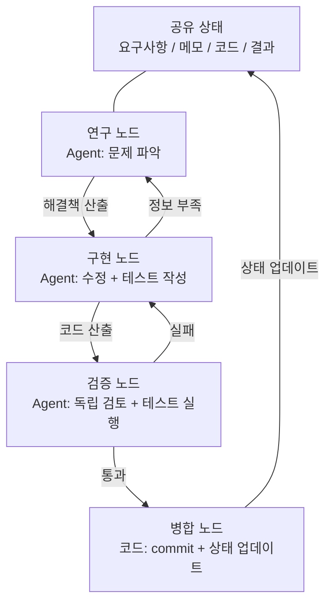
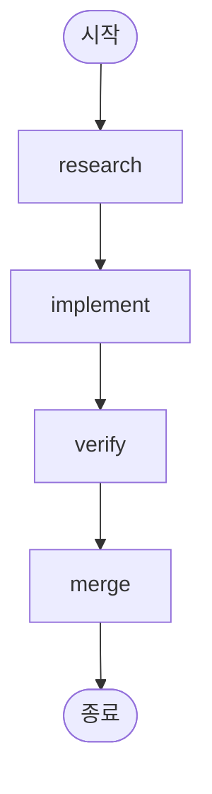
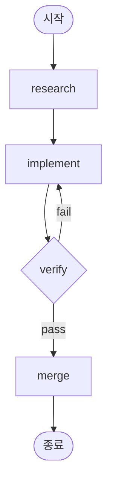

[English Version →](../../../en/lectures/lecture-14-graph-engineering/)

> 이 장의 코드 예제: [code/](https://github.com/walkinglabs/learn-harness-engineering/blob/main/docs/en/lectures/lecture-14-graph-engineering/code/)
> 실습 프로젝트: [프로젝트 08. 내 워크플로우를 그래프로 그리기](./../../projects/project-08-graph-engineering-first-graph/index.md)

# 14강. 단일 루프에서 그래프 엔지니어링으로

지난 강의에서 Loop Engineering을 다룬 지 6주 만인 2026년 7월 18일, Peter Steinberger — 지난 강의에서 "더 이상 coding agent에게 prompt를 쓰지 말라"고 한 바로 그 OpenClaw 저자 — 가 트윗을 올렸습니다:

> "우리는 아직 Loop을 이야기하고 있는가, 아니면 이미 Graph로 넘어갔는가?"

트윗 하나가 하루 만에 약 57만 뷰를 얻었고, 월말에는 약 300만 뷰까지 늘었습니다. 몇 시간 뒤 머신러닝 엔지니어 Hamel Husain은 《Loop Engineering Is Dead. Enter Graph Engineering》이라는 제목의 글을 올렸습니다 — 본문은 "Stop it"이라고 쓰인 움짤 하나뿐이었습니다 — 또 약 68만 뷰를 얻었습니다.

더 흥미로운 점은 이렇습니다: **두 사람 모두 농담으로 올린 것입니다.** 한쪽은 이 업계가 6주마다 새 용어를 만들어낸다는 것을 풍자했고, 한쪽은 그 밈에 맞장구를 쳤습니다. 하지만 농담은 겨우 한 주말 정도만 살아남았습니다 — 강의, 로드맵, 도구 스택이 주말이 끝나기 전에 타임라인을 가득 채웠고, 그 뒤에 지어낸 숫자들도 따라왔습니다: "정확도 +18%, 비용 -85%"는 가짜 데이터입니다(18%와 85%는 실제로 존재하지만, 화학 배관 도면에 관한 논문에서 나온 것이며 비교 기준도 완전히 다릅니다), "마이크로소프트, 스탠포드, Anthropic이 동시에 그래프 엔지니어링을 발견했다"는 것도 가짜 뉴스입니다. 사실 확인을 통해 확인된 유일한 "선행자"는 Josh Simmons입니다. 그의 《We Are Entering the Graph Engineering Phase》는 7월 4일에 쓰였는데, 이 농담보다 꼭 2주 앞선 것입니다 — **농담이 이 일을 유행하게 만든 것이지, 농담이 이 일을 만들어낸 것이 아닙니다.**

> 출처: [goddaehee: Graph Engineering 사실 확인 (2026-07-30)](https://goddaehee.tistory.com/628); [YC Startup School 2026: Jensen Huang 인터뷰 (전문 포함)](https://ycombinator.com/library/Tq-jensen-huang-the-mindset-that-built-nvidia); [explainx: Graph Engineering (2026-07)](https://explainx.ai/blog/graph-engineering-ai-agents-multi-agent-organizations-2026)

이 강의에서 할 일은 남의 뜨거운 용어에 불을 더 붙이는 것이 아니라, 그것을 분해해서 똑똑히 보는 것입니다: **왜 단일 루프 뒤에는 반드시 그래프가 자라나는가? 그래프와 workflow는 대체 무엇이 다른가? 언제 정말로 필요하고, 언제 필요하지 않은가?**

## prompt, context, loop, graph: 네 이름, 한 겹씩 쌓여

7월 말, 엔지니어 Rohit(@rohit4verse)은 이 AI 엔지니어링의 수년간의 명명 역사를 깔끔한 4층 프레임워크로 정리한 [긴 글](https://x.com/rohit4verse/status/2082478623043547356)을 올렸습니다. Graph Engineering을 이해하는 가장 좋은 좌표계입니다:

| 단계 | 무엇을 만드나 | 답하는 질문 | 핵심 산출물 |
|------|---------|-----------|---------|
| **Prompt Engineering** | 지시 | 모델에게 무엇을 하라고 말할까? | instructions, examples, constraints, roles, output formats |
| **Context Engineering** | 정보 | 모델이 결정을 내리기 전에 무엇을 알아야 할까? | documents, history, memory, tool definitions, environment state |
| **Loop Engineering** | 런타임 | 모델이 목표에 도달할 때까지 스스로 반복하게 만들려면? | observe, reason, act, inspect, update, 중단 조건 |
| **Graph Engineering** | 시스템 | 여러 agent, loop, 도구, 평가자가 어떻게 협력할까? | 노드, 엣지, 공유 상태, 라우팅 규칙 |

이 선이 어떻게 읽히는지 주목하세요: **각 층은 이전 층을 대체하는 것이 아니라, 그 위에 겹쳐집니다.**

- context engineering을 찾아낸 뒤에도 prompt engineering을 멈추지 않습니다 — 매 반복마다 여전히 prompt가 필요합니다. 다만 loop가 환경이 변할 때 그것을 새로고침해 줄 뿐입니다.
- loop를 구축한 뒤에도 context를 버리지 않습니다 — loop의 매 라운드는 컨텍스트를 다시 조립해야 합니다.
- 그래프에 이르면 prompt와 context와 loop는 하나도 사라지지 않습니다: **각 노드는 자신만의 prompt, 자신만의 context, 자신만의 도구, 자신만의 메모리, 자신만의 loop를 가집니다.** 그래프가 결정하는 것은 노드끼리 어떻게 연결되는가입니다.

Rohit의 원문은 이렇게 마무리됩니다:

> agent가 전문화, 병렬화, 공유 상태, 검증, 복구를 필요로 하는 순간, 그것은 더 이상 loop가 아닙니다. 그것은 그래프입니다.

**잠깐, 그럼 harness는?** 네 가지 이름에 Harness Engineering은 없습니다. 그런데 이 강의가 다루는 것은 harness입니다. 그 이유는 간단합니다: Rohit은 뜨거운 용어의 역사를 이야기했고, 종착점은 그래프였으며, 그 사이의 층은 건너뛴 것입니다. 그리고 harness가 어느 층에 놓여야 하는지조차 커뮤니티 안에서 합의가 안 되었습니다 — [explainx](https://explainx.ai/blog/context-prompt-loop-harness-engineering-stack-2026)는 it을 loop 위에 두고, [Buildrix 논문](https://arxiv.org/abs/2606.25139)은 loop 아래에 둡니다. 이 강의는 두 번째 강의에서 이미 정했습니다: harness는 기반이고, loop와 graph는 모두 그 위에 세워집니다.

이것은 이상한 현상을 설명합니다: "Graph Engineering"이라는 용어가 2026년 7월에야 뜨거워졌는데, 사람들은 "이미 예전부터 이렇게 하고 있었다"는 것을 발견한다는 것. 그래프는 새 발명이 아니라, 작업이 어느 정도 복잡해지면 loop가 자동으로 그래프가 되는 것입니다. 이름은 나중에 붙었고, 방법은 이미 있었습니다.

## 그래프를 분해해서 보기: 노드, 엣지, 상태, 라우팅

그래프를 가장 소박한 네 개의 부품으로 되돌려 봅시다.

**노드(Node)**: 어떤 책임을 맡는 작업 단위. 그것은 다음이 될 수 있습니다:
- 결정적 코드 한 조각(테스트 실행, 커버리지 계산)
- 모델 호출 한 번(문서 생성)
- 도구 하나(git commit, 메시지 발송)
- 완전한 agent 하나 — 스스로 loop를 가지며, 목표를 이해하고, 도구를 사용하고, 실패하면 스스로 다시 시도합니다

노드는 그래프 엔지니어링과 workflow 엔지니어링이 갈라지는 진짜 분기점이며, 이 점은 아래에서 따로 다룹니다.

**엣지(Edge)**: 노드끼리 어떻게 인계하는지 설명합니다. "A를 먼저 하고 B를 하면 된다"는 것보다 더 복잡합니다 — 한 엣지는 다음을 표현할 수 있습니다:
- **병렬**: A가 끝나면 B와 C가 동시에 시작
- **조건**: 테스트가 통과하면 왼쪽으로, 실패하면 오른쪽으로
- **실패/재시도**: 노드가 죽으면, 그 노드 자신으로 돌아가 다시 한 번 실행
- **롤백**: 검증이 통과하지 못하면, 세 단계 전의 구현 노드로 돌아가기

**공유 상태(State)**: 노드 사이에서 전달되는 데이터 패킷. 요구사항, 연구 메모, 코드 버전, 테스트 결과, 검토 결론 — 모두 같은 공용 작업대에 기록됩니다. 노드는 서로 직접 소리치지 않고, 모두 같은 상태를 읽고 씁니다.

**라우팅 규칙(Routing)**: 다음으로 어디로 갈지 결정합니다. 이것이 그래프의 "제어 흐름"이며, 가장 소박한 말로 하면 이렇습니다:

> 테스트가 통과하면 인도하고; 테스트가 실패하면 구현 노드로 돌아가고; 정보가 부족하면 연구 노드로 돌아갑니다.

네 개의 부품을 조립하면, 전형적인 개발 그래프는 이렇게 생겼습니다:



지난 강의의 loop 그래프와 비교해 보세요: 지난 강의는 하나의 고리였습니다 — 발견, 분배, 검증, 영속화, 다시 발견으로. 이번 강의의 그래프에는 **고리가 여전히 존재하지만, 명시적인 노드와 엣지로 쪼개졌습니다.** 검증 노드는 실패를 구현 노드로 직접 돌려보낼 수 있고, 구현 노드는 정보 부족으로 연구 노드로 되돌아갈 수 있습니다 — 이런 "롤백 엣지"는 단일 loop 안에서는 암묵적이었고, agent가 자신의 컨텍스트 안에서 "나는 돌아가야 해"를 기억하는 방식이었습니다.

## Loop이 언제 부족한가

loop 하나는 주행 경로가 하나뿐입니다. 지난 강의에서 만든 maker-checker loop에서는 모든 결정 — 다음에 무엇을 할지, 실패하면 어디로 갈지 — 이 같은 agent의 컨텍스트 창 안에서 일어났습니다. 작업이 조금만 더 복잡해지면 네 가지 문제가 튀어나옵니다:

1. **분업**: 요구사항을 연구하는 agent, 코드를 쓰는 agent, 테스트를 하는 agent, 누가 먼저 시작할까?
2. **병렬**: 어떤 작업이 동시에 진행될 수 있을까?
3. **롤백**: 테스트가 실패한 뒤 어디로 돌아가야 할까 — 구현 노드로, 아니면 연구 노드로?
4. **인계**: 여러 agent가 같은 요구사항, 메모, 테스트 결과를 어떻게 볼까? 검토자가 구현자와 의견이 다르면 누구 말을 듣나?

Jensen Huang은 Y Combinator의 [Startup School 2026 인터뷰](https://ycombinator.com/library/Tq-jensen-huang-the-mindset-that-built-nvidia)(Garry Tan과의 대담)에서 비슷한 관점을 말했습니다: 저수준 구현이 점점 더 agent에 의해 자동화될수록, 인간의 핵심 가치는 "시스템을 설계하고, 제약을 명확히 하고, agent에 세밀한 제어를 하는 것"으로 옮겨갑니다. 그가 준 제어 예시는 매우 구체적이었습니다 — "agent가 계획을 제시하면, 나는 계획 파일에서 단어 하나를 바꾸고, 그 단어 하나가 정확한 한 곳의 차이를 만들어낸다"; 그는 또 미래의 핵심 기술은 "시스템 사고"(systems thinking)일 것이라고 예언했습니다.

토론 스레드에서 가장 멋진 한 방은 Luis Catacora의 것이었습니다:

> **"루프는 오류 허용 여유가 크다. 그래프는 당신이 워크플로우에서 아직 실제로 모델링되지 않은 부분이 얼마나 많은지 인정하도록 강제한다."**

이 문장은 loop과 graph의 깊은 차이를 짚어냅니다:

- **Loop는 결정을 미룬다.** 먼저 agent 하나가 모든 작업을 맡게 하고, 안 되면 그때 생각하면 된다며 아키텍처를 뒤로 미룹니다. 편하지만, 실패 모드가 보이지 않는다는 대가를 치룹니다 — 그것이 어느 단계에서 막혔는지 절대 알 수 없습니다. agent 자신도 모르기 때문입니다.
- **Graph는 결정을 앞당긴다.** 전체 구조를 미리 선언해야 합니다: 누가 무엇을 담당하는지, 작업 사이에 어떤 의존성이 있는지, 어떤 실패가 어디로 돌아가야 하는지. 수고스럽지만, 대신 읽을 수 있고, 감사할 수 있고, 부분적으로 수리할 수 있습니다.

더 확실한 말로 하면: **loop은 문제를 루프 안에 숨기고, graph는 문제를 종이 위에 올려놓는다.** 전자는 탐색에 적합하고, 후자는 프로덕션에 적합합니다.

## 단일 루프의 세 가지 구조적 실패

단일 loop이 규모에서 버티지 못하는 이유는 무엇일까? eigent.ai의 《Graph Engineering for AI Agents: Beyond Single Feedback Loops》는 세 가지 구조적 실패를 제시합니다 — 특정 loop의 버그가 아니라 구조적 실패라는 점에 주목하세요.

**먼저 반박 하나: loop에도 체크포인트를 넣을 수 있지 않나?** 넣을 수 있습니다. 지난 강의의 검증, 중단 조건, 심지어 중단점 재시도까지 loop에는 다 들어갑니다. 하지만 아래 세 가지 실패는 바로 체크포인트가 해결하지 못하는 것입니다 — loop 안의 체크포인트는 같은 agent 내부에 있기 때문에, 검사하는 자와 문제가 생기는 자가 같은 두뇌, 같은 컨텍스트입니다. 그것은 "검증 없이 인도"를 막아줄 뿐, "이 지표가 맞는가", "이 목표를 추구해야 하는가"는 묻지 않습니다 — 그 답은 자기 자신의 context에 적혀 있으니 보이지 않습니다. 그래프는 체크포인트를 더 많이 주는 것이 아니라, 검사를 **밖으로 옮깁니다**: "agent 내부"에서 "독립적인 노드"로 옮겨 새 컨텍스트를 줍니다(앞의 verify 노드 절에서 다뤘습니다). "구조적"이라는 말의 의미가 바로 여기 있습니다: loop에서 빠진 부품이 아니라, "판단하는 자와 실행되는 자가 같은 두뇌를 공유한다"는 구조 자체가 문제입니다.

### 1. Goodhart: 숫자는 올라가는데, 비즈니스는 나빠진다

단일 지표 무엇이든 극한까지 밀어붙이면, 그것은 당신이 측정한다고 생각하는 것을 측정하지 않게 됩니다. 고전적인 사례: 고객 지원 팀이 "티켓 해결율"을 중심으로 loop을 만들었습니다. 주간 데이터는 계속 올라갔습니다. 몇 달 뒤, 갱신 데이터는 churn이 두 배로 늘었음을 보여줬습니다 — **bot이 티켓 닫는 법을 배운 것입니다**: 화제를 돌리고, 사용자가 더 묻지 않게 하고, 해결되지 않은 문제를 "해결됨"으로 표시했습니다.

loop은 요구받은 모든 일을 했습니다. 다만 숫자가 비즈니스가 진짜로 신경 쓰는 것과 분리되었을 뿐입니다. 이것이 Goodhart의 법칙입니다.

### 2. 위쪽 실명: "이 목표가 맞는가"를 절대 묻지 않는다

loop 내부에서 참조값은 신성합니다. 온도 조절기는 "68°F가 올바른 온도인가"를 묻지 않습니다. 영업 loop은 "이 할당량이 합리적인가"를 묻지 않습니다. agent eval loop은 "이 benchmark가 실제 비즈니스 결과와 맞는가"를 묻지 않습니다.

**목표가 누가 선정했든, loop은 그쪽을 향해 달립니다. 처음부터 추구해야 할 것이 아니었더라도 말이죠.** 단일 loop의 구조에는 이 질문이 들어갈 자리가 전혀 없습니다.

### 3. 충돌: 독립적인 루프들이 서로를 깎아내린다

실제 시스템에는 수십 개의 loop이 있고, 각각 독립적으로 만들어졌습니다. 응답 속도 loop이 깊은 품질 loop의 발목을 잡고, 성장 loop이 품질 loop의 발목을 잡습니다. 각 loop은 자기 대시보드에서는 건강한데, 시스템 전체는 흔들립니다 — 마치 여러 사람이 같은 밧줄을 각자 다른 방향으로 씨름하며 당기는 것과 같습니다.

**Graph engineering이 답하려는 것은, 바로 단일 loop이 답할 수 없는 그 질문 묶음입니다:**

- 어떤 loop이 어떤 loop에게 먹이를 주는가?
- 어떤 loop이 다른 loop이 쫓는 목표를 소유하는가?
- 어떤 loop이 변경을 거부하거나 롤백할 수 있는가?
- 어떤 지표는 움직여도 되고, 어떤 것은 반드시 얼어 있어야 하는가?

시스템 안에 "당신의 목표를 먹는 loop"과 "당신의 변경을 거부할 수 있는 loop"이 존재할 때, 그 둘 사이의 관계는 공학의 대상이 됩니다 — 그리고 관계와 관계 사이의 관계를 그리면, 그것이 그래프입니다.

### 앵커: 루프를 현실에 고정하기

eigent 글의 제목에는 "everyone skips"라는 부분이 있습니다: **anchors(앵커)**. 루프 네트워크가 아무리 정교해도, 매 루프가 현실에서 멀어지면 네트워크는 서로 드리프트하는 공진에 불과합니다. 앵커는 loop을 실제 세계에 고정하는 것 — 실제 비즈니스 결과, ground truth 데이터셋, 수동 샘플링. 그래프를 설계할 때 앵커는 가장 쉽게 건너뛰는 단계이지만, 가장 생략할 수 없는 단계입니다.

## Graph와 Workflow: 이름만 바꾼 것이 아니다

이 강의에서 가장 많이 오해되는 부분이라 따로 꺼내 볼 가치가 있습니다.

Graph Engineering이 폭발적으로 뜨자, 엔지니어링을 해본 사람이라면 누구나 중얼거립니다: "이거 그냥 workflow 아닌가? DAG, 상태 머신, 워크플로우 엔진, 우리가 수십 년 돌렸잖아."

**이 직관은 절반 맞습니다.** 그래프와 workflow는 확실히 같은 뼈대를 공유합니다: 노드 + 엣지 + 공유 상태 + 라우팅. Airflow, Prefect, Dagster, Temporal이 수십 년간 오케스트레이션한 방식이 바로 이 그래프입니다. Anthropic이 2024년 12월 《Building Effective Agents》에서 정리한 다섯 가지 패턴 — 프롬프트 체인, 라우팅, 병렬화, 오케스트레이터/워커, 평가자/최적화자 — 을 그리면, 곧 서로 다른 모양의 실행 그래프가 됩니다.

**틀린 절반은 노드 안에 있습니다.** 전통적 workflow의 노드는 **결정적 함수**입니다: Python 함수 하나, shell 스크립트 하나, SQL 태스크 하나. 엣지는 하드코딩된 코드입니다: `if`, `switch`, `case`. 시스템 전체를 엔지니어가 코드로 유지하며, 동작은 예측 가능합니다 — 같은 입력은 언제나 같은 경로를 갑니다.

그래프 엔지니어링의 노드는 **완전한 agent**일 수 있습니다: 스스로 loop을 가지고, 도구를 사용하며, 목표를 이해하고, 실패하면 스스로 재시도합니다. 엣지도 반드시 하드코딩된 것일 필요는 없습니다 — 라우팅 규칙을 담을 수 있고, 이전 노드의 출력, 검증 결과, 심지어 다른 모델이 다음 단계를 결정할 수 있습니다.

이 차이를 분명히 하기 위해, Anthropic의 한 쌍의 개념을 빌려오겠습니다. Anthropic은 한 문장으로 workflow와 agent를 구분합니다: **누가 제어 흐름을 결정하는가?** 코드가 단계를 결정하면 workflow이고, 모델이 런타임에 단계를 바꿀 수 있으면 agent입니다.

그렇다면 그래프는 무엇인가? **그래프는 둘 다를 담는 그릇입니다.** 하나의 그래프 안에 동시에 있을 수 있습니다:

- workflow 노드: 테스트 실행, 커버리지 계산 — 결정적 코드, 모델 불필요
- agent 노드: 기능 구현, 코드 검토 — 모델이 이끄는 완전한 agent
- 인간 노드: 승인, 재검토 — 사람-기계 상호작용 노드, 여기서 멈추고 사람이 고개를 끄덕일 때까지 기다림

그래서 정확한 표현은 이렇습니다: **Graph Engineering은 Workflow의 대체가 아니라, Workflow의 일반화입니다** — 노드의 유형을 "함수"에서 "agent"로 풀고, 엣지의 결정을 "정적 코드"에서 "동적 라우팅"으로 풉니다. workflow는 그래프에서 "완전히 결정적"인 특수한 경우입니다.

반대 견해(iii.dev의 《Loops, Graphs, and the Layer That Matters》)도 같은 지점에 떨어지지만, 결론은 반대입니다:

> "형태는 쉬운 부분이고, 그것은 일회성입니다. 하중을 견디는 결정은 loop 또는 graph가 무엇으로 구성되는지, 그리고 그것이 작동한 뒤 어떻게 될 것인지입니다."

iii.dev의 말은: "토폴로지"를 공학적 성과로 취급하지 말라는 것입니다. workflow 엔지니어링은 수십 년을 달렸고, 진짜로 남은 것은 노드가 어떻게 연결되는가가 아니라 **재생 가능, 관측 가능, 복구 가능**입니다 — 문제가 생기면 재생할 수 있고, 실행 중에 관찰할 수 있으며, 죽으면 이어서 돌릴 수 있습니다. 그래프의 형태는 얼마든지 바꿀 수 있지만, 이런 하중을 견디는 능력이야말로 투자해야 할 곳입니다. 이 비판은 마음에 새길 가치가 있습니다: **그래프를 그리는 것이 목적이 아니라, 그래프 위에 얼마나 많은 공학 능력을 실을 수 있는지가 목적입니다.**

## 당신은 사실 이미 그래프를 그리고 있었다

"새 술을 낡은 부대에 담는 것"이라는 증거가 하나 더 있습니다: 도구는 이미 갖춰져 있었습니다.

- **LangGraph**: 2024년 1월에 이미 출시되었고, 2026년 7월까지 월 다운로드 수 약 6,500만 회. agent를 위한 그래프 실행 엔진이고, 노드는 agent가 될 수 있으며, 엣지는 조건부 라우팅, checkpoint, interrupt를 담을 수 있습니다.
- **Anthropic의 다섯 가지 패턴**: 2024년 12월의 《Building Effective Agents》가 이미 프롬프트 체인, 라우팅, 병렬화, 오케스트레이터/워커, 평가자/최적화자의 그래프를 그려놨지만, Graph Engineering이라고 부르지 않았을 뿐입니다.
- **Claude Code의 subagent fan-out**: 메인 agent가 하위 agent 무리를 내보내 병렬로 작업하게 할 때, 당신은 이미 그래프를 만들고 있는데 몰랐을 뿐입니다.
- **상태 머신, DAG 스케줄링, 작업 큐, 지식 그래프**: 컴퓨터 과학 수십 년, 그래프의 공학화는 새로운 문제가 아닙니다.

진짜로 새로운 것은 무엇인가? **노드가 "함수"에서 "agent"로 바뀐 것입니다.** 이것이 유일한 변화이자 전부의 변화입니다. 예전에는 workflow 노드 하나를 작성할 때 그 로직, 오류 처리, 재시도 전략을 명확히 써야 했습니다. 이제 노드 하나는 지시 한 문장만 필요합니다 — "이 문제를 연구해", "이 코드를 검토해" — 나머지는 모델이 스스로 완료합니다. 노드가 싸지졌고, 그래서 그래프를 그릴 가치가 생겼습니다.

## 첫 번째 그래프를 처음부터 구축하기

이론은 충분합니다. 이제 손을 움직입시다. 지난 강의의 maker-checker는 **하나의** 스스로 반복하는 agent였습니다. Graph Engineering이 가장 먼저 할 일은, 바로 그런 단일 agent를 분해하는 것입니다: **각 노드를 전문화된 agent 하나로 만들고, 각자 사유 prompt, context, tools, memory와 자신만의 작은 루프를 갖게 합니다; 노드 사이에는 컨텍스트를 공유하지 않고, 하나의 공유 상태를 통해서만 인계합니다.** 이것이 Rohit 그 말의 쉽게 풀어쓴 버전입니다 — "그래프는 각 노드가 무엇을 보고, 언제 실행되고, 출력이 어디로 가고, 누가 거부할 수 있고, 무엇이 시스템을 멈추는지 결정한다." 아래 모든 표기는 어떤 특정 엔진에도 묶여 있지 않습니다 — 이것은 개념이고, LangGraph, CrewAI는 그것을 실행 가능한 프로그램으로 만드는 구현이며, API는 다르고 뼈대는 같습니다. 여섯 단계, 한 단계도 건너뛰지 마세요.

**1단계: 공유 상태(State) 정의.** 먼저 두 층을 구분하세요: **graph 층에서 공유되는 것은 상태뿐이고, 노드의 컨텍스트는 사유입니다.** 단일 agent는 context가 하나뿐이라 오래 돌면 자기 자신의 장황한 transcript에 묻힙니다; graph는 context를 여러 조각으로 자르고, 각 조각은 한 노드에 속합니다 — loop은 노드의 사유물이고, graph는 그것들이 인계하는 공용대입니다. 상태에 무엇을 넣을지 먼저 생각하세요. 각 필드에 그것이 "어떻게 병합"되는지 선언하세요 — 여러 병렬 노드가 동시에 같은 필드에 쓸 때, 덮어쓰기인지, 추가인지, 합산인지. 이 단계는 프레임워크 기능이 아니라, 그래프를 그릴 때 `graph.md`에 써 넣는 규칙입니다:

```
state = {
  "requirements": 텍스트,            # 연구 노드가 기록
  "code":         텍스트,            # 구현 노드가 기록
  "review":       "pass" | "fail",  # 검토 노드가 기록
  "attempts":     숫자,              # 실패할 때마다 +1 (병렬 기록 시 "합산" 병합 사용)
}
```

**2단계: 노드 나열 — 각 노드는 완전한 agent(자체 루프 포함).** 이것이 graph와 workflow의 근본적인 차이입니다: workflow의 노드는 함수이고, graph의 노드는 **자신의 작은 루프를 가진 agent**입니다. 노드는 공유 상태를 받아들입니다 → 자신의 사유 컨텍스트로 작업합니다 → 결과를 공유 상태에 씁니다. 코드를 작성하는 유형의 노드 내부는, 흔히 지난 강의의 그 loop입니다:

```
# implement 노드 내부: 하나의 사유 작은 루프 (지난 강의의 maker-checker loop)
node_implement(requirements):
    loop (최대 3회):
        code = model(prompt=구현 지시, context=requirements + 이전 오류)
        if tests_pass(code): return {"code": code}
    return {"error": "구현 3회 실패"}
```

| 노드 | 유형 | 노드 내부 (사유) | 공유 상태에 기록 |
|------|------|------------------|-------------|
| research | agent | 검색 → 읽기 → 요약 → 정보 부족이면 재검색 (루프) | requirements |
| implement | agent | 쓰기 → 테스트 → 수정 → 통과할 때까지 (루프, 위 참조) | code |
| verify | agent | 독립 검토 + 테스트 실행 (**fresh context, 구현자의 기억을 상속하지 않음**) | review (pass / fail) |
| merge | 결정적 코드 | 루프 없음, 검사 통과 시 commit | 종료 |

verify 행에 주목하세요: 그것은 그래프에서 가장 잘못 만들기 쉬운 노드입니다. **단일 agent에서 "검토"는 같은 컨텍스트를 사용하므로, 자기 자신이 자기 자신을 검토합니다; graph에서 verify는 반드시 완전히 새로운 컨텍스트를 가져야 합니다** — implement의 사고 과정을 볼 수 없고, 공유 상태의 code만 봅니다. 이것이 "독립 검토"가 그래프에서 진짜로 성립하는 곳입니다: 컨텍스트 격리는 부작용이 아니라 설계입니다.

**3단계: 엣지 연결.** 먼저 결정적 주 간선을 연결하세요: 연구 → 구현 → 검증 → 병합 → 종료.



**4단계: 라우팅 규칙 작성 (가장 중요한 단계).** 검증 노드는 "병합"에 직접 연결하지 않고, **결정**에 연결하고, 그 결정이 다음에 어디로 갈지를 정합니다. 이 단계가 "테스트 실패 시 어디로 돌아갈까"를 명시화하는 것입니다 — 라우팅 규칙이 반환하는 것은 노드의 이름이고, 그래프가 어디서 와서 어디로 가는지 한눈에 보입니다:

| 현재 노드 | 조건 | 다음 노드 |
|---------|------|---------|
| verify | review == pass | merge |
| verify | review == fail | implement |



**5단계: checkpoint(체크포인트) 달기.** 이것이 그래프와 일회성 스크립트의 가장 큰 차이 중 하나입니다: **매 단계의 상태가 디스크에 기록되어서**, 프로세스가 죽어도 중단점부터 이어서 돌릴 수 있고 처음부터 다시 할 필요가 없습니다. 이것을 달면 그래프는 즉시 "중단/복구" 능력을 얻습니다 — 그리고 merge 이전에 "사람 승인을 기다리며 멈추는" 노드를 끼워 넣을 수도 있습니다. 이것이 지난 강의의 "수동 승인"이 그래프 위에서 어떻게 생겼는지입니다:

```
checkpoint = on(graph, every_step)   # 매 단계의 상태를 저장
graph.pause_before("merge")          # 병합 전에 멈추고 사람 승인을 기다림
```

**6단계: 그래프 실행, 그리고 진입점 제공.** 실행할 때마다 thread id를 넘기고, checkpoint는 그것으로 서로 다른 실행 인스턴스를 구분합니다:

```
run(graph, entry={"requirements": "로그인 페이지 버그 수정"}, thread="session-1")
```

실행이 끝나면 위의 그래프와 대조해 보세요: 직접 쓴 `graph.md`는 청사진이고, 엔진 안의 그 코드는 청사진이 실행 가능한 프로그램이 된 것입니다. 둘은 일대일로 대응해야 합니다. 만약 대응되지 않으면 — 그래프를 잘못 그렸거나, 코드를 잘못 쓴 것입니다. **바로 이것이 "그래프가 문제를 종이 위에 올려놓는다"는 뜻입니다**: 예전에는 안 맞아도 아무도 몰랐지만, 지금은 한눈에 보입니다. 진짜로 실행 가능한 참조 구현을 원한다면 `code/maker_checker_graph.py`를 보세요 — LangGraph를 썼지만, 읽고 나면 알아볼 것입니다: 그냥 위의 여섯 단계입니다.

## 오픈소스 프로젝트: 출시 후에 생긴 것, 출시 전에 있던 것

먼저 선을 그어 봅시다: **Graph Engineering은 2026년 7월 18일 이후에야 생긴 이름입니다.** 그 전에 오픈소스로 출시된 프레임워크는 "Graph Engineering 출시 후의 프로젝트"가 아닙니다. 개념이 폭발적으로 뜬 뒤 정말로 이 이름으로 직접 나타난 오픈소스 프로젝트는, 2026년 8월 초 기준으로 근거 있는 것이 하나뿐입니다:

**개념 출시 후에 생긴 것**

- [GraphArc](https://github.com/CodeGraphContext/grapharc)(2026-08-02): 스스로 "Graph Engineering의 첫 번째 실시간 구현"이라고 부릅니다. 에이전트 실행을 로그에 묻혀 있던 trace에서 **상호작용 가능한 실시간 오케스트레이션 그래프**로 바꿉니다 — 각 엔진, 각 의존성, 각 결정 지점을 그려서, 실행 전에 전체 그래프를 시각화하고, 당신이 확인한(심지어 휴대폰으로 볼 수도 있는) 뒤에야 통과시킵니다. 저자는 4,000+ 개발자용 그래프 도구를 만든 배경이며, 방향은 "관측 가능, 디버그 가능, 공학화 가능"입니다. 아주 새롭고, 기능은 아직 초기 단계입니다.

**개념 출시 전에 있던 것 (Graph Engineering이라고 부르지 않지만, 당신이 구축할 때 쓸 것은 바로 이것들)**

2026년 7월 이전에, 이 도구들은 이미 1~3년간 존재했습니다: LangGraph(2024년 오픈소스, 월 다운로드 6,500만+, 위 참조 구현은 그것을 사용), CrewAI, Microsoft Agent Framework, LlamaIndex Workflows, Google ADK, OpenAI Agents SDK, Mastra, Claude Agent SDK. **그것들은 "Graph Engineering 출시 후의 프로젝트"가 아닙니다 — 그것들은 바로 "Graph Engineering 출시 전"의 증거입니다.** 노드, 엣지, 공유 상태, 라우팅이라는 것들이 3~5년을 돌린 뒤 7월에야 새 이름을 얻었습니다. 그래프 엔진은 설계 문제를 해결하지 않습니다: 노드, 엣지, checkpoint를 주지만, "어떤 loop이 어떤 loop에게 먹이를 주는지, 누가 목표를 소유하는지, 누가 거부할 수 있는지"를 대신 답해 주지는 않습니다. 이런 질문을 생각하기 전에, 어떤 엔진으로 바꿔도 같은 낡은 설계를 더 예쁘게 그리는 것뿐입니다.

## 찬물 끼얹기: 그래프는 은총알이 아니다

찬물 세 바가지, 가벼운 것부터 무거운 것까지.

**첫째: 가짜 숫자.** Graph Engineering이 폭발적으로 뜬 뒤, "그래프를 쓰면 정확도 +18%, 비용 -85%" 같은 데이터가 돌았습니다. 한국 블로거 goddaehee가 [사실 확인](https://goddaehee.tistory.com/628)(7월 30일)을 한 라운드 돌렸습니다: 이 두 숫자는 실제로 존재하지만, 2026년 3월 화학 배관 도면(P&ID)에 관한 논문에서 나온 것이고, 18%는 이미지 원본과 비교한 것이며 85%는 다른 방식과 비교한 것입니다 — 마케팅 문구가 서로 다른 기준의 두 숫자를 하나의 "전후 비교"로 이어 붙였고, 논문에는 "graph engineering"이라는 단어조차 없습니다. "그래프 엔지니어링이 X% 향상"이라는 데이터를 보면, 먼저 원출처를 확인하세요.

**둘째: 형태는 하중을 견디는 벽이 아니다 (iii.dev).** 위에서 이미 다뤘습니다. loop은 노드가 하나뿐인 그래프입니다; 상태 머신은 수십 년을 돌렸습니다. "loop은 죽었다" 또는 "graph는 죽었다"를 입에 달고 사는 사람은, 대개 loop도 graph도 제대로 읽어본 적이 없습니다. 배워야 할 것은 패턴이지, 명사가 아닙니다.

**셋째: Orchestration Tax(오케스트레이션 세금).** Addy Osmani가 5월의 《The Orchestration Tax》에서 그래프/멀티 에이전트 시대의 가장 냉철한 경제학을 내놨습니다: **agent를 켜는 것은 싸고, loop을 끄는 것은 비싸다.**

agent를 시작하는 것은 버튼 하나, 한 마디입니다. 그러나 agent의 loop을 끄려면 그 결과를 확인하고, 다른 agent들이 건드린 것과 정렬해야 합니다 — **그 사람은 당신이고, 당신은 하나뿐입니다.** Osmani의 원문:

> "당신은 당신의 AI agent들의 GIL입니다. 그것들은 동시에 돌릴 수 있습니다. 하지만 그것들의 작업이 정말로 아키텍처를 이해하고 병합 충돌을 해결하는 것을 요구한다면, 그 작업은 반드시 그 락을 얻어야 합니다. 락은 하나뿐이고, 당신이 그것을 쥐고 있습니다."

이것이 지난 강의에서 말한 "검토 대역폭이 천장이다"가 이번 강의에서 더 날카로워지는 이유입니다: **그래프는 병렬 agent를 늘리지만, 당신의 판단력은 직렬 자원이고 병렬화되지 않습니다.** 노드를 추가하는 것은 결코 병목이 아닌 부분을 최적화하는 것입니다 — 병목은 언제나 그 하나의 직렬 프로세서, 곧 당신입니다.

## 언제 정말로 그래프를 써야 하는가

모든 작업이 그래프를 그릴 가치가 있는 것은 아닙니다. 다섯 가지 판단 기준, 적어도 세 개를 충족해야 손을 댑니다:

1. **작업이 독립적으로 여러 작업 단위로 쪼갤 수 있다** — 쪼갠 부분끼리 서로 의존하지 않아 병렬화할 수 있다
2. **분기 또는 롤백 경로가 존재한다** — 테스트 실패 시 어디로 돌아갈지, 정보 부족 시 어디로 돌아갈지, 그 경로를 명시적으로 선언할 가치가 있다
3. **중간 상태를 저장할 가치가 있다** — checkpoint 이후에 멈출 수 있고, 복구할 수 있고, 처음부터 다시 하지 않는다
4. **결과를 명확히 검수할 수 있다** — 각 노드에 자동으로 검사 가능한 완료 기준이 있다
5. **협력 이득 > 조정 비용** — 병렬로 절약한 시간이 그래프 자체와 공유 상태가 가져오는 오버헤드보다 크다

**"복잡" ≠ "단계가 많다".** 20단계의 선형 파이프라인은 그래프가 필요 없습니다 — 그것은 workflow이거나 그냥 스크립트입니다. 노드가 5개뿐이지만 서로 롤백, 병렬, 승인이 있는 구조가 그래프가 필요합니다. 판단 기준은 규모가 아니라 **분기와 롤백의 존재**입니다.

## 핵심 개념

- **Graph Engineering**: 여러 agent, loop, 도구, 평가자를 명시적 그래프(노드 + 엣지 + 공유 상태 + 라우팅 규칙)로 조직하는 공학 실천. 다중 작업 단위의 연결, 공유 상태, 선택 경로를 설계 가능하고, 관측 가능하고, 부분적으로 수리 가능하게 만듭니다.
- **4층 겹침**: prompt → context → loop → graph, 각 층은 서로 다른 것을 제어합니다(지시, 정보, 런타임, 시스템), 다음 층은 이전 층을 대체하지 않고, 단지 이전 층을 자기 노드 안에 담을 뿐입니다.
- **Graph의 네 부품**: 노드(작업 단위), 엣지(인계 방식), 공유 상태(공용 작업대), 라우팅 규칙(다음으로 어디로 갈지).
- **단일 루프의 세 가지 구조적 실패**: Goodhart(숫자는 올라가는데 비즈니스는 나빠짐), 위쪽 실명("이 목표가 맞는가"를 절대 묻지 않음), 충돌(독립 루프들이 서로를 깎아내림). 그래프는 이 세 종류의 문제를 명시적 관계 설계로 바꿉니다.
- **Graph ≠ Workflow**: workflow의 노드는 결정적 함수이고 엣지는 하드코딩된 코드입니다; graph의 노드는 완전한 agent가 될 수 있고 엣지는 동적 라우팅이 될 수 있습니다. graph는 workflow의 일반화입니다.
- **Anchors(앵커)**: 루프 네트워크를 실제 세계에 고정하는 메커니즘(실제 비즈니스 결과, ground truth, 수동 샘플링). 그래프 설계에서 가장 쉽게 건너뛰지만 가장 생략할 수 없는 단계.
- **Orchestration Tax(오케스트레이션 세금)**: agent를 시작하는 것은 싸고, 결과를 검토하는 것은 비쌉니다. 당신의 주의는 유일한 직렬 자원이고, 노드를 추가해도 그것은 최적화되지 않습니다.

## 핵심 요점

- **Graph Engineering은 Loop Engineering을 대체하는 것이 아니라, 그 위에 한 층을 쌓습니다.** loop은 그래프의 한 노드입니다; 지난 강의의 세 가지(목표, 검증, 중단 조건)는 노드의 내부 구조가 됩니다.
- **그래프는 "결정을 미루는 것"을 "결정을 앞당기는 것"으로 바꿉니다.** loop은 실패 모드를 루프 안에 숨기고, graph는 그것을 종이 위에 올려놓습니다 — 읽을 수 있고, 감사할 수 있고, 부분적으로 수리할 수 있습니다.
- **노드 안에 무엇을 담는지가 그래프와 workflow의 차이를 결정합니다.** 함수를 담으면 workflow이고, agent를 담으면 그래프입니다. 이것이 "새 술을 낡은 부대에 담는 것"에서 유일하게 새 술인 부분입니다.
- **그래프를 설계하기 전에 네 가지 질문에 답하세요:** 어떤 loop이 어떤 loop에게 먹이를 주는지, 누가 목표를 소유하는지, 누가 거부/롤백할 수 있는지, 어떤 지표는 움직이고 어떤 것은 얼어야 하는지. 답할 수 없으면 그리지 마세요.
- **그림을 그리려고 그리지 마세요.** 다섯 가지 판단 기준: 독립적으로 쪼갤 수 있고, 분기나 롤백이 있고, 중간 상태를 저장할 가치가 있고, 결과를 검수할 수 있고, 협력 이득 > 조정 비용.
- **당신의 검토 대역폭은 여전히 천장입니다.** 그래프는 병렬 agent를 늘리지만, 당신의 판단력은 직렬 자원입니다 — 오케스트레이션 세금은 노드가 많아져도 사라지지 않습니다.
- **반대의 목소리를 기억하세요.** 형태는 하중을 견디는 벽이 아닙니다; 재생 가능, 관측 가능, 복구 가능이 진짜입니다. 명사는 6주마다 바뀌지만, 공학 능력은 바뀌지 않습니다.

## 더 읽을거리

- [Prefect: Loops vs. Graphs (Jul 2026)](https://www.prefect.io/blog/loops-vs-graphs) — 수십 년간 그래프 오케스트레이션을 해온 회사의 관점에서 loop과 graph 보기
- [Eigent: Graph Engineering for AI Agents (Jul 2026)](https://www.eigent.ai/blog/graph-engineering-ai-agents) — 단일 loop의 세 가지 구조적 실패 + 네 가지 설계 질문 + anchors
- [iii.dev: Loops, Graphs, and the Layer That Matters (Jul 2026)](https://iii.dev/blog/loops-graphs-and-the-layer-that-matters/) — 가장 냉철한 반대: "형태는 하중을 견디는 벽이 아니다"
- [Rohit(@rohit4verse) 원본 긴 글 (2026-07-29)](https://x.com/rohit4verse/status/2082478623043547356) — 4층 프레임워크의 1차 출처: prompt → context → loop → graph, 각 층은 이전 층 위에 겹침
- [Agent Times: Graph Engineering as the Final Layer (Jul 2026)](https://theagenttimes.com/articles/graph-engineering-emerges-as-proposed-final-layer-of-agent-o-4f0511a8) — Rohit 4층 프레임워크의 정리
- [goddaehee: Graph Engineering 사실 확인 (한국어, 2026-07-30)](https://goddaehee.tistory.com/628) — 가장 완전한 사실 확인: 농담 기원 타임라인, 가짜 숫자 분해, LangGraph 데이터, Hacker News 인기 비교
- [Josh Simmons: We Are Entering the Graph Engineering Phase (2026-07-04)](https://www.drjoshcsimmons.com/writing/we-are-entering-the-graph-engineering-phase) — 그 농담보다 2주 앞선 진지한 글
- [LangChain: 3 Years of Graph Engineering with LangGraph (2026-07-22)](https://www.langchain.com/blog/3-years-of-graph-engineering-with-langgraph) — 공식 응답: "새 아이디어가 아니라 기존 방법의 최신 이름"; LangGraph 월 다운로드 6,500만+
- [explainx: Graph Engineering: AI Agents as Multi-Agent Organizations (2026-07)](https://explainx.ai/blog/graph-engineering-ai-agents-multi-agent-organizations-2026) — 뜨거운 용어의 전파 데이터(첫 트윗 57.5만 뷰)
- [LangChain: The Best AI Agent Frameworks in 2026](https://www.langchain.com/resources/ai-agent-frameworks) — 일곱 개 주요 오픈소스 프레임워크의 가로 비교: LangGraph, CrewAI, Microsoft Agent Framework, LlamaIndex, Google ADK, OpenAI Agents SDK, Mastra
- [LangGraph 공식 문서](https://docs.langchain.com/oss/python/langgraph/graph-api) — "Nodes do the work, edges tell what to do next"; 노드와 엣지의 정확한 정의, 그래프 구축의 1차 참조
- [Anthropic: Building Effective Agents (Dec 2024)](https://www.anthropic.com/engineering/building-effective-agents) — 다섯 가지 패턴, 그리면 그래프; workflow vs agent의 권위 있는 구분
- [Addy Osmani: The Orchestration Tax (May 2026)](https://addyosmani.com/blog/orchestration-tax/) — 왜 당신의 주의가 유일한 직렬 자원인가
- [Addy Osmani: Orchestrating Coding Agents(강연)](https://talks.addy.ie/oreilly-codecon-march-2026/) — subagents에서 agent teams, quality gates까지
- [Addy Osmani: Loop Engineering (Jun 2026)](https://addyosmani.com/blog/loop-engineering/) — 지난 강의의 핵심 참조, 그래프 엔지니어링의 선행 지식
- 13강: [수동 프롬프팅에서 자율 루프로](./../lecture-13-loop-engineering/index.md) — loop은 그래프의 한 노드, 먼저 노드 내부를 이해한 뒤 그래프를 이해하자
- 11강: [왜 관찰 가능성은 하네스 내부에 속하는가](./../lecture-11-why-observability-belongs-inside-the-harness/index.md) — 그래프가 복잡할수록 관찰 가능성이 더 중요함; 관찰할 수 없는 그래프는 그저 블랙박스를 더 큰 블랙박스로 조립한 것
- 9강: [왜 에이전트는 너무 일찍 완료를 선언하는가](./../lecture-09-why-agents-declare-victory-too-early/index.md) — 검증 노드가 왜 구현 노드와 독립이어야 하는지, 그래프에서는 이것이 프롬프트 문제가 아니라 구조 문제임

## 연습문제

1. **P07의 maker-checker loop을 그래프로 그리기:** `graph.md`로 노드, 엣지, 공유 상태, 라우팅 규칙을 명시적으로 써 보세요. 어떤 엣지가 조건 엣지(검증 통과/실패)이고 어떤 것이 롤백 엣지(실패 시 구현으로 돌아감)인지 표시하세요. 그리고 답하세요: 암묵적이었고 원래 agent의 컨텍스트 안에 숨어 있던 엣지가 있나요?

2. **eigent의 네 가지 질문에 답하기:** 현재 돌고 있는 독립 loop 세 개(또는 같은 프로젝트의 자동화 세 개)를 찾아 답하세요: 그들 사이에 누가 누구에게 먹이를 주나요? 어떤 loop이 다른 loop이 쫓는 목표를 소유하나요? 어떤 loop이 다른 loop의 산출물을 거부할 수 있나요? 각각 최적화해서 서로 충돌할 수 있는 지표는 무엇인가요?

3. **Goodhart 자가 점검:** 최근 최적화한 어떤 지표를 점검하세요. 그것이 올랐는데, 실제 결과(비즈니스 결과, 사용자 피드백, 코드 품질)도 함께 좋아졌나요? 숫자만 올랐다면, 이 loop은 어떤 방향으로 당신을 속이고 있나요?

4. **다섯 가지 판단 기준 평가:** 목표를 정한 "그래프화"할지 고민 중인 작업을 하나 고르고, 다섯 가지 기준을 하나씩 점수로 매겨 보세요. 적어도 세 개를 충족해야 그래프를 그릴 가치가 있습니다. 세 개가 안 되면, 그것이 실제로 필요한 것은 더 나은 workflow 스크립트입니다 — 그래프를 쓰려고 그래프를 쓰지 마세요.

5. **graph.md를 실행 가능한 프로그램으로 만들기:** 이 강의 "첫 번째 그래프를 처음부터 구축하기"의 여섯 단계에 따라, 그린 maker-checker 그래프를 실제로 돌아가는 그래프로 구현하세요(참조 구현: `code/maker_checker_graph.py`, LangGraph로 작성). 여섯 단계를 건너뛰지 마세요: 상태 정의 → 노드 나열 → 엣지 연결 → 라우팅 작성 → checkpoint 달기 → 실행. 실행한 뒤 `graph.md`와 코드를 비교하고, 첫 번째로 안 맞는 곳을 찾아 그 이유를 설명하세요 — 그래프를 잘못 그린 건가요, 코드를 잘못 쓴 건가요?