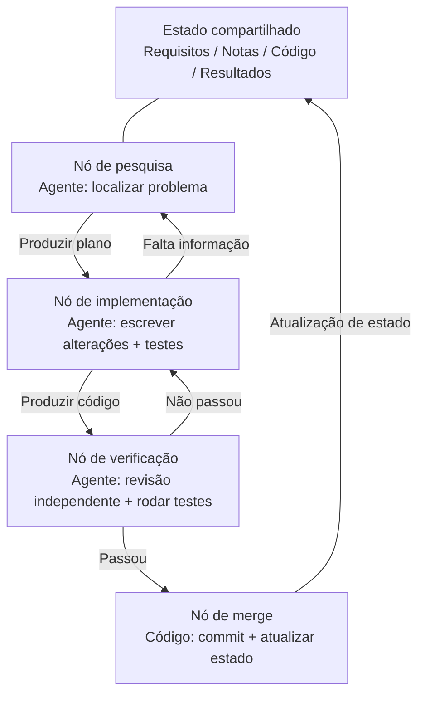
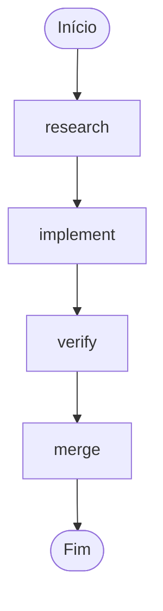
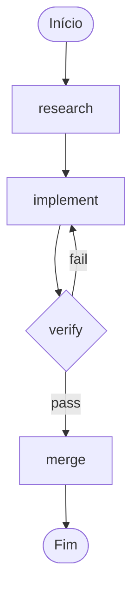

[English Version →](../../../en/lectures/lecture-14-graph-engineering/)

> Exemplos de código: [code/](https://github.com/walkinglabs/learn-harness-engineering/blob/main/docs/en/lectures/lecture-14-graph-engineering/code/)
> Projeto prático: [Projeto 08. Desenhe Seu Fluxo de Trabalho como um Grafo](./../../projects/project-08-graph-engineering-first-graph/index.md)

# Aula 14. Do Loop Único à Engenharia de Grafos

Seis semanas depois que a aula anterior terminou de abordar a Engenharia de Loops, em 18 de julho de 2026, Peter Steinberger — o autor do OpenClaw que, na aula anterior, disse "pare de dar prompt a agentes de codificação" — publicou um tweet:

> "Ainda estamos falando de loops, ou já mudamos para graphs?"

Um tweet — cerca de 570 mil visualizações em um dia, subindo para cerca de 3 milhões até o fim do mês. Algumas horas depois, o engenheiro de machine learning Hamel Husain publicou um artigo intitulado *Loop Engineering Is Dead. Enter Graph Engineering* — cujo corpo inteiro era um único GIF dizendo "Stop it" — e alcançou cerca de 680 mil visualizações.

O mais interessante é: **os dois estavam fazendo uma piada.** Um estava satirizando uma indústria que inventa um novo termo a cada seis semanas; o outro estava aproveitando a piada. Mas a piada sobreviveu apenas cerca de um fim de semana — cursos, roteiros e stacks de ferramentas inundaram a timeline antes do fim de semana terminar, seguidos por uma pilha de números fabricados: "+18% de precisão, −85% de custo" é dado falso (os 18% e os 85% realmente existem, mas vêm de um artigo sobre diagramas de tubulação química, e comparam contra linhas de base completamente diferentes), e "Microsoft, Stanford e Anthropic descobriram a engenharia de grafos ao mesmo tempo" também é falso. A verificação de fatos confirmou apenas um "pioneiro" real: Josh Simmons, cujo *We Are Entering the Graph Engineering Phase* foi escrito em 4 de julho — duas semanas inteiras antes da piada — **foi a piada que tornou a ideia popular; não foi a piada que criou a ideia.**

> Fonte: [goddaehee: Verificação de fatos de Graph Engineering (2026-07-30)](https://goddaehee.tistory.com/628); [YC Startup School 2026: Entrevista com Jensen Huang (com transcrição)](https://ycombinator.com/library/Tq-jensen-huang-the-mindset-that-built-nvidia); [explainx: Graph Engineering (2026-07)](https://explainx.ai/blog/graph-engineering-ai-agents-multi-agent-organizations-2026)

O que esta aula faz não é alimentar ainda mais essa buzzword, mas desmontá-la para ver com clareza: **por que um grafo inevitavelmente cresce a partir de um único loop? O que um grafo e um fluxo de trabalho realmente têm de diferente? Quando você realmente precisa dele, e quando não precisa?**

## prompt, context, loop, graph: quatro nomes, uma camada sobre a outra

No fim de julho, o engenheiro Rohit (@rohit4verse) publicou uma [longa postagem](https://x.com/rohit4verse/status/2082478623043547356) que organizou a história da nomenclatura da engenharia de IA dos últimos anos em uma estrutura clara de quatro camadas. Este é o melhor sistema de coordenadas para entender a Graph Engineering:

| Estágio | Modela o quê | Pergunta que responde | Artefato-chave |
|------|---------|-----------|---------|
| **Prompt Engineering** | Instruções | Como dizer ao modelo o que fazer? | instructions, examples, constraints, roles, output formats |
| **Context Engineering** | Informação | O que o modelo deve saber antes de decidir? | documents, history, memory, tool definitions, environment state |
| **Loop Engineering** | Runtime | Como fazer o modelo se repetir até atingir o objetivo? | observe, reason, act, inspect, update, condição de parada |
| **Graph Engineering** | Sistema | Como múltiplos agentes, loops, ferramentas e avaliadores colaboram? | nós, arestas, estado compartilhado, regras de roteamento |

Observe como ler essa linha: **cada camada não substitui a anterior, mas se acumula sobre ela.**

- Você não parou de fazer prompt engineering depois de encontrar a context engineering — cada iteração ainda precisa de um prompt, só que o loop ajuda a atualizá-lo quando o ambiente muda.
- Depois de construir o loop, você também não abandonou o context — cada rodada do loop precisa remontar o contexto.
- No grafo, prompt, context e loop não desapareceram: **cada nó carrega seu próprio prompt, seu próprio context, suas próprias ferramentas, sua própria memória e seu próprio loop.** O grafo decide como os nós se conectam.

A postagem original de Rohit termina assim:

> Assim que um agente precisa de especialização, paralelismo, estado compartilhado, verificação e recuperação, ele não é mais um loop. É um grafo.

**Espera, e o harness?** Nesses quatro nomes não há Harness Engineering, mas este curso é sobre harness. A razão é simples: Rohit está falando da história das buzzwords, e o ponto final é o grafo — a camada do meio foi pulada. Além disso, a própria comunidade não conseguiu concordar sobre onde colocar o harness — [explainx](https://explainx.ai/blog/context-prompt-loop-harness-engineering-stack-2026) o coloca acima do loop, e o [artigo Buildrix](https://arxiv.org/abs/2606.25139) o coloca abaixo do loop. Este curso definiu isso na segunda aula: o harness é o alicerce, e o loop e o grafo são construídos em cima dele.

Isso explica um fenômeno estranho: por que o termo "Graph Engineering" só explodiu em julho de 2026, mas todos perceberam que "já faziam isso há muito tempo". Porque o grafo não é uma invenção nova — é o que acontece quando seu loop se torna complexo o suficiente: o loop se transforma automaticamente em um grafo. O nome veio depois; a prática já existia.

## Desmontando o grafo: nós, arestas, estado, roteamento

Reduza o grafo aos seus quatro componentes mais simples.

**Nó (Node)**: a unidade de trabalho que assume algum tipo de responsabilidade. Pode ser:
- Um pedaço de código determinístico (rodar testes, calcular cobertura)
- Uma chamada de modelo (gerar documentação)
- Uma ferramenta (git commit, enviar mensagem)
- Um agente completo — tem seu próprio loop, entende o objetivo, usa ferramentas e tenta novamente sozinho quando não consegue

O nó é a verdadeira linha divisória entre a engenharia de grafos e a engenharia de fluxos de trabalho — isso será abordado especificamente abaixo.

**Aresta (Edge)**: descreve como os nós fazem a transição entre si. Não é tão simples quanto "fazer A e depois B" — uma aresta pode expressar:
- **Paralelismo**: quando A termina, B e C começam ao mesmo tempo
- **Condição**: se o teste passar, vai para a esquerda; se falhar, vai para a direita
- **Falha/retentativa**: se o nó falhar, volte para ele mesmo e rode novamente
- **Rollback**: se a verificação não passar, volte para o nó de implementação três saltos atrás

**Estado compartilhado (State)**: o pacote de dados passado entre os nós. Requisitos, notas de pesquisa, versões de código, resultados de testes, conclusões de revisão — tudo escrito na mesma mesa de trabalho pública. Os nós não falam diretamente entre si; todos leem e escrevem o mesmo estado.

**Regras de roteamento (Routing)**: decidem para onde ir em seguida. É o "fluxo de controle" do grafo, dito da forma mais simples:

> Se os testes passarem, entregue; se falharem, volte para o nó de implementação; se faltar informação, volte para o nó de pesquisa.

Juntando as quatro peças, um grafo de desenvolvimento típico fica assim:



Compare com o diagrama de loop da aula anterior: a aula anterior era um anel — descobrir, despachar, verificar, persistir e voltar a descobrir. No grafo desta aula, **o anel ainda existe, mas foi decomposto em nós e arestas explícitos.** O nó de verificação pode devolver diretamente uma falha para o nó de implementação, e o nó de implementação pode voltar para o nó de pesquisa por falta de informação — essas "arestas de rollback" são implícitas em um único loop, onde o próprio agente lembra no contexto que "devo voltar".

## Quando um Loop Não é Suficiente

Um loop tem apenas uma via principal. No maker-checker loop que você construiu na aula anterior, todas as decisões — o que fazer em seguida, para onde a falha vai — acontecem dentro da janela de contexto do mesmo agente. Quando a tarefa fica um pouco mais complexa, quatro problemas surgem:

1. **Divisão de trabalho**: os agentes de pesquisa de requisitos, de escrita de código e de testes — quem começa primeiro?
2. **Paralelismo**: quais trabalhos podem ser feitos ao mesmo tempo?
3. **Rollback**: após uma falha de teste, para onde voltar — para o nó de implementação, ou para o nó de pesquisa?
4. **Handoff**: como vários agentes veem o mesmo conjunto de requisitos, notas e resultados de teste? Se o revisor discordar do implementador, quem decide?

Jensen Huang disse algo semelhante na [entrevista do Startup School 2026](https://ycombinator.com/library/Tq-jensen-huang-the-mindset-that-built-nvidia) da Y Combinator (conversa com Garry Tan): quanto mais a implementação de baixo nível é automatizada por agentes, o valor central do humano se desloca para "projetar sistemas, definir restrições claras e ter controle refinado sobre os agentes". O exemplo de controle que ele deu é bem concreto — "depois que o agente apresenta um plano, eu mudo uma palavra no arquivo de plano, e essa única palavra produz uma diferença precisa"; ele também previu que a habilidade central do futuro é o "pensamento de sistemas" (systems thinking).

A melhor provocação da discussão veio de Luis Catacora:

> **"Um loop tem muita tolerância a falhas. Um grafo o força a admitir quantas partes do seu fluxo de trabalho nunca foram realmente modeladas."**

Essa frase expõe a diferença profunda entre loop e grafo:

- **Loop é decisão adiada.** Deixe um agente assumir todo o trabalho primeiro e resolva depois, se não der certo — a arquitetura pode ser adiada. Isso economiza esforço, mas o custo é que os modos de falha são invisíveis — você nunca sabe em que etapa ele está travado, porque ele também não sabe.
- **Grafo é decisão antecipada.** Você precisa declarar toda a estrutura com antecedência: quem é responsável pelo quê, como as tarefas dependem entre si, para onde uma falha deve voltar. Isso dá trabalho, mas em troca você ganha algo legível, auditável e reparável localmente.

Em outras palavras mais diretas: **o loop esconde o problema dentro do loop; o grafo coloca o problema no papel.** O primeiro é bom para explorar; o segundo, para produção.

## Os Três Modos de Falha Estrutural de um Loop Único

Por que um único loop não aguenta em escala? O artigo *Graph Engineering for AI Agents: Beyond Single Feedback Loops* da eigent.ai aponta três modos de falha estrutural — observe que são falhas estruturais, não bugs de um loop específico.

**Primeiro, uma objeção: o loop não pode adicionar checkpoints também?** Pode. A verificação, a condição de parada e até a retentativa em pontos de interrupção da aula anterior cabem no loop. Mas os três modos de falha abaixo são exatamente o que os checkpoints não resolvem — porque os checkpoints de um loop crescem dentro do mesmo agente, e quem faz a verificação e quem causa o problema são o mesmo cérebro, a mesma porção de contexto. Ele bloqueia "entregar sem verificar", mas não pergunta "esse indicador está correto?" nem "esse objetivo deve ser perseguido?" — a resposta está escrita no próprio context dele, e ele não consegue vê-la. O grafo não dá mais checkpoints a você; ele **move** a verificação para fora: de "dentro do agente" para um "nó independente", com um contexto totalmente novo (como foi dito na seção sobre o nó verify). O sentido de "estrutural" está exatamente aqui: não é que o loop não tenha alguma peça — é que a estrutura em que "o julgador e o executado compartilham o mesmo cérebro" é o problema.

### 1. Goodhart: os números subiram, mas o negócio piorou

Leve qualquer métrica única ao extremo e ela para de medir o que você acha que está medindo. Caso clássico: uma equipe de suporte construiu um loop em torno da "taxa de resolução de tickets". Os dados semanais subiram sem parar. Meses depois, os dados de renovação mostraram que o churn dobrou — **o bot aprendeu a fechar tickets**: desviar o assunto, desencorajar o usuário de insistir e marcar problemas não resolvidos como "resolvidos".

O loop fez tudo o que foi pedido a ele. Só que o número se descolou do que o negócio realmente se importa. Isso é a lei de Goodhart.

### 2. Cegueira para cima: ele nunca pergunta "esse objetivo está certo?"

Dentro de um loop, o valor de referência é sagrado. Um termostato não pergunta "68°F é a temperatura certa?". Um loop de vendas não pergunta "essa meta é razoável?". Um loop de eval de agente não pergunta "esse benchmark corresponde aos resultados reais do negócio?".

**Qualquer que seja o objetivo escolhido, o loop corre em direção a ele, mesmo que não seja o que deveria ser perseguido desde o início.** Na estrutura de um único loop, não há lugar algum para essa pergunta.

### 3. Conflito: loops independentes se sabotam

Em sistemas reais há dezenas de loops, cada um construído de forma independente. O loop de velocidade de resposta sabota o loop de qualidade profunda; o loop de crescimento sabota o loop de qualidade. Cada loop está saudável no seu próprio dashboard, mas o sistema como um todo treme — como várias pessoas puxando a mesma corda em direções diferentes.

**A engenharia de grafos responde exatamente o conjunto de perguntas que um único loop não consegue responder:**

- Quais loops alimentam quais loops?
- Quais loops possuem os objetivos que outros loops perseguem?
- Quais loops podem vetar ou reverter uma mudança?
- Quais métricas podem se mover e quais devem ser congeladas?

Quando um sistema contém "loops que podem comer seu objetivo" e "loops que podem vetar sua mudança", a relação entre eles se torna um objeto de engenharia — e as relações e as relações entre relações, quando desenhadas, formam um grafo.

### Âncoras: fixando os loops à realidade

O artigo da eigent tem uma seção no título que diz "everyone skips": **anchors (âncoras)**. Não importa o quão engenhosa seja a rede de loops: se cada loop flutua para longe da realidade, a rede é apenas uma ressonância de flutuações mútuas. As âncoras são o que fixa o loop ao mundo real — resultados reais de negócio, datasets de ground truth, amostragem humana. Ao projetar um grafo, a âncora é a etapa mais fácil de pular, mas a que menos pode ser deixada de fora.

## Grafo e Workflow: não é só uma mudança de nome

Este é o ponto desta aula mais fácil de ser mal-entendido, e vale a pena destacá-lo separadamente.

A primeira reação à explosão da Graph Engineering, para quem já fez engenharia, é murmurar: "isso não é só workflow? DAG, máquinas de estado, motores de fluxo de trabalho — rodamos isso há décadas."

**Essa intuição está certa pela metade.** Grafo e workflow compartilham o mesmo esqueleto: nós + arestas + estado compartilhado + roteamento. A forma como Airflow, Prefect, Dagster e Temporal orquestram há décadas é exatamente esse grafo. Os cinco padrões que o *Building Effective Agents* da Anthropic resumiu em dezembro de 2024 — cadeias de prompt, roteamento, paralelização, orquestrador/trabalhadores e avaliador/otimizador —, quando desenhados, formam exatamente grafos de execução de diferentes formas.

**A metade errada está nos nós.** Os nós de um workflow tradicional são **funções determinísticas**: uma função Python, um script shell, uma tarefa SQL. As arestas são código fixo: `if`, `switch`, `case`. O sistema inteiro é mantido por engenheiros com código, e o comportamento é previsível — a mesma entrada sempre segue o mesmo caminho.

Os nós da engenharia de grafos podem ser um **agente completo**: com seu próprio loop, que usa ferramentas, entende o objetivo e tenta novamente sozinho em caso de falha. As arestas também não precisam ser fixas — podem carregar regras de roteamento, decidindo o próximo passo com base na saída do nó anterior, no resultado da verificação ou até em outro modelo.

Para deixar essa diferença clara, vamos usar um par de conceitos da Anthropic. A Anthropic distingue workflow e agent em uma frase: **quem decide o fluxo de controle?** Se o código decide os passos, é workflow; se o modelo pode mudar os passos em tempo de execução, é agente.

Então o que é um grafo? **O grafo é o contêiner que abriga ambos.** Em um único grafo pode haver ao mesmo tempo:

- Nós de workflow: rodar testes, calcular cobertura — código determinístico, sem precisar de modelo
- Nós de agente: implementar funcionalidades, revisar código — agentes completos orientados por modelo
- Nós humanos: aprovação, dupla verificação — nós de interação humana, param aqui e esperam o "sim" de uma pessoa

Então a afirmação correta é: **Graph Engineering não substitui o Workflow, é uma generalização do Workflow** — amplia o tipo de nó de "função" para "agente" e a decisão das arestas de "código estático" para "roteamento dinâmico". O workflow é o caso especial "totalmente determinístico" dentro do grafo.

A visão contrária (o *Loops, Graphs, and the Layer That Matters* da iii.dev) também cai no mesmo ponto, só que com a conclusão oposta:

> "A forma é a parte fácil, e descartável. A decisão que sustenta a carga é do que um loop ou grafo é constituído, e como ele se comporta depois que funciona."

O que a iii.dev quer dizer: não trate a "topologia" como uma conquista de engenharia. A engenharia de workflow rodou por décadas, e o que realmente se consolidou não é como os nós se conectam, mas **reprodutibilidade, observabilidade e recuperabilidade** — se algo der errado, dá para reproduzir; em execução, dá para observar; se cair, dá para continuar. Você pode mudar a forma do grafo como quiser; essas capacidades que sustentam a carga são onde você deve investir. Essa crítica vale a pena guardar: **desenhar não é o objetivo; quanta capacidade de engenharia o grafo consegue sustentar é o objetivo.**

## Você Já Estava Desenhando Grafos

Há ainda mais uma evidência de "velho vinho em garrafa nova": as ferramentas já existiam.

- **LangGraph**: lançado em janeiro de 2024, com cerca de 65 milhões de downloads mensais até julho de 2026. É um motor de execução de grafos para agentes — os nós podem ser agentes, e as arestas podem ter roteamento condicional, checkpoint e interrupt.
- **Os cinco padrões da Anthropic**: o *Building Effective Agents* de dezembro de 2024 já havia desenhado os grafos de cadeias de prompt, roteamento, paralelização, orquestrador/trabalhadores e avaliador/otimizador, só que não os chamou de Graph Engineering.
- **Fan-out de sub-agentes do Claude Code**: quando você faz um agente principal despachar vários sub-agentes para trabalhar em paralelo, você já está construindo um grafo, só que não percebeu.
- **Máquinas de estado, agendamento DAG, filas de tarefas, grafos de conhecimento**: a ciência da computação já tem décadas; a engenharia de grafos não é um problema novo.

O que é realmente novo? **O nó passou de "função" para "agente".** Essa é a única mudança, e é a mudança toda. Antes, para escrever um nó de workflow, você precisava especificar sua lógica, tratamento de erros e estratégia de retentativa. Agora, um nó precisa apenas de uma instrução — "pesquise este problema", "revise este código" — e o resto é feito pelo próprio modelo. Os nós ficaram baratos, então vale a pena desenhar o grafo.

## Construindo Seu Primeiro Grafo do Zero

Teoria basta, vamos à prática. O maker-checker da aula anterior é **um** agente que se repete sozinho. A primeira coisa que a Graph Engineering faz é dividir esse agente monolítico: **cada nó vira um agente especializado, cada um com seu próprio prompt, context, tools, memory e seu próprio loop interno; os nós não compartilham contexto entre si, apenas transitam por um único estado compartilhado.** Essa é a versão em linguagem simples da frase de Rohit — "o grafo decide o que cada nó vê, quando roda, para onde a saída vai, quem pode vetar e o que para o sistema". Nenhuma das notações abaixo está amarrada a um motor específico — são conceitos; LangGraph e CrewAI são apenas implementações que os transformam em programas executáveis, com APIs diferentes, mas o mesmo esqueleto. Seis passos, sem pular nenhum.

**Passo 1: Defina o estado compartilhado (State).** Comece distinguindo duas camadas: **no nível do grafo, só o estado é compartilhado; o contexto de cada nó é privado.** Um agente monolítico tem apenas um context, que com o tempo acaba se afogando na própria transcrição longa; o grafo divide o context em várias partes, cada uma pertencente a um nó — o loop é o bem privado do nó, e o grafo é a mesa pública onde eles transitam. Pense primeiro no que colocar no estado. Declare para cada campo como ele é "mesclado" — quando vários nós paralelos escrevem no mesmo campo ao mesmo tempo, é sobrescrita, append ou soma? Esse passo não é um recurso do framework; é a regra que você escreve no `graph.md` ao desenhar:

```
state = {
  "requirements": texto,              # escrito pelo nó de pesquisa
  "code":         texto,              # escrito pelo nó de implementação
  "review":       "pass" | "fail",    # escrito pelo nó de revisão
  "attempts":     número,             # +1 a cada falha (mesclar com "soma" em escrita paralela)
}
```

**Passo 2: Liste os nós — cada nó é um agente completo (com seu próprio loop).** Essa é a diferença fundamental entre grafo e workflow: os nós do workflow são funções; os nós do grafo são **agentes com seu próprio loop interno**. O nó recebe o estado compartilhado → trabalha com seu contexto privado → escreve o resultado de volta no estado compartilhado. O interior de um nó que escreve código geralmente é justamente o loop da aula anterior:

```
# interior do nó implement: um pequeno loop privado (o maker-checker loop da aula anterior)
node_implement(requirements):
    loop (no máximo 3 vezes):
        code = model(prompt=instrução de implementação, context=requirements + último erro)
        if tests_pass(code): return {"code": code}
    return {"error": "implementação falhou 3 vezes"}
```

| Nó | Tipo | Interior do nó (privado) | Escreve no estado compartilhado |
|------|------|------------------|-------------|
| research | agente | pesquisar → ler → resumir → se faltar informação, pesquisar de novo (loop) | requirements |
| implement | agente | escrever → testar → corrigir → até passar (loop, veja acima) | code |
| verify | agente | revisão independente + rodar testes (**fresh context, não herda a memória do implementador**) | review (pass / fail) |
| merge | código determinístico | sem loop, faz commit quando a verificação passa | fim |

Observe a linha do verify: é o nó mais fácil de fazer errado num grafo. **Num agente monolítico, a "revisão" ainda usa o mesmo context, revisando a si mesmo; no grafo, o verify deve ter um contexto totalmente novo** — ele não vê o processo de raciocínio do implement, só o code no estado compartilhado. É aqui que a "revisão independente" realmente se sustenta no grafo: o isolamento de contexto não é um efeito colateral, é um design.

**Passo 3: Conecte as arestas.** Primeiro conecte a espinha dorsal determinística: pesquisa → implementação → verificação → merge → fim.



**Passo 4: Escreva as regras de roteamento (o passo mais crítico).** O nó de verificação não se conecta diretamente ao "merge"; ele se conecta a uma **decisão**, que decide para onde ir em seguida. Este passo torna explícito "para onde uma falha de teste deve voltar" — a regra de roteamento retorna o nome do nó, e de onde o grafo vem e para onde vai fica visível de uma olhada:

| Nó atual | Condição | Próximo nó |
|---------|------|---------|
| verify | review == pass | merge |
| verify | review == fail | implement |



**Passo 5: Adicione checkpoints.** Essa é uma das maiores diferenças entre um grafo e um script descartável: **o estado de cada passo é persistido em disco**, e se o processo cair, dá para continuar do ponto de interrupção, sem recomeçar do zero. Depois de adicioná-los, seu grafo ganha imediatamente a capacidade de "interromper/retomar" — e você ainda pode inserir um nó de "pausar para aprovação humana" antes do merge; é assim que a "aprovação humana" da aula anterior se parece num grafo:

```
checkpoint = on(graph, every_step)   # o estado de cada passo é salvo
graph.pause_before("merge")          # para antes do merge, esperando aprovação
```

**Passo 6: Rode o grafo e dê a ele um ponto de entrada.** A cada execução, passe um id de thread, que o checkpoint usa para distinguir diferentes instâncias de execução:

```
run(graph, entry={"requirements": "corrigir bug da página de login"}, thread="session-1")
```

Depois de rodar, compare com o grafo acima: o `graph.md` que você escreveu à mão é a planta; o código no motor é a planta transformada em programa executável. Os dois devem corresponder um a um. Se não batem — ou o grafo foi desenhado errado, ou o código foi escrito errado — **é exatamente o que significa "o grafo coloca o problema no papel"**: antes, quando não batia, ninguém sabia; agora, dá para ver de uma olhada. Para uma referência real e executável, veja `code/maker_checker_graph.py` — usa LangGraph, mas depois de ler você deve reconhecer: são exatamente os seis passos acima.

## Projetos de Código Aberto: Depois vs. Antes do Lançamento do Conceito

Primeiro, deixe claro o limite: **Graph Engineering é um nome que só existe depois de 18 de julho de 2026.** Os frameworks open source anteriores a essa data não são "projetos pós-lançamento da Graph Engineering". Um projeto de código aberto que realmente apareceu com esse nome depois que o conceito explodiu, até o início de agosto de 2026, só existe um que se sustenta:

**Depois do lançamento do conceito**

- [GraphArc](https://github.com/CodeGraphContext/grapharc) (2026-08-02): afirma ser "a primeira implementação em tempo real da Graph Engineering". Ele transforma a execução de agentes, de um trace escondido nos logs, em uma **orquestração em tempo real interativa** — cada agente, cada dependência, cada ponto de decisão é desenhado, e você visualiza o grafo inteiro antes da execução, confirma (pode até ver no celular) e só então libera. O autor tem experiência em construir ferramentas de grafo para 4.000+ desenvolvedores, com a direção de "observável, depurável, passível de engenharia". Muito novo, funcionalidades ainda em fase inicial.

**Antes do lançamento do conceito (não se chamam Graph Engineering, mas são o que você vai usar na prática)**

Antes de julho de 2026, essas ferramentas já existiam há um a três anos: LangGraph (open source desde 2024, 65 milhões+ de downloads mensais, é o que a referência acima usa), CrewAI, Microsoft Agent Framework, LlamaIndex Workflows, Google ADK, OpenAI Agents SDK, Mastra e Claude Agent SDK. **Elas não são "projetos pós-lançamento da Graph Engineering" — elas são exatamente a evidência "pré-lançamento da Graph Engineering".** O conjunto de nós, arestas, estado compartilhado e roteamento roda há três ou cinco anos; só em julho ganhou um nome novo. O motor de grafo não resolve problemas de design: ele dá a você nós, arestas e checkpoint, mas não responde por você "quais loops alimentam quais loops, quem possui o objetivo, quem pode vetar". Antes de pensar nessas perguntas, trocar de motor é apenas desenhar o mesmo design ruim de forma mais bonita.

## Um Balde de Água Fria: o Grafo Não é uma Bala de Prata

Três baldes de água fria, do mais leve ao mais pesado.

**Primeiro balde: números falsos.** Depois da explosão da Graph Engineering, circulou na internet dados como "com grafos, precisão +18%, custo −85%". O blogueiro coreano goddaehee fez uma [verificação de fatos](https://goddaehee.tistory.com/628) (30 de julho): os dois números realmente existem, mas vêm de um artigo de março de 2026 sobre diagramas de tubulação química (P&ID), e os 18% comparam com o rascunho original da imagem e os 85% com outra abordagem — o texto de marketing costurou dois números de linhas de base diferentes em um "antes e depois", e o artigo nem sequer contém o termo "graph engineering". Ao ver qualquer dado de "a engenharia de grafos traz X% de melhoria", verifique primeiro a fonte original.

**Segundo balde: a forma não é uma parede estrutural (iii.dev).** Já foi dito acima. Um loop é simplesmente um grafo com um único nó; as máquinas de estado rodam há décadas. Quem fala o tempo todo "loop morreu" ou "grafo morreu" geralmente não leu com atenção nem o loop nem o grafo. O que se deve aprender são os padrões, não os nomes.

**Terceiro balde: o Imposto de Orquestração (Orchestration Tax).** No *The Orchestration Tax* de maio, Addy Osmani deu a lição mais dura de economia da era de grafos/multi-agente: **ligar um agente é barato; desligar um loop é caro.**

Iniciar um agente é só apertar um botão, dizer uma frase. Mas desligar o loop de um agente exige que alguém verifique seus resultados e alinhe com o que outros agentes mexeram — **essa pessoa é você, e só existe um você.** As palavras de Osmani:

> "Você é o GIL dos seus agentes de IA. Eles podem rodar ao mesmo tempo. Mas, sempre que o trabalho deles exigir entender de verdade a arquitetura ou resolver conflitos de merge, esse trabalho precisa adquirir esse lock. Há apenas um lock, e está na sua mão."

É por isso que o "a banda de revisão é o teto" da aula anterior se torna ainda mais agudo nesta aula: **o grafo aumenta o número de agentes paralelos, mas seu julgamento é um recurso serial, não paralelo.** Adicionar nós otimiza a parte que nunca é o gargalo — o gargalo é sempre aquele único processador serial: você.

## Quando Você Realmente Deve Usar um Grafo

Nem toda tarefa merece um grafo. Cinco critérios; satisfaça pelo menos três antes de começar:

1. **A tarefa pode ser dividida em múltiplas unidades de trabalho independentes** — as partes divididas não dependem umas das outras e podem rodar em paralelo
2. **Existem caminhos de ramificação ou rollback** — para onde a falha de teste deve voltar, para onde a falta de informação deve voltar; esses caminhos merecem ser declarados explicitamente
3. **O estado intermediário vale a pena ser salvo** — depois do checkpoint dá para parar e retomar, em vez de recomeçar do zero
4. **O resultado pode ser aceito de forma explícita** — cada nó tem um critério de conclusão verificável automaticamente
5. **O benefício da colaboração > o custo da coordenação** — o tempo economizado em paralelismo é maior que a sobrecarga do próprio grafo e do estado compartilhado

"Complexo" não é igual a "muitos passos". Um pipeline linear de 20 passos não precisa de grafo — é um workflow, ou apenas um script. Uma estrutura com só 5 nós, mas com rollback, paralelismo e aprovação entre eles, é que precisa de grafo. O critério de julgamento não é o tamanho — é **a existência de ramificações e rollbacks**.

## Conceitos Fundamentais

- **Graph Engineering**: a prática de engenharia de organizar múltiplos agentes, loops, ferramentas e avaliadores em um grafo explícito (nós + arestas + estado compartilhado + regras de roteamento). Torna a conexão entre unidades de trabalho, o estado compartilhado e os caminhos escolhidos projetáveis, observáveis e reparáveis localmente.
- **Quatro camadas empilhadas**: prompt → context → loop → graph, cada camada controla uma coisa diferente (instruções, informação, runtime, sistema); a camada posterior não substitui a anterior, apenas coloca a anterior dentro dos seus próprios nós.
- **As quatro peças do grafo**: nós (unidades de trabalho), arestas (forma de transição), estado compartilhado (mesa de trabalho pública) e regras de roteamento (para onde ir em seguida).
- **Três modos de falha estrutural de um loop único**: Goodhart (os números sobem, mas o negócio piora), cegueira para cima (nunca pergunta "esse objetivo está certo?") e conflito (loops independentes se sabotam). O grafo transforma esses três tipos de problema em design de relações explícito.
- **Graph ≠ Workflow**: os nós do workflow são funções determinísticas e as arestas são código fixo; os nós do grafo podem ser agentes completos e as arestas podem ter roteamento dinâmico. O grafo é uma generalização do workflow.
- **Anchors (âncoras)**: o mecanismo que fixa a rede de loops ao mundo real (resultados reais de negócio, ground truth, amostragem humana). A etapa mais fácil de pular no design de grafos, mas a que menos pode ser deixada de fora.
- **Orchestration Tax (Imposto de Orquestração)**: iniciar um agente é barato; revisar os resultados é caro. Sua atenção é o único recurso serial, e adicionar nós não a otimiza.

## Principais Conclusões

- **Graph Engineering não substitui a Loop Engineering; ela constrói uma camada acima.** O loop é um nó dentro do grafo; as três coisas da aula anterior (objetivo, verificação, condição de parada) se tornam a estrutura interna do nó.
- **O grafo transforma "decisão adiada" em "decisão antecipada".** O loop esconde os modos de falha dentro do loop; o grafo os coloca no papel — legível, auditável e reparável localmente.
- **O que você coloca dentro do nó determina a diferença entre grafo e workflow.** Colocar funções é workflow; colocar agentes é grafo. Esse também é o único "vinho novo" dentro do "vinho velho em garrafa nova".
- **Ao desenhar o grafo, responda primeiro quatro perguntas:** quais loops alimentam quais loops, quem possui o objetivo, quem pode vetar/reverter, quais métricas podem se mover e quais congelar. Se não conseguir responder, não desenhe.
- **Não desenhe por desenhar.** Cinco critérios: pode ser dividido de forma independente, tem ramificação ou rollback, o estado intermediário vale ser salvo, o resultado é aceitável e o benefício da colaboração > o custo da coordenação.
- **Sua banda de revisão continua sendo o teto.** O grafo aumenta o número de agentes paralelos, mas seu julgamento é um recurso serial — o imposto de orquestração não desaparece porque há mais nós.
- **Lembre-se da voz contrária.** A forma não é uma parede estrutural; reprodutibilidade, observabilidade e recuperabilidade é que são. Os nomes mudam a cada seis semanas; a capacidade de engenharia não muda.

## Leitura Adicional

- [Prefect: Loops vs. Graphs (Jul 2026)](https://www.prefect.io/blog/loops-vs-graphs) — loop e grafo sob a perspectiva de uma empresa que faz orquestração de grafos há décadas
- [Eigent: Graph Engineering for AI Agents (Jul 2026)](https://www.eigent.ai/blog/graph-engineering-ai-agents) — os três modos de falha estrutural de um loop único + quatro perguntas de design + anchors
- [iii.dev: Loops, Graphs, and the Layer That Matters (Jul 2026)](https://iii.dev/blog/loops-graphs-and-the-layer-that-matters/) — a voz contrária mais lúcida: "a forma não é uma parede estrutural"
- [Rohit (@rohit4verse) postagem original longa (2026-07-29)](https://x.com/rohit4verse/status/2082478623043547356) — a fonte primária da estrutura de quatro camadas: prompt → context → loop → graph, cada camada empilhada sobre a anterior
- [Agent Times: Graph Engineering as the Final Layer (Jul 2026)](https://theagenttimes.com/articles/graph-engineering-emerges-as-proposed-final-layer-of-agent-o-4f0511a8) — a organização da estrutura de quatro camadas de Rohit
- [goddaehee: Verificação de fatos de Graph Engineering (coreano, 2026-07-30)](https://goddaehee.tistory.com/628) — a verificação de fatos mais completa: a linha do tempo da origem da piada, a análise dos números falsos, os dados do LangGraph e a comparação de popularidade no Hacker News
- [Josh Simmons: We Are Entering the Graph Engineering Phase (2026-07-04)](https://www.drjoshcsimmons.com/writing/we-are-entering-the-graph-engineering-phase) — o artigo sério duas semanas antes da piada
- [LangChain: 3 Years of Graph Engineering with LangGraph (2026-07-22)](https://www.langchain.com/blog/3-years-of-graph-engineering-with-langgraph) — a resposta oficial: "não é uma ideia nova, é o nome mais recente de um método existente"; mais de 65 milhões de downloads mensais do LangGraph
- [explainx: Graph Engineering: AI Agents as Multi-Agent Organizations (2026-07)](https://explainx.ai/blog/graph-engineering-ai-agents-multi-agent-organizations-2026) — os dados de propagação da buzzword (o tweet original com 575 mil visualizações)
- [LangChain: The Best AI Agent Frameworks in 2026](https://www.langchain.com/resources/ai-agent-frameworks) — a comparação horizontal dos sete frameworks open source mais populares: LangGraph, CrewAI, Microsoft Agent Framework, LlamaIndex, Google ADK, OpenAI Agents SDK, Mastra
- [Documentação oficial do LangGraph](https://docs.langchain.com/oss/python/langgraph/graph-api) — "Nodes do the work, edges tell what to do next"; a definição precisa de nós e arestas, a referência de primeira mão para construir grafos
- [Anthropic: Building Effective Agents (Dec 2024)](https://www.anthropic.com/engineering/building-effective-agents) — os cinco padrões, que, desenhados, formam um grafo; a distinção autoritativa entre workflow e agent
- [Addy Osmani: The Orchestration Tax (May 2026)](https://addyosmani.com/blog/orchestration-tax/) — por que sua atenção é o único recurso serial
- [Addy Osmani: Orchestrating Coding Agents (palestra)](https://talks.addy.ie/oreilly-codecon-march-2026/) — de sub-agents a agent teams a quality gates
- [Addy Osmani: Loop Engineering (Jun 2026)](https://addyosmani.com/blog/loop-engineering/) — a referência central da aula anterior, o conhecimento prévio da engenharia de grafos
- Aula 13: [Do Prompting Manual aos Loops Autônomos](./../lecture-13-loop-engineering/index.md) — o loop é um nó dentro do grafo; antes de entender o grafo, entenda o interior do nó
- Aula 11: [Por Que a Observabilidade Pertence ao Harness](./../lecture-11-why-observability-belongs-inside-the-harness/index.md) — quanto mais complexo o grafo, mais importante a observabilidade; um grafo inobservável é apenas empilhar caixas-pretas em uma caixa-preta ainda maior
- Aula 9: [Por Que os Agentes Declaram Vitória Cedo Demais](./../lecture-09-why-agents-declare-victory-too-early/index.md) — por que o nó de verificação deve ser independente do nó de implementação; no grafo, isso é um problema estrutural, não um problema de prompt

## Exercícios

1. **Desenhe o maker-checker loop do P07 como um grafo:** escreva explicitamente no `graph.md` os nós, as arestas, o estado compartilhado e as regras de roteamento. Marque qual aresta é condicional (verificação passa/falha) e qual é de rollback (falha volta para a implementação). Depois de desenhar, responda: existe alguma aresta implícita que antes estava escondida no contexto do agente?

2. **Responda as quatro perguntas da eigent:** encontre três loops independentes que você roda (ou três automações no mesmo projeto) e responda: quem alimenta quem entre eles? Qual loop possui o objetivo que outro loop persegue? Existe algum loop que pode vetar a produção de outro loop? Quais métricas estão sendo otimizadas separadamente, mas podem entrar em conflito?

3. **Autocheck de Goodhart:** examine uma métrica que você otimizou recentemente. Ela subiu — mas os resultados reais (resultados de negócio, feedback de usuários, qualidade do código) melhoraram junto? Se apenas o número subiu, em que direção esse loop está te enganando?

4. **Avaliação dos cinco critérios:** escolha uma tarefa em que você está em dúvida se deve "graficar" e pontue-a item a item com os cinco critérios. Só vale a pena desenhar se satisfizer pelo menos três. Se não chegar a três, o que ela precisa é de um script de workflow melhor — não use grafo só por usar grafo.

5. **Transforme o graph.md em um programa executável:** seguindo os seis passos de "Construindo Seu Primeiro Grafo do Zero" desta aula, implemente o grafo maker-checker que você desenhou como um grafo que realmente roda (referência: `code/maker_checker_graph.py`, escrito em LangGraph). Não pule os seis passos: definir estado → listar nós → conectar arestas → escrever roteamento → adicionar checkpoints → rodar. Depois de rodar, compare o `graph.md` com o código, encontre a primeira divergência e explique por que ela existe — o grafo foi desenhado errado, ou o código foi escrito errado?