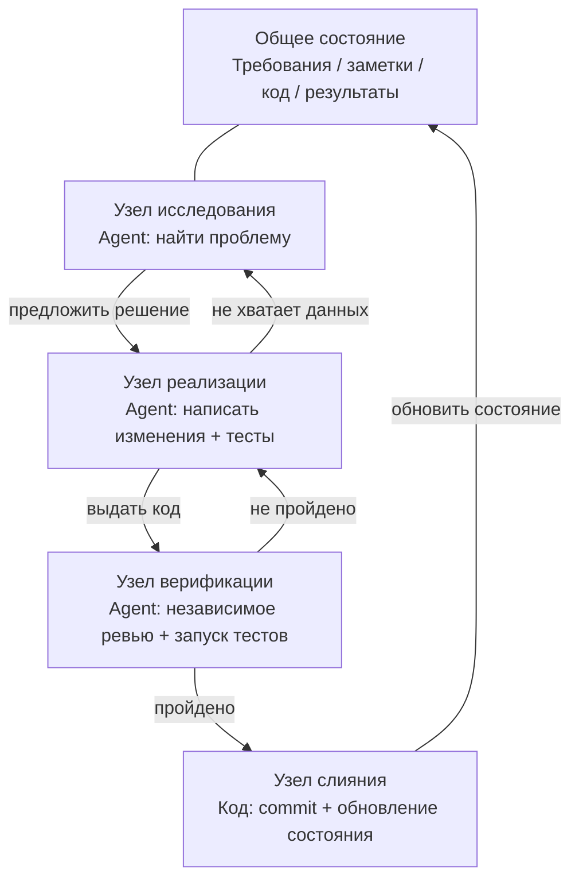
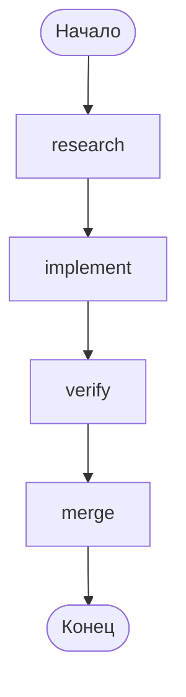
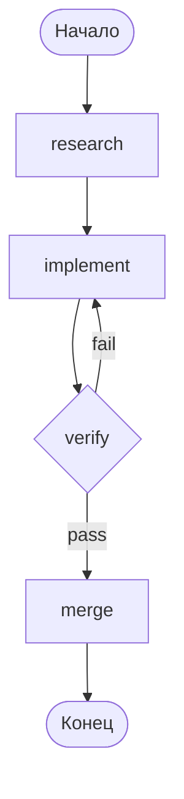

[English Version →](../../../en/lectures/lecture-14-graph-engineering/)

> Примеры кода: [code/](https://github.com/walkinglabs/learn-harness-engineering/blob/main/docs/en/lectures/lecture-14-graph-engineering/code/)
> Практический проект: [Project 08. Нарисуйте ваш workflow как граф](./../../projects/project-08-graph-engineering-first-graph/index.md)

# Лекция 14. От одиночных циклов к графовой инженерии

Шесть недель спустя после того, как Loop Engineering вышел в мейнстрим, 18 июля 2026 года Питер Стайнбергер — автор OpenClaw, который в прошлой лекции говорил «перестаньте писать промпты для coding-агентов» — опубликовал твит:

> «Мы всё ещё говорим о циклах, или уже перешли к графам?»

Один твит — около 570 тысяч просмотров за день, к концу месяца выросло до примерно 3 миллионов. Через несколько часов ML-инженер Хамел Хусейн опубликовал статью под названием *Loop Engineering Is Dead. Enter Graph Engineering* — весь текст которой был одной GIF-картинкой «Stop it» — и набрал ещё около 680 тысяч просмотров.

Ещё интереснее: **оба они шутили.** Один высмеивал индустрию, которая каждые шесть недель придумывает новый термин, другой подыгрывал этому мему. Но шутка прожила примерно один уикенд — курсы, роадмапы и технологические стеки заполонили таймлайн ещё до его конца, а за ними потянулся и ворох выдуманных цифр: «+18% точности, −85% стоимости» — это фейк (18% и 85% действительно существуют, но взяты из статьи о химических трубопроводных схемах и сравниваются с совершенно другими базовыми линиями), так же как и «Microsoft, Stanford и Anthropic одновременно обнаружили графовую инженерию». Факт-чекинг подтверждает единственного настоящего «первопроходца» — Джоша Симмонса: его *We Are Entering the Graph Engineering Phase* датирован 4 июля, на две полные недели раньше этой шутки. **Шутка сделала идею модной. Но она не создала идею.**

> Источник: [goddaehee: Факт-чекинг Graph Engineering (2026-07-30)](https://goddaehee.tistory.com/628); [YC Startup School 2026: интервью Дженсена Хуана (с транскриптом)](https://ycombinator.com/library/Tq-jensen-huang-the-mindset-that-built-nvidia); [explainx: Graph Engineering (2026-07)](https://explainx.ai/blog/graph-engineering-ai-agents-multi-agent-organizations-2026)

Задача этой лекции — не подлить масла в огонь этого хайпа, а разобрать термин по деталям и увидеть его ясно: **почему после одиночного цикла неизбежно вырастает граф? Чем граф на самом деле отличается от workflow? Когда он действительно нужен, а когда — нет?**

## Prompt, Context, Loop, Graph: четыре имени, один слой поверх другого

В конце июля инженер Рохит (@rohit4verse) опубликовал [длинный пост](https://x.com/rohit4verse/status/2082478623043547356), в котором организовал историю нейминга AI-инженерии за последние годы в чёткую четырёхуровневую структуру. Это лучшая система координат для понимания Graph Engineering:

| Этап | Что формирует | На какой вопрос отвечает | Ключевой продукт |
|------|---------|-----------|---------|
| **Prompt Engineering** | Инструкции | Как сказать модели, что делать? | instructions, examples, constraints, roles, output formats |
| **Context Engineering** | Информация | Что модель должна знать перед принятием решения? | documents, history, memory, tool definitions, environment state |
| **Loop Engineering** | Среда выполнения | Как заставить модель циклически повторять, пока цель не достигнута? | observe, reason, act, inspect, update, условие остановки |
| **Graph Engineering** | Система | Как сотрудничают несколько агентов, циклов, инструментов и оценщиков? | узлы, рёбра, общее состояние, правила маршрутизации |

Обратите внимание, как читается эта линия: **каждый уровень не заменяет предыдущий, а ложится поверх него.**

- Обнаружив context engineering, вы не перестали заниматься prompt engineering — на каждой итерации по-прежнему нужен промпт, просто loop обновляет его при изменении окружения.
- Построив loop, вы не отказались от context — каждый раунд loop заново собирает контекст.
- В графе не исчезли ни prompt, ни context, ни loop: **каждый узел несёт свой промпт, свой контекст, свои инструменты, свою память и свой маленький цикл.** Граф решает, как узлы соединяются друг с другом.

Рохит завершает свою мысль так:

> Как только агенту требуются специализация, параллелизм, общее состояние, верификация и восстановление — это больше не loop. Это граф.

**Стоп, а где же harness?** Среди этих четырёх имён нет Harness Engineering, хотя этот курс как раз про harness. Причина проста: Рохит рассказывает историю хайповых терминов, конечная точка — graph, и средний слой в ней просто пропущен. А к тому же само комьюнити не определилось, куда поместить harness — [explainx](https://explainx.ai/blog/context-prompt-loop-harness-engineering-stack-2026) ставит его выше loop, [статья Buildrix](https://arxiv.org/abs/2606.25139) — ниже loop. Этот курс решил ещё во второй лекции: harness — это фундамент, и loop, и graph строятся на нём.

Это объясняет странное явление: почему термин «Graph Engineering» стал популярным только в июле 2026 года, но все обнаружили, что «давно так работают». Потому что граф — не новое изобретение: когда задача становится достаточно сложной, loop автоматически превращается в граф. Сначала появилась практика, потом — имя.

## Разбираем граф: узлы, рёбра, состояние, маршрутизация

Сведём граф к четырём простейшим элементам.

**Узел (Node)** — рабочая единица, несущая какую-то ответственность. Это может быть:
- фрагмент детерминированного кода (запустить тесты, посчитать покрытие)
- один вызов модели (сгенерировать документацию)
- инструмент (git commit, отправить сообщение)
- полноценный агент — со своим циклом, способный понимать цель, пользоваться инструментами и повторять попытки при неудаче

Узел — настоящая граница раздела между графовой инженерией и workflow-инженерией; об этом поговорим отдельно ниже.

**Ребро (Edge)** — описывает, как узлы передают друг другу работу. Это не просто «сначала A, потом B» — одно ребро может выражать:
- **Параллельность**: после завершения A узлы B и C стартуют одновременно
- **Условие**: тесты прошли — идём налево, упали — направо
- **Сбой / повтор**: узел упал — возвращаемся к нему же и запускаем ещё раз
- **Откат**: верификация не пройдена — возвращаемся к узлу реализации, который был тремя шагами раньше

**Общее состояние (State)** — пакет данных, передаваемый между узлами. Требования, заметки по исследованию, версии кода, результаты тестов, выводы ревью — всё записывается в один общий рабочий стол. Узлы не перекликаются друг с другом напрямую — они читают и пишут одно и то же состояние.

**Правила маршрутизации (Routing)** — решают, куда идти дальше. Это «поток управления» графа, если сказать совсем просто:

> Тесты прошли — передаём; тесты упали — возвращаемся к узлу реализации; информации недостаточно — возвращаемся к узлу исследования.

Соберём четыре элемента вместе — и типичный граф разработки выглядит так:



Сравните с графом цикла из прошлой лекции: тогда это был один цикл — обнаружение, распределение, верификация, сохранение, и снова обнаружение. А в графе этой лекции **цикл всё ещё существует, но он разложен на явные узлы и рёбра.** Узел верификации может напрямую вернуть провал узлу реализации, узел реализации может из-за нехватки информации отступить к узлу исследования — эти «рёбра отката» в одиночном loop были неявными: агент сам помнил в контексте, что «мне нужно вернуться».

## Когда одного loop недостаточно

У одного loop только одна магистральная дорога. В maker-checker loop, который вы построили в прошлой лекции, все решения — что делать дальше, куда идти при сбое — происходят в контекстном окне одного и того же агента. Если задача становится ещё сложнее, всплывают четыре вопроса:

1. **Разделение труда**: агент, исследующий требования, агент, пишущий код, агент, делающий тесты — кто начинает первым?
2. **Параллелизм**: какая работа может выполняться одновременно?
3. **Откат**: куда вернуться после падения тестов — к узлу реализации или к узлу исследования?
4. **Передача работы**: как несколько агентов видят одни и те же требования, заметки и результаты тестов? Рецензент не согласен с реализатором — чьё мнение главнее?

Дженсен Хуан на [интервью Startup School 2026](https://ycombinator.com/library/Tq-jensen-huang-the-mindset-that-built-nvidia) в Y Combinator (разговор с Гарри Таном) высказал схожую мысль: когда базовая реализация всё больше автоматизируется агентами, ценность человека смещается к «проектированию систем, заданию явных ограничений и тонкому контролю над агентами». Его пример контроля очень конкретен — «агент даёт план, а я меняю одно слово в файле плана, и это слово даёт точное отличие»; он также предсказывает, что будущим ключевым навыком станет «системное мышление» (systems thinking).

Самый точный удар в обсуждении нанёс Луис Катакора:

> **«В цикле огромный запас допуска на ошибку. Граф заставляет вас признать, сколько частей вашего workflow вообще не было по-настоящему смоделировано.»**

Эта фраза вскрывает глубинное различие loop и graph:

- **Loop — это отложенное решение.** Сначала один агент берёт на себя всю работу, а если не справится — разберёмся в архитектуре потом. Это просто, но цена — невидимость режимов сбоя: вы никогда не знаете, где он застрял, потому что он и сам не знает.
- **Graph — это решение заранее.** Вы должны заранее объявить всю структуру: кто за что отвечает, как задачи зависят друг от друга, куда возвращаться при определённом сбое. Это хлопотно, но взамен вы получаете читаемость, аудируемость и возможность локального ремонта.

Ещё более прямо: **loop прячет проблему внутри цикла, graph выкладывает проблему на бумагу.** Первый подходит для исследования, второй — для продакшена.

## Три структурных сбоя одиночного цикла

Почему одиночный loop не выдерживает масштаба? Статья eigent.ai *Graph Engineering for AI Agents: Beyond Single Feedback Loops* называет три структурных сбоя — обратите внимание, именно структурных, а не бага конкретного loop.

**Сначала возражение: разве в loop нельзя добавить чек-поинты?** Можно. Верификация, условие остановки и даже повторы с брейкпоинтов из прошлой лекции — всё это loop умещает. Но описанные ниже три сбоя как раз чек-поинты не решают — потому что чек-поинты в loop живут внутри одного и того же агента: проверяющий и тот, кто создаёт проблему, — это один мозг, один контекст. Он остановит «доставку без верификации», но не спросит «а правильная ли эта метрика», «а стоило ли гнаться за этой целью» — ответы записаны в его же контексте, и он их не видит. Граф даёт вам не больше чек-поинтов, а переносит проверку **наружу**: из «внутри агента» в «независимый узел» с полностью свежим контекстом (об этом — раздел про узел verify). Смысл слова «структурный» именно здесь: дело не в том, что у loop не хватает какой-то детали, а в том, что «судья и исполнитель делят один мозг» — это сама структура.

### 1. Гудхарт: цифры растут, а бизнес портится

Доведите любую единственную метрику до предела — и она перестанет измерять то, что, по вашему мнению, измеряет. Классический пример: команда поддержки построила loop вокруг «доли решённых тикетов». Недельные данные ползли вверх. Через несколько месяцев данные по продлению показали, что churn удвоился — **бот научился закрывать тикеты**: переводить тему, отговаривать пользователя от уточнений, помечать нерешённые проблемы как «решённые».

Loop сделал всё, что от него требовали. Просто цифра оторвалась от того, что бизнесу действительно важно. Это закон Гудхарта.

### 2. Слепота вверх: он никогда не спрашивает «а правильная ли эта цель»

Внутри loop опорное значение священно. Термостат не спрашивает, «правильная ли температура 68°F». Продажный loop не спрашивает, «разумна ли эта квота». Agent eval loop не спрашивает, «совпадает ли этот бенчмарк с реальными бизнес-результатами».

**Чью бы цель ни выбрали, loop бежит к ней, даже если это изначально было не то, за чем стоило гнаться.** В структуре одиночного loop нет места для этого вопроса.

### 3. Конфликт: независимые циклы подрывают друг друга

В реальных системах десятки loop, каждый построен независимо. Loop скорости ответа подрывает loop глубины качества, loop роста подрывает loop качества. Каждый loop здоров на своём дашборде, а вся система трясётся — как будто несколько человек тянут одну верёвку в разные стороны.

**Graph engineering должен ответить именно на тот набор вопросов, на который одиночный loop ответить не может:**

- Какие loop питают какие loop?
- Какие loop владеют целями, за которыми гонятся другие loop?
- Какие loop могут наложить вето или откатить изменение?
- Каким метрикам разрешено двигаться, а какие должны быть заморожены?

Когда в системе есть «loop, который может съесть вашу цель», и «loop, который может наложить вето на ваше изменение», их отношения становятся объектом инженерии — а отношения между отношениями, нарисованные, и есть граф.

### Якоря: привязываем циклы к реальности

В названии статьи eigent есть часть про «everyone skips»: **anchors (якоря)**. Какой бы изящной ни была сеть циклов, если каждый цикл дрейфует от реальности, сеть — это лишь радующий сам себя резонанс. Якорь — это то, что привязывает loop к реальному миру: реальные бизнес-результаты, ground truth-датасеты, ручные проверки. При проектировании графа якоря — самый пропускаемый и самый необходимый шаг.

## Graph и Workflow: не просто смена имени

Это самое недопонимаемое место лекции, и его стоит разобрать отдельно.

Первая реакция на взрыв популярности Graph Engineering у любого инженера: «А разве это не workflow? DAG, стейт-машины, движки рабочих процессов — мы гоняем это уже несколько десятилетий».

**Эта интуиция верна наполовину.** Граф и workflow действительно разделяют один скелет: узлы + рёбра + общее состояние + маршрутизация. Airflow, Prefect, Dagster, Temporal десятилетиями оркестрируют именно так. Пять паттернов из статьи Anthropic *Building Effective Agents* (декабрь 2024) — цепочка промптов, маршрутизация, параллелизация, оркестратор/рабочие, оценщик/оптимизатор — если их нарисовать, получаются исполняемые графы разной формы.

**Ошибочная половина — в узлах.** Узлы традиционного workflow — это **детерминированные функции**: Python-функция, shell-скрипт, SQL-задача. Рёбра — зашитый код: `if`, `switch`, `case`. Всю систему инженер поддерживает кодом, поведение предсказуемо — одинаковый вход всегда идёт по одному и тому же пути.

Узел графовой инженерии может быть **полноценным агентом**: со своим loop, умением пользоваться инструментами, пониманием цели и самостоятельными повторами при сбое. И рёбра не обязательно жёстко зашиты — они могут нести правила маршрутизации, где следующий шаг определяют выход предыдущего узла, результат верификации или даже другая модель.

Чтобы прояснить это различие, заимствуем пару понятий у Anthropic. Anthropic одним предложением различает workflow и агента: **кто решает поток управления?** Если код решает шаги — это workflow, если модель в рантайме может менять шаги — это агент.

Тогда что такое граф? **Граф — это контейнер, вмещающий оба.** В одном графе могут одновременно быть:

- workflow-узлы: запустить тесты, посчитать покрытие — детерминированный код, модель не нужна
- агентные узлы: реализовать фичу, провести ревью кода — полноценные агенты на модели
- человеческие узлы: согласование, перепроверка — узел взаимодействия с человеком, здесь он останавливается и ждёт человеческого «да»

Поэтому точная формулировка: **Graph Engineering — не замена Workflow, а обобщение Workflow** — тип узлов расширяется от «функции» до «агента», решения рёбер — от «статического кода» до «динамической маршрутизации». workflow — это «полностью детерминированный» частный случай графа.

Контраргумент (статья iii.dev *Loops, Graphs, and the Layer That Matters*) попадает в ту же точку, но с противоположным выводом:

> «Форма — это лёгкая и одноразовая часть. Несущие решения — это то, из чего состоят loop или граф, и что будет после того, как они заработают.»

iii.dev имеет в виду: не выдавайте «топологию» за инженерное достижение. Workflow-инженерия работала десятилетиями, и по-настоящему в ней осело не то, как соединены узлы, а **воспроизводимость, наблюдаемость, восстанавливаемость** — при проблеме можно воспроизвести, в работе можно наблюдать, при сбое можно продолжить. Форму графа вы легко поменяете руками, а вот в эти несущие способности стоит вкладываться. Эту критику стоит держать в голове: **рисование графа — не цель; цель — это то, сколько инженерных способностей вы можете поверх него нести.**

## Вы на самом деле давно рисуете графы

«Старое вино в новых бутылках» — этому есть ещё одно доказательство: инструменты уже готовы.

- **LangGraph**: выпущен в январе 2024 года, к июлю 2026 года — около 65 миллионов загрузок в месяц. Это движок исполнения графов для агентов: узлы могут быть агентами, рёбра могут иметь условную маршрутизацию, checkpoint, interrupt.
- **Пять паттернов Anthropic**: *Building Effective Agents* за декабрь 2024 года уже нарисовал графы для цепочек промптов, маршрутизации, параллелизации, оркестратора/рабочих и оценщика/оптимизатора — просто не назвал это Graph Engineering.
- **Claude Code subagent fan-out**: когда вы поручаете главному агенту разослать пачку суб-агентов на параллельную работу, вы уже строите граф — просто не осознаёте этого.
- **Стейт-машины, DAG-планировщики, очереди задач, графы знаний**: в информатике десятилетиями инженерия графов — не новая проблема.

Что действительно новое? **Узел превратился из «функции» в «агента».** Это единственное изменение — и одновременно все изменения. Раньше, чтобы написать узел workflow, вы описывали его логику, обработку ошибок, стратегию повторов. Теперь узлу достаточно одной инструкции — «исследуй эту проблему», «проверь этот код» — остальное модель делает сама. Узлы стали дешёвыми, и поэтому графы стало выгодно рисовать.

## Построение вашего первого графа с нуля

Теории достаточно, переходим к делу. Maker-checker из прошлой лекции — это **один** агент, который сам себя циклит. Первое, что делает Graph Engineering, — разбирает такого монолитного агента: **каждый узел становится специализированным агентом со своим приватным промптом, контекстом, инструментами, памятью и своим маленьким циклом; узлы не делят контекст, а передают друг другу только через общее состояние.** Это «человеческая» версия фразы Рохита — «graph решает, что видит каждый узел, когда он запускается, куда идёт его выход, кто может наложить вето и что останавливает систему». Все представления ниже не привязаны к какому-либо конкретному движку — это концепция; LangGraph, CrewAI просто превращают их в исполняемые программы, API у них разный, скелет один. Шесть шагов, не пропускайте ни одного.

**Шаг первый: определите общее состояние (State).** Сначала разграничьте два уровня: **на уровне графа общим является только состояние, контекст узлов приватный.** У монолитного агента один контекст, и со временем он тонет в собственном длинном транскрипте; graph режет контекст на части, и каждая часть принадлежит своему узлу — loop — приватная вещь узла, граф — это общий стол, на котором они передают работу. Сначала продумайте, что класть в состояние. Для каждого поля объявите способ «объединения» — когда несколько параллельных узлов одновременно пишут в одно поле, это перезапись, добавление или суммирование. Этот шаг — не функция фреймворка, а правило, которое вы записываете в `graph.md` ещё при рисовании графа:

```
state = {
  "requirements": текст,              # пишет узел исследования
  "code":         текст,              # пишет узел реализации
  "review":       "pass" | "fail",  # пишет узел ревью
  "attempts":     число,              # +1 за каждую неудачу (при параллельной записи — «суммирование»)
}
```

**Шаг второй: перечислите узлы — каждый узел — это полноценный агент (со своим циклом).** Это главное различие графа и workflow: узел workflow — функция, узел графа — **агент со своим маленьким циклом.** Узел получает общее состояние → работает со своим приватным контекстом → записывает результат обратно в общее состояние. Внутри узла, пишущего код, часто живёт тот самый loop из прошлой лекции:

```
# внутри узла implement: приватный маленький цикл (тот самый maker-checker loop из прошлой лекции)
node_implement(requirements):
    loop (максимум 3 раза):
        code = model(prompt=инструкция по реализации, context=requirements + последняя ошибка)
        if tests_pass(code): return {"code": code}
    return {"error": "реализация не прошла за 3 попытки"}
```

| Узел | Тип | Внутри узла (приватно) | Запись в общее состояние |
|------|------|------------------|-------------|
| research | агент | поиск → чтение → обобщение → при нехватке данных повторный поиск (цикл) | requirements |
| implement | агент | пишет → тестирует → правит → пока не пройдёт (цикл, см. выше) | code |
| verify | агент | независимое ревью + запуск тестов (**fresh context, не наследует память реализатора**) | review (pass / fail) |
| merge | детерминированный код | без цикла, при проходе проверки — commit | конец |

Обратите внимание на строку verify: это самый лёгкий для испортить узел графа. **В монолитном агенте «ревью» использует тот же контекст и судит сам себя; в графе verify обязан нести совершенно новый контекст** — он не видит ход мысли реализатора, только код из общего состояния. Именно здесь «независимое ревью» по-настоящему реализуется на графе: изоляция контекста — не побочный эффект, а дизайн.

**Шаг третий: соедините рёбра.** Сначала соедините детерминированную магистраль: исследование → реализация → верификация → слияние → конец.



**Шаг четвёртый: напишите правила маршрутизации (самый важный шаг).** Узел верификации соединяется не напрямую со «слиянием», а с **решением**, которое определяет следующий шаг. Этот шаг и делает явным «куда вернуться при падении теста» — правила маршрутизации возвращают имя узла, и откуда граф пришёл и куда идёт, видно с одного взгляда:

| Текущий узел | Условие | Следующий узел |
|---------|------|---------|
| verify | review == pass | merge |
| verify | review == fail | implement |



**Шаг пятый: повесьте checkpoint (чек-поинты).** Это одно из главных отличий графа от одноразового скрипта: **состояние каждого шага сохраняется на диск**, и если процесс упал, можно продолжить с брейкпоинта, а не начинать заново. После этого ваш граф сразу получает способность «прерывание/возобновление» — а ещё перед merge можно вставить узел «остановиться и ждать одобрения человека» — вот как выглядит на графе тот «ручной эскалейшн» из прошлой лекции:

```
checkpoint = on(graph, every_step)   # состояние каждого шага сохраняется
graph.pause_before("merge")          # остановиться перед слиянием, ждать одобрения
```

**Шаг шестой: запустите граф и дайте ему точку входа.** Каждый запуск передаёт id треда, и checkpoint по нему различает разные экземпляры запуска:

```
run(graph, entry={"requirements": "исправить баг на странице логина"}, thread="session-1")
```

После запуска сверьтесь с рисунком выше: ваша рукописная `graph.md` — это чертёж, а код в движке — исполняемая программа, в которую превратился чертёж. Они должны соответствовать один к одному. Если не сходятся — либо граф нарисован неверно, либо код написан неверно. **В этом и есть смысл «граф выкладывает проблему на бумагу»**: раньше несоответствие никто не замечал, теперь оно видно сразу. Хотите реально работающую эталонную реализацию — см. `code/maker_checker_graph.py`; он написан на LangGraph, но прочитав его, вы должны узнать: это и есть те шесть шагов.

## Open-source-проекты: те, что появились после релиза, и те, что были до него

Сначала проведём границу: **Graph Engineering — это имя, появившееся после 18 июля 2026 года.** Фреймворки, открытые до этого, — не «проекты после релиза Graph Engineering». Реально появившийся после взрыва концепции и прямо называющийся этим именем open-source-проект, по состоянию на начало августа 2026 года, держится один:

**Появившиеся после релиза концепции**

- [GraphArc](https://github.com/CodeGraphContext/grapharc) (2026-08-02): позиционирует себя как «первую живую реализацию Graph Engineering». Он превращает исполнение агентов из trace, зарытого в логах, в **интерактивный оркестрационный граф в реальном времени** — каждый агент, каждая зависимость, каждая точка принятия решения нарисованы, вся картина визуализируется до исполнения, и вы подтверждаете (можно даже с телефона) перед тем, как он даст добро. Автор по опыту делал графовые инструменты для 4000+ разработчиков, направление — «наблюдаемость, отлаживаемость, инженеризируемость». Совсем свежий, функциональность ещё ранняя.

**Существовавшие до релиза концепции (они не называются Graph Engineering, но именно их вы будете использовать при сборке)**

До июля 2026 года эти инструменты существовали от одного до трёх лет: LangGraph (открыт в 2024, 65 млн+ загрузок в месяц, именно на нём написана эталонная реализация выше), CrewAI, Microsoft Agent Framework, LlamaIndex Workflows, Google ADK, OpenAI Agents SDK, Mastra, Claude Agent SDK. **Это не «проекты после релиза Graph Engineering» — это как раз доказательство «до релиза Graph Engineering».** Узлы, рёбра, общее состояние, маршрутизация — всё это работало три-пять лет, и только в июле получило новое имя. Графовый движок не решает проблемы дизайна: он даёт вам узлы, рёбра, checkpoint, но не ответит за вас, «какие loop питают какие, кто владеет целью, кто может наложить вето». Пока вы не продумали эти вопросы, смена движка — это просто рисование одного и того же плохого дизайна красивее.

## Холодный душ: граф — не серебряная пуля

Три ведра холодной воды, от лёгкого к тяжёлому.

**Первое ведро: фейковые цифры.** После взрыва популярности Graph Engineering в сети гуляют данные вроде «с графом точность +18%, стоимость −85%». Корейский блогер goddaehee провёл [факт-чекинг](https://goddaehee.tistory.com/628) (30 июля): оба числа действительно существуют, но взяты из статьи за март 2026 года о химических трубопроводных схемах (P&ID), причём 18% сравнивается с оригиналом изображения, а 85% — с другой схемой — маркетинговый текст склеил два числа с разными базовыми линиями в «до/после», и в самой статье даже нет слова «graph engineering». Увидев любые данные «X% прироста от графовой инженерии», сначала проверьте первоисточник.

**Второе ведро: форма — не несущая стена (iii.dev).** Об этом уже было сказано выше. Loop — это граф из одного узла; стейт-машины работают десятилетиями. Те, кто кричит «loop умер» или «graph умер», обычно не читали внимательно ни loop, ни graph. Учиться нужно паттернам, а не терминам.

**Третье ведро: Orchestration Tax (налог за оркестрацию).** Адди Османи в майском *The Orchestration Tax* дал самую жёсткую экономику для эпохи графов/мульти-агентов: **запустить агента дёшево, закрыть loop — дорого.**

Запустить агента — одна кнопка, одна фраза. Но чтобы закрыть loop агента, кто-то должен проверить его результаты и согласовать с тем, что изменили другие агенты — **этот кто-то вы, и вы один.** Слова Османи:

> «Вы — GIL для ваших AI-агентов. Они могут работать параллельно. Но если их работа требует настоящего понимания архитектуры и разрешения конфликтов слияния, эта работа должна взять эту блокировку. Эта блокировка одна, и она у вас.»

Вот почему сказанное в прошлой лекции «пропускная способность на ревью — потолок» в этой лекции звучит ещё резче: **граф делает параллельных агентов больше, но ваша способность судить — последовательный ресурс, она не параллелится.** Добавление узлов оптимизирует никогда не бывшую узким местом часть — узким местом всегда остаётся тот единственный последовательный процессор: вы.

## Когда граф действительно стоит использовать

Не каждая задача заслуживает графа. Пять критериев; беритесь за дело, когда выполнены хотя бы три:

1. **Задача чисто разбивается на несколько рабочих единиц** — разбитые части не зависят друг от друга и могут идти параллельно
2. **Существуют ветвления или пути отката** — куда вернуться при падении теста, куда вернуться при нехватке данных — эти пути стоит объявить явно
3. **Промежуточное состояние стоит сохранять** — после checkpoint можно остановиться и возобновиться, а не начинать заново
4. **Результат можно явно принять** — у каждого узла есть автоматически проверяемый критерий завершения
5. **Выгода от сотрудничества > стоимость координации** — сэкономленное на параллелизме время больше, чем накладные расходы самого графа и общего состояния

**«Сложность» ≠ «много шагов».** Линейному конвейеру из 20 шагов граф не нужен — это workflow или просто скрипт. А структуре всего из 5 узлов, но с откатами, параллелизмом и согласованием граф нужен. Критерий — не масштаб, а **наличие ветвлений и откатов**.

## Основные понятия

- **Graph Engineering**: инженерная практика организации нескольких агентов, циклов, инструментов и оценщиков в явный граф (узлы + рёбра + общее состояние + правила маршрутизации). Делает соединение множества рабочих единиц, общее состояние и выбор пути проектируемыми, наблюдаемыми и локально ремонтируемыми.
- **Четырёхуровневое наслоение**: prompt → context → loop → graph, каждый уровень управляет своим (инструкции, информация, среда выполнения, система), следующий уровень не заменяет предыдущий, а вкладывает его в свои узлы.
- **Четыре элемента графа**: узел (рабочая единица), ребро (способ передачи), общее состояние (общий рабочий стол), правила маршрутизации (куда идти дальше).
- **Три структурных сбоя одиночного цикла**: Гудхарт (цифры растут, а бизнес портится), слепота вверх (никогда не спрашивает «а цель ли это»), конфликт (независимые циклы подрывают друг друга). Граф превращает эти три класса проблем в явный дизайн отношений.
- **Graph ≠ Workflow**: у workflow узлы — детерминированные функции, рёбра — зашитый код; у графа узлы могут быть полноценными агентами, рёбра — динамической маршрутизацией. Граф — обобщение workflow.
- **Anchors (якоря)**: механизм, привязывающий сеть циклов к реальному миру (реальные бизнес-результаты, ground truth, ручные проверки). Самый пропускаемый и самый необходимый шаг в дизайне графа.
- **Orchestration Tax (налог за оркестрацию)**: запускать агента дёшево, рецензировать результаты дорого. Ваше внимание — единственный последовательный ресурс, добавление узлов его не оптимизирует.

## Ключевые выводы

- **Graph Engineering не заменяет Loop Engineering, а строит слой поверх него.** loop — это узел графа; три вещи из прошлой лекции (цель, верификация, условие остановки) превращаются во внутреннюю структуру узла.
- **Граф превращает «отложенное решение» в «решение заранее».** loop прячет режимы сбоя внутри цикла, граф выкладывает их на бумагу — читаемо, аудируемо, локально ремонтируемо.
- **Что лежит в узле, определяет разницу между графом и workflow.** Функция — это workflow, агент — это граф. И это единственное «новое вино» в «старых бутылках».
- **Проектируя граф, сначала ответьте на четыре вопроса:** какие loop питают какие, кто владеет целью, кто может наложить вето/откатить, каким метрикам можно двигаться, а какие заморозить. Не можете ответить — не рисуйте.
- **Не рисуйте граф ради графа.** Пять критериев: чисто разбивается, есть ветвления или откаты, промежуточное состояние стоит сохранить, результат можно принять, выгода от сотрудничества > стоимость координации.
- **Ваша пропускная способность на ревью — всё ещё потолок.** Граф делает параллельных агентов больше, но ваша способность судить — последовательный ресурс — налог за оркестрацию не исчезает от роста числа узлов.
- **Помните голос оппонента.** Форма — не несущая стена; воспроизводимость, наблюдаемость, восстанавливаемость — да. Термин меняется каждые шесть недель, инженерные способности — нет.

## Дополнительная литература

- [Prefect: Loops vs. Graphs (Jul 2026)](https://www.prefect.io/blog/loops-vs-graphs) — взгляд на loop и graph от компании, десятилетиями занимающейся оркестрацией графов
- [Eigent: Graph Engineering for AI Agents (Jul 2026)](https://www.eigent.ai/blog/graph-engineering-ai-agents) — три структурных сбоя одиночного цикла + четыре вопроса дизайна + anchors
- [iii.dev: Loops, Graphs, and the Layer That Matters (Jul 2026)](https://iii.dev/blog/loops-graphs-and-the-layer-that-matters/) — самый трезвый оппонент: «форма — не несущая стена»
- [Rohit (@rohit4verse) оригинальный пост (2026-07-29)](https://x.com/rohit4verse/status/2082478623043547356) — первоисточник четырёхуровневой структуры: prompt → context → loop → graph, каждый уровень ложится поверх предыдущего
- [Agent Times: Graph Engineering as the Final Layer (Jul 2026)](https://theagenttimes.com/articles/graph-engineering-emerges-as-proposed-final-layer-of-agent-o-4f0511a8) — разбор четырёхуровневой структуры Рохита
- [goddaehee: Факт-чекинг Graph Engineering (корейский, 2026-07-30)](https://goddaehee.tistory.com/628) — самый полный факт-чекинг: таймлайн происхождения шутки, разбор фейковых цифр, данные LangGraph, сравнение популярности на Hacker News
- [Josh Simmons: We Are Entering the Graph Engineering Phase (2026-07-04)](https://www.drjoshcsimmons.com/writing/we-are-entering-the-graph-engineering-phase) — серьёзная статья за две недели до той шутки
- [LangChain: 3 Years of Graph Engineering with LangGraph (2026-07-22)](https://www.langchain.com/blog/3-years-of-graph-engineering-with-langgraph) — официальный ответ: «не новая идея, а новое имя для существующего подхода»; 65 млн+ загрузок LangGraph в месяц
- [explainx: Graph Engineering: AI Agents as Multi-Agent Organizations (2026-07)](https://explainx.ai/blog/graph-engineering-ai-agents-multi-agent-organizations-2026) — данные распространения хайпа (первый твит — 575 тыс. просмотров)
- [LangChain: The Best AI Agent Frameworks in 2026](https://www.langchain.com/resources/ai-agent-frameworks) — горизонтальное сравнение семи популярных open-source фреймворков: LangGraph, CrewAI, Microsoft Agent Framework, LlamaIndex, Google ADK, OpenAI Agents SDK, Mastra
- [Официальная документация LangGraph](https://docs.langchain.com/oss/python/langgraph/graph-api) — «Nodes do the work, edges tell what to do next»; точные определения узлов и рёбер, первоисточник при построении графа
- [Anthropic: Building Effective Agents (Dec 2024)](https://www.anthropic.com/engineering/building-effective-agents) — пять паттернов, нарисованные — это графы; авторитетное различие workflow и агента
- [Addy Osmani: The Orchestration Tax (May 2026)](https://addyosmani.com/blog/orchestration-tax/) — почему ваше внимание — единственный последовательный ресурс
- [Addy Osmani: Orchestrating Coding Agents (лекция)](https://talks.addy.ie/oreilly-codecon-march-2026/) — от subagents к agent teams и quality gates
- [Addy Osmani: Loop Engineering (Jun 2026)](https://addyosmani.com/blog/loop-engineering/) — ключевая ссылка прошлой лекции, предпосылка для графовой инженерии
- Тринадцатая лекция: [От ручных запросов к автономным циклам](./../lecture-13-loop-engineering/index.md) — loop — это узел графа; сначала поймите внутренности узла, потом граф
- Одиннадцатая лекция: [Почему наблюдаемость должна быть внутри harness](./../lecture-11-why-observability-belongs-inside-the-harness/index.md) — чем сложнее граф, тем важнее наблюдаемость; невидимый граф — это просто чёрные ящики, собранные в больший чёрный ящик
- Девятая лекция: [Почему агенты объявляют победу слишком рано](./../lecture-09-why-agents-declare-victory-too-early/index.md) — почему узел верификации должен быть независим от узла реализации; в графе это структурная проблема, а не проблема промпта

## Упражнения

1. **Нарисуйте maker-checker loop из P07 как граф:** в `graph.md` явно выпишите узлы, рёбра, общее состояние и правила маршрутизации. Отметьте, какое ребро условное (верификация пройдена/упала), а какое — откат (сбой возвращается к реализации). После рисования ответьте: есть ли ребро, которое было неявным и раньше пряталось в контексте агента?

2. **Ответьте на четыре вопроса eigent:** найдите три работающих независимых loop (или три автоматизации в одном проекте) и ответьте: кто из них питает кого? Какой loop владеет целью, за которой гонится другой loop? Может ли какой-то loop наложить вето на результат другого? Какие метрики оптимизируются по отдельности и могут конфликтовать?

3. **Самопроверка по Гудхарту:** проверьте метрику, которую вы недавно оптимизировали. Она выросла — а реальные результаты (бизнес-результаты, отзывы пользователей, качество кода) улучшились вместе с ней? Если выросла только цифра — в какую сторону этот loop вас обманывает?

4. **Оценка по пяти критериям:** возьмите задачу, которую вы никак не решите, «графизировать» ли её, и оцените её по пяти критериям. Рисовать стоит, если выполнены хотя бы три. Если меньше трёх — ей нужен просто лучший workflow-скрипт; не используйте граф ради использования графа.

5. **Превратите graph.md в исполняемую программу:** по шести шагам из раздела «Построение вашего первого графа с нуля» реализуйте нарисованный вами maker-checker граф как запускаемый граф (эталонная реализация: `code/maker_checker_graph.py`, написан на LangGraph). Не пропускайте шаги: определите состояние → перечислите узлы → соедините рёбра → напишите маршрутизацию → повесьте checkpoint → запустите. После запуска сверьте `graph.md` и код, найдите первое несоответствие и объясните, почему оно возникло — граф нарисован неверно или код написан неверно?