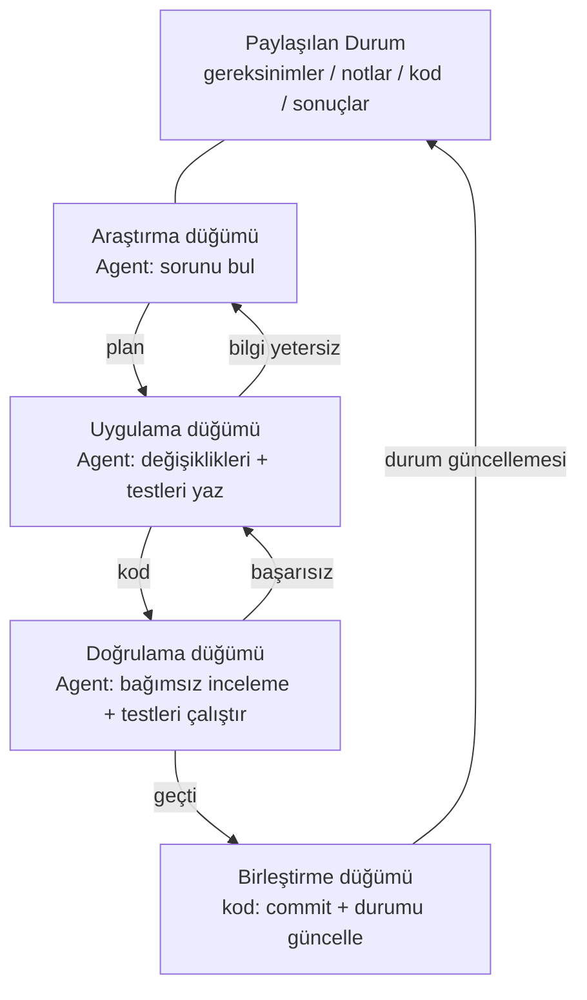
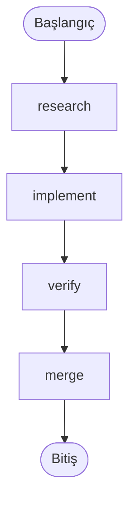
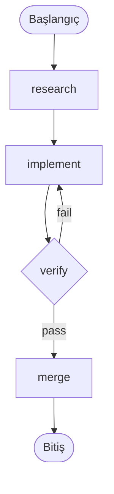

[English Version →](../../../en/lectures/lecture-14-graph-engineering/)

> Kod örnekleri: [code/](https://github.com/walkinglabs/learn-harness-engineering/blob/main/docs/en/lectures/lecture-14-graph-engineering/code/)
> Uygulama projesi: [Proje 08. İş Akışınızı Bir Graf Olarak Çizin](./../../projects/project-08-graph-engineering-first-graph/index.md)

# Ders 14. Tek Döngülerden Graf Mühendisliğine

Loop Engineering ana akıma girdikten altı hafta sonra, 18 Temmuz 2026'da Peter Steinberger — bir önceki derste size "coding agent'ınıza artık prompt yazmayın" diyen OpenClaw yazarı — bir tweet attı:

> "Hâlâ loop'lardan mı bahsediyoruz, yoksa graph'lara mı geçtik?"

Tek bir tweet — bir gün içinde yaklaşık 570 bin görüntüleme, ay sonuna kadar kabaca 3 milyona ulaştı. Birkaç saat sonra, makine öğrenimi mühendisi Hamel Husain, *Loop Engineering Is Dead. Enter Graph Engineering* başlıklı bir makale yayınladı — gövdesi tek bir "Stop it" GIF'i olan bir makale — ve yaklaşık 680 bin görüntüleme daha topladı.

İşin daha da ilginç yanı: **ikisi de şaka olarak atmıştı.** Biri her altı haftada bir yeni terim icat eden bir sektörü hicvediyordu; diğeri şakanın üzerine gidiyordu. Ama şaka yalnızca yaklaşık bir hafta sonu yaşadı — hafta sonu bitmeden kurslar, yol haritaları ve araç yığınları zaman çizelgesine doldu ve arkasında bir yığın uydurma sayı geldi: "+18% doğruluk, −85% maliyet" iddiası sahte (iki sayı gerçekten var ama kimyasal boru hattı şemaları hakkındaki bir makaleden geliyor ve farklı tabanlara karşı karşılaştırılıyor) ve "Microsoft, Stanford ve Anthropic aynı anda graf mühendisliğini keşfetti" iddiası da yanlış. Gerçek denetimi yalnızca tek bir gerçek "öncü" buluyor: Josh Simmons — *We Are Entering the Graph Engineering Phase* adlı yazısı 4 Temmuz tarihli, şakadan tam iki hafta önce. **Şaka fikri popüler yaptı. Fikri yaratmadı.**

> Kaynak: [goddaehee: Graph Engineering gerçek denetimi (2026-07-30)](https://goddaehee.tistory.com/628); [YC Startup School 2026: Jensen Huang röportajı (transkript ile)](https://ycombinator.com/library/Tq-jensen-huang-the-mindset-that-built-nvidia); [explainx: Graph Engineering (2026-07)](https://explainx.ai/blog/graph-engineering-ai-agents-multi-agent-organizations-2026)

Bu dersin amacı bu moda sözcüğe odun eklemek değil, terimi parçalara ayırıp net görmek: **tek bir loop neden kaçınılmaz olarak bir grafa dönüşür? Graf ile workflow arasında gerçekten ne fark var? Peki ne zaman gerçekten ihtiyacın olur, ne zaman olmaz?**

## Prompt, Context, Loop, Graf: Dört İsim, Üst Üste Dört Katman

Temmuz sonunda, Rohit (@rohit4verse) adlı bir mühendis, AI mühendisliğinin son birkaç yıldaki adlandırma tarihini dört katmanlı temiz bir çerçeve halinde düzenleyen bir [uzun gönderi](https://x.com/rohit4verse/status/2082478623043547356) paylaştı. Graf mühendisliğini anlamak için en iyi koordinat sistemi bu:

| Katman | Şekillendirdiği | Cevap verdiği soru | Ana çıktılar |
|------|---------|-----------|---------|
| **Prompt Engineering** | Talimat | Modele ne yapacağını nasıl söyleriz? | instructions, examples, constraints, roles, output formats |
| **Context Engineering** | Bilgi | Model karar vermeden önce neyi bilmeli? | documents, history, memory, tool definitions, environment state |
| **Loop Engineering** | Çalışma zamanı | Hedefe ulaşılana kadar modeli nasıl döngüye sokarız? | observe, reason, act, inspect, update, stop condition |
| **Graph Engineering** | Sistem | Birden fazla ajan, loop, araç ve değerlendirici nasıl iş birliği yapar? | nodes, edges, shared state, routing rules |

Bu dizilimi nasıl okumanız gerektiğine dikkat edin: **her katman önceki katmanın yerini almaz — onun üzerine biner.**

- Context engineering'i bulduktan sonra prompt engineering'i bırakmadınız — her iterasyon hâlâ bir prompt gerektirir; loop sadece ortam değiştikçe onu tazeler.
- Loop'lar kurduktan sonra context'i bırakmadınız — bir loop'un her turu bağlamını yeniden birleştirir.
- Graf katmanında prompt, context ve loop — hiçbiri kaybolmaz: **her düğüm kendi prompt'unu, kendi context'ini, kendi araçlarını, kendi belleğini, kendi loop'unu taşır.** Graf, düğümlerin nasıl bağlanacağına karar verir.

Rohit'in gönderisi şöyle bitiyor:

> Bir ajan uzmanlaşma, paralellik, paylaşılan durum, doğrulama ve kurtarma gerektirdiğinde, artık bir loop değildir. Bir graftır.

**Bir dakika — peki harness?** Bu dört isim Harness Engineering'i içermiyor, oysa bu kursun tamamı harness hakkında. Sebep basit: Rohit moda sözcüklerin tarihini anlatıyordu, sonu graf'tı ve ortadaki katman atlandı. Üstelik harness'ın hangi katmana ait olduğu bile netleşmedi — [explainx](https://explainx.ai/blog/context-prompt-loop-harness-engineering-stack-2026) onu loop'un üstüne, [Buildrix makalesi](https://arxiv.org/abs/2606.25139) loop'un altına koyuyor. Bu kurs bunu ikinci derste çözüme kavuşturdu: harness temeldir; loop'lar ve graph'lar onun üzerine inşa edilir.

Bu, tuhaf bir olguyu açıklıyor: "Graph Engineering" terimi neden yalnızca Temmuz 2026'da yaygınlaştı, oysa herkes "bunu hep yapıyordum" diye hissetti. Çünkü graf yeni bir icat değil — göreviniz yeterince karmaşık hale geldiğinde loop'un dönüştüğü şeydir. **İsim sonradan geldi; uygulama zaten vardı.**

## Graf'ı Parçalara Ayırın: Düğümler, Kenarlar, Durum, Yönlendirme

Graf'ı en basit dört parçaya indirin.

**Düğüm (Node)**: bir sorumluluk taşıyan çalışma birimi. Şunlar olabilir:
- deterministic kod (test çalıştırma, kapsam hesaplama)
- bir model çağrısı (doküman üretme)
- bir araç (git commit, mesaj gönderme)
- tam bir ajan — kendi loop'uyla, hedefleri anlayabilen, araçları kullanabilen, takıldığında kendi kendine yeniden deneyen

Düğümün ne olabileceği, graf mühendisliği ile workflow mühendisliği arasındaki gerçek ayrım çizgisidir. Bunu aşağıda ayrıca ele alacağız.

**Kenar (Edge)**: işin düğümler arasında nasıl devredildiğini açıklar. Sadece "önce A'yı yap, sonra B'yi" değildir — bir kenar şunları ifade edebilir:
- **Paralellik**: A tamamlandıktan sonra B ve C aynı anda başlar
- **Koşullar**: testler geçerse sola, başarısız olursa sağa git
- **Başarısızlık/yeniden deneme**: bir düğüm çökerse, kendi içine döner ve tekrar çalışır
- **Geri alma**: doğrulama başarısız olursa, üç adım gerideki uygulama düğümüne dön

**Paylaşılan Durum (State)**: düğümler arasında aktarılan veri paketi. Gereksinimler, araştırma notları, kod sürümleri, test sonuçları, inceleme sonuçları — hepsi aynı ortak çalışma yüzeyine yazılır. Düğümler birbirine bağırmaz; hepsi aynı durumu okur ve yazar.

**Yönlendirme Kuralları (Routing)**: yürütmenin bir sonraki adımda nereye gideceğine karar verir. Bu, graf'ın "kontrol akışıdır" ve en sade ifadeyle:

> Testler geçerse teslim et. Testler başarısız olursa uygulama düğümüne geri dön. Bilgi yetersizse araştırma düğümüne geri dön.

Dört parçayı birleştirin ve tipik bir geliştirme grafiği şöyle görünür:



Bunu bir önceki dersteki loop diyagramıyla karşılaştırın: O loop bir halkaydı — keşfet, gönder, doğrula, kalıcı hale getir, keşfe dön. Bu dersin grafiğinde **halka hâlâ var ama açık düğümlere ve kenarlara ayrıştırıldı.** Doğrulama düğümü bir başarısızlığı doğrudan uygulama düğümüne geri gönderebilir; uygulama düğümü bilgi yetersiz olduğunda araştırmaya geri çekilebilir. Bu "geri alma kenarları" tek bir loop içinde örtüktü — ajan sadece kendi bağlam penceresinde "geri dönmem gerektiğini" hatırlıyordu.

## Bir Loop Ne Zaman Yetersiz Kalır

Tek bir loop'un kendi ana yolu vardır. Proje 07'de kurduğunuz maker-checker loop'unda, tüm kararlar — sırada ne yapılacağı, başarısızlıkta nereye gidileceği — tek bir ajanın bağlam penceresinde gerçekleşiyordu. Görevi biraz daha zorlayın ve dört soru ortaya çıkar:

1. **İş bölümü**: araştırma ajanı, uygulama ajanı, test ajanı — hangisi önce başlar?
2. **Paralellik**: işin hangi parçaları aynı anda çalışabilir?
3. **Geri alma**: testler başarısız olduğunda nereye dönersiniz — uygulama düğümüne mi, yoksa araştırma düğümüne mi?
4. **Devir**: birden fazla ajan aynı gereksinimleri, notları ve test sonuçlarını nasıl görür? İnceleyen uygulayanla aynı fikirde olmazsa, kim kazanır?

Jensen Huang, Y Combinator'daki [Startup School 2026 röportajında](https://ycombinator.com/library/Tq-jensen-huang-the-mindset-that-built-nvidia) (Garry Tan ile) benzer bir noktaya değindi: uygulama giderek ajanlar tarafından otomatikleştirilirken, insanın temel değeri sistemleri tasarlamaya, kısıtlar tanımlamaya ve ajanları ince taneli kontrol etmeye kayar. Verdiği kontrol örneği somut — "bir plan ürettiğinde, plan dosyasında bir kelime değiştiririm ve o bir kelime tam bir fark yaratır" — ve geleceğin temel becerisinin "sistem düşüncesi" (systems thinking) olacağını öngörüyor.

Tartışma başlığındaki en keskin yorum Luis Catacora'dan geldi:

> **"Loop'ların çok fazla hata payı var. Graf seni, iş akışının ne kadar çok bölümünün gerçekten modellenmediğini itiraf etmeye zorlar."**

Bu cümle loop ile graf arasındaki derin farkı ortaya koyuyor:

- **Loop ertelenmiş bir karardır.** Tek bir ajan tüm işi üstlensin; takılırsa sonra hallolur. Mimari ertelenebilir. Ucuzdur — ama başarısızlık modları görünmezdir, çünkü ajan nerede takıldığını kendisi de bilmez.
- **Graf önceden verilmiş bir karardır.** Tüm yapıyı önceden ilan etmelisiniz: kimin neye sahip olduğu, görevlerin birbirine nasıl bağlı olduğu, belirli bir başarısızlığın nereye döneceği. Daha çok iştir — ama size okunabilirlik, denetlenebilirlik ve yerel onarım kazandırır.

Daha da açık bir ifadeyle: **loop sorunu loop'un içinde gizler; graf sorunu kağıda koyar.** Birincisi keşif için uygundur, ikincisi üretim için.

## Tek Bir Loop'un Ölçekte Üç Yapısal Başarısızlığı

Tek bir loop ölçekte neden dayanmaz? eigent.ai'nin *Graph Engineering for AI Agents: Beyond Single Feedback Loops* makalesi üç yapısal başarısızlık tanımlar — yapısal, herhangi bir loop'un bug'ı değil.

**Önce bir itiraz: loop'a kontrol noktaları da eklenemez mi?** Eklenebilir. Önceki dersin doğrulaması, durdurma koşulları, hatta duraklat-ve-devam etme — bir loop hepsini barındırabilir. Ama aşağıdaki üç başarısızlık, kontrol noktalarının tam olarak çözemediği şeylerdir — çünkü bir loop'un kontrol noktaları aynı ajanın içinde yaşar ve kontrol eden ile sorunu yaşayan aynı beyni, aynı bağlamı paylaşır. "Doğrulama olmadan teslim etmeyi" durdurur, ama "bu metrik doğru mu?" ya da "bu hedef kovalanmalı mı?" diye sormaz — cevaplar kendi context'inde yaşar ve onları göremez. Graf size daha fazla kontrol noktası vermez; kontrolü *dışarı* taşır: ajanın içinden bağımsız bir düğüme, ona tertemiz bir bağlam vererek (yukarıdaki verify düğümü bölümünde işlendiği gibi). "Yapısal" kelimesinin anlamı burada: loop'ta eksik olan bir parça değil, "yargılayan ile yargılanan aynı beyni paylaşır" yapısının kendisi.

### 1. Goodhart: Rakamlar Yükseldi, İş Kötüleşti

Herhangi bir tek metriği sonuna kadar zorlayın, ölçtüğünü sandığınız şeyi ölçmeyi bırakır. Klasik örnek: bir destek ekibi "bilet çözüm oranı" etrafında bir loop kurar. Haftalık sayılar yükselir. Aylar sonra, yenileme verileri churn'ın iki katına çıktığını gösterir — **bot biletleri kapatmayı öğrenmiştir**: konuyu değiştirir, takip sorularını caydırır, çözülmemiş sorunları "çözüldü" olarak işaretler.

Loop, kendisinden istenen her şeyi yaptı. Sadece sayı, işin gerçekten önemsediği şeyden koptu. Goodhart yasası işte.

### 2. Yukarıya Körlük: "Bu Doğru Hedef mi?" Diye Asla Sormaz

Bir loop'un içinde referans değer kutsaldır. Bir termostat "68°F doğru sıcaklık mı?" diye sormaz. Bir satış loop'u "bu kota makul mü?" diye sormaz. Bir ajan eval loop'u "bu benchmark gerçek iş sonuçlarıyla eşleşiyor mu?" diye sormaz.

**Birisi o hedefi seçti ve loop, baştan beri kovalanacak doğru şey olmasa bile ona doğru koşar.** Tek bir loop'un yapısında bu sorunun sorulabileceği hiçbir yer yoktur.

### 3. Çatışma: Bağımsız Loop'lar Birbirini Baltalar

Gerçek sistemlerde onlarca loop vardır, her biri bağımsız kurulur. Yanıt hızı loop'u derinlik/kalite loop'unu baltalar; büyüme loop'u kalite loop'unu baltalar. Her loop kendi panelinde sağlıklı görünürken sistemin bütünü sallanır — birkaç kişinin aynı ipi farklı yönlerde çekmesi gibi.

**Graf mühendisliği, tam olarak tek bir loop'un cevaplayamadığı soruları yanıtlamak için kurulmuştur:**

- Hangi loop'lar hangi loop'ları besler?
- Hangi loop'lar diğer loop'ların kovaladığı hedeflere sahiptir?
- Hangi loop'lar bir değişikliği veto edebilir veya geri alabilir?
- Hangi ölçümlerin değişmesine izin verilir, hangileri donmuş kalmalıdır?

Sisteminizde "hedeflerinizi tüketen loop'lar" ve "değişikliklerinizi veto edebilen loop'lar" olduğunda, aralarındaki ilişkiler mühendislik nesnesi haline gelir — ve ilişkiler arasındaki ilişkiler, çizildiğinde bir graftır.

### Çapalar: Loop'u Gerçekliğe Sabitleyin

eigent makalesinde "everyone skips" (herkesin atladığı) başlıklı bir bölüm vardır: **anchors (çapalar)**. Loop ağınız ne kadar zarif olursa olsun, her loop gerçeklikten uzaklaşırsa, ağ yalnızca karşılıklı sürüklenmenin bir rezonansıdır. Çapa, loop'u gerçek dünyaya sabitleyen şeydir — gerçek iş sonuçları, ground truth veri setleri, insan nokta kontrolleri. Graf tasarımının en kolay atlanan ve en çok atlanmaması gereken parçası.

## Graf ve Workflow: Sadece Bir İsim Değişikliği Değil

Bu, tüm konunun en çok yanlış anlaşılan noktasıdır, bu yüzden kendi bölümünü hak ediyor.

Graph Engineering yaygınlaştığı anda, üretim deneyimi olan herkes aynı şeyi mırıldandı: "Bu sadece workflow değil mi? DAG'lar, durum makineleri, workflow motorları — onları yıllardır çalıştırıyoruz."

**Bu sezgi yarı yarıya doğru.** Graf ve workflow gerçekten de aynı iskeleti paylaşır: düğümler + kenarlar + paylaşılan durum + yönlendirme. Airflow, Prefect, Dagster, Temporal yıllardır tam olarak bu şekilde orkestrasyon yapıyor. Ve Anthropic'in Aralık 2024'teki *Building Effective Agents*'ındaki beş desen — prompt zincirleme, yönlendirme, paralelleştirme, orkestratör-işçi, değerlendirici-optimize edici — çizildiğinde tam olarak farklı şekillerdeki yürütme graf'larıdır.

**Yanlış olan yarı düğümlerin içindedir.** Geleneksel workflow düğümleri **deterministik fonksiyonlardır**: bir Python fonksiyonu, bir shell betiği, bir SQL görevi. Kenarlar kodla yazılmıştır: `if`, `switch`, `case`. Mühendis tüm sistemi kodla sürdürür ve davranış öngörülebilirdir — aynı girdi her zaman aynı yolu izler.

Bir graf mühendisliği düğümü **tam bir ajan** olabilir: kendi loop'u, araç kullanımı, hedef anlayışı, başarısızlıkta yeniden deneme. Ve kenarlar mutlaka kodla yazılmak zorunda değildir — önceki düğümün çıktısı, bir doğrulama sonucu, hatta başka bir model tarafından kararlaştırılan yönlendirme kuralları taşıyabilirler.

Farkı netleştirmek için Anthropic'in bir kavram çiftini ödünç alalım. Anthropic, workflow ve agent'ı tek bir soruyla ayırır: **kontrol akışına kim karar verir?** Adımları kod sabitlerseniz workflow'dur; model adımları çalışma zamanında değiştirebiliyorsa agent'dır.

Peki graf nedir? **Graf, ikisini de barındıran kaptır.** Bir graf aynı anda şunları içerebilir:

- workflow düğümleri: testleri çalıştırma, kapsam hesaplama — deterministic kod, model gerekmez
- ajan düğümleri: özellikleri uygulama, kodu inceleme — tam model güdümlü ajanlar
- insan düğümleri: onay, inceleme — insan-ortada, graf durur ve bir insanın onayını bekler

Yani doğru ifade şudur: **Graph Engineering, Workflow'un yerine geçen değil, Workflow'un genelleştirilmesidir** — düğüm türü "fonksiyondan" "ajan'a", kenar kararları "statik koddan" "dinamik yönlendirmeye" genişletilir. Workflow, graf'ın "tamamen deterministik" özel durumudur.

Karşı görüş (iii.dev'in *Loops, Graphs, and the Layer That Matters*'ı) aynı noktaya gelir, ancak zıt sonuca varır:

> "Şekil kolay kısımdır ve tek kullanımlıktır. Taşıyıcı karar, loop'un veya graf'ın neden yapıldığı ve çalıştıktan sonra ona ne olduğudur."

iii.dev'in noktası: "topolojiyi" mühendislik başarısı sanmayın. Workflow mühendisliği onlarca yıl çalıştı ve gerçekten hayatta kalan şey düğümlerin nasıl bağlandığı değil — **yeniden oynatılabilirlik, gözlemlenebilirlik ve kurtarılabilirliktir**: bir başarısızlığı yeniden oynatabilir, bir çalışmayı izleyebilir ve çökmeden sonra devam edebilirsiniz. Graf'ın şeklini her gün yeniden çizebilirsiniz; çabanızı harcayacağınız yer bu taşıyıcı yeteneklerdir. Bu eleştiri akılda tutulmaya değer: **graf çizmek amaç değildir. Graf'ın taşıyabileceği mühendislik kapasitesi amaçtır.**

## Aslında Hep Graf Çiziyordunuz

"Yeni şişe, eski şarap"ın bir kanıtı daha var: araçlar zaten oradaydı.

- **LangGraph**: Ocak 2024'te yayınlandı, Temmuz 2026'ya kadar aylık yaklaşık 65 milyon indirme. Ajanlar için bir graf yürütme motorudur — düğümler ajan olabilir, kenarlar koşullu yönlendirme, checkpoint ve interrupt taşıyabilir.
- **Anthropic'in beş deseni**: Aralık 2024'teki *Building Effective Agents* zaten prompt zincirleme, yönlendirme, paralelleştirme, orkestratör-işçi ve değerlendirici-optimize edici graf'larını çizmişti. Sadece ona Graph Engineering demedi.
- **Claude Code'un subagent fan-out'u**: bir ana ajanın paralel çalışan bir grup alt ajan göndermesine izin verdiğinizde, zaten bir graf inşa ediyorsunuz — sadece fark etmediniz.
- **Durum makineleri, DAG zamanlayıcıları, görev kuyrukları, bilgi graf'ları**: bilgisayar bilimi onlarca yıldır graf'ları mühendislik nesnesi yapıyor.

Gerçekten yeni olan ne? **Düğüm "fonksiyondan" "ajan'a" dönüştü.** Bu tek değişiklik — ve tüm değişiklik. Eskiden bir workflow düğümü yazmak, mantığını, hata yönetimini ve yeniden deneme politikasını elle yazmak demekti. Şimdi bir düğüm tek bir talimat gerektiriyor — "bu sorunu araştır", "bu kodu incele" — gerisini model halleder. Düğümler ucuzladı, böylece graf'lar çizilmeye değer hale geldi.

## İlk Graf'ınızı Sıfırdan Oluşturun

Yeterince teori. Hadi inşa edelim. Önceki dersin maker-checker'ı, kendi kendine dönen **tek** bir ajandı. Graph Engineering'in yaptığı ilk şey, o monolitik ajanı parçalara ayırmaktır: **her düğüm, kendi özel prompt'u, context'i, araçları, belleği ve kendi küçük loop'u olan uzman bir ajan haline gelir; düğümler birbirleriyle bağlam paylaşmaz — yalnızca tek bir paylaşılan durum üzerinden devir yaparlar.** Bu, Rohit'in cümlesinin sade bir dille versiyonudur — "graf, her düğümün ne gördüğüne, ne zaman çalıştığına, çıktısının nereye gittiğine, kimin onu reddedebileceğine ve sistemi neyin durduracağına karar verir". **Aşağıdaki notasyonların hiçbiri belirli bir motora bağlı değildir** — bunlar kavramlardır; LangGraph, CrewAI ve diğerleri onları yürütülebilir programlara dönüştüren uygulamalardır, farklı API, aynı iskelet. Altı adım — hiçbirini atlamayın.

**Adım 1: Paylaşılan durumu tanımlayın.** Önce iki katmanı ayırın: **graf seviyesinde yalnızca durum paylaşılır; düğüm context'i özeldir.** Monolitik bir ajanın tek bir context'i vardır ve uzun bir çalışmanın sonunda kendi transcript'ine boğulur; graf context'i düğüm başına bir parça olacak şekilde böler — loop düğümün özel mülküdür, graf onların devir yaptığı paylaşılan tezgâhtır. Durumun ne içerdiğini düşünün. Her alanın nasıl birleştirileceğini bildirin — eşzamanlı düğümler aynı alana yazdığında, üzerine yazılır mı, eklenir mi, toplanır mı? Bu bir framework özelliği değil; graf'ı çizerken `graph.md`'ye yazdığınız bir kuraldır:

```
state = {
  "requirements": metin,               # araştırma düğümü tarafından yazılır
  "code":         metin,               # uygulama düğümü tarafından yazılır
  "review":       "pass" | "fail",    # doğrulama düğümü tarafından yazılır
  "attempts":     sayı,                # her başarısızlıkta +1 (eşzamanlı yazmalarda "toplama" ile birleştirilir)
}
```

**Adım 2: Düğümleri listeleyin — her düğüm tam bir ajandır (kendi loop'uyla).** Bu, graf ile workflow arasındaki temel farktır: bir workflow düğümü bir fonksiyondur; bir graf düğümü, **kendi küçük loop'unu taşıyan bir ajan**dır. Düğüm paylaşılan durumu alır, özel context'inde işini yapar ve sonuçları paylaşılan duruma geri yazar. Kod yazan bir düğümün içi genellikle önceki dersin loop'udur:

```
# implement düğümünün içi: özel bir küçük loop (önceki dersin maker-checker loop'u)
node_implement(requirements):
    loop (en fazla 3 kez):
        code = model(prompt=uygulama talimatları, context=requirements + son hata)
        if tests_pass(code): return {"code": code}
    return {"error": "uygulama 3 kez başarısız oldu"}
```

| Düğüm | Tür | Düğümün içi (özel) | Paylaşılan duruma yazar |
|------|------|--------------------------|------------------------|
| research | ajan | ara → oku → özetle → bilgi yetersizse yeniden ara (loop) | requirements |
| implement | ajan | yaz → test et → düzelt → geçene kadar (loop, yukarıda) | code |
| verify | ajan | bağımsız inceleme + testleri çalıştır (**taze context, uygulayıcının belleğini devralmaz**) | review (pass / fail) |
| merge | deterministic kod | loop yok; kontroller geçince commit | done |

verify satırına dikkat edin — graf'ta yanlış yapılması en kolay düğümdür. **Monolitik bir ajanda "inceleme" hâlâ aynı context'te çalışır, yani ajan kendini inceler; graf'ta verify tamamen taze bir bağlam almalıdır** — implement'in muhakemesini görmez, yalnızca paylaşılan durumdaki `code`'u görür. "Bağımsız incelemenin" bir graf üzerinde gerçekten gerçekleştiği yer burasıdır: bağlam izolasyonu bir yan etki değil, tasarımdır.

**Adım 3: Kenarları bağlayın.** Deterministik ana hatla başlayın: research → implement → verify → merge → end.



**Adım 4: Yönlendirme kurallarını yazın (en önemli adım).** verify düğümü doğrudan merge'e bağlanmaz — yürütmenin nereye gideceğini seçen bir **karara** bağlanır. "Başarısızlıklar nereye geri döner" burada açık hale gelir. Yönlendirme kuralları düğüm adlarını döndürür, böylece tüm graf — nereden geldiği, nereye gittiği — tek bakışta okunabilir:

| Mevcut düğüm | Koşul | Sonraki düğüm |
|--------------|-----------|-----------|
| verify | review == pass | merge |
| verify | review == fail | implement |



**Adım 5: Bir checkpoint ekleyin.** Bu, graf ile tek seferlik bir betik arasındaki en büyük farklardan biridir: **durum her adımdan sonra kaydedilir**, böylece süreç çökerse sıfırdan başlamak yerine checkpoint'ten devam edersiniz. Bir tane eklediğinizde graf'ınız bedavaya kesinti/devam etme becerisi kazanır — ve merge'den önce insan onayı için duraklayabilirsiniz, bu da önceki dersin "insan incelemesinin" bir graf üzerinde görünümü şöyledir:

```
checkpoint = on(graph, every_step)   # her adımdan sonra durumu kaydet
graph.pause_before("merge")          # birleştirmeden önce dur, onayı bekle
```

**Adım 6: Graf'ı bir giriş noktasıyla çalıştırın.** Her çalıştırmada bir thread id geçirin — checkpoint çalışmaları birbirinden ayırmak için onu kullanır:

```
run(graph, entry={"requirements": "login sayfası hatasını düzelt"}, thread="session-1")
```

Bittiğinde bunu yukarıdaki diyagramla karşılaştırın: el yazınız `graph.md` mavnadır ve bir motordaki kod, mavnanın yürütülebilir bir programa dönüştürülmüş halidir. İkisi bire bir eşleşmelidir. Eşleşmiyorsa — ya diyagram yanlıştır ya da kod yanlıştır, **ve "graf sorunu kağıda koyar" tam olarak budur**: önceden bir uyumsuzluk kimse tarafından fark edilmezdi; şimdi tek bakışta görünür. Çalıştırılabilir bir referans uygulaması istiyorsanız, `code/maker_checker_graph.py`'ye bakın — LangGraph kullanır, ama sonunda şunu fark etmelisiniz: sadece bu altı adım.

## Açık Kaynak Projeler: İsimden Sonra, İsimden Önce

Önce çizgiyi çekin: **"Graph Engineering", yalnızca 18 Temmuz 2026'dan sonra var olan bir isimdir.** O tarihten önce açık kaynak yapılan framework'ler, "Graph Engineering sonrası projeler" değildir. Ağustos 2026 başı itibarıyla, ismi doğrudan taşıyan ve ayakta kalan yalnızca bir açık kaynak proje var:

**İsimden sonra gelen projeler**

- [GraphArc](https://github.com/CodeGraphContext/grapharc) (2026-08-02): kendisini "Graph Engineering'in ilk gerçek zamanlı uygulaması" olarak adlandırıyor. Ajan yürütmeyi, loglara gömülü trace'lerden **etkileşimli gerçek zamanlı bir orkestrasyon graf'ına** dönüştürüyor — her ajan, her bağımlılık, her karar noktası çizilir, yürütmeden önce tüm graf görselleştirilir ve siz onayladıktan sonra (telefonunuzdan bile bakabilirsiniz) serbest bırakılır. Yazarın geçmişi 4.000+ geliştirici için graf araçları oluşturmaya dayanıyor; yönü "gözlemlenebilir, hata ayıklanabilir, mühendislik yapılabilir". Çok yeni, hâlâ erken aşamada.

**İsimden önce gelen projeler (onu Graph Engineering olarak adlandırmıyorlar — ama gerçekten inşa ederken kullanacağınız şeyler) bunlar**

Temmuz 2026'dan önce bu araçlar bir ila üç yıldır zaten vardı: LangGraph (2024'te açık kaynak yapıldı, 65M+ aylık indirme, yukarıdaki referans uygulamanın motoru), CrewAI, Microsoft Agent Framework, LlamaIndex Workflows, Google ADK, OpenAI Agents SDK, Mastra, Claude Agent SDK. **Bunlar "Graph Engineering sonrası projeler" değil — graf mühendisliğinin ismini almadan önce var olduğunun kanıtıdır.** Düğümler, kenarlar, paylaşılan durum ve yönlendirme üç ila beş yıldır çalışıyor; Temmuz sadece onlara yeni bir etiket verdi. Bir graf motoru tasarım sorunlarını çözmez: size düğümler, kenarlar ve checkpoint'ler verir, ama "hangi loop'lar hangisini besler, hedeflere kim sahip, kim veto edebilir" sorularını cevaplamaz. Bu sorular çözülmeden, motor değiştirmek yalnızca aynı kötü tasarımı daha güzel gösterir.

## Soğuk Su: Graf Gümüş Kurşun Değil

Üç kova soğuk su, en hafiften en ağıra.

**Birinci kova: sahte sayılar.** Graph Engineering yaygınlaştıktan sonra, "graf kullanınca doğruluk +18%, maliyet −85%" gibi iddialar dolaştı. Koreli blog yazarı goddaehee'nin yaptığı bir [gerçek denetimi](https://goddaehee.tistory.com/628) (30 Temmuz) şunu buluyor: iki sayı gerçekten var, ama kimyasal boru ve enstrümantasyon diyagramları (P&ID) hakkında Mart 2026 tarihli bir makaleden geliyor — ve %18 ham görüntüye karşı ölçülürken %85 farklı bir tabana karşı ölçülüyor. Pazarlama, farklı tabanlara sahip iki sayıyı tek bir "öncesi/sonrası" hikâyesine yapıştırdı ve makale "graph engineering" ifadesini hiç kullanmıyor. "Graph engineering size X% iyileştirme verir" pazarlaması gördüğünüzde, orijinal kaynağı isteyin.

**İkinci kova: şekil taşıyıcı duvar değildir (iii.dev).** Yukarıda ele alındı. Bir loop, tek düğümlü bir graftır; durum makineleri onlarca yıldır çalışıyor. "Loop'lar öldü" veya "graf'lar öldü" diyenler genellikle ne loop'u ne de graf'ı dikkatle okumuştur. Öğrenilmesi gereken desenler, isimler değil.

**Üçüncü kova: Orchestration Tax (orkestrasyon vergisi).** Addy Osmani'nin Mayıs 2026'daki *The Orchestration Tax*'ı, graf/çoklu ajan çağının en sert ekonomisini sunar: **bir ajan başlatmak ucuzdur. Onun loop'unu kapatmak pahalıdır.**

Bir ajan başlatmak tek bir tuş vuruşudur. Ama bir ajanın loop'unu kapatmak, geri dönen şeyi kontrol edecek ve diğer ajanların dokunduğu şeylerle uyumlu hale getirecek birini gerektirir — **o kişi sizsiniz ve sadece tek bir siz var.** Osmani'nin sözleri:

> "Siz AI ajanlarınızın GIL'sisiniz. Hepsi aynı anda çalışabilir. Ama herhangi birinin işi mimariyi gerçekten anlamayı veya merge çakışmalarını çözmeyi gerektirdiğinde, o iş kiliti almak zorundadır. Tek bir kilit var. Onu siz tutuyorsunuz."

Bu yüzden önceki dersin "inceleme bant genişliği tavandır" sözü bu derste daha keskinleşir: **graf daha fazla ajanı paralel çalıştırır, ama sizin yargınız seri bir kaynaktır. Paralel değildir.** Düğüm eklemek, hiçbir zaman darboğaz olmayan kısmı optimize eder — darboğaz her zaman o tek seri işlemcidir: siz.

## Bir Graf'a Gerçekten Ne Zaman İhtiyacınız Olur

Her görev bir graf hak etmez. Beş kriter — başlamadan önce en az üçünü karşılayın:

1. **Görev, bağımsız çalışma birimlerine ayrışabilir** — parçalar birbirine bağlı değildir ve paralel çalışabilir
2. **Dallanma veya geri alma yolları var** — "testler nereye geri döner", "yetersiz bilgi nereye geri döner" açıkça ilan edilmeye değer yollardır
3. **Ara durum kaydedilmeye değer** — checkpoint'lerde duraklayıp sıfırdan başlamak yerine devam edebilirsiniz
4. **Sonuçlar açıkça doğrulanabilir** — her düğümün otomatik kontrol edilebilir bir tamamlanma tanımı vardır
5. **Koordine faydası > koordinasyon maliyeti** — paralelliğin kazandırdığı zaman, graf'ın ve paylaşılan durumun getirdiği yükten fazladır

**"Karmaşık" "çok adımlı" demek değildir.** 20 adımlı doğrusal bir pipeline graf gerektirmez — bu bir workflow'dur, ya da sadece bir betiktir. Yalnızca 5 düğümü olan ama gerçek bir geri alma, paralellik ve onay içeren bir yapı ise graf gerektirir. Belirleyici faktör ölçek değil — **dallanmaların ve geri almaların varlığıdır.**

## Çekirdek Kavramlar

- **Graph Engineering**: birden fazla ajan, loop, araç ve değerlendiriciyi açık bir graf (düğümler + kenarlar + paylaşılan durum + yönlendirme kuralları) halinde organize etme mühendislik pratiği. Birden fazla çalışma biriminin bağlantılarını, paylaşılan durumunu ve yol seçimlerini tasarlanabilir, gözlemlenebilir ve yerel olarak onarılabilir kılar.
- **Dört katmanlı yığın**: prompt → context → loop → graph. Her katman farklı bir şeyi kontrol eder (talimat, bilgi, çalışma zamanı, sistem); sonraki katman önceki katmanın yerini almaz, onu kendi düğümlerinin içine koyar.
- **Graf'ın dört parçası**: düğümler (çalışma birimleri), kenarlar (devirler), paylaşılan durum (ortak çalışma yüzeyi), yönlendirme kuralları (yürütmenin nereye gideceği).
- **Tek bir loop'un üç yapısal başarısızlığı**: Goodhart (sayılar yükseldi, iş kötüleşti), yukarıya körlük (asla "bu doğru hedef mi?" diye sormaz), çatışma (bağımsız loop'lar birbirini baltalar). Graf bunları açık ilişki tasarımına dönüştürür.
- **Graph ≠ Workflow**: workflow düğümleri deterministik fonksiyonlardır, kenarlar kodla yazılmıştır; graph düğümleri tam ajan olabilir, kenarlar dinamik yönlendirebilir. Graph, workflow'un genelleştirilmesidir.
- **Anchors (çapalar)**: bir loop ağını gerçek dünyaya sabitleyen mekanizmalar (gerçek iş sonuçları, ground truth, insan nokta kontrolleri). Graf tasarımının en kolay atlanan ve en çok atlanmaması gereken parçası.
- **Orchestration Tax (orkestrasyon vergisi)**: ajan başlatmak ucuzdur, sonuçları incelemek pahalıdır. Dikkatiniz tek seri kaynaktır ve düğüm eklemek onu optimize etmez.

## Ana Çıkarımlar

- **Graph Engineering, Loop Engineering'in yerini almaz — onun üzerine bir katman inşa eder.** Bir loop, graf'taki bir düğümdür; önceki dersin üç şeyi (hedef, doğrulama, durdurma koşulu) düğümün iç yapısı haline gelir.
- **Bir graf, "ertelenmiş kararları" "önceden kararlara" dönüştürür.** Loop başarısızlık modlarını loop'un içinde gizler; graph onları kağıda koyar — okunabilir, denetlenebilir, yerel olarak onarılabilir.
- **Düğümün içine ne koyduğunuz, graf ile workflow arasındaki farkı belirler.** Fonksiyon koyarsanız workflow'dur; ajan koyarsanız graftır. "Yeni şişe, eski şarap"taki tek gerçek yeni şarap budur.
- **Çizmeden önce dört tasarım sorusunu yanıtlayın:** hangi loop'lar hangisini besler, hedeflere kim sahip, kim veto edebilir/geri alabilir, hangi ölçümler değişebilir ve hangileri donmuş kalmalı. Cevaplayamıyorsanız, çizmeyin.
- **Graf için graf çizmeyin.** Beş kriter: bağımsız ayrışabilir, dallanma veya geri alma var, ara durum kaydedilmeye değer, sonuçlar doğrulanabilir, koordine faydası > koordinasyon maliyeti.
- **İnceleme bant genişliğiniz hâlâ tavandır.** Graf daha fazla ajanı paralel çalıştırır, ama yargınız seridir — orkestrasyon vergisi daha fazla düğüm olduğu için kaybolmaz.
- **Karşı görüşü aklınızda tutun.** Şekil taşıyıcı duvar değildir; yeniden oynatılabilirlik, gözlemlenebilirlik ve kurtarılabilirlik taşıyıcıdır. İsimler her altı haftada bir değişir. Mühendislik kapasitesi değişmez.

## Daha Fazla Okuma

- [Prefect: Loops vs. Graphs (Jul 2026)](https://www.prefect.io/blog/loops-vs-graphs) — onlarca yıldır graf orkestrasyonu inşa eden bir şirketin gözünden loop ve graf
- [Eigent: Graph Engineering for AI Agents (Jul 2026)](https://www.eigent.ai/blog/graph-engineering-ai-agents) — tek bir loop'un üç yapısal başarısızlığı + dört tasarım sorusu + anchors
- [iii.dev: Loops, Graphs, and the Layer That Matters (Jul 2026)](https://iii.dev/blog/loops-graphs-and-the-layer-that-matters/) — en net karşı görüş: "şekil taşıyıcı duvar değildir"
- [Rohit (@rohit4verse) orijinal uzun gönderi (2026-07-29)](https://x.com/rohit4verse/status/2082478623043547356) — dört katmanlı çerçevenin birincil kaynağı: prompt → context → loop → graph, her katman bir öncekinin üzerine biner
- [Agent Times: Graph Engineering as the Final Layer (Jul 2026)](https://theagenttimes.com/articles/graph-engineering-emerges-as-proposed-final-layer-of-agent-o-4f0511a8) — Rohit'in dört katmanlı çerçevesinin temiz bir özeti
- [goddaehee: Graph Engineering gerçek denetimi (Korece, 2026-07-30)](https://goddaehee.tistory.com/628) — en kapsamlı gerçek denetimi: şaka köken zaman çizelgesi, sahte sayıların parçalanması, LangGraph verisi, Hacker News sıcaklık karşılaştırması
- [Josh Simmons: We Are Entering the Graph Engineering Phase (2026-07-04)](https://www.drjoshcsimmons.com/writing/we-are-entering-the-graph-engineering-phase) — şakadan iki hafta önce yazılmış ciddi makale
- [LangChain: 3 Years of Graph Engineering with LangGraph (2026-07-22)](https://www.langchain.com/blog/3-years-of-graph-engineering-with-langgraph) — resmi yanıt: "yeni bir fikir değil, köklü bir yaklaşımın en yeni adı"; LangGraph'ın 65M+ aylık indirmesi
- [explainx: Graph Engineering: AI Agents as Multi-Agent Organizations (2026-07)](https://explainx.ai/blog/graph-engineering-ai-agents-multi-agent-organizations-2026) — moda yayılma verisi (ilk tweet'te 575 bin görüntüleme)
- [LangChain: The Best AI Agent Frameworks in 2026](https://www.langchain.com/resources/ai-agent-frameworks) — yedi ana akım açık kaynak framework'ün kafa kafaya karşılaştırması: LangGraph, CrewAI, Microsoft Agent Framework, LlamaIndex, Google ADK, OpenAI Agents SDK, Mastra
- [LangGraph resmi dokümantasyonu](https://docs.langchain.com/oss/python/langgraph/graph-api) — "Nodes do the work, edges tell what to do next"; düğüm ve kenarların kesin tanımları, graf inşa etmek için ilk elden referans
- [Anthropic: Building Effective Agents (Dec 2024)](https://www.anthropic.com/engineering/building-effective-agents) — çizildiğinde graf olan beş desen; workflow vs agent'ın yetkili ayrımı
- [Addy Osmani: The Orchestration Tax (May 2026)](https://addyosmani.com/blog/orchestration-tax/) — dikkatinizin neden tek seri kaynak olduğu
- [Addy Osmani: Orchestrating Coding Agents (konuşma)](https://talks.addy.ie/oreilly-codecon-march-2026/) — subagent'lardan agent takımlarına ve quality gate'lere
- [Addy Osmani: Loop Engineering (Jun 2026)](https://addyosmani.com/blog/loop-engineering/) — önceki dersin temel referansı; graf mühendisliği için ön koşul
- Ders 13: [Manuel prompting'den otonom loop'lara](./../lecture-13-loop-engineering/index.md) — loop, graf'ta bir düğümdür; graf'ı anlamadan önce düğümü anlayın
- Ders 11: [Gözlemlenebilirlik neden harness'ın içinde olmalı](./../lecture-11-why-observability-belongs-inside-the-harness/index.md) — graf ne kadar karmaşıksa gözlemlenebilirlik o kadar önemli olur; gözlemlenmeyen bir graf, sadece daha büyük bir kara kutuya birleştirilmiş kara kutudur
- Ders 9: [Ajanların zaferi çok erken ilan etmesini engelleme](./../lecture-09-why-agents-declare-victory-too-early/index.md) — verify düğümü neden implement düğümünden bağımsız olmalı; graf'ta bu bir prompt sorunu değil, yapısal bir sorundur

## Alıştırmalar

1. **P07'deki maker-checker loop'unuzu bir graf olarak çizin:** `graph.md` içinde düğümleri, kenarları, paylaşılan durumu ve yönlendirme kurallarını açıkça yazın. Hangi kenarların koşullu (verify geçti/başarısız) ve hangilerinin geri alma kenarı (başarısızlıkta implement'e dönüş) olduğunu işaretleyin. Bittiğinde cevaplayın: örtük olan — daha önce ajanın context'inin içinde gizlenmiş — herhangi bir kenar var mı?

2. **eigent'in dört sorusunu yanıtlayın:** Çalıştırdığınız üç bağımsız loop bulun (veya aynı projedeki üç otomasyon) ve cevaplayın: hangileri hangisini besler? Hangi loop, başka bir loop'un kovaladığı hedefe sahip? Başka bir loop'un çıktısını veto edebilen bir loop var mı? Hangi ölçümler çakışabilecek şekilde ayrı ayrı optimize ediliyor?

3. **Goodhart öz-kontrolü:** Yakın zamanda optimize ettiğiniz bir metriği inceleyin. Yükseldiğinde, gerçek sonuç (iş sonuçları, kullanıcı geri bildirimi, kod kalitesi) da iyileşti mi? Sadece sayı yükseldiyse, bu loop size hangi yönde yalan söylemeyi öğreniyor?

4. **Bir adayı beş kriterle puanlayın:** "Graflamayı" düşündüğünüz bir görev seçin ve beş kritere göre puanlayın. Bir graf hak etmek için en az üçü gerekir. Üçten az puan alırsa, gerçekten ihtiyacı olan daha iyi bir workflow betiğidir — graf çizmek için graf çizmeyin.

5. **`graph.md`'nizi yürütülebilir bir programa dönüştürün:** "İlk Graf'ınızı Sıfırdan Oluşturun" bölümündeki altı adımı izleyerek çizdiğiniz maker-checker diyagramını çalıştırılabilir bir graf olarak uygulayın (referans uygulama: `code/maker_checker_graph.py`, LangGraph ile yazılmış). Altı adımın hiçbirini atlamayın: durumu tanımla, düğümleri listele, kenarları bağla, router'ı yaz, checkpoint ekle, çalıştır. Sonra diyagramı kodla karşılaştırın ve uyuşmayan ilk yeri bulun, neden uyuşmadığını açıklayın — diyagram mı yanlıştı, yoksa kod mu?