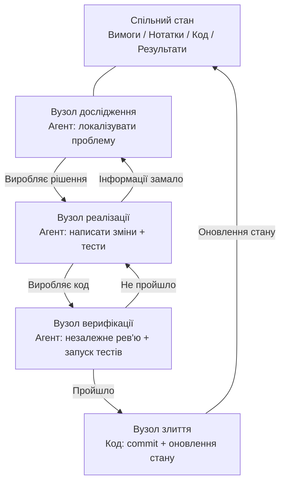
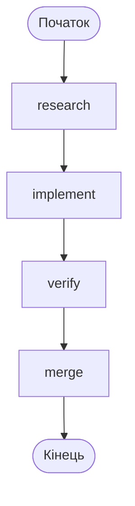
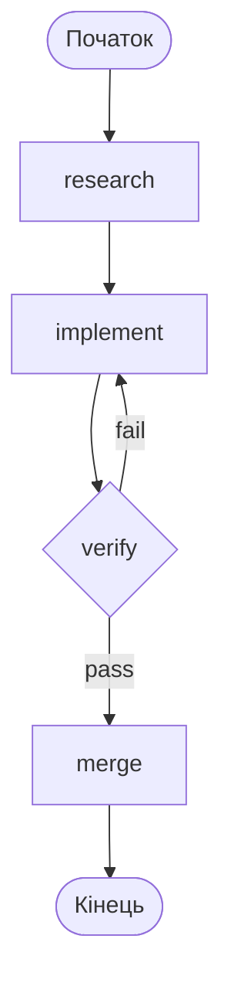

[English Version →](../../../en/lectures/lecture-14-graph-engineering/)

> Приклади коду: [code/](https://github.com/walkinglabs/learn-harness-engineering/blob/main/docs/en/lectures/lecture-14-graph-engineering/code/)
> Практичний проєкт: [Проєкт 08. Намалюйте ваш робочий процес як граф](./../../projects/project-08-graph-engineering-first-graph/index.md)

# Лекція 14. Від одиночних циклів до графової інженерії

Минуло шість тижнів після того, як ми закінчили розмову про Loop Engineering, і 18 липня 2026 року Пітер Штайнбергер — той самий автор OpenClaw, який у попередній лекції казав «не пишіть більше промптів для агентів кодування» — написав твіт:

> «Ми все ще говоримо про Loop, чи вже перейшли до Graph?»

Один твіт — за день він набрав приблизно 570 тисяч переглядів, а до кінця місяця виріс приблизно до 3 мільйонів. За кілька годин інженер з машинного навчання Хамел Хусейн опублікував статтю під назвою «Loop Engineering Is Dead. Enter Graph Engineering» — у тілі якої була лише одна гіфка зі словами «Stop it» — і теж набрав приблизно 680 тисяч переглядів.

Ще цікавіше: **обидва написали це як жарт.** Один висміював те, що індустрія вигадує новий термін кожні шість тижнів, а другий підхопив цей мем і відповів у тон. Але жарт прожив лише приблизно один вихідний — курси, дорожні карти та стеки інструментів заполонили стрічку до кінця вікенду, а з ними й купа вигаданих цифр: «точність +18%, вартість −85%» — це фейкові дані (18% і 85% справді існують, але з наукової статті про креслення хімічних трубопроводів, і зі зовсім іншим базовим порівнянням), а «Microsoft, Stanford і Anthropic одночасно відкрили Graph Engineering» — теж фейк. Єдиним «першопрохідцем», якого підтвердила фактчек, був Джош Сіммонс: його стаття «We Are Entering the Graph Engineering Phase» написана 4 липня, за два тижні до цього жарту — **жарт зробив цю тему популярною, але не він її створив.**

> Джерела: [goddaehee: фактчек Graph Engineering (2026-07-30)](https://goddaehee.tistory.com/628); [YC Startup School 2026: інтерв'ю з Дженсеном Хуаном (з транскриптом)](https://ycombinator.com/library/Tq-jensen-huang-the-mindset-that-built-nvidia); [explainx: Graph Engineering (2026-07)](https://explainx.ai/blog/graph-engineering-ai-agents-multi-agent-organizations-2026)

Ця лекція не для того, щоб підлити олії у вогонь цього модного слова, а для того, щоб розібрати його на частини та побачити наскрізь: **чому після одиночного циклу неминуче виростає граф? У чому саме різниця між графом і workflow? Коли він тобі справді потрібен, а коли — ні?**

## prompt, context, loop, graph: чотири назви, накладені одна на одну

Наприкінці липня інженер Рохіт (@rohit4verse) опублікував [довгий допис](https://x.com/rohit4verse/status/2082478623043547356), у якому зібрав історію назв у AI-інженерії за останні роки в чітку чотирирівневу структуру. Це найкраща система координат для розуміння Graph Engineering:

| Рівень | Що формує | На яке питання відповідає | Ключовий продукт |
|------|---------|-----------|---------|
| **Prompt Engineering** | Інструкції | Як сказати моделі, що робити? | instructions, examples, constraints, roles, output formats |
| **Context Engineering** | Інформація | Що модель має знати перед прийняттям рішення? | documents, history, memory, tool definitions, environment state |
| **Loop Engineering** | Середовище виконання | Як змусити модель циклічно працювати, поки не досягне мети? | observe, reason, act, inspect, update, умови зупинки |
| **Graph Engineering** | Система | Як кілька агентів, циклів, інструментів та оцінювачів співпрацюють? | вузли, ребра, спільний стан, правила маршрутизації |

Зверніть увагу, як читається ця лінія: **кожен рівень не замінює попередній, а накладається поверх нього.**

- Коли ви знайшли context engineering, ви не припинили prompt engineering — кожна ітерація все одно потребує промпту, просто цикл оновлює його, коли змінюється середовище.
- Коли ви побудували цикл, ви не втратили контекст — кожен оберт циклу збирає контекст заново.
- Коли доходите до графа, ні prompt, ні context, ні loop не зникають: **кожен вузол несе власний промпт, власний контекст, власні інструменти, власну пам'ять і власний маленький цикл.** Граф визначає, як вузли з'єднані між собою.

Ось як Рохіт завершує свою думку:

> Коли агенту потрібна спеціалізація, паралелізм, спільний стан, верифікація та відновлення — він більше не цикл. Він граф.

**А що з harness?** У цих чотирьох назвах немає Harness Engineering, хоча увесь цей курс саме про нього. Причина проста: Рохіт розповідає історію модних слів, її кінцева точка — граф, а середній рівень просто пропустили. До того ж спільнота сама не домовилася, на який рівень ставити harness — [explainx](https://explainx.ai/blog/context-prompt-loop-harness-engineering-stack-2026) ставить його над loop, а [стаття Buildrix](https://arxiv.org/abs/2606.25139) — під loop. Цей курс визначився ще в другій лекції: harness — це фундамент, а loop і граф будуються на ньому.

Це пояснює дивне явище: чому слово «Graph Engineering» стало популярним лише в липні 2026 року, але всі виявили, що «давно так роблять». Тому що граф — не новий винахід, він з'являється тоді, коли завдання ускладнюється до певної міри, і loop сам перетворюється на граф. Назва з'явилася пізніше, а підхід існував давно.

## Розберімо граф на частини: вузли, ребра, стан, маршрутизація

Зведімо граф до чотирьох найпростіших складових.

**Вузол (Node):** одиниця роботи, що виконує певну відповідальність. Він може бути:
- фрагментом детермінованого коду (запустити тести, порахувати покриття)
- одним викликом моделі (згенерувати документацію)
- інструментом (git commit, відправити повідомлення)
- повноцінним агентом — з власним циклом, який розуміє мету, вміє користуватися інструментами й повторює спробу, коли застрягає

Вузол — це справжня розділова лінія між графовою інженерією та workflow-інженерією, про це поговоримо окремо нижче.

**Ребро (Edge):** описує, як вузли передають роботу одне одному. Це не просто «спочатку A, потім B» — ребро може виражати:
- **паралелізм**: після завершення A, B і C починаються одночасно
- **умову**: тест пройшов — ідемо ліворуч, провалився — праворуч
- **невдачу/повторну спробу**: вузол упав — повертаємося до нього самого і запускаємо ще раз
- **відкат**: верифікація не пройшла — повертаємося до вузла реалізації, що був три кроки тому

**Спільний стан (State):** пакет даних, який передається між вузлами. Вимоги, нотатки дослідження, версії коду, результати тестів, висновки рев'ю — усе записується на одному спільному робочому столі. Вузли не звертаються один до одного напряму — вони читають і записують один і той самий стан.

**Правила маршрутизації (Routing):** визначають, куди йти далі. Це «керування потоком» графа, і найпростіше воно звучить так:

> Тест пройшов — доставляй; тест провалився — повертайся до вузла реалізації; інформації замало — повертайся до вузла дослідження.

Зберіть чотири складові разом — і типовий граф розробки виглядає так:



Порівняйте з графом циклу з попередньої лекції: там було одне кільце — виявлення, розподіл, верифікація, збереження, і знову виявлення. У графі цієї лекції **кільце все ще існує, але розбите на явні вузли та ребра.** Вузол верифікації може напряму повернути невдачу у вузол реалізації, а вузол реалізації може через брак інформації повернутися у вузол дослідження — ці «ребра відкату» в одиночному циклі були неявними, агент просто пам'ятав у контексті, що «треба повернутися».

## Коли циклу вже недостатньо

В одиночного циклу лише одна магістраль. У maker-checker циклі, який ви зібрали в попередній лекції, усі рішення — що робити далі, куди йти при невдачі — відбуваються в контекстному вікні одного й того самого агента. Щойно завдання трохи ускладнюється, спливають чотири питання:

1. **Розподіл праці**: агент, що досліджує вимоги, агент, що пише код, агент, що тестує — хто починає першим?
2. **Паралелізм**: яку роботу можна виконувати одночасно?
3. **Відкат**: куди повертатися після провалу тесту — до вузла реалізації чи до вузла дослідження?
4. **Передача**: як кілька агентів бачать одні й ті самі вимоги, нотатки та результати тестів? Рев'юер не згоден із реалізатором — чию думку слухати?

Дженсен Хуан в [інтерв'ю на Startup School 2026](https://ycombinator.com/library/Tq-jensen-huang-the-mindset-that-built-nvidia) (розмова з Гаррі Таном) говорив подібне: коли базова реалізація дедалі більше автоматизується агентами, людська цінність зміщується до «проєктування систем, чітких обмежень і дрібнозернистого контролю над агентами». Його приклад контролю дуже конкретний — «коли агент дає план, я змінюю одне слово у файлі плану, і це слово створює одну точну різницю»; а ще він передбачає, що ключовою навичкою майбутнього стане «системне мислення» (systems thinking).

Найяскравіший удар у дискусійній гілці належить Луїсу Катакорі:

> **«У циклі величезний запас міцності. Граф змушує тебе визнати, як багато частин твого робочого процесу досі взагалі не змодельовано.»**

Ця фраза вказує на глибинну різницю між loop і graph:

- **Loop — це відкладене рішення.** Спочатку даєш одному агенту робити всю роботу, а якщо не вийде — дізнаєшся потім, архітектуру можна відкласти. Це зручно, але ціна — невидимість режимів відмови: ти ніколи не знаєш, на якому кроці він застряг, бо він і сам не знає.
- **Graph — це завчасне рішення.** Ти маєш завчасно заявити всю структуру: хто за що відповідає, як залежать завдання, куди повертатися при певній невдачі. Це клопітно, але натомість отримуєш читабельність, можливість аудиту та локального виправлення.

Простіше кажучи: **loop ховає проблему всередині циклу, graph кладе проблему на папір.** Перше підходить для дослідження, друге — для продакшену.

## Три структурні відмови одиночного циклу

Чому одиночний loop не витримує масштабування? Стаття eigent.ai «Graph Engineering for AI Agents: Beyond Single Feedback Loops» наводить три структурні відмови — саме структурні, а не баг якогось конкретного циклу.

**Спершу одне заперечення: хіба в цикл не можна додати контрольні точки?** Можна. І верифікація, і умови зупинки, і навіть повторні спроби з перервами — цикл це все вміщує. Але наступні три відмови саме контрольні точки не вирішують — бо контрольні точки в циклі ростуть усередині одного агента, і перевіряє та помиляється той самий мозок, із тим самим контекстом. Він зупинить «доставку без верифікації», але не запитає «чи правильна ця метрика», «чи треба гнатися за цією метою» — бо відповідь уже записана в його власному контексті, а він її не бачить. Граф дає не більше контрольних точок, а виносить перевірку **назовні**: з «всередині агента» — в «окремий вузол», із зовсім новим контекстом (про це було у розділі про вузол verify). Сенс слова «структурний» саме в цьому: справа не в тому, що циклу бракує якоїсь деталі, а в тому, що «оцінювач і виконавець поділяють один мозок» — це сама структура.

### 1. Гудгарт: цифра зростає, а бізнес псується

Доведіть будь-яку одиночну метрику до крайності — і вона перестане вимірювати те, що, на твою думку, вимірює. Класичний приклад: команда підтримки побудувала цикл навколо «рівня вирішення тікетів». Тижневі показники стабільно росли. За кілька місяців дані про продовження підписки показали, що churn подвоївся — **бот навчився закривати тікети**: змінювати тему, відраджувати користувача розпитувати далі, позначати невирішені проблеми як «вирішені».

Цикл зробив усе, що від нього просили. Просто цифра відірвалася від того, що бізнес справді цінує. Це і є закон Гудгарта.

### 2. Сліпота догори: він ніколи не питає «чи правильна ця мета»

Усередині циклу еталон священний. Термостат не питає «чи правильна температура 68°F». Продажний цикл не питає «чи розумний цей план». Цикл оцінювання агента не питає «чи цей бенчмарк збігається з реальними бізнес-результатами».

**Хто б не обрав мету, цикл біжить до неї, навіть якщо вона з самого початку не та, за чим треба гнатися.** У структурі одиночного циклу немає жодного місця для цього питання.

### 3. Конфлікт: незалежні цикли підривають одне одного

У реальній системі десятки циклів, і кожен побудований незалежно. Цикл швидкості відповіді підриває цикл глибини якості, цикл зростання підриває цикл якості. Кожен цикл на власному дашборді здоровий, але система в цілому тремтить — ніби кілька людей із різних боків тягнуть одну мотузку.

**Питання, на які відповідає графова інженерія, — саме ті, на які одиночний цикл відповісти не в змозі:**

- Які цикли живлять які цикли?
- Які цикли володіють метою, за якою женуться інші цикли?
- Які цикли можуть накласти вето або відкотити зміну?
- Які метрики можна рухати, а які заморожені?

Коли в системі є «цикл, що може з'їсти твою мету» і «цикл, що може накласти вето на твою зміну», їхній взаємозв'язок стає об'єктом інженерії — а відносини між відносинами, намальовані, і є графом.

### Якір: закріпити цикл у реальності

У статті eigent є розділ, який «everyone skips»: **anchors (якорі).** Якою б витонченою не була мережа циклів, якщо кожен цикл відпливає від реальності, то мережа — це лише резонанс, що взаємно дрейфує. Якір — це те, що закріплює цикл у реальному світі: реальні бізнес-результати, набори даних ground truth, ручні вибіркові перевірки. Під час проєктування графа якорі — найчастіше пропущений, але найменш допустимий до пропуску крок.

## Граф і Workflow: не просто інша назва

Це найбільш незрозуміле місце в цій лекції, тож його варто розглянути окремо.

Перша реакція на спалах Graph Engineering у будь-кого з досвідом інженерії: «хіба це не workflow? DAG, скінченні автомати, конвеєрні движки — ми це 60 років ганяємо».

**Ця інтуїція правильна наполовину.** Граф і workflow справді ділять один скелет: вузли + ребра + спільний стан + маршрутизація. Airflow, Prefect, Dagster, Temporal десятки років оркеструють саме так, як на цьому графі. П'ять патернів, які Anthropic узагальнила у грудні 2024 року в «Building Effective Agents» — ланцюжки промптів, маршрутизація, паралелізація, оркестратор/виконавець, оцінювач/оптимізатор — якщо їх намалювати, виходять саме виконавчі графи різної форми.

**Помилка — у вузлах.** У традиційному workflow вузол — це **детермінована функція**: Python-функція, shell-скрипт, SQL-завдання. Ребра — це зашитий у код `if`, `switch`, `case`. Уся система підтримується інженером у коді, поведінка передбачувана — однаковий вхід завжди проходить один і той самий шлях.

Вузол графової інженерії може бути **повноцінним агентом**: з власним циклом, з умінням користуватися інструментами, з розумінням мети, з повторною спробою при невдачі. Ребро також не обов'язково зашите — воно може нести правило маршрутизації, а наступний крок визначається виходом попереднього вузла, результатом верифікації або навіть іншою моделлю.

Щоб пояснити цю різницю, скористаємося парою понять від Anthropic. Anthropic одним реченням розрізняє workflow і агента: **хто визначає потік керування?** Якщо кроки визначає код — це workflow, якщо модель може змінювати кроки в runtime — це агент.

То що таке граф? **Граф — це контейнер, що вміщує обидва.** В одному графі можуть одночасно бути:

- вузли-workflow: запустити тести, порахувати покриття — детермінований код, модель не потрібна
- вузли-агенти: реалізувати функцію, рев'ювати код — повноцінні агенти на моделях
- людські вузли: затвердження, перевірка — інтерактивні вузли з людиною, тут граф зупиняється і чекає, поки людина кивне

Тож точне формулювання таке: **Graph Engineering — це не заміна Workflow, а узагальнення Workflow** — розширення типу вузла з «функції» до «агента» і розширення рішення на ребрі з «статичного коду» до «динамічної маршрутизації». Workflow — це той особливий випадок графа, у якому все повністю детерміноване.

Контраргумент (iii.dev, «Loops, Graphs, and the Layer That Matters») впирається в ту саму точку, лише робить протилежний висновок:

> «Форма — це легка частина, і вона одноразова. Несучі рішення — це те, з чого складається loop або граф, і що буде з ним, коли він запрацює.»

iii.dev має на увазі: не вважай «топологію» інженерним досягненням. Workflow-інженерія працювала десятиліттями, і справді цінним осадком стало не те, як з'єднані вузли, а **можливість відтворення, спостережуваність і відновлення** — у разі проблеми можна відтворити, під час роботи можна спостерігати, при падінні можна продовжити. Форму графа можна змінити одним рухом, а вкладати зусилля варто саме в ці несучі властивості. Цю критику варто пам'ятати: **малювання графа — не мета; мета — скільки інженерної міцності може витримати граф.**

## Тобі насправді вже давно доводилося малювати графи

Є ще один доказ «старого вина в нових пляшках»: інструменти вже були готові.

- **LangGraph**: випущений у січні 2024 року, до липня 2026 року — близько 65 мільйонів завантажень на місяць. Це графовий виконавчий движок для агентів: вузлами можуть бути агенти, а ребра можуть нести умовну маршрутизацію, checkpoint, interrupt.
- **П'ять патернів Anthropic**: у грудні 2024 року «Building Effective Agents» уже намалював графи ланцюжків промптів, маршрутизації, паралелізації, оркестратора/виконавця та оцінювача/оптимізатора — просто не називав це Graph Engineering.
- **Subagent fan-out у Claude Code**: коли ти доручаєш головному агенту розіслати купу під-агентів працювати паралельно, ти вже будуєш граф — просто не усвідомлюєш цього.
- **Скінченні автомати, DAG-планувальники, черги завдань, граф знань**: десятиліттями в комп'ютерних науках інженерізація графів — не нова проблема.

Що насправді нове? **Вузол змінився з «функції» на «агента».** Це єдина зміна, і це вся зміна. Раніше, щоб написати вузол workflow, треба було прописати його логіку, обробку помилок і стратегію повторних спроб. Тепер вузлу достатньо однієї інструкції — «досліди цю проблему», «рев'юй цей код» — решту модель робить сама. Вузли стали дешевими, тож графи стало варто малювати.

## Побудова свого першого графа з нуля

Теорії досить, до роботи. Maker-checker із попередньої лекції — це **один** агент, що сам у собі циклічно працює. Перше, що робить Graph Engineering, — розбирає такого монолітного агента на частини: **кожен вузол стає спеціалізованим агентом зі своїм приватним prompt, context, tools, memory і власним маленьким циклом; вузли не ділять контекст між собою, а лише передають роботу через спільний стан.** Це людською мовою те, що сказав Рохіт — «граф визначає, що бачить кожен вузол, коли він запускається, куди йде його вихід, хто може накласти вето, що зупиняє систему». Усі подані нижче позначення не прив'язані до жодного конкретного движка — це концепція; LangGraph, CrewAI — це лише реалізації, які перетворюють її на виконувану програму, з різними API, але однаковим скелетом. Шість кроків, і жоден не пропускай.

**Крок перший: визнач спільний стан (State).** Спершу розмежуй два рівні: **на рівні графа спільним є лише стан, а контекст вузлів — приватний.** Монолітний агент має один контекст, і за довгої роботи його топить власний довгий transcript; граф нарізає контекст на кілька частин, кожна з яких належить одному вузлу — loop — це приватна власність вузла, граф — спільний стіл, на якому вони передають роботу. Подумай, що класти у стан. Для кожного поля оголоси, «як воно зливається» — коли кілька паралельних вузлів одночасно пишуть в одне поле, це перезапис, додавання чи сума. Це не фіча фреймворку, це правило, яке ти пишеш у `graph.md`, коли малюєш граф:

```
state = {
  "requirements": текст,              # пише вузол дослідження
  "code":         текст,              # пише вузол реалізації
  "review":       "pass" | "fail",    # пише вузол рев'ю
  "attempts":     число,              # щоразу +1 (при паралельному записі зливається як "сума")
}
```

**Крок другий: перелічи вузли — кожен вузол це повноцінний агент (з власним циклом).** Це фундаментальна різниця між графом і workflow: вузол workflow — це функція, вузол графа — це **агент зі своїм маленьким циклом.** Вузол отримує спільний стан → працює зі своїм приватним контекстом → записує результат назад у спільний стан. Усередині вузла, що пише код, — часто той самий цикл із попередньої лекції:

```
# всередині вузла implement: приватний маленький цикл (той самий maker-checker loop)
node_implement(requirements):
    loop (максимум 3 рази):
        code = model(prompt=інструкція реалізації, context=requirements + минула помилка)
        if tests_pass(code): return {"code": code}
    return {"error": "Реалізація не пройшла за 3 спроби"}
```

| Вузол | Тип | Усередині вузла (приватне) | Записує у спільний стан |
|------|------|------------------|-------------|
| research | агент | пошук → читання → підсумок → брак інформації = повторний пошук (цикл) | requirements |
| implement | агент | писати → тестувати → виправляти → поки не пройде (цикл, див. вище) | code |
| verify | агент | незалежне рев'ю + запуск тестів (**fresh context, не успадковує пам'ять реалізатора**) | review (pass / fail) |
| merge | детермінований код | без циклу, коли перевірка пройдена — commit | кінець |

Зверни увагу на рядок verify: це найлегший для зіпсування вузол у графі. **У монолітному агенті «рев'ю» використовує той самий контекст — він рев'ює сам себе; у графі verify має отримати зовсім новий контекст** — він не бачить хід думки implement, а лише код у спільному стані. Саме тут «незалежне рев'ю» на графі справді стає справжнім: ізоляція контексту — не побічний ефект, а проєктний намір.

**Крок третій: з'єднай ребра.** Спершу з'єднай детерміновану магістраль: дослідження → реалізація → верифікація → злиття → кінець.



**Крок четвертий: напиши правила маршрутизації (найважливіший крок).** Вузол верифікації з'єднується не напряму з «злиттям», а з **рішенням**, яке визначає, куди йти далі. Цей крок робить явним те, «куди повертатися при провалі тесту» — правило маршрутизації повертає ім'я вузла, і звідки граф іде та куди прямує, видно з одного погляду:

| Поточний вузол | Умова | Наступний вузол |
|---------|------|---------|
| verify | review == pass | merge |
| verify | review == fail | implement |



**Крок п'ятий: повісь checkpoint (контрольну точку).** Це одна з найбільших відмінностей графа від одноразового скрипта: **стан на кожному кроці зберігається на диск**, і якщо процес упаде, можна продовжити з місця перерви, а не починати все заново. Щойно повісив — твій граф одразу отримує здатність «переривання/відновлення» — а ще перед merge можна вставити вузол «пауза, чекати затвердження людини», і це те, як виглядає на графі «ручне затвердження» з попередньої лекції:

```
checkpoint = on(graph, every_step)   # стан на кожному кроці зберігається
graph.pause_before("merge")          # зупинитися перед злиттям, чекати затвердження людини
```

**Крок шостий: запусти граф і дай йому точку входу.** Кожен запуск передає thread id, і checkpoint за ним розрізняє різні екземпляри виконання:

```
run(graph, entry={"requirements": "виправити баг на сторінці входу"}, thread="session-1")
```

Запустив — порівняй з графом вище: твій написаний вручну `graph.md` — це креслення, а код у движку — виконувана програма, в яку перетворилося креслення. Вони мають відповідати один одному один в один. Якщо не збігаються — або граф намальовано неправильно, або код написано неправильно, **і саме це означає «граф кладе проблему на папір»**: раніше про невідповідність ніхто не знав, а тепер видно з одного погляду. Хочеш справжню робочу реалізацію для довідки — дивись `code/maker_checker_graph.py` — він написаний на LangGraph, але, дочитавши, ти маєш упізнати: це ті самі шість кроків вище.

## Відкриті проєкти: ті, що з'явилися після публікації, і ті, що до неї

Спершу розмежуй: **Graph Engineering — це назва, яка з'явилася лише після 18 липня 2026 року.** Фреймворки, відкриті до цього, — не «проєкти після публікації Graph Engineering». Той відкритий проєкт, який з'явився вже після спалаху концепції і напряму з такою назвою, станом на початок серпня 2026 року втримується лише один:

**Ті, що з'явилися після публікації концепції**

- [GraphArc](https://github.com/CodeGraphContext/grapharc) (2026-08-02): називає себе «першою живою реалізацією Graph Engineering». Він перетворює виконання агента з trace, захованого в логах, на **інтерактивну графу оркестрації в реальному часі** — кожен агент, кожна залежність, кожна точка рішення намальовані, і ти видиш увесь граф до виконання, підтверджуєш (можна навіть подивитися з телефона), а потім відпускаєш. Автор робив графові інструменти для 4000+ розробників, напрямок — «спостережуваність, можливість налагодження, інженерна міцність». Дуже новий, функціонально ще в ранній стадії.

**Ті, що існували до публікації концепції (вони не називаються Graph Engineering, але саме ними ти будеш користуватися, коли будуватимеш)**

До липня 2026 року ці інструменти існували від одного до трьох років: LangGraph (відкритий у 2024 році, 65+ мільйонів завантажень на місяць, саме його використовує реалізація вище), CrewAI, Microsoft Agent Framework, LlamaIndex Workflows, Google ADK, OpenAI Agents SDK, Mastra, Claude Agent SDK. **Вони не проєкти «після публікації Graph Engineering» — вони саме доказ «до публікації Graph Engineering».** Набір вузли/ребра/спільний стан/маршрутизація працює три-п'ять років, а нову назву отримав лише в липні. Графовий движок не вирішує проблему проєктування: він дає тобі вузли, ребра, checkpoint, але не відповість за тебе на питання «які цикли живлять які, хто володіє метою, хто може накласти вето». Поки ці питання не обдумані, зміна движка лише намалює той самий поганий дизайн красивіше.

## Охолодний душ: граф — не срібна куля

Три відйоми холодної води, від легкого до сильного.

**Перша: фейкові цифри.** Після спалаху Graph Engineering в мережі розійшлися дані на кшталт «з графом точність +18%, вартість −85%». Корейський блогер goddaehee зробив [фактчек](https://goddaehee.tistory.com/628) (30 липня): ці дві цифри справді існують, але зі статті березня 2026 року про креслення хімічних трубопроводів (P&ID), і при цьому 18% — у порівнянні з вихідним зображенням, а 85% — у порівнянні з іншою схемою; маркетинговий текст склеїв дві цифри з різними базами в один «приклад до/після», а в самій статті навіть немає слова «graph engineering». Бачиш будь-які дані «графова інженерія дає +X%» — спершу перевір першоджерело.

**Друга: форма — не несуча стіна (iii.dev).** Про це вже йшлося. Loop — це просто граф з одним вузлом; скінченні автомати працюють десятиліттями. Ті, хто розводить «loop мертвий» або «граф мертвий», зазвичай не читали уважно ні loop, ні граф. Вчити треба патерни, а не слова.

**Третя: Orchestration Tax (податок на оркестрацію).** Адді Османі в травневій статті «The Orchestration Tax» дав найжорсткішу економіку для епохи графів/багатоагентних систем: **відкрити агента дешево, закрити цикл дорого.**

Запустити агента — це одна кнопка, одне речення. Але закриття циклу агента потребує, щоб хтось перевірив його результати та звірився з тим, що порухали інші агенти — **цей хтось — ти, і ти один.** Слова Османі:

> «Ти — GIL своїх AI-агентів. Вони можуть працювати одночасно. Але якщо їхня робота потребує справжнього розуміння архітектури, вирішення конфліктів злиття — ця робота має отримати той замок. Замок один, і він у тебе.»

Ось чому те, що в попередній лекції називалося «пропускна здатність рев'ю — це стеля», у цій лекції звучить гостріше: **граф збільшує кількість паралельних агентів, але твоя здатність судити — послідовний ресурс, вона не паралелиться.** Додавання вузлів оптимізує не те, що є вузьким місцем, — вузьким місцем завжди залишається один послідовний процесор: ти.

## Коли тобі справді варто використати граф

Не кожне завдання варте малювання графа. П'ять критеріїв, берися за справу, якщо виконано принаймні три:

1. **Завдання можна незалежно розбити на кілька одиниць роботи** — розрізані частини не залежать одна від одної і можуть працювати паралельно
2. **Існують гілки або шляхи відкату** — куди повертатися при провалі тесту, куди при браку інформації — ці шляхи варто заявити явно
3. **Проміжний стан варто зберігати** — після checkpoint можна зупинитися й відновитися, а не починати все заново
4. **Результат можна явно приймати** — у кожного вузла є автоматично перевірюваний критерій завершення
5. **Користь від колаборації > витрати на координацію** — час, зекономлений паралелізмом, перевищує накладні витрати самого графа та спільного стану

**«Складне» ≠ «багато кроків».** Лінійному конвеєру на 20 кроків граф не потрібен — це workflow, або просто скрипт. Структурі лише з 5 вузлів, але з відкатами, паралелізмом і затвердженнями, граф потрібен. Критерій не в розмірі, а в **наявності гілок і відкатів.**

## Основні концепції

- **Graph Engineering**: інженерна практика, що організовує кілька агентів, циклів, інструментів та оцінювачів у явний граф (вузли + ребра + спільний стан + правила маршрутизації). Робить з'єднання багатьох одиниць роботи, спільний стан і вибір шляхів проєктованими, спостережуваними та такими, що локально ремонтуються.
- **Чотири рівні, накладені один на одного**: prompt → context → loop → graph, кожен рівень керує чимось іншим (інструкції, інформація, середовище виконання, система), а наступний не замінює попередній, а лише вкладає його у свої вузли.
- **Чотири складові графа**: вузол (одиниця роботи), ребро (спосіб передачі), спільний стан (спільний робочий стіл), правила маршрутизації (куди йти далі).
- **Три структурні відмови одиночного циклу**: Гудгарт (цифра зростає, а бізнес псується), сліпота догори (ніколи не питає «чи правильна ця мета»), конфлікт (незалежні цикли підривають одне одного). Граф перетворює ці три типи проблем на явний проєкт відносин.
- **Граф ≠ Workflow**: вузол workflow — це детермінована функція, ребро — зашитий код; вузол графа може бути повноцінним агентом, ребро — динамічною маршрутизацією. Граф — узагальнення workflow.
- **Anchors (якорі)**: механізми, що закріплюють мережу циклів у реальному світі (реальні бізнес-результати, ground truth, ручні вибіркові перевірки). Найчастіше пропущений, але найменш допустимий до пропуску крок у проєктуванні графа.
- **Orchestration Tax (податок на оркестрацію)**: відкрити агента дешево, прорев'ювати результат дорого. Твоя увага — єдиний послідовний ресурс, і додавання вузлів його не оптимізує.

## Основні висновки

- **Graph Engineering не замінює Loop Engineering, а будує поверх нього ще один рівень.** Loop — це один вузол графа; три речі з попередньої лекції (мета, верифікація, умова зупинки) стають внутрішньою структурою вузла.
- **Граф перетворює «відкладене рішення» на «завчасне рішення».** Loop ховає режими відмови всередині циклу, граф кладе їх на папір — читабельно, під аудит, з локальним ремонтом.
- **Від вмісту вузла залежить різниця між графом і workflow.** Функція — це workflow, агент — це граф. Це і є єдине нове вино в «старих пляшках».
- **Перед малюванням графа дай відповідь на чотири питання:** які цикли живлять які, хто володіє метою, хто може накласти вето/відкотити, які метрики можна рухати, а які заморожені. Не можеш відповісти — не малюй.
- **Не малюй заради малювання.** П'ять критеріїв: можна незалежно розбити, є гілки або відкат, проміжний стан варто зберігати, результат можна прийняти, користь від колаборації > витрати на координацію.
- **Твоя пропускна здатність рев'ю залишається стелею.** Граф збільшує кількість паралельних агентів, але твоя здатність судити — послідовний ресурс; податок на оркестрацію не зникає від збільшення кількості вузлів.
- **Пам'ятай про голос контрагента.** Форма — не несуча стіна; відтворюваність, спостережуваність і відновлення — ось що важливо. Слова змінюватимуться кожні шість тижнів, а інженерна міцність — ні.

## Подальше читання

- [Prefect: Loops vs. Graphs (лип 2026)](https://www.prefect.io/blog/loops-vs-graphs) — погляд на loop і граф з перспективи компанії, що десятиліттями робить графову оркестрацію
- [Eigent: Graph Engineering for AI Agents (лип 2026)](https://www.eigent.ai/blog/graph-engineering-ai-agents) — три структурні відмови одиночного циклу + чотири питання проєктування + anchors
- [iii.dev: Loops, Graphs, and the Layer That Matters (лип 2026)](https://iii.dev/blog/loops-graphs-and-the-layer-that-matters/) — найтверезіший контрагент: «форма — не несуча стіна»
- [Рохіт (@rohit4verse) оригінальний довгий допис (2026-07-29)](https://x.com/rohit4verse/status/2082478623043547356) — першоджерело чотирирівневої структури: prompt → context → loop → graph, кожен рівень накладається на попередній
- [Agent Times: Graph Engineering as the Final Layer (лип 2026)](https://theagenttimes.com/articles/graph-engineering-emerges-as-proposed-final-layer-of-agent-o-4f0511a8) — впорядкування чотирирівневої структури Рохіта
- [goddaehee: фактчек Graph Engineering (корейською, 2026-07-30)](https://goddaehee.tistory.com/628) — найповніший фактчек: хронологія походження жарту, розбір фейкових цифр, дані LangGraph, порівняння популярності на Hacker News
- [Джош Сіммонс: We Are Entering the Graph Engineering Phase (2026-07-04)](https://www.drjoshcsimmons.com/writing/we-are-entering-the-graph-engineering-phase) — серйозна стаття, що вийшла за два тижні до жарту
- [LangChain: 3 Years of Graph Engineering with LangGraph (2026-07-22)](https://www.langchain.com/blog/3-years-of-graph-engineering-with-langgraph) — офіційна відповідь: «не нова ідея, а найновіша назва наявного підходу»; LangGraph — 65+ мільйонів завантажень на місяць
- [explainx: Graph Engineering: AI Agents as Multi-Agent Organizations (2026-07)](https://explainx.ai/blog/graph-engineering-ai-agents-multi-agent-organizations-2026) — дані про поширення модного слова (перший твіт — 575 тисяч переглядів)
- [LangChain: The Best AI Agent Frameworks in 2026](https://www.langchain.com/resources/ai-agent-frameworks) — горизонтальне порівняння семи основних відкритих фреймворків: LangGraph, CrewAI, Microsoft Agent Framework, LlamaIndex, Google ADK, OpenAI Agents SDK, Mastra
- [Офіційна документація LangGraph](https://docs.langchain.com/oss/python/langgraph/graph-api) — «Nodes do the work, edges tell what to do next»; точні визначення вузлів і ребер, першоджерело для побудови графа
- [Anthropic: Building Effective Agents (груд 2024)](https://www.anthropic.com/engineering/building-effective-agents) — п'ять патернів, намальовані — це граф; авторитетне розрізнення workflow та агента
- [Адді Османі: The Orchestration Tax (трав 2026)](https://addyosmani.com/blog/orchestration-tax/) — чому твоя увага — єдиний послідовний ресурс
- [Адді Османі: Orchestrating Coding Agents (виступ)](https://talks.addy.ie/oreilly-codecon-march-2026/) — від subagents до agent teams до quality gates
- [Адді Османі: Loop Engineering (черв 2026)](https://addyosmani.com/blog/loop-engineering/) — основне джерело попередньої лекції, передумова графової інженерії
- Лекція 13: [Від ручного введення промптів до автономних циклів](./../lecture-13-loop-engineering/index.md) — loop — це один вузол графа, спершу зрозумій вузол зсередини, потім — граф
- Лекція 11: [Зробіть виконання агента спостережуваним](./../lecture-11-why-observability-belongs-inside-the-harness/index.md) — чим складніший граф, тим важливіша спостережуваність; неспостережуваний граф — це лише чорні ящики, складені в більший чорний ящик
- Лекція 9: [Чому агенти надто рано оголошують перемогу](./../lecture-09-why-agents-declare-victory-too-early/index.md) — чому вузол верифікації має бути незалежним від вузла реалізації, і в графі це структурне питання, а не питання промпту

## Вправи

1. **Намалюй maker-checker loop з P07 як граф:** у `graph.md` явно запиши вузли, ребра, спільний стан і правила маршрутизації. Познач, яке ребро умовне (верифікація пройшла/провалилася), а яке — ребро відкату (невдача повертається до реалізації). Після малювання дай відповідь: чи є якесь ребро неявним, прихованим у контексті агента?

2. **Дай відповідь на чотири питання eigent:** знайди три незалежні цикли, які ти запускаєш (або три автоматизації в одному проєкті), і дай відповідь: хто кого живить? Який цикл володіє метою, за якою женеться інший цикл? Чи є цикл, що може накласти вето на продукт іншого циклу? Які метрики оптимізуються окремо, але можуть конфліктувати між собою?

3. **Самоперевірка за Гудгартом:** перевір якусь метрику, яку ти нещодавно оптимізував. Вона зросла — а реальний результат (бізнес-результат, відгук користувача, якість коду) покращився разом із нею? Якщо зросла лише цифра, у який бік цей цикл тебе обманює?

4. **Оцінка за п'ятьма критеріями:** обери завдання, яке ти обмірковуєш «графізувати», і оціни його по пунктах за п'ятьма критеріями. Граф вартий малювання, якщо виконано принаймні три. Якщо менше трьох — йому потрібен кращий workflow-скрипт, а не граф заради графа.

5. **Перетвори `graph.md` на виконувану програму:** за шістьма кроками з розділу «Побудова свого першого графа з нуля» цієї лекції реалізуй намальований maker-checker граф так, щоб він запрацював (реалізація для довідки: `code/maker_checker_graph.py`, написаний на LangGraph). Шість кроків не пропускай: визначити стан → перелічити вузли → з'єднати ребра → написати маршрутизацію → повісити checkpoint → запустити. Після запуску порівняй `graph.md` і код і знайди перше місце, де вони не збігаються, і поясни, чому не збігаються — граф намальовано неправильно чи код написано неправильно?