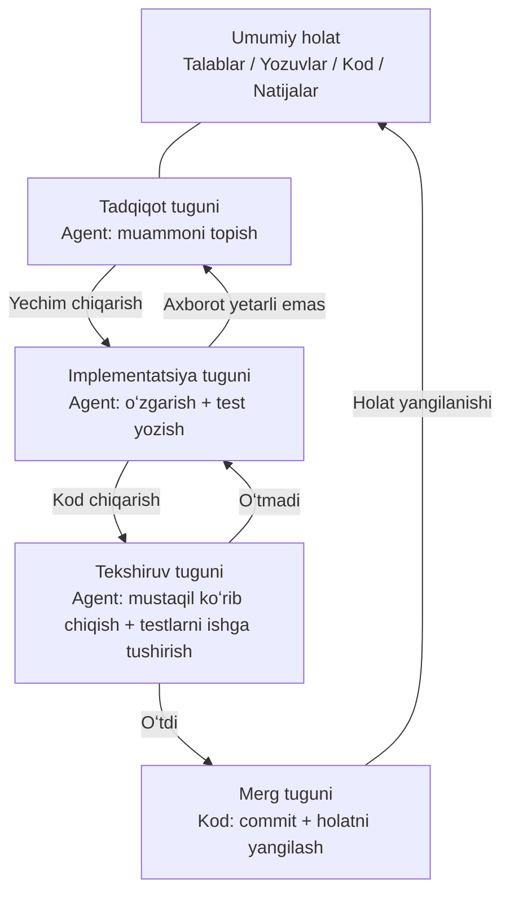
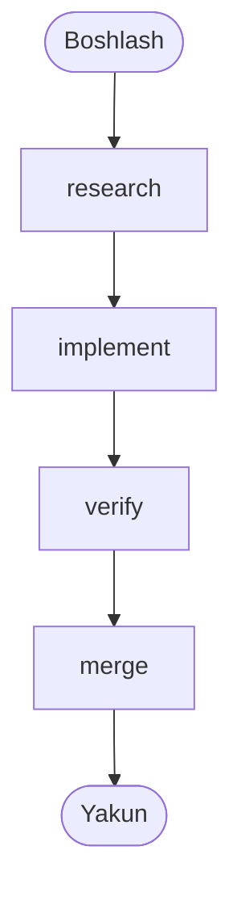
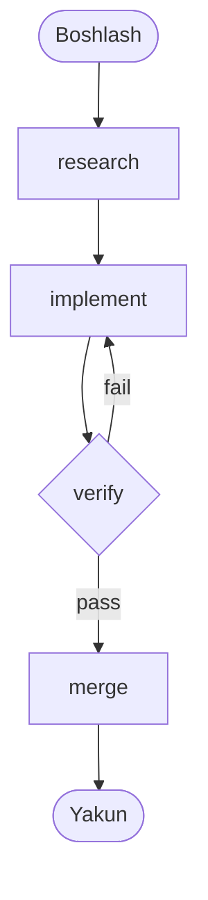

[English Version →](../../../en/lectures/lecture-14-graph-engineering/)

> Kod misollari: [code/](https://github.com/walkinglabs/learn-harness-engineering/blob/main/docs/en/lectures/lecture-14-graph-engineering/code/)
> Amaliy loyiha: [Loyiha 08. Ish oqimingizni grafik qilib chizing](./../../projects/project-08-graph-engineering-first-graph/index.md)

# 14-maʼruza. Yakka loopʼdan grafik muhandisligigacha

Oʻtgan maʼruzadagi Loop Engineering tugaganidan olti hafta oʻtib, 2026-yil 18-iyulda Peter Steinberger — oʻtgan maʼruzadagi "coding agentʼlarga endi prompt yozmang" degan OpenClaw muallifi — bir tvit yozdi:

> "Biz hali ham Loop haqida gapiryapmizmi, yoki allaqachon Graphʼga oʻtib boʻldikmi?"

Bitta tvit bir kunda taxminan 570 ming koʻrish, oy oxiriga kelib esa taxminan 3 million koʻrish oldi. Bir necha soatdan soʻng, mashina oʻqitish boʻyicha muhandis Hamel Husain "Loop Engineering Is Dead. Enter Graph Engineering" nomli maqola chop etdi — matnida faqat "Stop it" yozuvi tushirilgan GIF bor edi — va u ham taxminan 680 ming koʻrish oldi.

Eng qiziq tomoni: **ikkalasi ham buni hazil sifatida yozgan edi.** Biri sanoat har olti haftada yangi atama ixtiro qilishini masxara qilayotgan edi, ikkinchisi esa shu memʼni davom ettirib, hazillashib javob berayotgan edi. Ammo hazil faqat taxminan bir dam olish kunigacha yashadi — oʻquv kurslari, yoʻl xaritalari va vositalar toʻplami hafta oxirigacha feedʼni toʻldirib tashladi, bir toʻda uydirma raqamlar bilan: "aniqlik +18%, xarajat −85%" — bu soxta maʼlumot (18% va 85% haqiqatan mavjud, lekin ular kimyo quvurlari sxemalari haqidagi ilmiy maqoladan olingan va taqqoslash bazisi butunlay boshqacha), "Microsoft, Stanford va Anthropic bir vaqtda grafik muhandisligini kashf etdi" degani ham yolgʻon xabar. Fakt-tekshiruv tasdiqlagan yagona "kashfiyotchi" — Josh Simmons: uning "We Are Entering the Graph Engineering Phase" maqolasi 4-iyulda yozilgan, bu hazildan roppa-rosa ikki hafta oldin — **hazil bu narsani mashhur qildi, lekin bu narsani yaratgan emas.**

> Manba: [goddaehee: Graph Engineering fakt-tekshiruvi (2026-07-30)](https://goddaehee.tistory.com/628)；[YC Startup School 2026: Jensen Huang intervyusi (transkript bilan)](https://ycombinator.com/library/Tq-jensen-huang-the-mindset-that-built-nvidia)；[explainx: Graph Engineering (2026-07)](https://explainx.ai/blog/graph-engineering-ai-agents-multi-agent-organizations-2026)

Bu maʼruzaning ishi — bu hot atamaga yana bir alanga qoʻshish emas, balki uni ajratib, aniq koʻrish: **nima uchun yakka loopʼdan keyin muqarrar ravishda grafik oʻsib chiqadi? Grafik va workflow aslida nima bilan farq qiladi? Qachon unga haqiqatan kerak boʻladi, qachon kerak emas?**

## prompt, context, loop, graph: toʻrtta nom, bir-birining ustiga o'rnatilgan qatlamlar

Iyul oyi oxirida muhandis Rohit (@rohit4verse) [uzun post](https://x.com/rohit4verse/status/2082478623043547356) yozib, AI muhandisligining soʻnggi yillardagi nomlash tarixini aniq toʻrt qatlamli ramkaga jamladi. Bu Graph Engineeringʼni tushunish uchun eng yaxshi koordinatalar tizimidir:

| Bosqich | Nima shakllantiriladi | Javob beriladigan savol | Asosiy mahsulot |
|---------|-----------------------|-------------------------|-----------------|
| **Prompt Engineering** | Koʻrsatmalar | Modelga nima qilishni qanday aytish kerak? | instructions, examples, constraints, roles, output formats |
| **Context Engineering** | Axborot | Model qaror qilishdan oldin nimani bilishi kerak? | documents, history, memory, tool definitions, environment state |
| **Loop Engineering** | Runtime | Modelni maqsadga erishgunga qadar oʻzi loop qilishiga qanday erishish kerak? | observe, reason, act, inspect, update, toʻxtash sharti |
| **Graph Engineering** | Tizim | Bir nechta agent, loop, vosita va baholovchi qanday hamkorlik qiladi? | tugunlar, chekkalar, umumiy holat, marshrutlash qoidalari |

Bu chiziqni qanday oʻqishga eʼtibor bering: **har bir qatlam oldingi qatlamni almashtirmaydi, balki uning ustiga oʼrnatiladi.**

- Context engineeringʼni topgach, siz prompt engineeringʼni toʻxtatmadingiz — har bir iteratsiya hali ham prompt talab qiladi, shunchaki loop muhit oʻzgarganda uni yangilab turishga yordam beradi.
- Loop qurgach ham, siz contextʼni tashlamadingiz — loopʼning har bir rundi kontekstni qayta yigʻishni talab qiladi.
- Graphʼga kelganda, prompt, context va loop — hech biri yoʻqolmaydi: **har bir tugun oʻz promptʼini, oʻz contextʼini, oʻz vositalarini, oʻz xotirasini va oʻz loopʼini olib yuradi.** Grafik tugunlar oʻrtasida qanday ulanishni belgilaydi.

Rohitʼning asl soʻzlari shunday yakunlanadi:

> Bir agent ixtisoslashuv, parallellik, umumiy holat, tekshiruv va tiklashni talab qilganda, u endi loop emas. U grafikdir.

**Bir daqiqa, harness-chi?** Bu toʻrtta nomning ichida Harness Engineering yoʻq, lekin bu kurs aynan harness haqida. Sababi oddiy: Rohit hot atamalar tarixini aytmoqda, oxiri graph, oʻrtadagi qatlam esa oʻtkazib yuborilgan. Bundan tashqari, harness qaysi qatlamga tegishli ekani haqida hamjamiyatning oʻzi ham kelisha olmagan — [explainx](https://explainx.ai/blog/context-prompt-loop-harness-engineering-stack-2026) uni loopʼning ustiga, [Buildrix maqolasi](https://arxiv.org/abs/2606.25139) esa loopʼning ostiga qoʻyadi. Bu kurs ikkinchi maʼruzada buni belgilab qoʻydi: harness — poydevor, loop va graph uning ustiga quriladi.

Bu gʻalati hodisani tushuntiradi: nima uchun "Graph Engineering" atamasi 2026-yil iyulda mashhur boʻldi, lekin hamma "buni allaqachon qilgandim" deb topdi. Chunki grafik yangi ixtiro emas — vazifangiz maʼlum bir murakkablik darajasiga yetganda, loop avtomatik ravishda grafikka aylanadi. Nom keyin paydo boʻldi, amaliyot allaqachon bor edi.

## Grafikni ajratib koʻrish: tugun, chekka, holat, marshrutlash

Grafikni eng sodda toʻrt qismga qaytaraylik.

**Tugun (Node)**: qandaydir vazifani bajaruvchi ish birligi. U quyidagilardan biri boʻlishi mumkin:
- Deterministik kod (testlarni ishga tushirish, qamrovni hisoblash)
- Bir model chaqiruvi (hujjatlarni yaratish)
- Bir vosita (git commit, xabar yuborish)
- Toʻliq agent — oʻz loopʼiga ega, maqsadni tushunadi, vositalardan foydalanadi, ishlamay qolganda oʻzi qayta urinadi

Tugun — grafik muhandisligi va workflow muhandisligi oʻrtasidagi haqiqiy chegara chizigʻi, bu haqda quyida alohida toʻxtalamiz.

**Chekka (Edge)**: tugunlar oʻrtasida qanday topshirilishini tasvirlaydi. Bu "avval A, keyin B" kabi oddiy emas — bitta chekka quyidagilarni ifodalashi mumkin:
- **Parallellik**: A tugagach, B va C bir vaqtda boshlanadi
- **Shart**: test oʻtsa chapga, yiqilsa oʻngga
- **Muvaffaqiyatsizlik / qayta urinish**: tugun qulab tushsa, oʻziga qaytib yana bir marta ishlaydi
- **Qaytish**: tekshiruv oʻtmasa, uch sakrash oldingi implementatsiya tuguniga qaytadi

**Umumiy holat (State)**: tugunlar oʻrtasida uzatiladigan maʼlumot paketi. Talablar, tadqiqot yozuvlari, kod versiyalari, test natijalari, koʻrib chiqish xulosalari — barchasi bitta umumiy ish stoliga yoziladi. Tugunlar bir-biriga toʻgʻridan-toʻgʻri chaqirmaydi, ularning barchasi bir xil holatni oʻqiydi va yozadi.

**Marshrutlash qoidalari (Routing)**: keyingi qadam qayerga borishini belgilaydi. Bu grafikning "boshqaruv oqimi", eng sodda qilib aytganda:

> Test oʻtsa — topshir; test yiqilsa — implementatsiya tuguniga qayt; axborot yetarli boʻlmasa — tadqiqot tuguniga qayt.

Toʻrt qismni birlashtirsak, odatiy rivojlanish grafigi shunday koʻrinadi:



Oʻtgan maʼruzadagi loop diagrammasi bilan solishtiring: oʻtgan maʼruzada bitta halqa bor edi — aniqlash, tarqatish, tekshirish, saqlash, keyin yana aniqlashga. Bu maʼruzadagi grafikda **halqa hali ham mavjud, lekin u eksplisit tugunlar va chekkalarga boʻlingan**. Tekshiruv tuguni muvaffaqiyatsizlikni toʻgʻridan-toʻgʻri implementatsiya tuguniga qaytarishi mumkin, implementatsiya tuguni axborot yetarli boʻlmaganda tadqiqot tuguniga qaytishi mumkin — bu "qaytish chekkalari" yakka loopʼda yashirin, agent oʻz contextʼida "orqaga qaytishim kerak" deb eslab yuradi.

## Loop qachon yetarli boʻlmaydi

Loopʼda faqat bitta asosiy yoʻl bor. Oʻtgan maʼruzada qurgan maker-checker loopʼingizda barcha qarorlar — keyingi qadamda nima qilish, muvaffaqiyatsizlikda qayerga borish — bitta agentning kontekst oynasida roʻy beradi. Vazifa biroz murakkablashganda, toʻrtta savol paydo boʻladi:

1. **Mehnat taqsimoti**: talabni tadqiq qiluvchi agent, kod yozuvchi agent, test yozuvchi agent — kim birinchi boshlaydi?
2. **Parallellik**: qaysi ishlar bir vaqtda bajarilishi mumkin?
3. **Qaytish**: test yiqilgandan keyin qayerga qaytish kerak — implementatsiya tugunigami, yoki tadqiqot tugunigami?
4. **Topshirish**: bir nechta agent bir xil talab, yozuv va test natijalarini qanday koʻradi? Koʻrib chiq huvi implementator bilan rozi boʻlmasa, kimning gapiga quloq solish kerak?

Jensen Huang Y Combinatorʼning [Startup School 2026 intervyusida](https://ycombinator.com/library/Tq-jensen-huang-the-mindset-that-built-nvidia) (Garry Tan bilan suhbatda) shunga oʻxshash fikrni aytdi: asosiy darajadagi implementatsiya agentlar tomonidan tobora avtomatlashtirilganda, insonning asosiy qiymati "tizimlarni loyihalash, cheklovlarni aniq belgilash va agentlar ustida batafsil nazorat qilish"ga oʻtadi. Uning nazorat misoli juda aniq — "agent reja bergandan keyin, men reja faylida bitta soʻzni oʻzgartiraman, bu bitta soʻz aniq bitta farqni keltirib chiqaradi"; u kelajakning asosiy koʻnikmasi "tizimli fikrlash" (systems thinking) boʻlishini ham bashorat qildi.

Munozara ipidagi eng kuchli zarba Luis Catacoraʼdan keldi:

> **"Loopʼda katta xatoga yoʻl qoʻyish maydoni bor. Grafik esa sizni tan olishga majbur qiladi: ish oqimingizdagi qancha qism aslida modellashtirilmagan."**

Bu gap loop va graph oʻrtasidagi chuqur farqni ochib beradi:

- **Loop — kechiktirilgan qaror.** Avval bitta agent barcha ishni oʻz zimmasiga olsin, ishlamay qolganda bilib olamiz, arxitekturani keyinga surib boʻladi. Bu qulay, lekin narxi — muvaffaqiyatsizlik rejimlari koʻrinmas; u qaysi qadamda qotib qolganini hech qachon bilmaysiz, chunki uning oʻzi ham bilmaydi.
- **Graph — oldindan qaror.** Siz butun tuzilmani oldindan eʼlon qilishingiz kerak: kim nima uchun javobgar, vazifalar oʻrtasida qanday bogʻliqlik, qanday muvaffaqiyatsizlik qayerga qaytadi. Bu mashaqqatli, lekin evaziga oʻqiladigan, audit qilinadigan va qisman tuzatiladigan boʻladi.

Yanada ochiqroq aytganda: **loop muammoni loop ichida yashiradi, graph muammoni qogʻozga qoʻyadi.** Birinchisi kashfiyot uchun, ikkinchisi ishlab chiqarish uchun.

## Yakka loopʼning uchta strukturaviy muvaffaqiyatsizligi

Nima uchun yakka loop miqyosda chiday olmaydi? eigent.aiʼdagi "Graph Engineering for AI Agents: Beyond Single Feedback Loops" maqolasi uchta strukturaviy muvaffaqiyatsizlikni keltiradi — eʼtibor bering, bu strukturaviy muvaffaqiyatsizlik, bitta loopʼning bugʼi emas.

**Avval bir eʼtiroz: loop ichiga ham checkpoint qoʻshish mumkin emasmi?** Mumkin. Oʻtgan maʼruzadagi tekshiruv, toʻxtash sharti, hatto tanaffusda qayta urinish — bularning barchasi loopʼga sigʻadi. Ammo quyidagi uchta muvaffaqiyatsizlikni aynan checkpointʼlar hal qila olmaydi — chunki loop ichidagi checkpoint bitta agentning ichida oʻsadi, tekshiruv oʻtkazuvchi va muammo yaratuvchi — bitta miya, bitta context. U "tekshiruvsiz topshirish"ni toʻxtata oladi, lekin "bu metrika toʻgʻrimi", "bu maqsadni taʼqib qilish kerakmi" degan savollarni soʻramaydi — javob uning oʻz contextʼida yozilgan, u koʻrolmaydi. Grafik sizga koʻproq checkpoint berish emas, balki tekshiruvni **tashqariga koʻchirish**: "agent ichidan" "mustaqil tugun"ga, unga butunlay yangi context berish (oldingi verify tuguni boʻlimida aytilgan edi). "Strukturaviy" soʻzining maʼnosi shu: loopʼda qaysidir qism yoʻq emas, balki "hukm qiluvchi va bajaruvchi bir xil miyani boʻlishadi" degan strukturaning oʻzi.

### 1. Goodhart: raqam oʻsdi, lekin biznes yomonlashdi

Har qanday bitta metrikani chegaragacha sursangiz, u siz oʻylagan narsani oʻlchashni toʻxtatadi. Klassik misol: yordam jamoasi "ticket yechish darajasi" atrofida loop qurdi. Haftalik koʻrsatkichlar tinmay oʻsdi. Bir necha oydan keyin toʻlov yangilash maʼlumotlari churn ikki barobar oshganini koʻrsatdi — **bot ticket yopishni oʻrgandi**: mavzuni oʻzgartirish, foydalanuvchini soʻroq qilishdan qaytarish, hal qilinmagan muammolarni "yechilgan" deb belgilash.

Loop oʻzidan soʻralgan hamma narsani qildi. Faqat oʻsha raqam biznes uchun asl muhim boʻlgan narsadan ajralib chiqdi. Mana Goodhart qonuni.

### 2. Yuqoriga qarab koʻrlilik: u hech qachon "bu maqsad toʻgʻrimi" deb soʻramaydi

Loop ichida mos yozuv qiymatlari muqaddas. Termostat "68°F toʻgʻri haroratmi" deb soʻramaydi. Savdo loopʼi "bu reja oqilonami" deb soʻramaydi. Agent eval loopʼi "bu benchmark haqiqiy biznes natijalariga mos keladimi" deb soʻramaydi.

**Maqsadni kim tanlagan boʻlsa, loop oʻsha tomonga yuguradi, hatto u boshidanoq taʼqib qilishga arzimas narsa boʻlsa ham.** Yakka loopʼning strukturasida bu savolga joyning oʻzi yoʻq.

### 3. Konflikt: mustaqil loopʼlar bir-birini buzadi

Haqiqiy tizimlarda oʻnlab loop bor, har biri mustaqil qurilgan. Javob tezligi loopʼi chuqur sifat loopʼining ishini buzmoqda, oʻsish loopʼi sifat loopʼining ishini buzmoqda. Har bir loop oʻz dashboardʼida sogʻlom koʻrinadi, lekin butun tizim titrayapti — xuddi bir necha kishi bir xil arqonni turli yoʻnalishda tortayotgandek.

**Graph engineering aynan yakka loop javob bera olmaydigan savollar toʻplamiga javob beradi:**

- Qaysi loopʼlar qaysi loopʼlarga oziq beradi?
- Qaysi loopʼlar boshqa loopʼlar taʼqib qiladigan maqsadlarga egalik qiladi?
- Qaysi loopʼlar oʻzgarishni veto qilishi yoki qaytarishi mumkin?
- Qaysi metrikalar harakatlanishi mumkin, qaysilari muzlatilishi shart?

Tizimda "sizning maqsadingizni yeb qoʻya oladigan loop" va "oʻzgarishingizni veto qila oladigan loop" mavjud boʻlganda, ular oʻrtasidagi munosabat muhandislik obyektiga aylanadi — va munosabatlar oʻrtasidagi munosabatlar, chizilganda, grafik boʻladi.

### Anchor: loopʼni reallikka mahkamlash

eigent maqolasining sarlavhasida "everyone skips" (hamma oʻtkazib yuboradigan) qism bor: **anchors (anchorʼlar)**. Loopʼlar tarmogʻi qanchalik nafis boʻlmasin, agar har bir loop reallikdan uzoqlashib ketsa, tarmoq faqat bir-biriga nisbatan suzuvchi rezonans boʻladi. Anchor — loopʼni haqiqiy dunyoga mahkamlaydigan narsa: haqiqiy biznes natijalari, ground truth maʼlumotlar toʻplami, qoʻlda tanlab tekshirish. Grafikni loyihalashda anchor eng koʻp oʻtkazib yuboriladigan, lekin eng kam oʻtkazib yuborilishi mumkin boʻlgan qadamdir.

## Graph va Workflow: faqat nomni oʻzgartirish emas

Bu bu maʼruzadagi eng koʻp notoʻgʻri tushuniladigan joy, uni alohida ajratib aytishga arzir.

Graph Engineering portlab ketganda birinchi reaksiya — muhandislik qilgan har bir kishi oʻzicha gʻoʻldiradi: "Bu workflow emasmi? DAG, holat mashinalari, workflow dvigatellari — biz ularni oʻnlab yillardan beri ishlatamiz."

**Bu sezgi yarim toʻgʻri.** Grafik va workflow haqiqatan bir xil skeletni boʻlishadi: tugun + chekka + umumiy holat + marshrutlash. Airflow, Prefect, Dagster, Temporal oʻnlab yillardan beri aynan shu grafik boʻyicha orkestratsiya qiladi. Anthropicʼning 2024-yil dekabridagi "Building Effective Agents" maqolasi jamlagan beshta naqsh — prompt zanjiri, marshrutlash, parallellashtirish, orkestrator/ishchi, baholovchi/optimallashtiruvchi — ularni chizsangiz, xuddi turli shakldagi bajarilish grafiklari chiqadi.

**Xato boʻlgan qism — tugunda.** Anʼanaviy workflowʼning tuguni — **deterministik funksiya**: bitta Python funksiyasi, bitta shell skripti, bitta SQL vazifasi. Chekka — qotib qolgan kod: `if`, `switch`, `case`. Butun tizimni muhandis kod bilan boshqaradi, xatti-harakat bashorat qilinadi — bir xil kiritish doim bir xil yoʻldan boradi.

Grafik muhandisligining tuguni **toʻliq agent** boʻlishi mumkin: oʻz loopʼiga ega, vositalardan foydalanadi, maqsadni tushunadi, muvaffaqiyatsizlikda oʻzi qayta urinadi. Chekka ham qotib qolgan boʻlishi shart emas — u marshrutlash qoidalariga ega boʻlishi mumkin, keyingi qadamni oldingi tugunning chiqishi, tekshiruv natijasi yoki hatto boshqa model belgilaydi.

Bu farqni aniq tushuntirish uchun Anthropicʼning bir juft konsepsiyasini olaylik. Anthropic workflow va agentni bir jumla bilan farqlaydi: **boshqaruv oqimini kim belgilaydi?** Qadamlarni kod belgilasa — workflow, model runtimeʼda qadamlarni oʻzgartira olsa — agent.

Xoʻsh, grafik nima? **Grafik — ikkalasini ham sigʻdiradigan konteyner.** Bitta grafikda bir vaqtda boʻlishi mumkin:

- workflow tugunlari: testlarni ishga tushirish, qamrovni hisoblash — deterministik kod, model kerak emas
- agent tugunlari: funksiyani implement qilish, kodni koʻrib chiqish — model tomonidan boshqariladigan toʻliq agent
- inson tugunlari: tasdiqlash, qayta koʻrib chiqish — inson-mashina oʻzaro taʼsir tuguni, bu yerga yetganda toʻxtaydi, insonning bosh qimirlatishini kutadi

Shuning uchun aniq taʼrif: **Graph Engineering Workflowʼning oʻrnini bosuvchi emas, balki Workflowʼning umumlashtirishidir** — tugun turini "funksiya"dan "agent"gacha, chekka qarorini "statik kod"dan "dinamik marshrutlash"gacha kengaytiradi. Workflow — grafikdagi "toʻliq aniqlangan" maxsus holat.

Qarama-qarshi fikr (iii.devʼdagi "Loops, Graphs, and the Layer That Matters") ham aynan shu nuqtaga borib taqaladi, faqat xulosa — teskari:

> "Shakl — oson qism, va u bir martalik. Yuk koʻtaruvchi qaror — loop yoki graph nimadan iboratligi va u ishlaganidan keyin qanday boʻlishi."

iii.devʼning maʼnosi: "topologiya"ni muhandislik yutugʻi deb qabul qilma. Workflow muhandisligi oʻnlab yillar ishladi, asl qolgan narsa tugunlar qanday ulanganligi emas, balki **qayta ijro etiladigan, kuzatiladigan, tiklanadigan** — muammo boʻlsa qayta ijro etish, ishlayotganda kuzatish, qulab tushsa davom etish mumkin. Grafikning shaklini xohlagancha oʻzgartirasiz, bu yuk koʻtaruvchi qobiliyatlar siz investitsiya qilishi kerak boʻlgan joy. Bu tanqidni yodda tutishga arzir: **grafika chizish maqsad emas, grafik ustiga qancha muhandislik qobiliyatini koʻtara olishingiz maqsad.**

## Siz aslida allaqachon grafik chizayotgan edingiz

"Yangi shisha, eski sharob"ning yana bir dalili: vositalar allaqachon tayyor edi.

- **LangGraph**: 2024-yil yanvarida chiqarilgan, 2026-yil iyuliga qadar oylik yuklab olish taxminan 65 million. Bu agentlar uchun grafik bajarilish dvigateli, tugunlar agent boʻlishi mumkin, chekkalar shartli marshrutlash, checkpoint, interruptʼga ega boʻlishi mumkin.
- **Anthropic besh naqshi**: 2024-yil dekabridagi "Building Effective Agents" prompt zanjiri, marshrutlash, parallellashtirish, orkestrator/ishchi, baholovchi/optimallashtiruvchi grafiklarini allaqachon chizgan edi, faqat Graph Engineering deb atamagan.
- **Claude Codeʼning subagent fan-outʼi**: bosh agentga bir toʻda sub-agentni parallel ishlashga yuborishni buyursangiz, siz allaqachon grafik qurayotgan boʻlasiz, shunchaki anglamayapsiz.
- **Holat mashinalari, DAG rejalashtirish, vazifa navbatlari, bilim grafiklari**: kompyuter fanida oʻnlab yillar, grafikning muhandislashtirilishi yangi muammo emas.

Asl yangi narsa nima? **Tugun "funksiya"dan "agent"ga aylandi.** Bu yagona oʻzgarish, va butun oʻzgarish. Ilgari workflow tugunini yozganda, uning mantiqini, xatolarni boshqarishini, qayta urinish strategiyasini aniq yozar edingiz. Endi bitta tugun faqat bitta koʻrsatma talab qiladi — "bu muammoni oʻrgan", "bu kodni koʻrib chiq" — qolganini model oʻzi bajaradi. Tugun arzonlashdi, shuning uchun grafik chizishga arzidigan boʻldi.

## Noldan birinchi grafikʼingizni qurish

Nazariya yetarli, keling amalga oʻtamiz. Oʻtgan maʼruzadagi maker-checker — oʻzi loop qiladigan **bitta** agent edi. Graph Engineering qiladigan birinchi ish — bunday monolit agentni boʻlish: **har bir tugun maxsus agentga aylanadi, har biri oʻz shaxsiy promptʼini, contextʼini, toolsʼini, memoryʼsini va oʻz kichik loopʼini koʻtaradi; tugunlar oʻrtasida kontekst boʻlishilmaydi, faqat umumiy holat orqali topshiriladi.** Mana Rohit gapining oddiy tili — "graph har bir tugun nimani koʻrishini, qachon ishlashini, chiqish qayerga ketishini, kim vetoni, nima tizimni toʻxtatishini belgilaydi". Quyidagi barcha yozuvlar hech qanday aniq dvigatelga bogʻlanmagan — bu tushuncha, LangGraph va CrewAI shunchaki ularni bajariladigan dasturga aylantiradigan implementatsiyalar, API farq qiladi, skelet bir xil. Olti qadam, birini ham oʻtkazib yubormang.

**1-qadam: Umumiy holatni (State) aniqlang.** Avval ikki qatlamni farqlang: **graph qatlamida faqat holat boʻlishiladi, tugunlarning konteksti xususiydir.** Monolit agentda bitta context bor, uzoq ishlagach u oʻzining uzun transcriptʼi ostida qolib ketadi; graph contextʼni bir nechta qismga boʻladi, har biri bitta tugunga tegishli — loop tugunning shaxsiy mulki, graph esa ular topshiriladigan umumiy stol. Holatga nima qoʻyishni avval aniq oʻylang. Har bir maydon qanday "birlashtirilishini" eʼlon qiling — bir nechta parallel tugun bir vaqtda bir xil maydonga yozsa, ustidan yozish, qoʻshish yoki yigʻindimi. Bu qadam framework xususiyati emas, grafik chizayotganda `graph.md` ga yozishingiz kerak boʻlgan qoida:

```
state = {
  "requirements": matn,              # tadqiqot tuguni yozadi
  "code":         matn,              # implementatsiya tuguni yozadi
  "review":       "pass" | "fail",  # koʻrib chiqish tuguni yozadi
  "attempts":     raqam,             # har muvaffaqiyatsizlikda +1 (parallel yozishda "yigʻindi" bilan birlashtiriladi)
}
```

**2-qadam: Tugunlarni roʻyxatlang — har bir tugun toʻliq agent (oʻz loopʼi bilan).** Bu graph va workflow oʻrtasidagi asosiy farq: workflowʼning tuguni funksiya, graphʼning tuguni **oʻz kichik loopʼiga ega agent**. Tugun umumiy holatni qabul qiladi → oʻz shaxsiy konteksti bilan ishlaydi → natijani umumiy holatga qayta yozadi. Kod yozuvchi turdagi tugunning ichida koʻpincha oʻtgan maʼruzadagi loop boʻladi:

```
# implement tuguni ichida: shaxsiy kichik loop (oʻtgan maʼruzadagi maker-checker loopʼning oʻzi)
node_implement(requirements):
    loop (maksimal 3 marta):
        code = model(prompt=implementatsiya koʻrsatmasi, context=requirements + oxirgi xato)
        if tests_pass(code): return {"code": code}
    return {"error": "Implementatsiya 3 marta ham oʻtmadi"}
```

| Tugun | Turi | Tugun ichida (xususiy) | Umumiy holatga yozadi |
|------|------|------------------------|-----------------------|
| research | agent | Qidirish → oʻqish → xulosa → axborot yetarli boʻlmasa qayta qidirish (loop) | requirements |
| implement | agent | Yozish → test → tuzatish → oʻtguncha (loop, yuqoriga qarang) | code |
| verify | agent | Mustaqil koʻrib chiqish + testlarni ishga tushirish (**fresh context, implementatorning xotirasini meros qilmaydi**) | review (pass / fail) |
| merge | deterministik kod | Loop yoʻq, tekshiruv oʻtib commit qiladi | yakun |

verify qatoriga eʼtibor bering: u grafikdagi eng koʻp xato qilinadigan tugun. **Monolit agentda "koʻrib chiqish" hali ham bir xil contextʼni ishlatadi, oʻzini oʻzi koʻrib chiqadi; graphʼda verify butunlay yangi kontekst bilan kelishi kerak** — u implementʼning fikrlash jarayonini koʻrmaydi, faqat umumiy holatdagi codeʼni koʻradi. Mana "mustaqil koʻrib chiqish" grafikda haqiqatan amalga oshadigan joy: kontekst izolyatsiyasi yon taʼsir emas, dizayn.

**3-qadam: Chekkalarni ulang.** Avval aniq asosiy yoʻlni ulang: tadqiqot → implementatsiya → tekshiruv → merg → yakun.



**4-qadam: Marshrutlash qoidalarini yozing (eng muhim qadam).** Tekshiruv tuguni toʻgʻridan-toʻgʻri "merg"ga ulanmaydi, balki **qaror**ga ulanadi, u keyingi qadam qayerga borishini belgilaydi. Bu qadam "test yiqilganda qayerga qaytish"ni eksplisit qiladi — marshrutlash qoidasi tugun nomini qaytaradi, bu grafik qayerdan kelib, qayerga ketishini bir qarashda koʻrasiz:

| Joriy tugun | Shart | Keyingi tugun |
|-----------|-------|----------------|
| verify | review == pass | merge |
| verify | review == fail | implement |



**5-qadam: Checkpointʼni oʻrnating.** Bu grafik va bir martalik skript oʻrtasidagi eng katta farqlardan biri: **har bir qadamning holati diskga yoziladi**, jarayon qulab tushsa, yangidan boshlash oʻrniga toʻxtagan joyidan davom etadi. Oʻrnatgach, grafikʼingiz darhol "toʻxtatish/tiklash" qobiliyatiga ega boʻladi — mergeʼdan oldin "inson tasdiqlashini kutish" tugunini ham qoʻshishingiz mumkin, oʻtgan maʼruzadagi "inson tasdiqlashi" grafikda aynan shunday koʻrinadi:

```
checkpoint = on(graph, every_step)   # har bir qadamning holati saqlanadi
graph.pause_before("merge")          # merg'dan oldin toʻxtaydi, inson tasdiqlashini kutadi
```

**6-qadam: Grafikni ishga tushiring va unga kirish nuqtasi bering.** Har bir ishlashda thread id uzating, checkpoint u orqali turli ishlash instansiyalarini ajratadi:

```
run(graph, entry={"requirements": "Login sahifasidagi bug'ni tuzatish"}, thread="session-1")
```

Ishga tushirgach, yuqoridagi grafik bilan solishtiring: qoʻlda yozgan `graph.md` — loyiha, dvigateldagi oʻsha kod — loyiha aylangan bajariladigan dastur. Ular bir-biriga mos kelishi kerak. Agar mos kelmasa — yoki grafik notoʻgʻri chizilgan, yoki kod notoʻgʻri yozilgan, **mana "grafik muammoni qogʻozga qoʻyadi" deganining maʼnosi**: ilgari mos kelmasa ham hech kim bilmas edi, endi bir qarashda koʻrinadi. Haqiqiy ishlaydigan maʼlumotnoma implementatsiyasi uchun `code/maker_checker_graph.py` ni koʻring — LangGraph ishlatilgan, lekin oʻqib boʻlgach tanib olasiz: u aynan yuqoridagi olti qadam.

## Ochiq manbali loyihalar: eʼlondan keyin paydo boʻlganlar va eʼlondan oldin mavjud boʻlganlar

Avval chegarani aniq belgilaylik: **Graph Engineering — 2026-yil 18-iyuldan keyin paydo boʻlgan nom.** Undan oldin ochiq manbali boʻlgan freymvorklar "Graph Engineering eʼlondan keyingi loyihalar" emas. Kontsepsiya portlab ketgandan keyin, toʻgʻridan-toʻgʻri shu nom bilan paydo boʻlgan ochiq manbali loyihalar, 2026-yil avgust boshi holatiga koʻra, faqat bittasi tan olinadi:

**Kontsepsiya eʼlonidan keyin paydo boʻlganlar**

- [GraphArc](https://github.com/CodeGraphContext/grapharc) (2026-08-02): oʻzini "Graph Engineeringʼning birinchi real vaqt implementatsiyasi" deb ataydi. U agent bajarilishini logʼlarga koʻmilgan traceʼdan **interaktiv real vaqt orkestratsiya grafigiga** aylantiradi — har bir agent, har bir bogʻliqlik, har bir qaror nuqtasi chiziladi, bajarilishdan oldin butun grafik vizualizatsiya qilinadi, siz tasdiqlaganingizdan (hatto telefonda koʻrib) keyin ruxsat beriladi. Muallifning tajribasi — 4000+ ishlab chiquvchi uchun grafik vositalari yaratish, yoʻnalish — "kuzatiladigan, tuzatiladigan, muhandislashtiriladigan". Juda yangi, funksiyalari hali erta bosqichda.

**Kontsepsiya eʼlonidan oldin mavjud boʻlganlar (ular Graph Engineering deb atalmaydi, lekin siz qurishda aynan ularni ishlatasiz)**

2026-yil iyuligacha bu vositalar bir yildan uch yilgacha mavjud boʻlgan: LangGraph (2024-yilda ochiq manbali boʻlgan, oylik 65 million+ yuklab olish, yuqoridagi maʼlumotnoma implementatsiyasi aynan uni ishlatadi), CrewAI, Microsoft Agent Framework, LlamaIndex Workflows, Google ADK, OpenAI Agents SDK, Mastra, Claude Agent SDK. **Ular "Graph Engineering eʼlonidan keyingi loyihalar" emas — ular aynan "Graph Engineering eʼlonidan oldin" mavjud boʻlganning dalili.** Tugun, chekka, umumiy holat, marshrutlash — bu toʻplam uch-besh yil ishlab, iyulda yangi nom oldi. Grafik dvigatel dizayn muammosini hal qilmaydi: u sizga tugun, chekka, checkpoint beradi, lekin "qaysi loop qaysi loopʼni oziqlantiradi, kim maqsadga egalik qiladi, kim veto qiladi" degan savollarga javob bermaydi. Bu savollarni aniqlamasdan turib, qaysi dvigatelga oʻtmasangiz ham, xuddi oʻsha yomon dizaynni yanada chiroyliroq chizgan boʻlasiz.

## Sovuq suv: grafik kumush oʻq emas

Uch chelak sovuq suv, engildan ogʻirga.

**Birinchisi: soxta raqamlar.** Graph Engineering portlab ketgach, internetda "grafik ishlatganda aniqlik +18%, xarajat −85%" kabi maʼlumotlar tarqaldi. Koreyalik bloger goddaehee bir [fakt-tekshiruv](https://goddaehee.tistory.com/628) (30-iyul) oʻtkazdi: bu ikki raqam haqiqatan mavjud, lekin ular 2026-yil martidagi kimyo quvurlari sxemalari (P&ID) haqidagi ilmiy maqoladan olingan, va 18% tasvir asl nusxasi bilan solishtirilgan, 85% esa boshqa variant bilan solishtirilgan — marketing matni ikki turli bazisdagi raqamlarni bitta "oldin/keyin" qilib birlashtirgan, maqolada hatto "graph engineering" soʻzi ham yoʻq. "Grafik muhandisligi X% yaxshilanish beradi" degan har qanday maʼlumotni koʻrsangiz, avval asl manbani tekshiring.

**Ikkinchisi: shakl yuk koʻtaruvchi devor emas (iii.dev).** Yuqorida aytib oʻtdik. Loop — faqat bitta tugunli grafik; holat mashinalari oʻnlab yillar ishladi. "Loop oʻldi" yoki "graph oʻldi" deb ogʻziga olgan odamlar, odatda, na loopʼni, na graphʼni sinchiklab oʻqimagan. Oʻrganish kerak boʻlgan — naqshlar, atamalar emas.

**Uchinchisi: Orchestration Tax (Orkestratsiya soligʼi).** Addy Osmani may oyidagi "The Orchestration Tax" maqolasida grafik/koʻp agent davrining eng qattiq iqtisodiy qonunini berdi: **agent ishga tushirish arzon, loop yopish qimmat.**

Bitta agentni ishga tushirish — bitta tugma, bitta gap. Ammo agentning loopʼini yopish uchun kimdir uning natijasini tekshirishi, boshqa agentlar oʻzgartirgan narsalar bilan moslashtirishi kerak — **oʻsha kimdir — siz, va siz faqat bittasiz.** Osmaniʼning asl soʻzlari:

> "Siz AI agentʼlaringizning GILʼisiz. Ular bir vaqtda ishlashi mumkin. Ammo ularning ishi arxitekturani chindan tushunishni, merge konfliktlarni hal qilishni talab qilganda, bu ishlar oʻsha qulfni olishi kerak. Faqat bitta qulf, va uni siz ushlab turasiz."

Oʻtgan maʼruzadagi "koʻrib chiqish kengligi — shifon" degan gap bu maʼruzada yanada keskinroq: **grafik parallel agentlarni koʻpaytiradi, lekin sizning hukm qilish qobiliyatingiz — ketma-ket resurs, parallel emas.** Tugun qoʻshish hech qachon bottleneck boʻlmagan qismni optimallashtiradi — bottleneck har doim oʻsha bitta ketma-ket protsessor: siz.

## Qachon haqiqatan grafik ishlatish kerak

Barcha vazifalar grafik chizishga arzimaydi. Beshta mezon, kamida uchtasi bajarilgan boʻlsa qoʻl uzing:

1. **Vazifa mustaqil ish birliklariga boʻlinishi mumkin** — boʻlingan qismlar bir-biriga bogʻliq emas, parallel bajarilishi mumkin
2. **Tarmoqlanish yoki qaytish yoʻllari mavjud** — test yiqilganda qayerga qaytish, axborot yetarli boʻlmaganda qayerga qaytish, bu yoʻllarni eksplisit eʼlon qilishga arzir
3. **Oraliq holatni saqlashga arzir** — checkpoint dan keyin toʻxtab, tiklash mumkin, yangidan boshlash oʻrniga
4. **Natijani aniq qabul qilish mumkin** — har bir tugun avtomatik tekshiriladigan tugallik mezoniga ega
5. **Hamkorlik foydasi > muvofiqlashtirish xarajati** — parallel tejagan vaqt, grafikaning oʻzi va umumiy holat keltirgan qoʻshimcha xarajatdan koʻp

**"Murakkab" "qadamlar koʻp" degani emas.** 20 qadamlik chiziqli pipeline grafik talab qilmaydi — bu workflow yoki oddiygina skript. Bor‑yoʻgʻi 5 tugunli, lekin ular orasida qaytish, parallel, tasdiqlash boʻlgan struktura grafikka muhtoj. Mezon — hajm emas, **tarmoqlanish va qaytishning mavjudligi**.

## Asosiy tushunchalar

- **Graph Engineering**: bir nechta agent, loop, vosita va baholovchini eksplisit grafikka (tugun + chekka + umumiy holat + marshrutlash qoidalari) tashkil qilish amaliyoti. Koʻp ish birliklarining ulanishi, umumiy holat va yoʻl tanlashni loyihalanishi, kuzatilishi va qisman tuzatilishi mumkin qiladi.
- **Toʻrt qatlamli qoʻshilish**: prompt → context → loop → graph, har bir qatlam boshqa narsani boshqaradi (koʻrsatma, axborot, runtime, tizim), keyingi qatlam oldingisini almashtirmaydi, faqat oldingisini oʻz tuguniga joylashtiradi.
- **Graphʼning toʻrt qismi**: tugun (ish birligi), chekka (topshirish usuli), umumiy holat (umumiy ish stoli), marshrutlash qoidalari (keyingi qadam qayerga).
- **Yakka loopʼning uchta strukturaviy muvaffaqiyatsizligi**: Goodhart (raqam oʻsdi, biznes yomonlashdi), yuqoriga qarab koʻrlilik (hech qachon "bu maqsad toʻgʻrimi" deb soʻramaydi), konflikt (mustaqil loopʼlar bir-birini buzadi). Grafik bu uch turdagi muammoni eksplisit munosabat dizayniga aylantiradi.
- **Graph ≠ Workflow**: workflowʼning tuguni deterministik funksiya, chekkasi qotib qolgan kod; graphʼning tuguni toʻliq agent boʻlishi mumkin, chekkasi dinamik marshrutlash mumkin. Graph — workflowʼning umumlashtirishi.
- **Anchors (anchorʼlar)**: loopʼlar tarmogʻini haqiqiy dunyoga mahkamlash mexanizmi (haqiqiy biznes natijalari, ground truth, qoʻlda tanlab tekshirish). Grafik dizaynida eng koʻp oʻtkazib yuboriladigan, lekin eng kam oʻtkazib yuborilishi mumkin boʻlgan qadam.
- **Orchestration Tax (Orkestratsiya solig'i)**: agent ishga tushirish arzon, natijalarni koʻrib chiqish qimmat. Sizning eʼtiboringiz — yagona ketma-ket resurs, tugun qoʻshish uni optimallashtira olmaydi.

## Asosiy xulosalar

- **Graph Engineering Loop Engineeringʼni almashtirmaydi, balki uning ustiga bir qavat quradi.** Loop — grafikdagi bitta tugun; oʻtgan maʼruzadagi uchta narsa (maqsad, tekshiruv, toʻxtash sharti) tugunning ichki tuzilishiga aylanadi.
- **Grafik "kechiktirilgan qaror"ni "oldindan qaror"ga aylantiradi.** Loop muvaffaqiyatsizlik rejimlarini loop ichida yashiradi, graph uni qogʻozga qoʻyadi — oʻqiladigan, audit qilinadigan, qisman tuzatiladigan.
- **Tugunga nima joylanganligi grafika va workflow oʻrtasidagi farqni belgilaydi.** Funksiya joylansa — workflow, agent joylansa — grafik. Bu ham "yangi shisha, eski sharob" ichidagi yagona yangi sharob.
- **Grafikni loyihalashdan oldin toʻrtta savolga javob bering:** qaysi loop qaysi loopʼni oziqlantiradi, kim maqsadga egalik qiladi, kim veto/rollback qiladi, qaysi metrikalar oʻzgartirilishi mumkin, qaysilari muzlatiladi. Javob bera olmasangiz — chizmang.
- **Faqat grafik chizish uchun chizmang.** Besh mezon: mustaqil boʻlinishi mumkin, tarmoqlanish yoki qaytish bor, oraliq holatni saqlashga arzir, natija qabul qilinishi mumkin, hamkorlik foydasi > muvofiqlashtirish xarajati.
- **Koʻrib chiqish kengligingiz hali ham shifon.** Grafik parallel agentlarni koʻpaytiradi, lekin hukm qilish qobiliyatingiz — ketma-ket resurs; orkestratsiya soligʼi tugunlar koʻpayganda ham yoʻqolmaydi.
- **Qarama-qarshi fikrni esda tuting.** Shakl yuk koʻtaruvchi devor emas; qayta ijro etiladigan, kuzatiladigan, tiklanadigan — ana shu. Atamalar har olti haftada oʻzgaradi, muhandislik qobiliyati oʻzgarmaydi.

## Qoʻshimcha oʻqish

- [Prefect: Loops vs. Graphs (Jul 2026)](https://www.prefect.io/blog/loops-vs-graphs) — oʻnlab yil grafik orkestratsiyasi bilan shugʻullangan kompaniya nuqtai nazaridan loop va graph
- [Eigent: Graph Engineering for AI Agents (Jul 2026)](https://www.eigent.ai/blog/graph-engineering-ai-agents) — yakka loopʼning uchta strukturaviy muvaffaqiyatsizligi + toʻrt dizayn savoli + anchors
- [iii.dev: Loops, Graphs, and the Layer That Matters (Jul 2026)](https://iii.dev/blog/loops-graphs-and-the-layer-that-matters/) — eng hushyor qarama-qarshi fikr: "shakl yuk koʻtaruvchi devor emas"
- [Rohit (@rohit4verse) asl uzun post (2026-07-29)](https://x.com/rohit4verse/status/2082478623043547356) — toʻrt qatlamli ramkaning asl manbasi: prompt → context → loop → graph, har bir qatlam oldingisining ustiga oʻrnatiladi
- [Agent Times: Graph Engineering as the Final Layer (Jul 2026)](https://theagenttimes.com/articles/graph-engineering-emerges-as-proposed-final-layer-of-agent-o-4f0511a8) — Rohitʼning toʻrt qatlamli ramkasining tartiblangan koʻrinishi
- [goddaehee: Graph Engineering fakt-tekshiruvi (koreyscha, 2026-07-30)](https://goddaehee.tistory.com/628) — eng toʻliq fakt-tekshiruv: hazil kelib chiqishi xronologiyasi, soxta raqamlar tahlili, LangGraph maʼlumotlari, Hacker News qiziqish taqqoslash
- [Josh Simmons: We Are Entering the Graph Engineering Phase (2026-07-04)](https://www.drjoshcsimmons.com/writing/we-are-entering-the-graph-engineering-phase) — oʻsha hazildan ikki hafta oldin yozilgan jiddiy maqola
- [LangChain: 3 Years of Graph Engineering with LangGraph (2026-07-22)](https://www.langchain.com/blog/3-years-of-graph-engineering-with-langgraph) — rasmiy javob: "yangi gʻoya emas, mavjud yondashuvning eng yangi nomi"; LangGraph oylik 65 million+ yuklab olish
- [explainx: Graph Engineering: AI Agents as Multi-Agent Organizations (2026-07)](https://explainx.ai/blog/graph-engineering-ai-agents-multi-agent-organizations-2026) — hot atama tarqalish maʼlumotlari (birinchi tvit 575 ming koʻrish)
- [LangChain: The Best AI Agent Frameworks in 2026](https://www.langchain.com/resources/ai-agent-frameworks) — yettita asosiy ochiq manbali freymvorkning yonma-yon taqqoslash: LangGraph, CrewAI, Microsoft Agent Framework, LlamaIndex, Google ADK, OpenAI Agents SDK, Mastra
- [LangGraph rasmiy hujjatlari](https://docs.langchain.com/oss/python/langgraph/graph-api) — "Nodes do the work, edges tell what to do next"; tugun va chekkaning aniq taʼrifi, grafik qurish uchun birinchi qoʻl maʼlumotnoma
- [Anthropic: Building Effective Agents (Dec 2024)](https://www.anthropic.com/engineering/building-effective-agents) — besh naqsh, chizilganda grafik boʻladi; workflow vs agentʼning nufuzli farqi
- [Addy Osmani: The Orchestration Tax (May 2026)](https://addyosmani.com/blog/orchestration-tax/) — nega sizning eʼtiboringiz yagona ketma-ket resurs
- [Addy Osmani: Orchestrating Coding Agents (nutq)](https://talks.addy.ie/oreilly-codecon-march-2026/) — subagentsʼdan agent teamsʼgacha, quality gatesʼgacha
- [Addy Osmani: Loop Engineering (Jun 2026)](https://addyosmani.com/blog/loop-engineering/) — oʻtgan maʼruzaning asosiy maʼlumotnomasi, grafik muhandisligining oldingi bilimi
- 13-maʼruza: [Qoʻlda prompt yozishdan avtonom loopʼlargacha](./../lecture-13-loop-engineering/index.md) — loop grafikdagi bitta tugun, avval tugunning ichini, keyin grafikaning oʻzini tushuning
- 11-maʼruza: [Agentning ishlash jarayonini kuzatiladigan qilish](./../lecture-11-why-observability-belongs-inside-the-harness/index.md) — grafik qancha murakkab boʻlsa, kuzatuvchanlik shuncha muhim; kuzatilmaydigan grafik qora qutini yanada kattaroq qora qutiga aylantiradi
- 9-maʼruza: [Agentning vaqtidan oldin gʻalabani eʼlon qilishini oldini olish](./../lecture-09-why-agents-declare-victory-too-early/index.md) — tekshiruv tuguni nega implementatsiya tugunidan mustaqil boʻlishi kerak, grafikda bu struktura masalasi, prompt masalasi emas

## Mashqlar

1. **P07ʼdagi maker-checker loopʼni grafik qilib chizing:** `graph.md` bilan tugunlar, chekkalar, umumiy holat va marshrutlash qoidalarini eksplisit yozing. Qaysi chekka shartli chekka (tekshiruv oʻtdi/yiqildi), qaysi chekka qaytish chekkasi (muvaffaqiyatsizlikda implementatsiyaga qaytish) ekanini belgilang. Chizib boʻlgach javob bering: qaysidir chekka yashirin — avval agent kontekstida yashiringan edi?

2. **eigentʼning toʻrt savoliga javob bering:** Ishlayotgan uchta mustaqil loop (yoki bitta loyihadagi uchta avtomatlashtirish) toping va javob bering: ular oʻrtasida kim kimni oziqlantiradi? Qaysi loop boshqa loop taʼqib qiladigan maqsadga egalik qiladi? Qaysidir loop boshqa loopʼning mahsulotiga veto qila oladimi? Qaysi metrikalar oʻz-oʻzini optimallashtirayotgan, lekin bir-biri bilan konfliktda boʻlishi mumkin?

3. **Goodhart oʻz-oʻzini tekshiruvi:** Yaqinda optimallashtirgan biron metrikangizni tekshiring. U oʻsdimi, haqiqiy natija (biznes natijasi, foydalanuvchi fikr-mulohazasi, kod sifati) ham yaxshilandi? Agar faqat raqam oʻsgan boʻlsa, bu loop sizni qaysi yoʻnalishda aldayapti?

4. **Besh mezon bilan baholash:** "grafiklash" qilish kerakmi yoʻqmi deb qiyinlayotgan bitta vazifani tanlang, besh mezon bilan birma-bir baholang. Kamida uchtasi bajarilgan boʻlsa grafik chizishga arzir. Uchtadan kam boʻlsa, unga aslida yaxshiroq workflow skripti kerak — faqat grafik ishlatish uchun ishlatmang.

5. **graph.md ni bajariladigan dasturga aylantiring:** Ushbu maʼruzadagi "noldan birinchi grafikʼingizni qurish" olti qadamiga koʻra, chizgan maker-checker grafigingizni ishlaydigan grafikka aylantiring (maʼlumotnoma implementatsiyasi: `code/maker_checker_graph.py`, LangGraph bilan yozilgan). Olti qadamni oʻtkazib yubormang: holatni aniqlash → tugunlarni roʻyxatlash → chekkalarni ulash → marshrutni yozish → checkpoint oʻrnatish → ishga tushirish. Ishga tushirgach `graph.md` va kodni solishtiring, birinchi mos kelmaydigan joyni toping va nima uchun mos kelmasligini tushuntiring — grafik notoʻgʻri chizilganmi, yoki kod notoʻgʻri yozilganmi?