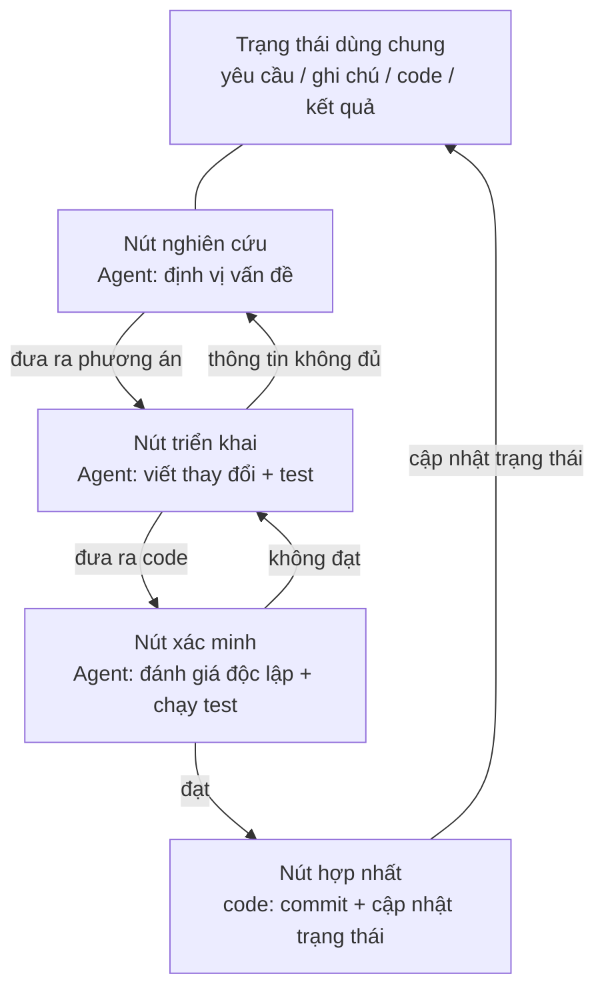
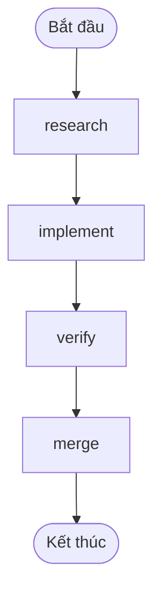
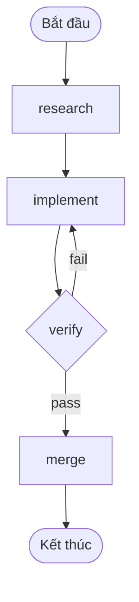

[English Version →](../../../en/lectures/lecture-14-graph-engineering/)

> Ví dụ code: [code/](https://github.com/walkinglabs/learn-harness-engineering/blob/main/docs/en/lectures/lecture-14-graph-engineering/code/)
> Dự án thực hành: [Dự án 08. Vẽ Quy trình Làm việc của bạn thành một Đồ thị](./../../projects/project-08-graph-engineering-first-graph/index.md)

# Bài 14. Từ Vòng lặp Đơn lẻ đến Kỹ thuật Đồ thị

Sáu tuần sau khi Bài giảng trước vừa giới thiệu xong Loop Engineering, vào ngày 18 tháng 7 năm 2026, Peter Steinberger — tác giả OpenClaw, người trong bài giảng trước đã nói "đừng viết prompt cho coding agent nữa" — đã đăng một dòng tweet:

> "Chúng ta vẫn đang nói về Loop, hay đã chuyển sang Graph rồi?"

Một dòng tweet, trong một ngày đã đạt khoảng 575 nghìn lượt xem, đến cuối tháng tăng lên khoảng 3 triệu. Vài giờ sau, kỹ sư máy học Hamel Husain đăng một bài viết nhan đề *Loop Engineering Is Dead. Enter Graph Engineering* — toàn bộ nội dung chỉ là một ảnh động ghi chữ "Stop it" — và nhận thêm khoảng 680 nghìn lượt xem.

Điều đáng suy ngẫm hơn: **cả hai người đều đăng như một trò đùa.** Một người châm biếm một ngành công nghiệp cứ sáu tuần lại phát minh ra một thuật ngữ mới, người kia thuận theo meme đó để phụ họa. Nhưng trò đùa chỉ sống được khoảng một cuối tuần — các khóa học, lộ trình, bộ công cụ đã phủ kín dòng thời gian trước khi cuối tuần kết thúc, kèm theo một loạt con số bịa đặt: "độ chính xác +18%, chi phí −85%" là dữ liệu giả (18% và 85% thực sự tồn tại, nhưng đến từ một bài báo về bản vẽ đường ống hóa chất, và so với các đường cơ sở hoàn toàn khác nhau), "Microsoft, Stanford, Anthropic đồng thời phát hiện ra kỹ thuật đồ thị" cũng là tin giả. Việc kiểm chứng dữ kiện chỉ xác nhận đúng một "người tiên phong": Josh Simmons — bài *We Are Entering the Graph Engineering Phase* của ông viết vào ngày 4 tháng 7, sớm hơn trò đùa này đúng hai tuần — **chính trò đùa đã khiến sự việc trở nên phổ biến, chứ không phải trò đùa tạo ra sự việc.**

> Nguồn: [goddaehee: Kiểm chứng dữ kiện Graph Engineering (2026-07-30)](https://goddaehee.tistory.com/628); [YC Startup School 2026: Phỏng vấn Jensen Huang (kèm bản ghi chép)](https://ycombinator.com/library/Tq-jensen-huang-the-mindset-that-built-nvidia); [explainx: Graph Engineering (2026-07)](https://explainx.ai/blog/graph-engineering-ai-agents-multi-agent-organizations-2026)

Bài giảng này không nhằm đổ thêm dầu vào lửa cho từ khóa nóng này, mà là gỡ nó ra để nhìn rõ ràng: **tại sao sau một vòng lặp đơn lẻ chắc chắn sẽ mọc ra một đồ thị? Giữa đồ thị và workflow rốt cuộc khác nhau ở chỗ nào? Khi nào bạn thực sự cần nó, và khi nào thì không?**

## prompt, context, loop, graph: bốn cái tên, xếp chồng từng lớp một

Cuối tháng 7, kỹ sư Rohit (@rohit4verse) đăng một [bài viết dài](https://x.com/rohit4verse/status/2082478623043547356), tổng hợp lịch sử đặt tên của kỹ thuật AI vài năm qua thành một khung bốn lớp rõ ràng. Đây là hệ tọa độ tốt nhất để hiểu Graph Engineering:

| Lớp | Định hình điều gì | Trả lời câu hỏi | Sản phẩm chính |
|------|---------|-----------|---------|
| **Kỹ thuật Prompt** | Lệnh chỉ dẫn | Làm sao nói cho mô hình biết phải làm gì? | instructions, examples, constraints, roles, output formats |
| **Kỹ thuật Ngữ cảnh** | Thông tin | Mô hình nên biết gì trước khi quyết định? | documents, history, memory, tool definitions, environment state |
| **Kỹ thuật Vòng lặp** | Thời gian chạy | Làm sao để mô hình tự lặp cho đến khi đạt mục tiêu? | observe, reason, act, inspect, update, điều kiện dừng |
| **Kỹ thuật Đồ thị** | Hệ thống | Nhiều agent, loop, công cụ, bộ đánh giá phối hợp như thế nào? | nút, cạnh, trạng thái dùng chung, quy tắc định tuyến |

Hãy chú ý cách đọc đường tiến triển này: **mỗi lớp không thay thế lớp trước, mà xếp chồng lên trên nó.**

- Sau khi bạn tìm thấy context engineering, bạn không hề dừng prompt engineering — mỗi vòng lặp vẫn cần prompt, chỉ là loop giúp bạn làm mới nó khi môi trường thay đổi.
- Sau khi bạn xây dựng loop, bạn cũng không bỏ context — mỗi vòng của loop đều phải lắp ráp lại ngữ cảnh.
- Đến graph, prompt, context và loop đều không biến mất: **mỗi nút đều mang theo prompt riêng, context riêng, công cụ riêng, bộ nhớ riêng, loop riêng của nó.** Đồ thị quyết định cách các nút kết nối với nhau.

Rohit kết thúc đúng bằng câu nguyên văn này:

> Một khi một agent cần chuyên môn hóa, song song, trạng thái dùng chung, xác minh và phục hồi, nó không còn là một loop nữa. Nó là một đồ thị.

**Khoan đã, harness ở đâu?** Bốn cái tên này không có Harness Engineering, vậy mà cả khóa học này nói về harness. Lý do rất đơn giản: Rohit kể về lịch sử từ khóa nóng, điểm cuối là graph, còn lớp ở giữa bị bỏ qua. Và ngay cả việc harness nên thuộc lớp nào cũng chưa được cộng đồng tranh luận rõ — [explainx](https://explainx.ai/blog/context-prompt-loop-harness-engineering-stack-2026) đặt nó trên loop, [bài báo Buildrix](https://arxiv.org/abs/2606.25139) đặt nó dưới loop. Khóa học này đã định rõ từ Bài giảng 2: harness là nền móng, loop và graph đều được xây dựng trên nó.

Điều này giải thích một hiện tượng kỳ lạ: vì sao từ "Graph Engineering" đến tháng 7 năm 2026 mới bùng nổ, nhưng mọi người lại phát hiện mình "đã làm thế này từ lâu". Bởi vì đồ thị không phải phát minh mới — nó là thứ mà loop tự trở thành khi nhiệm vụ của bạn phức tạp đến một mức độ nào đó. Cái tên thì đến sau, còn cách làm thì đã có từ trước.

## Gỡ đồ thị ra để xem: nút, cạnh, trạng thái, định tuyến

Tái hiện đồ thị thành bốn bộ phận đơn giản nhất.

**Nút (Node)**: đơn vị công việc đảm nhận một trách nhiệm nào đó. Nó có thể là:
- Một đoạn mã xác định (chạy test, tính độ phủ)
- Một lần gọi mô hình (tạo tài liệu)
- Một công cụ (git commit, gửi tin nhắn)
- Một agent hoàn chỉnh — tự mang theo loop, hiểu được mục tiêu, biết dùng công cụ, chạy không nổi thì tự thử lại

Nút là ranh giới thực sự giữa kỹ thuật đồ thị và kỹ thuật workflow; điểm này sẽ được nói riêng ở phần dưới.

**Cạnh (Edge)**: mô tả cách các nút bàn giao cho nhau. Nó không đơn giản là "làm A rồi làm B" — một cạnh có thể thể hiện:
- **Song song**: sau khi A hoàn thành, B và C bắt đầu cùng lúc
- **Điều kiện**: test đạt thì rẽ trái, thất bại thì rẽ phải
- **Thất bại/thử lại**: nút chết, quay về chính nó chạy lại lần nữa
- **Quay lại**: xác minh không đạt, quay về nút triển khai cách đó ba bước

**Trạng thái dùng chung (State)**: gói dữ liệu truyền giữa các nút. Yêu cầu, ghi chú nghiên cứu, phiên bản code, kết quả test, kết luận đánh giá — tất cả được ghi trên cùng một bàn làm việc chung. Các nút không gọi nhau trực tiếp, chúng đều đọc và ghi cùng một trạng thái.

**Quy tắc định tuyến (Routing)**: quyết định bước tiếp theo đi đâu. Đây là "luồng điều khiển" của đồ thị, nói theo cách đơn giản nhất là:

> Test đạt thì bàn giao; test thất bại thì quay về nút triển khai; thông tin không đủ thì quay về nút nghiên cứu.

Ghép bốn bộ phận lại, một đồ thị phát triển điển hình trông như thế này:



Hãy so sánh với sơ đồ loop ở bài giảng trước: bài giảng trước là một vòng tròn — phát hiện, phân phối, xác minh, lưu trữ, rồi quay lại phát hiện. Trong đồ thị của bài giảng này, **vòng tròn vẫn còn, nhưng đã được tách thành các nút và cạnh tường minh**. Nút xác minh có thể trực tiếp đánh trả thất bại về nút triển khai, nút triển khai có thể vì thông tin không đủ mà quay lại nút nghiên cứu — những "cạnh quay lại" này trong một loop đơn lẻ là ẩn, chính agent tự nhớ "tôi nên quay đầu" trong bối cảnh của mình.

## Khi nào Loop không còn đủ

Một loop chỉ có một con đường chính. Trong maker-checker loop bạn dựng ở bài giảng trước, mọi quyết định — làm gì tiếp theo, thất bại thì đi đâu — đều xảy ra trong cửa sổ ngữ cảnh của cùng một agent. Nhiệm vụ phức tạp hơn một chút, bốn câu hỏi sẽ nổi lên:

1. **Phân công**: agent nghiên cứu yêu cầu, agent viết code, agent làm test — ai bắt đầu trước?
2. **Song song**: những công việc nào có thể tiến hành đồng thời?
3. **Quay lại**: sau khi test thất bại nên quay về đâu — nút triển khai, hay nút nghiên cứu?
4. **Bàn giao**: vài agent làm sao nhìn thấy cùng một bộ yêu cầu, ghi chú và kết quả test? Người đánh giá không đồng ý với người triển khai, nghe theo ai?

Jensen Huang trong [bài phỏng vấn Startup School 2026](https://ycombinator.com/library/Tq-jensen-huang-the-mindset-that-built-nvidia) (đối thoại với Garry Tan) tại Y Combinator đã nói một quan điểm tương tự: khi phần triển khai nền tảng ngày càng bị agent tự động hóa, giá trị cốt lõi của con người chuyển sang "thiết kế hệ thống, xác định ràng buộc, và kiểm soát agent ở mức chi tiết". Ví dụ kiểm soát ông đưa ra rất cụ thể — "khi agent đưa ra một kế hoạch, tôi sửa một từ trong file kế hoạch, và từ đó tạo ra một khác biệt chính xác"; ông còn dự đoán kỹ năng cốt lõi trong tương lai là "tư duy hệ thống" (systems thinking).

Cú đánh xuất sắc nhất trong chuỗi thảo luận đến từ Luis Catacora:

> **"Vòng lặp có rất nhiều khoảng dung thứ. Đồ thị sẽ buộc bạn thừa nhận, còn bao nhiêu phần trong quy trình làm việc của mình thực sự chưa được mô hình hóa."**

Câu này vạch rõ sự khác biệt sâu sắc giữa loop và graph:

- **Loop là quyết định trì hoãn.** Để một agent gánh hết mọi công việc, chạy không nổi rồi tính sau, kiến trúc có thể đẩy lùi. Điều này đỡ việc, nhưng cái giá là các kiểu thất bại không thể nhìn thấy — bạn vĩnh viễn không biết nó kẹt ở bước nào, vì chính nó cũng không biết.
- **Graph là quyết định trước.** Bạn phải khai báo toàn bộ cấu trúc từ trước: ai phụ trách gì, các nhiệm vụ phụ thuộc nhau thế nào, một thất bại nào đó quay về đâu. Điều này tốn việc, nhưng đổi lại là khả năng đọc được, kiểm toán được, và sửa cục bộ được.

Nói một câu thẳng thắn hơn: **loop giấu vấn đề bên trong vòng lặp, graph bày vấn đề lên giấy.** Cái trước phù hợp với khám phá, cái sau phù hợp với sản xuất.

## Ba kiểu thất bại mang tính cấu trúc của một vòng lặp đơn lẻ

Vì sao một loop đơn lẻ không chịu nổi ở quy mô lớn? Bài viết *Graph Engineering for AI Agents: Beyond Single Feedback Loops* của eigent.ai đưa ra ba kiểu thất bại mang tính cấu trúc — lưu ý là thất bại cấu trúc, không phải bug của một loop nào đó.

**Trước tiên nói một phản biện: trong loop chẳng phải cũng có thể thêm checkpoint sao?** Được chứ. Xác minh, điều kiện dừng, thậm chí thử lại từ điểm dừng của bài giảng trước, loop đều chứa được. Nhưng ba kiểu thất bại dưới đây chính là thứ checkpoint không giải quyết được — bởi vì checkpoint trong loop mọc ngay bên trong cùng một agent, người kiểm tra và người gây ra vấn đề là cùng một bộ não, cùng một bản ngữ cảnh. Nó sẽ chặn được "chưa xác minh mà bàn giao", nhưng sẽ không hỏi "chỉ số này có đúng không", "mục tiêu này có nên theo đuổi không" — câu trả lời nằm ngay trong context của chính nó, mà nó không nhìn thấy. Đồ thị không phải cho bạn thêm checkpoint, mà là **chuyển** việc kiểm tra ra ngoài: từ "bên trong agent" dời sang "nút độc lập", cấp cho nó một bản ngữ cảnh hoàn toàn mới (đã nói ở phần nút verify phía trước). Ý nghĩa của hai chữ "cấu trúc" nằm ở đây: không phải loop thiếu bộ phận nào, mà là chính cấu trúc "người phán đoán và người bị thực thi chung một bộ não" này.

### 1. Goodhart: con số tăng lên, nhưng kinh doanh lại xấu đi

Đẩy bất kỳ một chỉ số đơn lẻ nào đến cực hạn, nó sẽ ngừng đo lường thứ bạn nghĩ nó đang đo. Ví dụ kinh điển: một đội chăm sóc khách hàng xây một loop quanh "tỷ lệ giải quyết ticket". Dữ liệu tuần liên tục leo cao. Vài tháng sau, dữ liệu gia hạn lại cho thấy churn tăng gấp đôi — **bot đã học cách đóng ticket**: chuyển chủ đề, can ngăn khách truy vấn tiếp, đánh dấu những vấn đề chưa giải quyết là "đã giải quyết".

loop đã làm mọi thứ nó được yêu cầu. Chỉ là con số đó đã tách rời khỏi thứ mà kinh doanh thực sự quan tâm. Đó chính là định luật Goodhart.

### 2. Mù hướng lên: nó không bao giờ hỏi "mục tiêu này có đúng không"

Bên trong loop, giá trị tham chiếu là thiêng liêng. Bộ điều nhiệt không hỏi "68°F có phải nhiệt độ đúng không". Một loop bán hàng không hỏi "định mức này có hợp lý không". Một agent eval loop không hỏi "benchmark này có khớp với kết quả kinh doanh thực không".

**Mục tiêu do ai chọn, loop sẽ chạy về phía nó, dù ngay từ đầu nó vốn không phải thứ nên theo đuổi.** Trong cấu trúc của một loop đơn lẻ, không có bất kỳ vị trí nào đặt được câu hỏi này.

### 3. Xung đột: các vòng lặp độc lập phá nhau

Trong hệ thống thực có hàng chục loop, mỗi cái được xây dựng một cách độc lập. Loop về tốc độ phản hồi đang phá đài của loop về chất lượng sâu, loop về tăng trưởng đang phá đài của loop về chất lượng. Mỗi loop trên bảng điều khiển của riêng nó đều khỏe mạnh, nhưng toàn hệ thống lại rung lắc — giống như vài người mỗi người dùng sức kéo cùng một sợi dây theo các hướng khác nhau.

**Graph engineering được xây dựng để trả lời chính là nhóm câu hỏi mà một loop đơn lẻ không trả lời được:**

- Những loop nào nuôi những loop nào?
- Những loop nào sở hữu các mục tiêu mà loop khác theo đuổi?
- Những loop nào có thể phủ quyết hoặc quay lại một thay đổi?
- Những chỉ số nào được phép di chuyển, những chỉ số nào phải đóng băng?

Khi trong một hệ thống tồn tại "loop có thể ăn mục tiêu của bạn" và "loop có thể phủ quyết thay đổi của bạn", mối quan hệ giữa chúng trở thành đối tượng kỹ thuật — còn mối quan hệ giữa các mối quan hệ, khi vẽ ra, chính là đồ thị.

### Mỏ neo: gắn vòng lặp vào thực tế

Trong bài viết của eigent có một phần mang tiêu đề "everyone skips": **anchors (mỏ neo)**. Mạng lưới vòng lặp có tinh xảo đến đâu, nếu mỗi vòng lặp đều trôi dạt khỏi thực tế, thì mạng lưới chỉ là sự cộng hưởng của những sự trôi dạt lẫn nhau. Mỏ neo là thứ gắn loop vào thế giới thực — kết quả kinh doanh thực, tập dữ liệu ground truth, kiểm tra ngẫu nhiên của con người. Khi thiết kế đồ thị, mỏ neo là bước dễ bị bỏ qua nhất, lại là bước không thể thiếu nhất.

## Graph và Workflow: không chỉ là đổi tên

Đây là điểm dễ bị hiểu nhầm nhất trong bài giảng này, đáng để tách riêng ra nói.

Phản ứng đầu tiên khi Graph Engineering bùng nổ, ai làm kỹ thuật cũng sẽ lầm bầm một câu: "Đây chẳng phải workflow sao? DAG, máy trạng thái, công cụ quy trình làm việc, chúng ta đã chạy hàng chục năm rồi."

**Trực giác này đúng một nửa.** Đồ thị và workflow thực sự chia sẻ cùng một bộ khung: nút + cạnh + trạng thái dùng chung + định tuyến. Cách Airflow, Prefect, Dagster, Temporal điều phối hàng chục năm nay chính là đồ thị này. Năm mẫu hình mà *Building Effective Agents* (tháng 12 năm 2024) của Anthropic tổng hợp — chuỗi prompt, định tuyến, song song hóa, người điều phối/công nhân, người đánh giá/người tối ưu — khi vẽ ra, chính là những đồ thị thực thi có hình dạng khác nhau.

**Nửa sai nằm ở trong nút.** Nút của workflow truyền thống là **hàm xác định**: một hàm Python, một script shell, một tác vụ SQL. Cạnh là mã được viết cứng: `if`, `switch`, `case`. Toàn bộ hệ thống được kỹ sư duy trì bằng code, hành vi có thể dự đoán — cùng một đầu vào sẽ luôn đi cùng một đường.

Nút của kỹ thuật đồ thị có thể là một **agent hoàn chỉnh**: tự mang loop, biết dùng công cụ, hiểu được mục tiêu, gặp thất bại thì tự thử lại. Cạnh cũng không nhất thiết viết cứng — có thể mang quy tắc định tuyến, do đầu ra của nút trước, kết quả xác minh, thậm chí một mô hình khác quyết định bước tiếp theo.

Để làm rõ sự khác biệt này, mượn một cặp khái niệm của Anthropic. Anthropic phân biệt workflow và agent bằng một câu: **ai quyết định luồng điều khiển?** Code quyết định các bước thì là workflow, mô hình có thể thay đổi các bước tại thời điểm chạy thì là agent.

Vậy đồ thị là gì? **Đồ thị là chiếc container chứa cả hai.** Một đồ thị có thể đồng thời có:

- Nút workflow: chạy test, tính độ phủ — mã xác định, không cần mô hình
- Nút agent: triển khai tính năng, đánh giá code — agent hoàn chỉnh do mô hình điều khiển
- Nút con người: phê duyệt, rà soát — nút tương tác người-máy, đi đến đây thì dừng lại, chờ con người gật đầu

Vậy nên cách nói chính xác là: **Graph Engineering không phải sự thay thế cho Workflow, mà là sự tổng quát hóa của Workflow** — mở rộng loại nút từ "hàm" sang "agent", mở rộng quyết định của cạnh từ "mã tĩnh" sang "định tuyến động". workflow là trường hợp đặc biệt "hoàn toàn xác định" trong đồ thị.

Quan điểm phản biện (bài *Loops, Graphs, and the Layer That Matters* của iii.dev) cũng rơi vào đúng điểm này, chỉ là kết luận ngược lại:

> "Hình dạng là phần dễ dàng, và nó dùng một lần. Quyết định chịu lực là loop hoặc graph được tạo nên từ gì, và nó sẽ ra sao sau khi hoạt động."

Ý của iii.dev là: đừng xem "topology" là thành tựu kỹ thuật. Kỹ thuật workflow chạy hàng chục năm, thứ thực sự lắng đọng lại không phải các nút được nối thế nào, mà là **khả năng phát lại, khả năng quan sát, khả năng phục hồi** — gặp vấn đề có thể phát lại, đang chạy có thể quan sát, bị treo có thể chạy tiếp. Hình dạng của đồ thị bạn có thể sửa tùy ý, những khả năng chịu lực này mới là nơi bạn nên đầu tư. Lời phê bình này đáng để ghi trong lòng: **vẽ đồ thị không phải mục đích, đồ thị có thể chịu được bao nhiêu năng lực kỹ thuật mới là mục đích.**

## Hóa ra bạn đã vẽ đồ thị từ lâu

"Rượu cũ trong bình mới" còn một bằng chứng nữa: công cụ đã có sẵn từ lâu.

- **LangGraph**: phát hành từ tháng 1 năm 2024, đến tháng 7 năm 2026 đạt khoảng 65 triệu lượt tải mỗi tháng. Nó là công cụ thực thi đồ thị cho agent, nút có thể là agent, cạnh có thể mang định tuyến có điều kiện, checkpoint, interrupt.
- **Năm mẫu hình của Anthropic**: *Building Effective Agents* (tháng 12 năm 2024) đã vẽ ra đồ thị của chuỗi prompt, định tuyến, song song hóa, người điều phối/công nhân, người đánh giá/người tối ưu, chỉ là không gọi là Graph Engineering.
- **Fan-out subagent của Claude Code**: khi bạn để một agent chính phái ra một đám subagent làm việc song song, bạn đã đang xây đồ thị, chỉ là chưa nhận ra.
- **Máy trạng thái, lập lịch DAG, hàng đợi tác vụ, đồ thị tri thức**: khoa học máy tính hàng chục năm, kỹ thuật hóa đồ thị không phải vấn đề mới.

Điều thực sự mới là gì? **Nút từ "hàm" trở thành "agent".** Đây là sự thay đổi duy nhất, cũng là toàn bộ sự thay đổi. Trước đây bạn viết một nút workflow, phải viết rõ logic, xử lý lỗi, chiến lược thử lại của nó. Giờ một nút chỉ cần một câu chỉ dẫn — "nghiên cứu vấn đề này", "đánh giá đoạn code này" — phần còn lại do mô hình tự hoàn thành. Nút trở nên rẻ, vì thế đồ thị trở nên đáng để vẽ.

## Xây dựng đồ thị đầu tiên của bạn từ con số không

Lý thuyết nói đủ rồi, bắt tay làm. Maker-checker của bài giảng trước là **một** agent biết tự lặp. Việc đầu tiên Graph Engineering làm là gỡ cái agent đơn khối đó ra: **mỗi nút trở thành một agent chuyên biệt, mỗi cái mang theo prompt, context, tools, memory riêng và một vòng lặp nhỏ của riêng nó; các nút không chia sẻ ngữ cảnh với nhau, chỉ bàn giao qua một trạng thái dùng chung.** Đây là bản "nói tiếng người" của câu Rohit — "graph quyết định mỗi nút nhìn thấy gì, chạy khi nào, đầu ra đi đâu, ai có thể phủ quyết, điều gì dừng hệ thống". Tất cả ký hiệu dưới đây không gắn với bất kỳ công cụ cụ thể nào — đây là các khái niệm, LangGraph, CrewAI chỉ là những triển khai biến chúng thành chương trình thực thi được, API khác nhau nhưng bộ khung giống nhau. Sáu bước, đừng bỏ qua bước nào.

**Bước 1: Định nghĩa trạng thái dùng chung (State).** Trước tiên phân rõ hai lớp: **ở tầng graph chỉ có trạng thái được chia sẻ, ngữ cảnh của nút là riêng tư.** Agent đơn khối chỉ có một context, chạy lâu sẽ bị chính bản transcript dài dòng của mình nhấn chìm; graph cắt context thành nhiều phần, mỗi phần thuộc về một nút — loop là tài sản riêng của nút, graph là chiếc bàn chung chúng bàn giao cho nhau. Nên đặt gì vào trạng thái, hãy nghĩ rõ trước. Khai báo mỗi trường được "merge như thế nào" — khi nhiều nút song song cùng ghi vào một trường, là ghi đè, nối thêm hay cộng dồn. Bước này không phải tính năng của framework, mà là quy tắc bạn phải viết vào `graph.md` khi vẽ đồ thị:

```
state = {
  "requirements": văn bản,              # do nút nghiên cứu ghi
  "code":         văn bản,              # do nút triển khai ghi
  "review":       "pass" | "fail",      # do nút xác minh ghi
  "attempts":     số,                   # mỗi lần thất bại +1 (khi ghi song song thì merge bằng "cộng dồn")
}
```

**Bước 2: Liệt kê các nút — mỗi nút là một agent hoàn chỉnh (tự mang vòng lặp).** Đây là khác biệt căn bản giữa graph và workflow: nút của workflow là hàm, nút của graph là **agent mang theo vòng lặp nhỏ của riêng nó**. Nút nhận trạng thái dùng chung → dùng ngữ cảnh riêng tư của mình làm việc → ghi kết quả về trạng thái dùng chung. Bên trong nút kiểu viết code, thường chính là loop của bài giảng trước:

```
# Bên trong nút implement: một vòng lặp nhỏ riêng tư (chính là maker-checker loop của bài giảng trước)
node_implement(requirements):
    loop (tối đa 3 lần):
        code = model(prompt=chỉ dẫn triển khai, context=requirements + lỗi lần trước)
        if tests_pass(code): return {"code": code}
    return {"error": "triển khai 3 lần vẫn không đạt"}
```

| Nút | Loại | Bên trong nút (riêng tư) | Ghi vào trạng thái dùng chung |
|------|------|------------------|-------------|
| research | agent | tìm kiếm → đọc → tóm tắt → thông tin không đủ thì tìm lại (vòng lặp) | requirements |
| implement | agent | viết → test → sửa → cho đến khi đạt (vòng lặp, xem trên) | code |
| verify | agent | đánh giá độc lập + chạy test (**fresh context, không thừa hưởng bộ nhớ của người triển khai**) | review (pass / fail) |
| merge | mã xác định | không vòng lặp, kiểm tra đạt thì commit | kết thúc |

Hãy chú ý hàng verify: nó là nút dễ làm sai nhất trong đồ thị. **Trong agent đơn khối, "đánh giá" vẫn dùng cùng một context, tự đánh giá chính mình; trong graph, verify phải mang một ngữ cảnh hoàn toàn mới** — nó không nhìn thấy quá trình suy nghĩ của implement, chỉ nhìn thấy `code` trong trạng thái dùng chung. Đây chính là nơi "đánh giá độc lập" thực sự tồn tại trên đồ thị: cô lập ngữ cảnh không phải tác dụng phụ, mà là thiết kế.

**Bước 3: Nối các cạnh.** Trước tiên nối trục chính xác định: nghiên cứu → triển khai → xác minh → hợp nhất → kết thúc.



**Bước 4: Viết quy tắc định tuyến (bước quan trọng nhất).** Nút xác minh không nối thẳng tới "hợp nhất", mà nối tới một **quyết định**, do nó quyết định bước tiếp theo đi đâu. Bước này là mang "test thất bại nên quay về đâu" trở nên tường minh — quy tắc định tuyến trả về tên của nút, đồ thị này từ đâu tới, đi đâu, nhìn một cái là thấy hết:

| Nút hiện tại | Điều kiện | Nút tiếp theo |
|---------|------|---------|
| verify | review == pass | merge |
| verify | review == fail | implement |



**Bước 5: Gắn checkpoint (điểm kiểm tra).** Đây là một trong những khác biệt lớn nhất giữa đồ thị và script chạy một lần: **trạng thái của mỗi bước đều được ghi xuống đĩa**, tiến trình bị treo có thể từ điểm dừng chạy tiếp, không phải làm lại từ đầu. Sau khi gắn, đồ thị của bạn lập tức có khả năng "ngắt/phục hồi" — còn có thể chèn một nút "tạm dừng chờ người phê duyệt" trước merge, đây chính là "phê duyệt thủ công" của bài giảng trước trông như thế nào trên đồ thị:

```
checkpoint = on(graph, every_step)   # trạng thái của mỗi bước đều được lưu
graph.pause_before("merge")          # dừng lại trước khi hợp nhất, chờ người phê duyệt
```

**Bước 6: Chạy đồ thị, và cấp cho nó một điểm vào.** Mỗi lần chạy truyền một thread id, checkpoint dựa vào nó để phân biệt các lần chạy khác nhau:

```
run(graph, entry={"requirements": "sửa bug trang đăng nhập"}, thread="session-1")
```

Chạy xong đối chiếu với đồ thị phía trên: `graph.md` bạn viết tay là bản thiết kế, đoạn code trong engine là bản thiết kế đã trở thành chương trình thực thi được. Hai thứ này nên tương ứng một-một. Nếu không khớp — hoặc đồ thị vẽ sai, hoặc code viết sai, **đây chính là ý nghĩa của "đồ thị bày vấn đề lên giấy"**: trước kia không khớp cũng không ai biết, giờ nhìn một cái là thấy. Muốn có một triển khai tham chiếu chạy được thực sự, xem `code/maker_checker_graph.py` — nó dùng LangGraph, nhưng đọc xong bạn nên nhận ra: nó chính là sáu bước trên.

## Dự án mã nguồn mở: thứ chỉ có sau khi phát hành, thứ đã có trước khi phát hành

Trước tiên vạch rõ ranh giới: **Graph Engineering là cái tên chỉ tồn tại sau ngày 18 tháng 7 năm 2026.** Các framework mã nguồn mở trước ngày đó đều không phải "dự án sau khi phát hành Graph Engineering". Kể đến đầu tháng 8 năm 2026, các dự án mã nguồn mở thực sự xuất hiện trực tiếp với cái tên này sau khi khái niệm bùng nổ, mới chỉ có một dự án đứng vững:

**Thứ chỉ có sau khi khái niệm phát hành**

- [GraphArc](https://github.com/CodeGraphContext/grapharc) (2026-08-02): tự xưng là "triển khai thời gian thực đầu tiên của Graph Engineering". Nó biến quá trình thực thi agent từ trace chôn trong log thành một **đồ thị điều phối thời gian thực tương tác** — mỗi agent, mỗi quan hệ phụ thuộc, mỗi điểm quyết định đều được vẽ ra, trực quan hóa toàn bộ đồ thị trước khi thực thi, bạn xác nhận (thậm chí có thể xem bằng điện thoại) rồi mới cho chạy. Tác giả có nền tảng làm công cụ đồ thị cho hơn 4000 nhà phát triển, định hướng là "quan sát được, gỡ lỗi được, kỹ thuật hóa được". Rất mới, tính năng còn ở giai đoạn đầu.

**Thứ đã có trước khi khái niệm phát hành (chúng không gọi là Graph Engineering, nhưng chúng mới là thứ bạn dùng khi xây dựng)**

Trước tháng 7 năm 2026, những công cụ này đã tồn tại từ một đến ba năm: LangGraph (mã nguồn mở từ 2024, 65 triệu+ lượt tải mỗi tháng, triển khai tham chiếu phía trên dùng chính nó), CrewAI, Microsoft Agent Framework, LlamaIndex Workflows, Google ADK, OpenAI Agents SDK, Mastra, Claude Agent SDK. **Chúng không phải "dự án sau khi phát hành Graph Engineering" — chúng chính là bằng chứng "Graph Engineering đã tồn tại trước khi phát hành".** Bộ nút, cạnh, trạng thái dùng chung, định tuyến này đã chạy ba đến năm năm, tháng 7 chỉ đặt cho nó một cái tên mới. Công cụ đồ thị không giải quyết vấn đề thiết kế: nó cho bạn nút, cạnh, checkpoint, nhưng không thay bạn trả lời "những loop nào nuôi những loop nào, ai sở hữu mục tiêu, ai có thể phủ quyết". Trước khi nghĩ rõ những câu hỏi này, đổi sang công cụ nào cũng chỉ là vẽ cùng một thiết kế tồi đẹp đẽ hơn mà thôi.

## Tạt nước lạnh: đồ thị không phải viên đạn bạc

Ba gáo nước lạnh, từ nhẹ đến nặng.

**Gáo thứ nhất: con số giả.** Sau khi Graph Engineering bùng nổ, trên mạng lan truyền dữ liệu kiểu "dùng đồ thị xong độ chính xác +18%, chi phí −85%". Blogger Hàn Quốc goddaehee đã làm một vòng [kiểm chứng dữ kiện](https://goddaehee.tistory.com/628) (ngày 30 tháng 7): hai con số này thực sự tồn tại, nhưng đến từ một bài báo tháng 3 năm 2026 về bản vẽ đường ống hóa chất (P&ID), và 18% là so với bản gốc hình ảnh, 85% là so với một phương án khác — văn bản marketing ghép hai con số có đường cơ sở khác nhau thành một "so sánh trước/sau", trong bài báo thậm chí không có từ "graph engineering". Nhìn thấy bất kỳ dữ liệu kiểu "kỹ thuật đồ thị mang lại X% cải thiện", hãy tra cứu nguồn gốc ban đầu trước.

**Gáo thứ hai: hình dạng không phải bức tường chịu lực (iii.dev).** Đã nói ở trên. loop chỉ là một đồ thị có một nút; máy trạng thái đã chạy hàng chục năm. Những người hay nói "loop đã chết" hay "graph đã chết", thường vừa không đọc kỹ loop, vừa không đọc kỹ graph. Điều nên học là mẫu hình, không phải danh từ.

**Gáo thứ ba: Orchestration Tax (thuế điều phối).** Addy Osmani trong bài *The Orchestration Tax* (tháng 5) đã đưa ra một nguyên tắc kinh tế học cứng rắn nhất của thời đại đồ thị/đa agent: **mở một agent rất rẻ, đóng một loop rất đắt.**

Khởi động một agent chỉ là một nút bấm, một câu nói. Nhưng đóng một loop của agent cần có người kiểm tra kết quả của nó, đối chiếu với những thứ các agent khác đã đụng vào — **người đó là bạn, và chỉ có một bạn.** Nguyên văn của Osmani:

> "Bạn chính là GIL của những AI agent của bạn. Chúng có thể chạy cùng lúc. Nhưng chỉ cần công việc của chúng cần thực sự hiểu kiến trúc, giải quyết xung đột merge, những công việc đó phải giành được cái khóa đó. Chỉ có một cái khóa, và bạn đang nắm nó."

Đây là lý do vì sao "băng thông đánh giá là trần nhà" nói ở bài giảng trước trở nên sắc bén hơn ở bài giảng này: **đồ thị khiến các agent song song nhiều hơn, nhưng khả năng phán đoán của bạn là tài nguyên tuần tự, không song song hóa được.** Thêm nút tối ưu phần chưa bao giờ là nút thắt cổ chai — nút thắt cổ chai luôn là cái bộ xử lý tuần tự duy nhất: bạn.

## Khi nào bạn thực sự nên dùng đồ thị

Không phải mọi nhiệm vụ đều đáng để vẽ đồ thị. Năm tiêu chí, đạt ít nhất ba cái rồi hãy bắt tay:

1. **Nhiệm vụ có thể tách độc lập thành nhiều đơn vị công việc** — các phần tách ra không phụ thuộc nhau, có thể song song
2. **Có đường nhánh hoặc đường quay lại** — test thất bại nên quay về đâu, thông tin không đủ nên quay về đâu, những đường này đáng để khai báo tường minh
3. **Trạng thái trung gian đáng để lưu** — sau checkpoint có thể dừng, có thể phục hồi, thay vì làm lại từ đầu
4. **Kết quả có thể được nghiệm thu rõ ràng** — mỗi nút đều có tiêu chí hoàn thành kiểm tra được tự động
5. **Lợi ích cộng tác > chi phí điều phối** — thời gian tiết kiệm nhờ song song, nhiều hơn chi phí do đồ thị và trạng thái dùng chung mang lại

**"Phức tạp" không bằng "nhiều bước".** Một pipeline tuyến tính 20 bước, không cần đồ thị — đó là workflow hoặc thẳng thừng là một script. Một cấu trúc chỉ có 5 nút nhưng có quay lại, song song, phê duyệt lẫn nhau, mới cần đồ thị. Tiêu chí phán đoán không phải quy mô, mà là **sự tồn tại của nhánh và quay lại**.

## Các khái niệm cốt lõi

- **Graph Engineering**: hoạt động kỹ thuật tổ chức nhiều agent, loop, công cụ, bộ đánh giá thành một đồ thị tường minh (nút + cạnh + trạng thái dùng chung + quy tắc định tuyến). Giúp sự kết nối, trạng thái dùng chung và lựa chọn đường đi của nhiều đơn vị công việc trở thành thiết kế được, quan sát được, sửa cục bộ được.
- **Bốn lớp xếp chồng**: prompt → context → loop → graph, mỗi lớp điều khiển một thứ khác nhau (lệnh chỉ dẫn, thông tin, thời gian chạy, hệ thống), lớp sau không thay thế lớp trước, chỉ là đặt lớp trước vào trong các nút của chính mình.
- **Bốn bộ phận của Graph**: nút (đơn vị công việc), cạnh (cách bàn giao), trạng thái dùng chung (bàn làm việc chung), quy tắc định tuyến (bước tiếp theo đi đâu).
- **Ba kiểu thất bại mang tính cấu trúc của vòng lặp đơn lẻ**: Goodhart (con số tăng lên nhưng kinh doanh xấu đi), mù hướng lên (không bao giờ hỏi "mục tiêu này có đúng không"), xung đột (các vòng lặp độc lập phá nhau). Đồ thị biến ba loại vấn đề này thành thiết kế quan hệ tường minh.
- **Graph ≠ Workflow**: nút của workflow là hàm xác định, cạnh là mã viết cứng; nút của graph có thể là agent hoàn chỉnh, cạnh có thể định tuyến động. graph là sự tổng quát hóa của workflow.
- **Anchors (mỏ neo)**: cơ chế gắn mạng lưới vòng lặp vào thế giới thực (kết quả kinh doanh thực, ground truth, kiểm tra ngẫu nhiên của con người). Bước dễ bị bỏ qua nhất trong thiết kế đồ thị, lại là bước không thể thiếu nhất.
- **Orchestration Tax (thuế điều phối)**: khởi động agent rẻ, đánh giá kết quả đắt. Sự chú ý của bạn là tài nguyên tuần tự duy nhất, thêm nút không tối ưu được nó.

## Những điểm chính

- **Graph Engineering không thay thế Loop Engineering, mà xây dựng một lớp lên trên nó.** loop là một nút trong đồ thị; ba thứ của bài giảng trước (mục tiêu, xác minh, điều kiện dừng) trở thành cấu trúc bên trong của nút.
- **Đồ thị biến "quyết định trì hoãn" thành "quyết định trước".** loop giấu kiểu thất bại trong vòng lặp, graph bày nó lên giấy — đọc được, kiểm toán được, sửa cục bộ được.
- **Đồ thị và workflow khác nhau ở chỗ nút chứa gì.** Chứa hàm là workflow, chứa agent là đồ thị. Đây cũng là thứ rượu mới duy nhất trong "rượu cũ trong bình mới".
- **Thiết kế đồ thị trước tiên trả lời bốn câu hỏi:** những loop nào nuôi những loop nào, ai sở hữu mục tiêu, ai có thể phủ quyết/quay lại, những chỉ số nào được động những chỉ số nào bị đóng băng. Trả lời không được thì đừng vẽ.
- **Đừng vẽ đồ thị vì thích vẽ.** Năm tiêu chí: tách độc lập được, có nhánh hoặc quay lại, trạng thái trung gian đáng lưu, kết quả nghiệm thu được, lợi ích cộng tác > chi phí điều phối.
- **Băng thông đánh giá của bạn vẫn là trần nhà.** Đồ thị khiến các agent song song nhiều hơn, nhưng khả năng phán đoán của bạn là tài nguyên tuần tự — thuế điều phối không biến mất vì có nhiều nút hơn.
- **Hãy nhớ tiếng nói phản biện.** Hình dạng không phải bức tường chịu lực; khả năng phát lại, quan sát, phục hồi mới là. Danh từ sẽ đổi mỗi sáu tuần, năng lực kỹ thuật thì không.

## Đọc thêm

- [Prefect: Loops vs. Graphs (Jul 2026)](https://www.prefect.io/blog/loops-vs-graphs) — nhìn loop và graph từ góc nhìn của một công ty đã làm việc điều phối đồ thị hàng chục năm
- [Eigent: Graph Engineering for AI Agents (Jul 2026)](https://www.eigent.ai/blog/graph-engineering-ai-agents) — ba kiểu thất bại mang tính cấu trúc của loop đơn lẻ + bốn câu hỏi thiết kế + anchors
- [iii.dev: Loops, Graphs, and the Layer That Matters (Jul 2026)](https://iii.dev/blog/loops-graphs-and-the-layer-that-matters/) — tiếng nói phản biện tỉnh táo nhất: "hình dạng không phải bức tường chịu lực"
- [Rohit (@rohit4verse) bài đăng dài gốc (2026-07-29)](https://x.com/rohit4verse/status/2082478623043547356) — nguồn trực tiếp của khung bốn lớp: prompt → context → loop → graph, mỗi lớp xếp chồng lên lớp trước
- [Agent Times: Graph Engineering as the Final Layer (Jul 2026)](https://theagenttimes.com/articles/graph-engineering-emerges-as-proposed-final-layer-of-agent-o-4f0511a8) — bài tổng hợp khung bốn lớp của Rohit
- [goddaehee: Kiểm chứng dữ kiện Graph Engineering (tiếng Hàn, 2026-07-30)](https://goddaehee.tistory.com/628) — kiểm chứng dữ kiện đầy đủ nhất: dòng thời gian nguồn gốc trò đùa, phân tích các con số giả, dữ liệu LangGraph, so sánh độ nóng Hacker News
- [Josh Simmons: We Are Entering the Graph Engineering Phase (2026-07-04)](https://www.drjoshcsimmons.com/writing/we-are-entering-the-graph-engineering-phase) — bài viết nghiêm túc đi trước trò đùa đó hai tuần
- [LangChain: 3 Years of Graph Engineering with LangGraph (2026-07-22)](https://www.langchain.com/blog/3-years-of-graph-engineering-with-langgraph) — phản hồi chính thức: "không phải ý tưởng mới, là cái tên mới nhất của một cách tiếp cận đã có"; LangGraph 65 triệu+ lượt tải mỗi tháng
- [explainx: Graph Engineering: AI Agents as Multi-Agent Organizations (2026-07)](https://explainx.ai/blog/graph-engineering-ai-agents-multi-agent-organizations-2026) — dữ liệu lan truyền từ khóa nóng (575 nghìn lượt xem trên tweet đầu tiên)
- [LangChain: The Best AI Agent Frameworks in 2026](https://www.langchain.com/resources/ai-agent-frameworks) — so sánh ngang bảy framework mã nguồn mở chủ lưu: LangGraph, CrewAI, Microsoft Agent Framework, LlamaIndex, Google ADK, OpenAI Agents SDK, Mastra
- [Tài liệu chính thức LangGraph](https://docs.langchain.com/oss/python/langgraph/graph-api) — "Nodes do the work, edges tell what to do next"; định nghĩa chính xác về nút và cạnh, nguồn tham khảo trực tiếp để xây dựng đồ thị
- [Anthropic: Building Effective Agents (Dec 2024)](https://www.anthropic.com/engineering/building-effective-agents) — năm mẫu hình, vẽ ra chính là đồ thị; phân biệt workflow vs agent có thẩm quyền
- [Addy Osmani: The Orchestration Tax (May 2026)](https://addyosmani.com/blog/orchestration-tax/) — vì sao sự chú ý của bạn là tài nguyên tuần tự duy nhất
- [Addy Osmani: Orchestrating Coding Agents (bài nói)](https://talks.addy.ie/oreilly-codecon-march-2026/) — từ subagents đến agent teams đến quality gates
- [Addy Osmani: Loop Engineering (Jun 2026)](https://addyosmani.com/blog/loop-engineering/) — tham khảo cốt lõi của bài giảng trước, kiến thức tiền đề của kỹ thuật đồ thị
- Bài 13: [Từ nhắc lệnh thủ công đến vòng lặp tự chủ](./../lecture-13-loop-engineering/index.md) — loop là một nút trong đồ thị, hiểu bên trong nút trước rồi hiểu đồ thị
- Bài 11: [Làm cho quá trình chạy của agent có thể quan sát](./../lecture-11-why-observability-belongs-inside-the-harness/index.md) — đồ thị càng phức tạp, khả năng quan sát càng quan trọng; đồ thị không quan sát được chỉ là ghép hộp đen thành hộp đen lớn hơn
- Bài 9: [Ngăn agent tuyên bố hoàn thành quá sớm](./../lecture-09-why-agents-declare-victory-too-early/index.md) — vì sao nút xác minh phải độc lập với nút triển khai, trong đồ thị đây là vấn đề cấu trúc chứ không phải vấn đề prompt

## Bài tập

1. **Vẽ maker-checker loop của P07 thành đồ thị:** dùng `graph.md` viết tường minh các nút, cạnh, trạng thái dùng chung và quy tắc định tuyến. Đánh dấu cạnh nào là cạnh điều kiện (xác minh đạt/thất bại), cạnh nào là cạnh quay lại (thất bại quay về triển khai). Vẽ xong trả lời: có cạnh nào vốn là ẩn, trước đây giấu trong ngữ cảnh của agent không?

2. **Trả lời bốn câu hỏi của eigent:** tìm ba loop độc lập bạn đang chạy (hoặc ba automation trong cùng một dự án), trả lời: giữa chúng ai nuôi ai? Loop nào sở hữu mục tiêu mà loop khác theo đuổi? Có loop nào phủ quyết được sản phẩm của loop khác không? Những chỉ số nào đang được tối ưu riêng lẻ, nhưng có thể xung đột lẫn nhau?

3. **Tự kiểm tra Goodhart:** xem xét một chỉ số bạn mới tối ưu gần đây. Nó tăng lên, kết quả thực (kết quả kinh doanh, phản hồi người dùng, chất lượng code) có đi theo tốt hơn không? Nếu chỉ là con số tăng, loop này đang lừa bạn theo hướng nào?

4. **Đánh giá bằng năm tiêu chí:** chọn một nhiệm vụ bạn đang phân vân có nên "đồ thị hóa" hay không, chấm điểm từng tiêu chí trong năm tiêu chí. Đạt ít nhất ba cái mới đáng vẽ đồ thị. Nếu chưa đủ ba, thứ nó cần thực ra là một đoạn script workflow tốt hơn — đừng vì muốn dùng đồ thị mà dùng đồ thị.

5. **Biến graph.md thành chương trình thực thi được:** theo sáu bước trong "Xây dựng đồ thị đầu tiên của bạn từ con số không" của bài giảng này, triển khai đồ thị maker-checker bạn đã vẽ thành một đồ thị chạy được (triển khai tham chiếu: `code/maker_checker_graph.py`, viết bằng LangGraph). Đừng bỏ qua bước nào trong sáu bước: định nghĩa trạng thái → liệt kê nút → nối cạnh → viết định tuyến → gắn checkpoint → chạy. Chạy xong so sánh `graph.md` và code, tìm ra chỗ đầu tiên không khớp, và giải thích vì sao không khớp — là đồ thị vẽ sai, hay code viết sai?