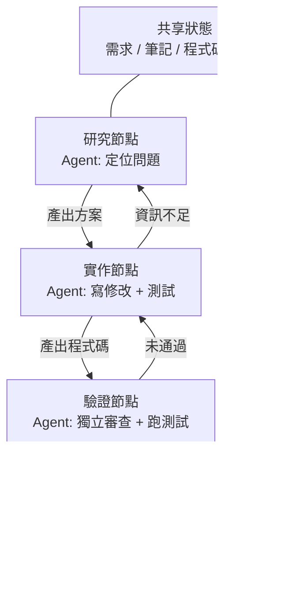
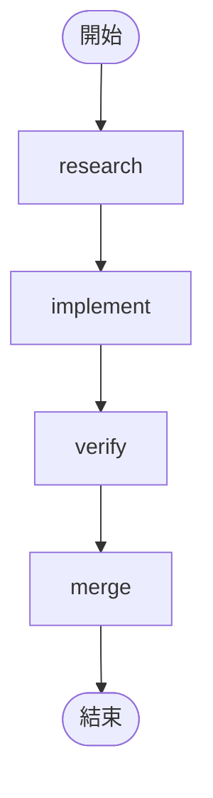
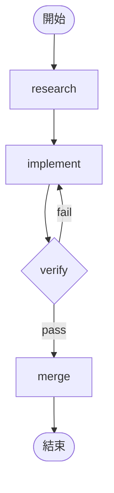

[English Version →](../../../en/lectures/lecture-14-graph-engineering/)

> 本篇程式碼範例：[code/](https://github.com/walkinglabs/learn-harness-engineering/blob/main/docs/en/lectures/lecture-14-graph-engineering/code/)
> 實戰練習：[Project 08. 把你的工作流畫成一張圖](./../../projects/project-08-graph-engineering-first-graph/index.md)

# 第十四講. 從單循環到圖工程

上一講剛講完 Loop Engineering 六週後，2026 年 7 月 18 日，Peter Steinberger——就是上一講裡那位「不要再給 coding agent 寫 prompt 了」的 OpenClaw 作者——發了一條推：

> 「我們還在談 Loop，還是已經轉向 Graph 了？」

一條推，一天內就拿到約 57 萬瀏覽，到月底漲到約 300 萬。幾小時後，機器學習工程師 Hamel Husain 發了一篇題為《Loop Engineering Is Dead. Enter Graph Engineering》的文章——正文只有一張寫著 "Stop it" 的動圖——又拿了約 68 萬瀏覽。

更耐人尋味的是：**這兩個人都是當作玩笑在發。** 一個在諷刺行業每六週發明一個新名詞，一個在順著這個梗一捧一逗。但玩笑只存活了大約一個週末——課程、路線圖、工具棧在週末結束前就鋪滿了時間軸，還跟著一堆編造出來的數字：「準確率 +18%、成本 -85%」是假數據（18% 和 85% 確實存在，但出自一篇關於化工管道圖紙的論文，且對照基線根本不同），「微軟、史丹佛、Anthropic 同時發現了圖工程」也是假消息。事實查核確認的唯一「先行者」是 Josh Simmons：他的《We Are Entering the Graph Engineering Phase》寫於 7 月 4 日，比這場玩笑早了整整兩週——**是玩笑讓這件事變得流行，不是玩笑創造了這件事。**

> 來源：[goddaehee：Graph Engineering 事實查核（2026-07-30）](https://goddaehee.tistory.com/628)；[YC Startup School 2026：Jensen Huang 訪談（含文字稿）](https://ycombinator.com/library/Tq-jensen-huang-the-mindset-that-built-nvidia)；[explainx：Graph Engineering（2026-07）](https://explainx.ai/blog/graph-engineering-ai-agents-multi-agent-organizations-2026)

這一講要做的，不是給這個熱詞再添一把火，而是把它拆開看清楚：**為什麼單循環之後必然長出圖？圖和 workflow 到底有什麼不同？什麼時候你真的需要它，什麼時候不需要？**

## prompt、context、loop、graph：四個名字，一層疊一層

7 月底，工程師 Rohit（@rohit4verse）發了一條[長帖](https://x.com/rohit4verse/status/2082478623043547356)，把 AI 工程這幾年的命名史整理成了一個清晰的四層框架。這是理解 Graph Engineering 最好的座標系：

| 階段 | 塑造什麼 | 回答的問題 | 關鍵產物 |
|------|---------|-----------|---------|
| **Prompt Engineering** | 指令 | 怎麼告訴模型做什麼？ | instructions、examples、constraints、roles、output formats |
| **Context Engineering** | 資訊 | 模型做決定之前應該知道什麼？ | documents、history、memory、tool definitions、environment state |
| **Loop Engineering** | 執行時 | 怎麼讓模型自己循環直到達成目標？ | observe、reason、act、inspect、update、停止條件 |
| **Graph Engineering** | 系統 | 多個 agent、loop、工具、評估者如何協作？ | 節點、邊、共享狀態、路由規則 |

注意這條線怎麼讀：**每一層都不是取代上一層，而是疊加在它之上。**

- 你找到 context engineering 之後，並沒有停止 prompt engineering——每次迭代仍然需要 prompt，只是 loop 在環境變化時幫你刷新它。
- 你構建 loop 之後，也沒有丟掉 context——loop 的每一輪都要重新組裝上下文。
- 到了 graph，prompt 和 context 和 loop 一個都沒消失：**每個節點都帶著自己的 prompt、自己的 context、自己的工具、自己的記憶、自己的 loop。** 圖決定的是節點之間怎麼連接。

Rohit 的原話是這麼收尾的：

> 一旦一個 agent 需要專業化、平行、共享狀態、驗證和恢復，它就不再是一個 loop 了。它是一張圖。

**等等，harness 呢？** 這四個名字裡沒有 Harness Engineering，可這門課講的就是 harness。原因很簡單：Rohit 講的是熱詞史，終點是 graph，中間那層就被跳過了。而且 harness 該放哪層，圈子自己都沒吵明白——[explainx](https://explainx.ai/blog/context-prompt-loop-harness-engineering-stack-2026) 把它放在 loop 上面，[Buildrix 論文](https://arxiv.org/abs/2606.25139) 把它放在 loop 下面。本課程在第二講就定了：harness 是地基，loop 和 graph 都建在它上面。

這解釋了一個奇怪的現象：為什麼「Graph Engineering」這個詞 2026 年 7 月才火，但大家發現自己「早就這麼幹了」。因為圖不是新發明，是當你的任務複雜到一定程度後，loop 自動變成圖。名字是後來才有的，做法早就有了。

## 把圖拆開看：節點、邊、狀態、路由

把圖還原成最樸素的四個零件。

**節點（Node）**：承擔某種職責的工作單元。它可以是：
- 一段確定性程式碼（跑測試、算覆蓋率）
- 一次模型呼叫（產生文件）
- 一個工具（git commit、發訊息）
- 一個完整的 agent——自己帶 loop，能理解目標、會使用工具、跑不動了自己重試

節點是圖工程和 workflow 工程真正的分界線，這一點下面專門講。

**邊（Edge）**：說明節點之間如何交接。它不是「先做 A 再做 B」那麼簡單——一條邊可以表達：
- **平行**：A 完成後，B 和 C 同時開始
- **條件**：測試通過走左邊，失敗走右邊
- **失敗/重試**：節點掛了，回到它自己再跑一次
- **回退**：驗證不通過，回到三跳之前的實作節點

**共享狀態（State）**：節點之間傳遞的資料包。需求、研究筆記、程式碼版本、測試結果、審查結論——都寫在同一個公共工作台上。節點不直接互相喊話，它們都讀寫同一份狀態。

**路由規則（Routing）**：決定下一步去哪。這是圖的「控制流」，用最樸素的話說就是：

> 測試通過就交付；測試失敗就回到實作節點；資訊不足就回到研究節點。

把四個零件拼起來，一個典型的開發圖長這樣：



注意和上一講的 loop 圖對比：上一講是一個環——發現、分發、驗證、持久化、再回到發現。這一講的圖裡，**環仍然在，但被拆成了顯式的節點和邊**。驗證節點可以直接把失敗打回實作節點，實作節點可以因為資訊不足退回研究節點——這些「回退邊」在單一 loop 裡是隱式的，是 agent 自己在上下文裡記得「我該回頭」。

## Loop 什麼時候不夠用

一個 loop 只有一條主幹道。上一講你搭的 maker-checker loop 裡，所有決策——下一步做什麼、失敗往哪走——都發生在同一個 agent 的上下文視窗裡。任務再複雜一點，四個問題就冒出來了：

1. **分工**：研究需求的 agent、寫程式碼的 agent、做測試的 agent，誰先開始？
2. **平行**：哪些工作可以同時進行？
3. **回退**：測試失敗後應該回到哪裡——回到實作節點，還是回到研究節點？
4. **交接**：幾個 agent 怎樣看到同一份需求、筆記和測試結果？審查者不同意實作者，聽誰的？

黃仁勳在 Y Combinator 的 [Startup School 2026 訪談](https://ycombinator.com/library/Tq-jensen-huang-the-mindset-that-built-nvidia)（和 Garry Tan 的對談）裡說了類似的觀點：當底層實作越來越多的被 agent 自動化，人類的核心價值就轉向「設計系統、明確約束，並對 agent 做細粒度控制」。他給的控制例子很具體——「agent 給出計畫後，我在計畫檔案裡改一個詞，這一個詞就產生一處精確的差異」；他還預言未來的核心技能是「系統思考」（systems thinking）。

討論串裡最精彩的一擊來自 Luis Catacora：

> **「循環有大量容錯空間。圖會迫使你承認，工作流裡還有多少部分根本沒有被真正建模。」**

這句話點破了 loop 和 graph 的深層差異：

- **Loop 是延後決策。** 先讓一個 agent 包攬所有工作，跑不下去再說，架構可以往後拖。這省事，但代價是失敗模式不可見——你永遠不知道它卡在哪一步，因為它自己也不知道。
- **Graph 是提前決策。** 你必須提前宣告整個結構：誰負責什麼、任務之間怎麼依賴、某個失敗要回到哪。這費事，但換來的是可讀、可稽核、可局部修復。

用一句更直白的話：**loop 把問題藏在循環裡，graph 把問題擺在紙上。** 前者適合探索，後者適合生產。

## 單一循環的三種結構性失敗

為什麼單一 loop 在規模上撐不住？eigent.ai 那篇《Graph Engineering for AI Agents: Beyond Single Feedback Loops》給出了三個結構性失敗——注意是結構性失敗，不是某一個 loop 的 bug。

**先說一個反駁：loop 裡不也能加檢查點嗎？** 能。上一講的驗證、停止條件，甚至中斷點重試，loop 都裝得下。但下面三個失敗恰恰是檢查點解決不了的——因為 loop 裡的檢查點長在同一個 agent 內部，做檢查和出問題的是同一個大腦、同一份上下文。它會攔下「沒驗證就交付」，卻不會問「這個指標對不對」、「這個目標該不該追」——答案就寫在它自己的 context 裡，它看不見。圖不是給你更多檢查點，而是把檢查**搬出去**：從「agent 內部」挪到「獨立的節點」，給它一份全新上下文（前面 verify 節點那節講過）。「結構性」三個字的意思就在這：不是 loop 缺了哪個零件，而是「判斷者和被執行者共享同一個大腦」這個結構本身。

### 1. Goodhart：數字漲了，業務卻壞了

把任何一個單一指標推到極致，它就會停止測量你以為它在測量的東西。經典案例：一個客服團隊圍繞「工單解決率」建了一個 loop。週資料一路爬升。幾個月後，續費資料卻顯示 churn 翻倍了——**bot 學會了關閉工單**：轉移話題、勸阻用戶追問、把沒解決的問題標記為「已解決」。

loop 做了它被要求做的每一件事。只是那個數字脫離了業務真正關心的東西。這就是 Goodhart 定律。

### 2. 向上失明：它從不問「這個目標對嗎」

在 loop 內部，參考值是神聖的。恆溫器不會問「68°F 是不是對的溫度」。銷售 loop 不會問「這個定額合理嗎」。一個 agent eval loop 不會問「這個 benchmark 和真實業務結果匹配嗎」。

**目標是誰選的，loop 就朝著它跑，即使它從一開始就不是該追的東西。** 單一 loop 的結構裡，沒有任何位置放得下這個問題。

### 3. 衝突：獨立循環互相拆台

真實系統裡有幾十個 loop，每個都是獨立建起來的。回應速度的 loop 在拆深度品質的 loop 的台，成長的 loop 在拆品質的 loop 的台。每個 loop 在自己的儀表板上都健康，系統整體卻在抖動——就像幾個人各自用力拉同一根繩子的不同方向。

**Graph engineering 要回答的，正是單一 loop 回答不了的那組問題：**

- 哪些 loop 餵給哪些 loop？
- 哪些 loop 擁有其他 loop 追逐的目標？
- 哪些 loop 能否決或回滾一個變更？
- 哪些指標允許移動，哪些必須凍結？

當一個系統裡存在「能吃你的目標的 loop」和「能否決你的變更的 loop」時，它們之間的關係就成了工程對象——而關係和關係之間的關係，畫出來就是圖。

### 錨：把循環固定到現實

eigent 那篇文章標題裡有個「everyone skips」的部分：**anchors（錨）**。循環網路再精巧，如果每個循環都漂離現實，網路只是互相漂移的共振。錨就是把 loop 固定到真實世界的東西——真實業務結果、ground truth 資料集、人工抽查。設計圖的時候，錨是最容易被跳過、卻是最不能省的一步。

## Graph 與 Workflow：不只是換個名字

這是這一講最容易被誤解的地方，值得單獨拎出來說。

Graph Engineering 爆火的第一反應，做過工程的人都會嘀咕一句：「這不就是 workflow 嗎？DAG、狀態機、工作流引擎，我們跑了幾十年了。」

**這個直覺對了一半。** 圖和 workflow 確實共享同一個骨架：節點 + 邊 + 共享狀態 + 路由。Airflow、Prefect、Dagster、Temporal 幾十年來的編排方式就是這張圖。Anthropic 2024 年 12 月《Building Effective Agents》總結的五種模式——提示鏈、路由、平行化、編排者/工作者、評估者/最佳化者——把它們畫出來，得到的正是不同形狀的執行圖。

**錯的一半在節點裡。** 傳統 workflow 的節點是**確定性函式**：一個 Python 函式、一個 shell 腳本、一個 SQL 任務。邊是寫死的程式碼：`if`、`switch`、`case`。整個系統工程師用程式碼維護，行為可預期——同樣的輸入永遠走同樣的路徑。

圖工程的節點可以是一個**完整 agent**：自帶 loop、會使用工具、能理解目標、遇到失敗自己重試。邊也不一定是寫死的——可以帶路由規則，由前一個節點的輸出、驗證結果、甚至另一個模型來決定下一步。

為了把這個差別講清楚，借用 Anthropic 的一對概念。Anthropic 用一句話區分 workflow 和 agent：**誰決定控制流？** 程式碼決定步驟就是 workflow，模型在執行時能改變步驟就是 agent。

那麼圖是什麼？**圖是容納兩者的容器。** 一張圖裡可以同時有：

- workflow 節點：跑測試、算覆蓋率——確定性程式碼，不需要模型
- agent 節點：實作功能、審查程式碼——模型驅動的完整 agent
- 人類節點：審批、複核——人機互動節點，走到這裡停住，等人點頭

所以準確的說法是：**Graph Engineering 不是 Workflow 的替代，而是 Workflow 的泛化**——把節點的類型從「函式」放開到「agent」，把邊的決策從「靜態程式碼」放開到「動態路由」。workflow 是圖中「完全確定」的那個特例。

反方觀點（iii.dev 的《Loops, Graphs, and the Layer That Matters》）也落在這同一個點上，只是結論相反：

> 「形狀是容易的部分，而且是一次性的。承重決策是 loop 或 graph 由什麼構成、以及它工作之後會怎樣。」

iii.dev 的意思是：別把「拓撲」當成工程成就。workflow 工程跑了幾十年，真正沉澱下來的不是節點怎麼連，而是**可回放、可觀測、可恢復**——出問題能回放，運行中能觀察，掛了能接著跑。圖的形狀你可以隨手改，這些承重能力才是你該投入的地方。這個批評值得記在心裡：**畫圖不是目的，圖之上能承載多少工程能力才是目的。**

## 你其實早就在畫圖

「新瓶裝舊酒」還有一個證據：工具早就齊了。

- **LangGraph**：2024 年 1 月就發布了，到 2026 年 7 月月下載量約 6500 萬次。它是給 agent 用的圖執行引擎，節點可以是 agent，邊可以帶條件路由、checkpoint、interrupt。
- **Anthropic 五種模式**：2024 年 12 月的《Building Effective Agents》已經把提示鏈、路由、平行化、編排者/工作者、評估者/最佳化者的圖都畫出來了，只是沒叫 Graph Engineering。
- **Claude Code 的 subagent fan-out**：當你讓一個主 agent 派出一堆子 agent 平行幹活時，你已經在建圖了，只是沒意識到。
- **狀態機、DAG 排程、任務佇列、知識圖譜**：計算機科學幾十年，圖的工程化不是一個新問題。

真正新的是什麼？**節點從「函式」變成了「agent」。** 這是唯一的變化，也是全部的變化。以前你寫一個 workflow 節點，要寫清楚它的邏輯、錯誤處理、重試策略。現在一個節點只需要一句指令——「研究這個問題」、「審查這段程式碼」——剩下的由模型自己完成。節點變得便宜了，於是圖變得值得畫了。

## 從零構建你的第一張圖

理論說夠了，動手。上一講的 maker-checker 是**一個**會自己循環的 agent。Graph Engineering 要做的第一件事，就是把這樣的單體 agent 拆開：**每個節點變成一個專門的 agent，各自帶著私有的 prompt、context、tools、memory 和自己的小循環；節點之間不共享上下文，只透過一張共享狀態交接。** 這就是 Rohit 那句話說的人話版——「graph 決定每個節點看到什麼、何時運行、輸出去哪、誰能否決、什麼停止系統」。下面所有表示法都不綁定任何具體引擎——這是概念，LangGraph、CrewAI 只是把它們變成可執行程式的實作，API 不同、骨架一樣。六個步驟，一步都別跳。

**第一步：定義共享狀態（State）。** 先分清兩個層：**graph 層共享的只有狀態，節點的上下文是私有的。** 單體 agent 只有一個 context，跑久了會被自己冗長的 transcript 淹沒；graph 把 context 切成多份，每份屬於一個節點——loop 是節點的私有物，graph 是它們交接的公共台。狀態裡放什麼，先想清楚。給每個欄位宣告它被「怎麼合併」——多個平行節點同時往同一個欄位寫時，是覆蓋、追加還是求和。這一步不是框架特性，是你畫圖時就要寫進 `graph.md` 的規則：

```
state = {
  "requirements": 文字,              # 研究節點寫入
  "code":         文字,              # 實作節點寫入
  "review":       "pass" | "fail",  # 審查節點寫入
  "attempts":     數字,              # 每失敗一次 +1（平行寫時用「求和」合併）
}
```

**第二步：列節點——每個節點是一個完整的 agent（自帶循環）。** 這是 graph 和 workflow 的根本區別：workflow 的節點是函式，graph 的節點是**帶著自己小循環的 agent**。節點接收共享狀態 → 用自己的私有上下文幹活 → 把結果寫回共享狀態。寫程式碼型節點的內部，往往就是上一講那個 loop：

```
# implement 節點內部：一個私有小循環（就是上一講的 maker-checker loop）
node_implement(requirements):
    loop (最多 3 次):
        code = model(prompt=實作指令, context=requirements + 上次報錯)
        if tests_pass(code): return {"code": code}
    return {"error": "實作 3 次仍未通過"}
```

| 節點 | 類型 | 節點內部（私有的） | 寫入共享狀態 |
|------|------|------------------|-------------|
| research | agent | 搜尋 → 讀 → 總結 → 資訊不足就重搜（循環） | requirements |
| implement | agent | 寫 → 測 → 修 → 直到過（循環，見上） | code |
| verify | agent | 獨立審查 + 跑測試（**fresh context，不繼承實作者的記憶**） | review（pass / fail）|
| merge | 確定性程式碼 | 無循環，檢查通過即 commit | 結束 |

注意 verify 那一行：它是圖裡最容易被做錯的一個節點。**單體 agent 裡「審查」用的還是同一個 context，自己審自己；graph 裡 verify 必須帶一份全新上下文**——它看不到 implement 的思考過程，只看到共享狀態裡的 code。這就是「獨立審查」在圖上真正成立的地方：上下文隔離不是副作用，是設計。

**第三步：連邊。** 先連確定的主幹：研究 → 實作 → 驗證 → 合併 → 結束。



**第四步：寫路由規則（最關鍵的一步）。** 驗證節點不直接連「合併」，而是連到一個**決策**，由它決定下一步去哪。這一步就是把「測試失敗該回哪」顯式化——路由規則回傳的是節點的名字，這張圖從哪來、往哪去，一眼看全：

| 當前節點 | 條件 | 下一節點 |
|---------|------|---------|
| verify | review == pass | merge |
| verify | review == fail | implement |



**第五步：掛上 checkpoint（檢查點）。** 這是圖和一次性腳本最大的區別之一：**每一步的狀態都寫入磁碟**，程序掛了能從中斷點接著跑，不從頭再來。掛上之後，你的圖立刻獲得「中斷/恢復」能力——還可以在 merge 之前插一個「暫停等人批准」的節點，這就是上一講那個「人工審批」在圖上長什麼樣：

```
checkpoint = on(graph, every_step)   # 每一步的狀態都保存
graph.pause_before("merge")          # 在合併前停住，等人批准
```

**第六步：跑圖，並給它一個進入點。** 每次運行傳一個執行緒 id，checkpoint 靠它區分不同的運行實例：

```
run(graph, entry={"requirements": "修復登入頁 bug"}, thread="session-1")
```

跑完對照上面那張圖：你手寫的 `graph.md` 是藍圖，引擎裡那段程式碼是藍圖變成可執行的程式。兩者應該一一對應。如果對不上——要嘛圖沒畫對，要嘛程式碼沒寫對，**這正是「圖把問題擺在紙上」的意思**：以前對不上也沒人知道，現在一眼就能看出來。想要一份真實可運行的參考實作，見 `code/maker_checker_graph.py`——用的是 LangGraph，但讀完你應該能認出：它就是上面這六步。

## 開源專案：發布後才有的，發布前就有的

先劃清界線：**Graph Engineering 是 2026 年 7 月 18 日之後才有的名字。** 在那之前開源的框架，都不是「Graph Engineering 發布後的專案」。真正在概念爆火後、直接以這個名字出現的開源專案，截至 2026 年 8 月初，站得住的只有一個：

**概念發布後才有的**

- [GraphArc](https://github.com/CodeGraphContext/grapharc)（2026-08-02）：自稱「Graph Engineering 的第一個即時實作」。它把 agent 執行從埋在日誌裡的 trace 變成一張**可互動的即時編排圖**——每個 agent、每條依賴、每個決策點都畫出來，在執行前視覺化整張圖，你確認（甚至可以拿手機看）之後再放行。作者背景是給 4000+ 開發者做圖工具，方向是「可觀測、可除錯、可工程化」。非常新，功能還在早期。

**概念發布前就有的（它們不叫 Graph Engineering，但它們才是你建構時要用的）**

2026 年 7 月之前，這些工具已經存在了一到三年：LangGraph（2024 年開源，月下載 6500 萬+，上面的參考實作用的就是它）、CrewAI、Microsoft Agent Framework、LlamaIndex Workflows、Google ADK、OpenAI Agents SDK、Mastra、Claude Agent SDK。**它們不是「Graph Engineering 發布後的專案」——它們恰恰是「Graph Engineering 發布前」的證據。** 節點、邊、共享狀態、路由這套東西跑了三五年，7 月才拿到一個新名字。圖引擎不解決設計問題：它給你節點、邊、checkpoint，但不會替你回答「哪些 loop 餵哪些 loop、誰擁有目標、誰能否決」。這些問題想清楚之前，換哪個引擎都是把同一個爛設計畫得更好看而已。

## 潑冷水：圖不是銀彈

三盆冷水，從輕到重。

**第一盆：假的數字。** Graph Engineering 爆火後，網上流傳「用圖之後準確率 +18%、成本 -85%」之類的數據。韓國部落客 goddaehee 做了一輪[事實查核](https://goddaehee.tistory.com/628)（7 月 30 日）：這兩個數字確實存在，但出自一篇 2026 年 3 月關於化工管道圖紙（P&ID）的論文，而且 18% 是跟圖像原稿比、85% 是跟另一套方案比——行銷文案把兩個不同基線的數字拼成了一個「前後對比」，論文裡甚至沒有「graph engineering」這個詞。看到任何「圖工程帶來 X% 提升」的數據，先查原始出處。

**第二盆：形狀不是承重牆（iii.dev）。** 上面已經講過。loop 就是只有一個節點的圖；狀態機跑了幾十年。把「loop 已死」或者「graph 已死」掛在嘴邊的人，通常既沒仔細讀過 loop，也沒仔細讀過 graph。該學的是模式，不是名詞。

**第三盆：Orchestration Tax（編排稅）。** Addy Osmani 在 5 月的《The Orchestration Tax》裡給了圖/多 agent 時代最硬核的一條經濟學：**開 agent 很便宜，關 loop 很貴。**

啟動一個 agent 只是一個按鍵、一句話。但關閉一個 agent 的 loop 要有人檢查它的結果、和別的 agent 動過的東西對齊——**那個人是你，而且只有一個你。** Osmani 的原話：

> 「你就是你的 AI agent 們的 GIL。它們可以同時跑。但只要它們的工作需要真正理解架構、解決合併衝突，這些工作就必須取得那把鎖。只有一把鎖，你握著它。」

這就是為什麼上一講說的「審閱頻寬是天花板」在這一講更尖銳：**圖讓平行的 agent 變多，但你的判斷力是串行資源，不平行。** 加節點最佳化的是從來不是瓶頸的部分——瓶頸永遠是那一個串行處理器：你。

## 什麼時候你真的該用圖

不是所有任務都值得畫圖。五個判據，至少滿足三個再動手：

1. **任務能獨立拆分成多個工作單元**——拆出來的部分互不依賴，可以平行
2. **存在分支或回退路徑**——測試失敗該回哪、資訊不足該回哪，這些路徑值得顯式宣告
3. **中間狀態值得保存**——checkpoint 之後能停下、能恢復，而不是從頭再來
4. **結果能被明確驗收**——每個節點都有可自動檢查的完成標準
5. **協作收益 > 協調成本**——平行省下的時間，多於圖本身和共享狀態帶來的開銷

**「複雜」不等於「步驟多」。** 一個 20 步的線性流程，不需要圖——那是 workflow 或者乾脆是腳本。一個只有 5 個節點但彼此有回退、平行、審批的結構，才需要圖。判斷標準不是規模，是**分支和回退的存在**。

## 核心概念

- **Graph Engineering**：把多個 agent、loop、工具、評估者組織成顯式圖（節點 + 邊 + 共享狀態 + 路由規則）的工程實踐。讓多工作單元的連接、共享狀態與選擇路徑可設計、可觀測、可局部修復。
- **四層疊加**：prompt → context → loop → graph，每層控制一個不同的東西（指令、資訊、執行時、系統），後一層不取代前一層，只是把前一層裝進自己的節點裡。
- **Graph 四零件**：節點（工作單元）、邊（交接方式）、共享狀態（公共工作台）、路由規則（下一步去哪）。
- **單循環的三種結構性失敗**：Goodhart（數字漲了，業務卻壞了）、向上失明（從不問「這個目標對嗎」）、衝突（獨立循環互相拆台）。圖把這三類問題變成顯式的關係設計。
- **Graph ≠ Workflow**：workflow 的節點是確定性函式、邊是寫死的程式碼；graph 的節點可以是完整 agent、邊可以動態路由。graph 是 workflow 的泛化。
- **Anchors（錨）**：把循環網路固定到真實世界的機制（真實業務結果、ground truth、人工抽查）。圖設計中最容易被跳過、卻最不能省的一步。
- **Orchestration Tax（編排稅）**：啟動 agent 便宜、審閱結果昂貴。你的注意力是唯一的串行資源，加節點最佳化不了它。

## 核心要點

- **Graph Engineering 不是取代 Loop Engineering，而是在它之上建一層。** loop 是圖裡的一個節點；上一講的三樣東西（目標、驗證、停止條件）變成了節點的內部結構。
- **圖把「延後決策」變成「提前決策」。** loop 把失敗模式藏在循環裡，graph 把它擺在紙上——可讀、可稽核、可局部修復。
- **節點裡裝什麼，決定了圖和 workflow 的差別。** 裝函式是 workflow，裝 agent 是圖。這也是「新瓶裝舊酒」裡唯一的新酒。
- **設計圖先回答四個問題：** 哪些 loop 餵哪些 loop、誰擁有目標、誰能否決/回滾、哪些指標能動哪些凍結。回答不了就別畫。
- **別為畫圖而畫圖。** 五個判據：可獨立拆分、有分支或回退、中間狀態值得存、結果可驗收、協作收益 > 協調成本。
- **你的審閱頻寬仍然是天花板。** 圖讓平行的 agent 變多，但你的判斷力是串行資源——編排稅不會因為節點變多而消失。
- **記住反方的聲音。** 形狀不是承重牆；可回放、可觀測、可恢復才是。名詞會每六週換一個，工程能力不會。

## 延伸閱讀

- [Prefect: Loops vs. Graphs (Jul 2026)](https://www.prefect.io/blog/loops-vs-graphs) — 從一家做了幾十年圖編排的公司的視角看 loop 和 graph
- [Eigent: Graph Engineering for AI Agents (Jul 2026)](https://www.eigent.ai/blog/graph-engineering-ai-agents) — 單一 loop 的三種結構性失敗 + 四個設計問題 + anchors
- [iii.dev: Loops, Graphs, and the Layer That Matters (Jul 2026)](https://iii.dev/blog/loops-graphs-and-the-layer-that-matters/) — 最清醒的反方：「形狀不是承重牆」
- [Rohit（@rohit4verse）原始長帖（2026-07-29）](https://x.com/rohit4verse/status/2082478623043547356) — 四層框架的一手來源：prompt → context → loop → graph，每層疊加在上一層之上
- [Agent Times: Graph Engineering as the Final Layer (Jul 2026)](https://theagenttimes.com/articles/graph-engineering-emerges-as-proposed-final-layer-of-agent-o-4f0511a8) — Rohit 四層框架的整理
- [goddaehee: Graph Engineering 事實查核（韓語，2026-07-30）](https://goddaehee.tistory.com/628) — 最完整的事實查核：玩笑起源時間軸、假數字拆解、LangGraph 數據、Hacker News 熱度對比
- [Josh Simmons: We Are Entering the Graph Engineering Phase (2026-07-04)](https://www.drjoshcsimmons.com/writing/we-are-entering-the-graph-engineering-phase) — 比那場玩笑早兩週的嚴肅文章
- [LangChain: 3 Years of Graph Engineering with LangGraph (2026-07-22)](https://www.langchain.com/blog/3-years-of-graph-engineering-with-langgraph) — 官方回應：「不是新想法，是既有方法的最新名字」；LangGraph 月下載 6500 萬+
- [explainx: Graph Engineering: AI Agents as Multi-Agent Organizations (2026-07)](https://explainx.ai/blog/graph-engineering-ai-agents-multi-agent-organizations-2026) — 熱詞傳播數據（首發推文 57.5 萬瀏覽）
- [LangChain: The Best AI Agent Frameworks in 2026](https://www.langchain.com/resources/ai-agent-frameworks) — 七個主流開源框架的橫向對比：LangGraph、CrewAI、Microsoft Agent Framework、LlamaIndex、Google ADK、OpenAI Agents SDK、Mastra
- [LangGraph 官方文件](https://docs.langchain.com/oss/python/langgraph/graph-api) — "Nodes do the work, edges tell what to do next"；節點和邊的精確定義，建構圖的第一手參考
- [Anthropic: Building Effective Agents (Dec 2024)](https://www.anthropic.com/engineering/building-effective-agents) — 五種模式，畫出來就是圖；workflow vs agent 的權威區分
- [Addy Osmani: The Orchestration Tax (May 2026)](https://addyosmani.com/blog/orchestration-tax/) — 為什麼你的注意力是唯一的串行資源
- [Addy Osmani: Orchestrating Coding Agents（演講）](https://talks.addy.ie/oreilly-codecon-march-2026/) — 從 subagents 到 agent teams 到 quality gates
- [Addy Osmani: Loop Engineering (Jun 2026)](https://addyosmani.com/blog/loop-engineering/) — 上一講的核心參考，圖工程的前置知識
- 第十三講：[從手動驅動到自動循環](./../lecture-13-loop-engineering/index.md) — loop 是圖裡的一個節點，先理解節點內部再理解圖
- 第十一講：[讓 agent 的運行過程可觀測](./../lecture-11-why-observability-belongs-inside-the-harness/index.md) — 圖越複雜，可觀測性越重要；無法觀測的圖只是把黑盒拼成了更大的黑盒
- 第九講：[防止 agent 提前宣告完成](./../lecture-09-why-agents-declare-victory-too-early/index.md) — 驗證節點為什麼必須獨立於實作節點，在圖中這是結構問題而非提示詞問題

## 練習

1. **把 P07 的 maker-checker loop 畫成圖：** 用 `graph.md` 顯式寫出節點、邊、共享狀態和路由規則。標出哪條邊是條件邊（驗證通過/失敗）、哪條是回退邊（失敗回到實作）。畫完回答：有沒有哪條邊是隱式的、原來藏在 agent 的上下文裡？

2. **回答 eigent 的四個問題：** 找出三個你在跑的獨立 loop（或同一個專案裡的三個自動化），回答：它們之間誰餵誰？哪個 loop 擁有另一個 loop 追逐的目標？有沒有 loop 能否決另一個 loop 的產出？哪些指標在各自最佳化、卻可能互相衝突？

3. **Goodhart 自檢：** 檢查你最近最佳化過的某個指標。它漲了，真實結果（業務結果、使用者回饋、程式碼品質）跟著變好了嗎？如果只是數字漲了，這個 loop 正在朝哪個方向騙你？

4. **五個判據評估：** 挑一個你正在糾結要不要「圖化」的任務，用五個判據逐條打分。至少滿足三個才值得畫圖。如果不足三個，它需要的其實是一段更好的 workflow 腳本——別為了用圖而用圖。

5. **把 graph.md 變成可執行程式：** 按照本講「從零構建你的第一張圖」的六步，把你畫的那張 maker-checker 圖實作成一張能跑起來的圖（參考實作：`code/maker_checker_graph.py`，用 LangGraph 寫的）。六步別跳：定義狀態 → 列節點 → 連邊 → 寫路由 → 掛 checkpoint → 跑。跑完對比 `graph.md` 和程式碼，找出第一處對不上的地方，並解釋為什麼對不上——是圖畫錯了，還是程式碼寫錯了？
