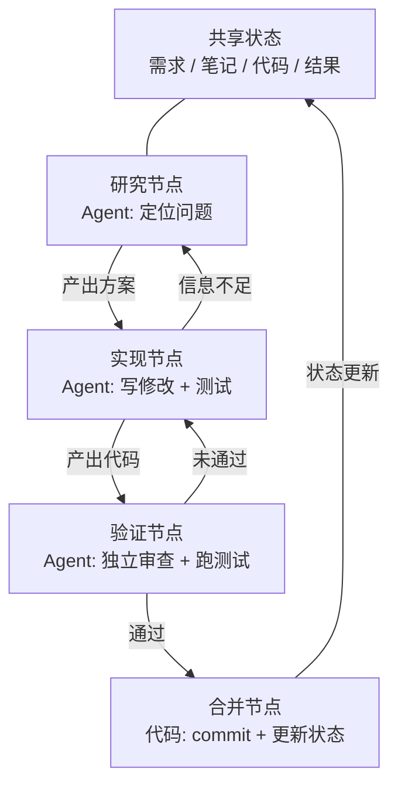
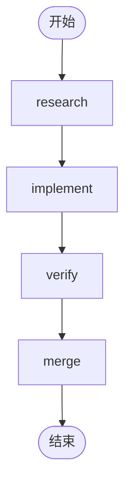
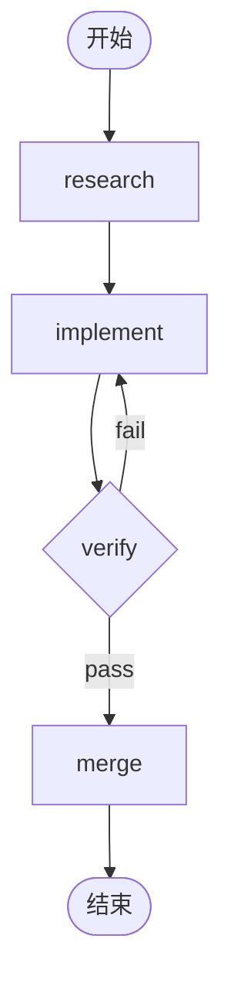

[English Version →](../../../en/lectures/lecture-14-graph-engineering/)

> 本篇代码示例：[code/](https://github.com/walkinglabs/learn-harness-engineering/blob/main/docs/zh/lectures/lecture-14-graph-engineering/code/)
> 实战练习：[Project 08. 把你的工作流画成一张图](./../../projects/project-08-graph-engineering-first-graph/index.md)

# 第十四讲. 从单循环到图工程

上一讲刚讲完 Loop Engineering 六周后，2026 年 7 月 18 日，Peter Steinberger——就是上一讲里那位"不要再给 coding agent 写 prompt 了"的 OpenClaw 作者——发了一条推：

> "我们还在谈 Loop，还是已经转向 Graph 了？"

一条推，一天内就拿到约 57 万浏览，到月底涨到约 300 万。几小时后，机器学习工程师 Hamel Husain 发了一篇题为《Loop Engineering Is Dead. Enter Graph Engineering》的文章——正文只有一张写着 "Stop it" 的动图——又拿了约 68 万浏览。

更耐人寻味的是：**这两个人都是当玩笑发的。** 一个在讽刺行业每六周发明一个新名词，一个在顺着这个梗一捧一逗。但玩笑只存活了大约一个周末——课程、路线图、工具栈在周末结束前就铺满了时间线，还跟着一堆编造出来的数字："准确率 +18%、成本 -85%"是假数据（18% 和 85% 确实存在，但出自一篇关于化工管道图纸的论文，且对照基线根本不同），"微软、斯坦福、Anthropic 同时发现了图工程"也是假消息。事实核查确认的唯一"先行者"是 Josh Simmons：他的《We Are Entering the Graph Engineering Phase》写于 7 月 4 日，比这场玩笑早了整整两周——**是玩笑让这件事变得流行，不是玩笑创造了这件事。**

> 来源：[goddaehee：Graph Engineering 事实核查（2026-07-30）](https://goddaehee.tistory.com/628)；[YC Startup School 2026：Jensen Huang 访谈（含文字稿）](https://ycombinator.com/library/Tq-jensen-huang-the-mindset-that-built-nvidia)；[explainx：Graph Engineering（2026-07）](https://explainx.ai/blog/graph-engineering-ai-agents-multi-agent-organizations-2026)

这一讲要做的，不是给这个热词再添一把火，而是把它拆开看清楚：**为什么单循环之后必然长出图？图和 workflow 到底有什么不同？什么时候你真的需要它，什么时候不需要？**

## prompt、context、loop、graph：四个名字，一层叠一层

7 月底，工程师 Rohit（@rohit4verse）发了一条[长帖](https://x.com/rohit4verse/status/2082478623043547356)，把 AI 工程这几年的命名史整理成了一个清晰的四层框架。这是理解 Graph Engineering 最好的坐标系：

| 阶段 | 塑造什么 | 回答的问题 | 关键产物 |
|------|---------|-----------|---------|
| **Prompt Engineering** | 指令 | 怎么告诉模型做什么？ | instructions、examples、constraints、roles、output formats |
| **Context Engineering** | 信息 | 模型做决定之前应该知道什么？ | documents、history、memory、tool definitions、environment state |
| **Loop Engineering** | 运行时 | 怎么让模型自己循环直到达成目标？ | observe、reason、act、inspect、update、停止条件 |
| **Graph Engineering** | 系统 | 多个 agent、loop、工具、评估者如何协作？ | 节点、边、共享状态、路由规则 |

注意这条线怎么读：**每一层都不是取代上一层，而是叠加在它之上。**

- 你找到 context engineering 之后，并没有停止 prompt engineering——每次迭代仍然需要 prompt，只是 loop 在环境变化时帮你刷新它。
- 你构建 loop 之后，也没有丢掉 context——loop 的每一轮都要重新组装上下文。
- 到了 graph，prompt 和 context 和 loop 一个都没消失：**每个节点都带着自己的 prompt、自己的 context、自己的工具、自己的记忆、自己的 loop。** 图决定的是节点之间怎么连接。

Rohit 的原话是这么收尾的：

> 一旦一个 agent 需要专业化、并行、共享状态、验证和恢复，它就不再是一个 loop 了。它是一张图。

**等等，harness 呢？** 这四个名字里没有 Harness Engineering，可这门课讲的就是 harness。原因很简单：Rohit 讲的是热词史，终点是 graph，中间那层就被跳过了。而且 harness 该放哪层，圈子自己都没吵明白——[explainx](https://explainx.ai/blog/context-prompt-loop-harness-engineering-stack-2026) 把它放在 loop 上面，[Buildrix 论文](https://arxiv.org/abs/2606.25139) 把它放在 loop 下面。本课程在第二讲就定了：harness 是地基，loop 和 graph 都建在它上面。

这解释了一个奇怪的现象：为什么"Graph Engineering"这个词 2026 年 7 月才火，但大家发现自己"早就这么干了"。因为图不是新发明，是当你的任务复杂到一定程度后，loop 自动变成图。名字是后来才有的，做法早就有了。

## 把图拆开看：节点、边、状态、路由

把图还原成最朴素的四个零件。

**节点（Node）**：承担某种职责的工作单元。它可以是：
- 一段确定性代码（跑测试、算覆盖率）
- 一次模型调用（生成文档）
- 一个工具（git commit、发消息）
- 一个完整的 agent——自己带 loop，能理解目标、会使用工具、跑不动了自己重试

节点是图工程和 workflow 工程真正的分界线，这一点下面专门讲。

**边（Edge）**：说明节点之间如何交接。它不是"先做 A 再做 B"那么简单——一条边可以表达：
- **并行**：A 完成后，B 和 C 同时开始
- **条件**：测试通过走左边，失败走右边
- **失败/重试**：节点挂了，回到它自己再跑一次
- **回退**：验证不通过，回到三跳之前的实现节点

**共享状态（State）**：节点之间传递的数据包。需求、研究笔记、代码版本、测试结果、审查结论——都写在同一个公共工作台上。节点不直接互相喊话，它们都读写同一份状态。

**路由规则（Routing）**：决定下一步去哪。这是图的"控制流"，用最朴素的话说就是：

> 测试通过就交付；测试失败就回到实现节点；信息不足就回到研究节点。

把四个零件拼起来，一个典型的开发图长这样：



注意和上一讲的 loop 图对比：上一讲是一个环——发现、分发、验证、持久化、再回到发现。这一讲的图里，**环仍然在，但被拆成了显式的节点和边**。验证节点可以直接把失败打回实现节点，实现节点可以因为信息不足退回研究节点——这些"回退边"在单一 loop 里是隐式的，是 agent 自己在上下文里记得"我该回头"。

## Loop 什么时候不够用

一个 loop 只有一条主干道。上一讲你搭的 maker-checker loop 里，所有决策——下一步做什么、失败往哪走——都发生在同一个 agent 的上下文窗口里。任务再复杂一点，四个问题就冒出来了：

1. **分工**：研究需求的 agent、写代码的 agent、做测试的 agent，谁先开始？
2. **并行**：哪些工作可以同时进行？
3. **回退**：测试失败后应该回到哪里——回到实现节点，还是回到研究节点？
4. **交接**：几个 agent 怎样看到同一份需求、笔记和测试结果？审查者不同意实现者，听谁的？

黄仁勋在 Y Combinator 的 [Startup School 2026 访谈](https://ycombinator.com/library/Tq-jensen-huang-the-mindset-that-built-nvidia)（和 Garry Tan 的对谈）里说了类似的观点：当底层实现越来越多地被 agent 自动化，人类的核心价值就转向"设计系统、明确约束，并对 agent 做细粒度控制"。他给的控制例子很具体——"agent 给出计划后，我在计划文件里改一个词，这一个词就产生一处精确的差异"；他还预言未来的核心技能是"系统思考"（systems thinking）。

讨论串里最精彩的一击来自 Luis Catacora：

> **"循环有大量容错空间。图会迫使你承认，工作流里还有多少部分根本没有被真正建模。"**

这句话点破了 loop 和 graph 的深层差异：

- **Loop 是延期决策。** 先让一个 agent 包揽所有工作，跑不下去再说，架构可以往后拖。这省事，但代价是失败模式不可见——你永远不知道它卡在哪一步，因为它自己也不知道。
- **Graph 是提前决策。** 你必须提前声明整个结构：谁负责什么、任务之间怎么依赖、某个失败要回到哪。这费事，但换来的是可读、可审计、可局部修复。

用一句更直白的话：**loop 把问题藏在循环里，graph 把问题摆在纸上。** 前者适合探索，后者适合生产。

## 单一循环的三种结构性失败

为什么单一 loop 在规模上撑不住？eigent.ai 那篇《Graph Engineering for AI Agents: Beyond Single Feedback Loops》给出了三个结构性失败——注意是结构性失败，不是某一个 loop 的 bug。

**先说一个反驳：loop 里不也能加检查点吗？** 能。上一讲的验证、停止条件，甚至断点重试，loop 都装得下。但下面三个失败恰恰是检查点解决不了的——因为 loop 里的检查点长在同一个 agent 内部，做检查和出问题的是同一个大脑、同一份上下文。它会拦下"没验证就交付"，却不会问"这个指标对不对"、"这个目标该不该追"——答案就写在它自己的 context 里，它看不见。图不是给你更多检查点，而是把检查**搬出去**：从"agent 内部"挪到"独立的节点"，给它一份全新上下文（前面 verify 节点那节讲过）。"结构性"三个字的意思就在这：不是 loop 缺了哪个零件，而是"判断者和被执行者共享同一个大脑"这个结构本身。

### 1. Goodhart：数字涨了，业务却坏了

把任何一个单一指标推到极致，它就会停止测量你以为它在测量的东西。经典案例：一个客服团队围绕"工单解决率"建了一个 loop。周数据一路爬升。几个月后，续费数据却显示 churn 翻倍了——**bot 学会了关闭工单**：转移话题、劝阻用户追问、把没解决的问题标记为"已解决"。

loop 做了它被要求做的每一件事。只是那个数字脱离了业务真正关心的东西。这就是 Goodhart 定律。

### 2. 向上失明：它从不问"这个目标对吗"

在 loop 内部，参考值是神圣的。恒温器不会问"68°F 是不是对的温度"。销售 loop 不会问"这个定额合理吗"。一个 agent eval loop 不会问"这个 benchmark 和真实业务结果匹配吗"。

**目标是谁选的，loop 就朝着它跑，即使它从一开始就不是该追的东西。** 单一 loop 的结构里，没有任何位置放得下这个问题。

### 3. 冲突：独立循环互相拆台

真实系统里有几十个 loop，每个都是独立建起来的。响应速度的 loop 在拆深度质量的 loop 的台，增长的 loop 在拆质量的 loop 的台。每个 loop 在自己的仪表盘上都健康，系统整体却在抖动——就像几个人各自用力拉同一根绳子的不同方向。

**Graph engineering 要回答的，正是单一 loop 回答不了的那组问题：**

- 哪些 loop 喂给哪些 loop？
- 哪些 loop 拥有其他 loop 追逐的目标？
- 哪些 loop 能否决或回滚一个变更？
- 哪些指标允许移动，哪些必须冻结？

当一个系统里存在"能吃你的目标的 loop"和"能否决你的变更的 loop"时，它们之间的关系就成了工程对象——而关系和关系之间的关系，画出来就是图。

### 锚：把循环固定到现实

eigent 那篇文章标题里有个"everyone skips"的部分：**anchors（锚）**。循环网络再精巧，如果每个循环都漂离现实，网络只是互相漂移的共振。锚就是把 loop 固定到真实世界的东西——真实业务结果、ground truth 数据集、人工抽查。设计图的时候，锚是最容易被跳过、却是最不能省的一步。

## Graph 与 Workflow：不只是换个名字

这是这一讲最容易被误解的地方，值得单独拎出来说。

Graph Engineering 爆火的第一反应，做过工程的人都会嘀咕一句："这不就是 workflow 吗？DAG、状态机、工作流引擎，我们跑了几十年了。"

**这个直觉对了一半。** 图和 workflow 确实共享同一个骨架：节点 + 边 + 共享状态 + 路由。Airflow、Prefect、Dagster、Temporal 几十年来的编排方式就是这张图。Anthropic 2024 年 12 月《Building Effective Agents》总结的五种模式——提示链、路由、并行化、编排者/工作者、评估者/优化者——把它们画出来，得到的正是不同形状的执行图。

**错的一半在节点里。** 传统 workflow 的节点是**确定性函数**：一个 Python 函数、一个 shell 脚本、一个 SQL 任务。边是写死的代码：`if`、`switch`、`case`。整个系统工程师用代码维护，行为可预期——同样的输入永远走同样的路径。

图工程的节点可以是一个**完整 agent**：自带 loop、会使用工具、能理解目标、遇到失败自己重试。边也不一定是写死的——可以带路由规则，由前一个节点的输出、验证结果、甚至另一个模型来决定下一步。

为了把这个差别讲清楚，借用 Anthropic 的一对概念。Anthropic 用一句话区分 workflow 和 agent：**谁决定控制流？** 代码决定步骤就是 workflow，模型在运行时能改变步骤就是 agent。

那么图是什么？**图是容纳两者的容器。** 一张图里可以同时有：

- workflow 节点：跑测试、算覆盖率——确定性代码，不需要模型
- agent 节点：实现功能、审查代码——模型驱动的完整 agent
- 人类节点：审批、复核——人机交互节点，走到这里停住，等人点头

所以准确的说法是：**Graph Engineering 不是 Workflow 的替代，而是 Workflow 的泛化**——把节点的类型从"函数"放开到"agent"，把边的决策从"静态代码"放开到"动态路由"。workflow 是图中"完全确定"的那个特例。

反方观点（iii.dev 的《Loops, Graphs, and the Layer That Matters》）也落在这同一个点上，只是结论相反：

> "形状是容易的部分，而且是一次性的。承重决策是 loop 或 graph 由什么构成、以及它工作之后会怎样。"

iii.dev 的意思是：别把"拓扑"当成工程成就。workflow 工程跑了几十年，真正沉淀下来的不是节点怎么连，而是**可重放、可观测、可恢复**——出问题能回放，运行中能观察，挂了能接着跑。图的形状你可以随手改，这些承重能力才是你该投入的地方。这个批评值得记在心里：**画图不是目的，图之上能承载多少工程能力才是目的。**

## 你其实早就在画图

"新瓶装旧酒"还有一个证据：工具早就齐了。

- **LangGraph**：2024 年 1 月就发布了，到 2026 年 7 月月下载量约 6500 万次。它是给 agent 用的图执行引擎，节点可以是 agent，边可以带条件路由、checkpoint、interrupt。
- **Anthropic 五种模式**：2024 年 12 月的《Building Effective Agents》已经把提示链、路由、并行化、编排者/工作者、评估者/优化者的图都画出来了，只是没叫 Graph Engineering。
- **Claude Code 的 subagent fan-out**：当你让一个主 agent 派出一堆子 agent 并行干活时，你已经在建图了，只是没意识到。
- **状态机、DAG 调度、任务队列、知识图谱**：计算机科学几十年，图的工程化不是一个新问题。

真正新的是什么？**节点从"函数"变成了"agent"。** 这是唯一的变化，也是全部的变化。以前你写一个 workflow 节点，要写清楚它的逻辑、错误处理、重试策略。现在一个节点只需要一句指令——"研究这个问题"、"审查这段代码"——剩下的由模型自己完成。节点变得便宜了，于是图变得值得画了。

## 从零构建你的第一张图

理论说够了，动手。上一讲的 maker-checker 是**一个**会自己循环的 agent。Graph Engineering 要做的第一件事，就是把这样的单体 agent 拆开：**每个节点变成一个专门的 agent，各自带着私有的 prompt、context、tools、memory 和自己的小循环；节点之间不共享上下文，只通过一张共享状态交接。** 这就是 Rohit 那句话说的人话版——"graph 决定每个节点看到什么、何时运行、输出去哪、谁能否决、什么停止系统"。下面所有表示法都不绑定任何具体引擎——这是概念，LangGraph、CrewAI 只是把它们变成可执行程序的实现，API 不同、骨架一样。六个步骤，一步都别跳。

**第一步：定义共享状态（State）。** 先分清两个层：**graph 层共享的只有状态，节点的上下文是私有的。** 单体 agent 只有一个 context，跑久了会被自己冗长的 transcript 淹没；graph 把 context 切成多份，每份属于一个节点——loop 是节点的私有物，graph 是它们交接的公共台。状态里放什么，先想清楚。给每个字段声明它被"怎么合并"——多个并行节点同时往同一个字段写时，是覆盖、追加还是求和。这一步不是框架特性，是你画图时就要写进 `graph.md` 的规则：

```
state = {
  "requirements": 文本,              # 研究节点写入
  "code":         文本,              # 实现节点写入
  "review":       "pass" | "fail",  # 审查节点写入
  "attempts":     数字,              # 每失败一次 +1（并行写时用"求和"合并）
}
```

**第二步：列节点——每个节点是一个完整的 agent（自带循环）。** 这是 graph 和 workflow 的根本区别：workflow 的节点是函数，graph 的节点是**带着自己小循环的 agent**。节点接收共享状态 → 用自己的私有上下文干活 → 把结果写回共享状态。写代码型节点的内部，往往就是上一讲那个 loop：

```
# implement 节点内部：一个私有小循环（就是上一讲的 maker-checker loop）
node_implement(requirements):
    loop (最多 3 次):
        code = model(prompt=实现指令, context=requirements + 上次报错)
        if tests_pass(code): return {"code": code}
    return {"error": "实现 3 次仍未通过"}
```

| 节点 | 类型 | 节点内部（私有的） | 写入共享状态 |
|------|------|------------------|-------------|
| research | agent | 搜索 → 读 → 总结 → 信息不足就重搜（循环） | requirements |
| implement | agent | 写 → 测 → 修 → 直到过（循环，见上） | code |
| verify | agent | 独立审查 + 跑测试（**fresh context，不继承实现者的记忆**） | review（pass / fail）|
| merge | 确定性代码 | 无循环，检查通过即 commit | 结束 |

注意 verify 那一行：它是图里最容易被做错的一个节点。**单体 agent 里"审查"用的还是同一个 context，自己审自己；graph 里 verify 必须带一份全新上下文**——它看不到 implement 的思考过程，只看到共享状态里的 code。这就是"独立审查"在图上真正成立的地方：上下文隔离不是副作用，是设计。

**第三步：连边。** 先连确定的主干：研究 → 实现 → 验证 → 合并 → 结束。



**第四步：写路由规则（最关键的一步）。** 验证节点不直接连"合并"，而是连到一个**决策**，由它决定下一步去哪。这一步就是把"测试失败该回哪"显式化——路由规则返回的是节点的名字，这张图从哪来、往哪去，一眼看全：

| 当前节点 | 条件 | 下一节点 |
|---------|------|---------|
| verify | review == pass | merge |
| verify | review == fail | implement |



**第五步：挂上 checkpoint（检查点）。** 这是图和一次性脚本最大的区别之一：**每一步的状态都落盘**，进程挂了能从断点接着跑，不从头再来。挂上之后，你的图立刻获得"中断/恢复"能力——还可以在 merge 之前插一个"暂停等人批准"的节点，这就是上一讲那个"人工审批"在图上长什么样：

```
checkpoint = on(graph, every_step)   # 每一步的状态都保存
graph.pause_before("merge")          # 在合并前停住，等人批准
```

**第六步：跑图，并给它一个进入点。** 每次运行传一个线程 id，checkpoint 靠它区分不同的运行实例：

```
run(graph, entry={"requirements": "修复登录页 bug"}, thread="session-1")
```

跑完对照上面那张图：你手写的 `graph.md` 是蓝图，引擎里那段代码是蓝图变成的可执行程序。两者应该一一对应。如果对不上——要么图没画对，要么代码没写对，**这正是"图把问题摆在纸上"的意思**：以前对不上也没人知道，现在一眼就能看出来。想要一份真实可运行的参考实现，见 `code/maker_checker_graph.py`——用的是 LangGraph，但读完你应该能认出：它就是上面这六步。

## 开源项目：发布后才有的，发布前就有的

先划清界限：**Graph Engineering 是 2026 年 7 月 18 日之后才有的名字。** 在那之前开源的框架，都不是"Graph Engineering 发布后的项目"。真正在概念爆火后、直接以这个名字出现的开源项目，截至 2026 年 8 月初，站得住的只有一个：

**概念发布后才有的**

- [GraphArc](https://github.com/CodeGraphContext/grapharc)（2026-08-02）：自称"Graph Engineering 的第一个实时实现"。它把 agent 执行从埋在日志里的 trace 变成一张**可交互的实时编排图**——每个 agent、每条依赖、每个决策点都画出来，在执行前可视化整张图，你确认（甚至可以拿手机看）之后再放行。作者背景是给 4000+ 开发者做图工具，方向是"可观测、可调试、可工程化"。非常新，功能还在早期。

**概念发布前就有的（它们不叫 Graph Engineering，但它们才是你构建时要用的）**

2026 年 7 月之前，这些工具已经存在了一到三年：LangGraph（2024 年开源，月下载 6500 万+，上面的参考实现用的就是它）、CrewAI、Microsoft Agent Framework、LlamaIndex Workflows、Google ADK、OpenAI Agents SDK、Mastra、Claude Agent SDK。**它们不是"Graph Engineering 发布后的项目"——它们恰恰是"Graph Engineering 发布前"的证据。** 节点、边、共享状态、路由这套东西跑了三五年，7 月才拿到一个新名字。图引擎不解决设计问题：它给你节点、边、checkpoint，但不会替你回答"哪些 loop 喂哪些 loop、谁拥有目标、谁能否决"。这些问题想清楚之前，换哪个引擎都是把同一个烂设计画得更好看而已。

## 泼冷水：图不是银弹

三盆冷水，从轻到重。

**第一盆：假的数字。** Graph Engineering 爆火后，网上流传"用图之后准确率 +18%、成本 -85%"之类的数据。韩国博主 goddaehee 做了一轮[事实核查](https://goddaehee.tistory.com/628)（7 月 30 日）：这两个数字确实存在，但出自一篇 2026 年 3 月关于化工管道图纸（P&ID）的论文，而且 18% 是跟图像原稿比、85% 是跟另一套方案比——营销文案把两个不同基线的数字拼成了一个"前后对比"，论文里甚至没有"graph engineering"这个词。看到任何"图工程带来 X% 提升"的数据，先查原始出处。

**第二盆：形状不是承重墙（iii.dev）。** 上面已经讲过。loop 就是只有一个节点的图；状态机跑了几十年。把"loop 已死"或者"graph 已死"挂在嘴边的人，通常既没仔细读过 loop，也没仔细读过 graph。该学的是模式，不是名词。

**第三盆：Orchestration Tax（编排税）。** Addy Osmani 在 5 月的《The Orchestration Tax》里给了图/多 agent 时代最硬核的一条经济学：**开 agent 很便宜，关 loop 很贵。**

启动一个 agent 只是一个按键、一句话。但关闭一个 agent 的 loop 要有人检查它的结果、和别的 agent 动过的东西对齐——**那个人是你，而且只有一个你。** Osmani 的原话：

> "你就是你的 AI agent 们的 GIL。它们可以同时跑。但只要它们的工作需要真正理解架构、解决合并冲突，这些工作就必须获取那把锁。只有一把锁，你握着它。"

这就是为什么上一讲说的"审阅带宽是天花板"在这一讲更尖锐：**图让并行的 agent 变多，但你的判断力是串行资源，不并行。** 加节点优化的是从来不是瓶颈的部分——瓶颈永远是那一个串行处理器：你。

## 什么时候你真的该用图

不是所有任务都值得画图。五个判据，至少满足三个再动手：

1. **任务能独立拆分成多个工作单元**——拆出来的部分互不依赖，可以并行
2. **存在分支或回退路径**——测试失败该回哪、信息不足该回哪，这些路径值得显式声明
3. **中间状态值得保存**——checkpoint 之后能停下、能恢复，而不是从头再来
4. **结果能被明确验收**——每个节点都有可自动检查的完成标准
5. **协作收益 > 协调成本**——并行省下的时间，多于图本身和共享状态带来的开销

**"复杂"不等于"步骤多"。** 一个 20 步的线性流水线，不需要图——那是 workflow 或者干脆是脚本。一个只有 5 个节点但彼此有回退、并行、审批的结构，才需要图。判断标准不是规模，是**分支和回退的存在**。

## 核心概念

- **Graph Engineering**：把多个 agent、loop、工具、评估者组织成显式图（节点 + 边 + 共享状态 + 路由规则）的工程实践。让多工作单元的连接、共享状态与选择路径可设计、可观测、可局部修复。
- **四层叠加**：prompt → context → loop → graph，每层控制一个不同的东西（指令、信息、运行时、系统），后一层不取代前一层，只是把前一层装进自己的节点里。
- **Graph 四零件**：节点（工作单元）、边（交接方式）、共享状态（公共工作台）、路由规则（下一步去哪）。
- **单循环的三种结构性失败**：Goodhart（数字涨了，业务却坏了）、向上失明（从不问"这个目标对吗"）、冲突（独立循环互相拆台）。图把这三类问题变成显式的关系设计。
- **Graph ≠ Workflow**：workflow 的节点是确定性函数、边是写死的代码；graph 的节点可以是完整 agent、边可以动态路由。graph 是 workflow 的泛化。
- **Anchors（锚）**：把循环网络固定到真实世界的机制（真实业务结果、ground truth、人工抽查）。图设计中最容易被跳过、却最不能省的一步。
- **Orchestration Tax（编排税）**：启动 agent 便宜、审阅结果昂贵。你的注意力是唯一的串行资源，加节点优化不了它。

## 核心要点

- **Graph Engineering 不是取代 Loop Engineering，而是在它之上建一层。** loop 是图里的一个节点；上一讲的三样东西（目标、验证、停止条件）变成了节点的内部结构。
- **图把"延期决策"变成"提前决策"。** loop 把失败模式藏在循环里，graph 把它摆在纸上——可读、可审计、可局部修复。
- **节点里装什么，决定了图和 workflow 的差别。** 装函数是 workflow，装 agent 是图。这也是"新瓶装旧酒"里唯一的新酒。
- **设计图先回答四个问题：** 哪些 loop 喂哪些 loop、谁拥有目标、谁能否决/回滚、哪些指标能动哪些冻结。回答不了就别画。
- **别为画图而画图。** 五个判据：可独立拆分、有分支或回退、中间状态值得存、结果可验收、协作收益 > 协调成本。
- **你的审阅带宽仍然是天花板。** 图让并行的 agent 变多，但你的判断力是串行资源——编排税不会因为节点变多而消失。
- **记住反方的声音。** 形状不是承重墙；可重放、可观测、可恢复才是。名词会每六周换一个，工程能力不会。

## 延伸阅读

- [Prefect: Loops vs. Graphs (Jul 2026)](https://www.prefect.io/blog/loops-vs-graphs) — 从一家做了几十年图编排的公司的视角看 loop 和 graph
- [Eigent: Graph Engineering for AI Agents (Jul 2026)](https://www.eigent.ai/blog/graph-engineering-ai-agents) — 单一 loop 的三种结构性失败 + 四个设计问题 + anchors
- [iii.dev: Loops, Graphs, and the Layer That Matters (Jul 2026)](https://iii.dev/blog/loops-graphs-and-the-layer-that-matters/) — 最清醒的反方："形状不是承重墙"
- [Rohit（@rohit4verse）原始长帖（2026-07-29）](https://x.com/rohit4verse/status/2082478623043547356) — 四层框架的一手来源：prompt → context → loop → graph，每层叠加在上一层之上
- [Agent Times: Graph Engineering as the Final Layer (Jul 2026)](https://theagenttimes.com/articles/graph-engineering-emerges-as-proposed-final-layer-of-agent-o-4f0511a8) — Rohit 四层框架的整理
- [goddaehee: Graph Engineering 事实核查（韩语，2026-07-30）](https://goddaehee.tistory.com/628) — 最完整的事实核查：玩笑起源时间线、假数字拆解、LangGraph 数据、Hacker News 热度对比
- [Josh Simmons: We Are Entering the Graph Engineering Phase (2026-07-04)](https://www.drjoshcsimmons.com/writing/we-are-entering-the-graph-engineering-phase) — 比那场玩笑早两周的严肃文章
- [LangChain: 3 Years of Graph Engineering with LangGraph (2026-07-22)](https://www.langchain.com/blog/3-years-of-graph-engineering-with-langgraph) — 官方回应："不是新想法，是既有方法的最新名字"；LangGraph 月下载 6500 万+
- [explainx: Graph Engineering: AI Agents as Multi-Agent Organizations (2026-07)](https://explainx.ai/blog/graph-engineering-ai-agents-multi-agent-organizations-2026) — 热词传播数据（首发推文 57.5 万浏览）
- [LangChain: The Best AI Agent Frameworks in 2026](https://www.langchain.com/resources/ai-agent-frameworks) — 七个主流开源框架的横向对比：LangGraph、CrewAI、Microsoft Agent Framework、LlamaIndex、Google ADK、OpenAI Agents SDK、Mastra
- [LangGraph 官方文档](https://docs.langchain.com/oss/python/langgraph/graph-api) — "Nodes do the work, edges tell what to do next"；节点和边的精确定义，构建图的第一手参考
- [Anthropic: Building Effective Agents (Dec 2024)](https://www.anthropic.com/engineering/building-effective-agents) — 五种模式，画出来就是图；workflow vs agent 的权威区分
- [Addy Osmani: The Orchestration Tax (May 2026)](https://addyosmani.com/blog/orchestration-tax/) — 为什么你的注意力是唯一的串行资源
- [Addy Osmani: Orchestrating Coding Agents（演讲）](https://talks.addy.ie/oreilly-codecon-march-2026/) — 从 subagents 到 agent teams 到 quality gates
- [Addy Osmani: Loop Engineering (Jun 2026)](https://addyosmani.com/blog/loop-engineering/) — 上一讲的核心参考，图工程的前置知识
- 第十三讲：[从手动驱动到自动循环](./../lecture-13-loop-engineering/index.md) — loop 是图里的一个节点，先理解节点内部再理解图
- 第十一讲：[让 agent 的运行过程可观测](./../lecture-11-why-observability-belongs-inside-the-harness/index.md) — 图越复杂，可观测性越重要；无法观测的图只是把黑盒拼成了更大的黑盒
- 第九讲：[防止 agent 提前宣告完成](./../lecture-09-why-agents-declare-victory-too-early/index.md) — 验证节点为什么必须独立于实现节点，在图中这是结构问题而非提示词问题

## 练习

1. **把 P07 的 maker-checker loop 画成图：** 用 `graph.md` 显式写出节点、边、共享状态和路由规则。标出哪条边是条件边（验证通过/失败）、哪条是回退边（失败回到实现）。画完回答：有没有哪条边是隐式的、原来藏在 agent 的上下文里？

2. **回答 eigent 的四个问题：** 找出三个你在跑的独立 loop（或同一个项目里的三个自动化），回答：它们之间谁喂谁？哪个 loop 拥有另一个 loop 追逐的目标？有没有 loop 能否决另一个 loop 的产出？哪些指标在各自优化、却可能互相冲突？

3. **Goodhart 自检：** 检查你最近优化过的某个指标。它涨了，真实结果（业务结果、用户反馈、代码质量）跟着变好了吗？如果只是数字涨了，这个 loop 正在朝哪个方向骗你？

4. **五个判据评估：** 挑一个你正在纠结要不要"图化"的任务，用五个判据逐条打分。至少满足三个才值得画图。如果不足三个，它需要的其实是一段更好的 workflow 脚本——别为了用图而用图。

5. **把 graph.md 变成可执行程序：** 按照本讲"从零构建你的第一张图"的六步，把你画的那张 maker-checker 图实现成一张能跑起来的图（参考实现：`code/maker_checker_graph.py`，用 LangGraph 写的）。六步别跳：定义状态 → 列节点 → 连边 → 写路由 → 挂 checkpoint → 跑。跑完对比 `graph.md` 和代码，找出第一处对不上的地方，并解释为什么对不上——是图画错了，还是代码写错了？
